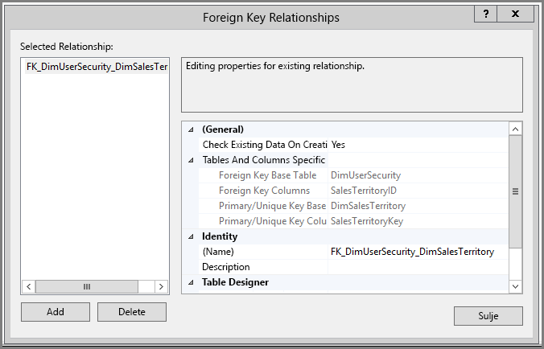
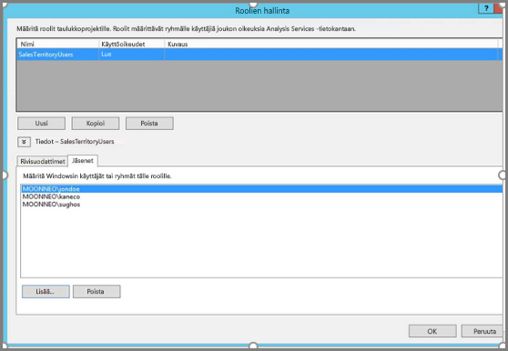
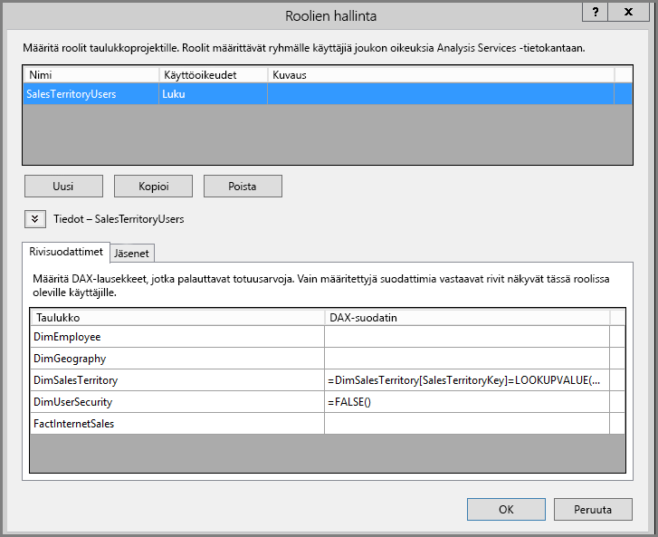
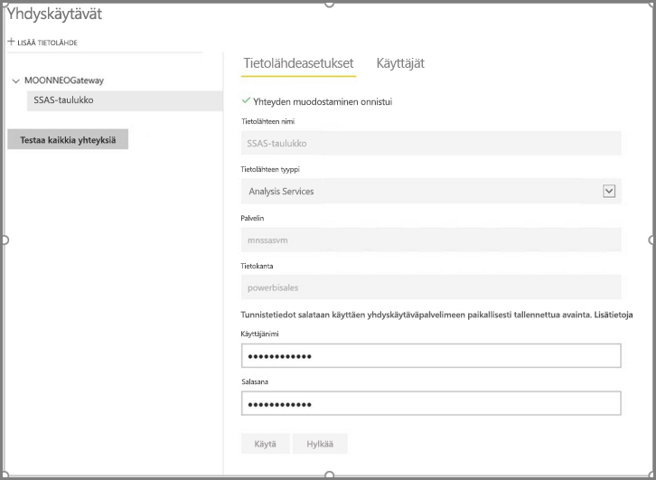
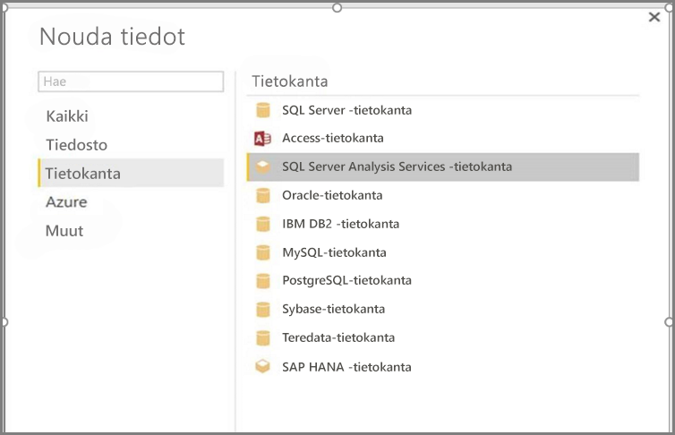
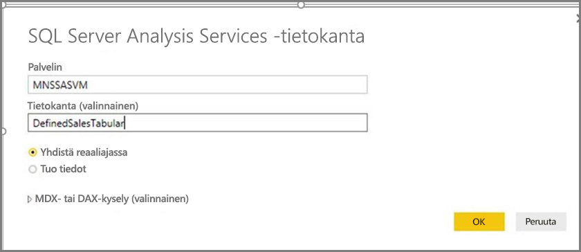
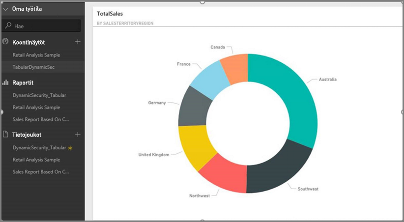
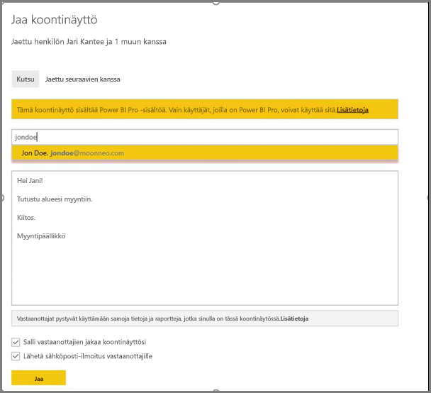
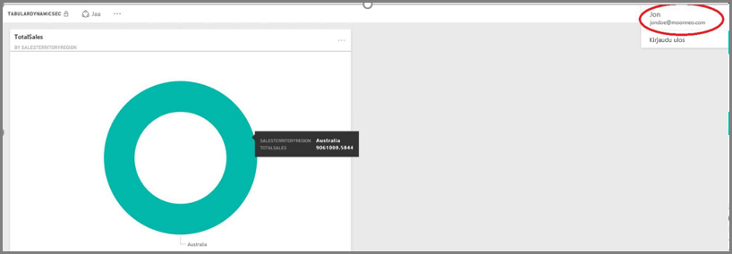

# <a name="dynamic-row-level-security-with-analysis-services-tabular-model"></a>Dynaaminen rivitason suojaus Analysis Servicen taulukkomallissa
Tässä opetusohjelmassa esitellään **rivitason suojauksen** toteuttamiseen tarvittavat vaiheet **Analysis Services -taulukkomallissa** ja näytetään, miten voit käyttää sitä Power BI -raportissa. Tämän opetusohjelman ohjeet on suunniteltu niin, että voit niitä seuraamalla opetella esimerkkitietojoukon kokoamisen.

Tämän opetusohjelman aikana seuraavat vaiheet on kuvattu yksityiskohtaisesti, mikä auttaa sinua ymmärtämään, miten voit toteuttaa dynaamisen rivitason suojauksen Analysis Services -taulukkomallissa:

* Luo uusi suojaustaulukko **AdventureworksDW2012**-tietokannassa
* Kokoa taulukkomalli tarvittavilla fakta- ja dimensiotaulukoilla
* Määritä käyttäjien roolit ja käyttöoikeudet
* Ota käyttöön **Analysis Services -taulukkoesiintymän** malli
* Power BI Desktopin avulla voit laatia raportin, jossa näytetään raporttia käsittelevää käyttäjää vastaavat tiedot
* Ota raportti käyttöön **Power BI -palvelussa**
* Luo raporttiin perustuva uusi, raporttiin perustuva koontinäyttö ja lopuksi
* jaa koontinäyttö työtovereille

Jotta voit noudattaa tämän opetusohjelman vaiheita, tarvitset **AdventureworksDW2012**-tietokannan, joka on ladattavissa **[tietovarastosta](https://github.com/Microsoft/sql-server-samples/releases/tag/adventureworks)**.

## <a name="task-1-create-the-user-security-table-and-define-data-relationship"></a>Tehtävä 1: Käyttäjän tietoturvataulukon luominen ja tietojen yhteyden määrittäminen
Lukuiset julkaistut artikkelit opastavat rivitason dynaamisen suojauksen määrittämisessä **taulukkomuotoiseen SQL Server Analysis Services (SSAS)** -malliin. Tässä esimerkissä noudatetaan [Dynaamisen suojauksen toteuttaminen rivisuodattimien avulla](https://msdn.microsoft.com/library/hh479759.aspx) -artikkelin ohjeita. Voit suorittaa opetusohjelman ensimmäisen tehtävän seuraavasti:

1. Esimerkissä käytetään **AdventureworksDW2012**-relaatiotietokantaa. Luo kyseiseen tietokantaan **DimUserSecurity**-taulukko seuraavassa kuvassa esitetyllä tavalla. Tässä esimerkissä taulukon luomiseen käytetään SQL Server Management Studiota (SSMS).
   
   
2. Kun taulukko on luotu ja tallennettu, sinun on luotava suhde **DimUserSecurity**-taulukon ja **SalesTerritoryID**-sarakkeen sekä **DimSalesTerritory**-taulukon ja **SalesTerritoryKey**-sarakkeen välille seuraavassa kuvassa esitetyllä tavalla. Voit tehdä tämän **SSMS**:ssä napsauttamalla hiiren kakkospainikkeella **DimUserSecurity**-taulukkoa ja valitsemalla **Rakenne**. Valitse sitten valikosta **Taulukon suunnittelu -> Suhteet...** 
   
   
3. Tallenna taulukko ja lisää siihen muutama rivi käyttäjän tietoja napsauttamalla **DimUserSecurity**-taulukkoa uudelleen hiiren kakkospainikkeella ja valitsemalla sitten **Muokkaa 200 ylintä riviä**. Kun olet lisännyt kyseiset käyttäjät, **DimUserSecurity**-taulukon rivit näyttävät seuraavalta:
   
   
   
   Palaamme näihin käyttäjiin myöhemmissä tehtävissä.
4. Seuraavaksi teemme *sisäliitoksen* **DimSalesTerritory**-taulukon kanssa, minkä avulla näet käyttäjän alueeseen liittyvät tiedot. Seuraava koodi suorittaa *sisäliitoksen*, ja sitä seuraavassa kuvassa näytetään, miltä taulukko näyttää *sisäliitoksen* onnistuttua.
   
       select b.SalesTerritoryCountry, b.SalesTerritoryRegion, a.EmployeeID, a.FirstName, a.LastName, a.UserName from [dbo].[DimUserSecurity] as a join  [dbo].[DimSalesTerritory] as b on a.[SalesTerritoryKey] = b.[SalesTerritoryID]
   
   
5. Huomaa, että yllä olevassa kuvassa näkyy mm. tieto siitä, kuka käyttäjistä vastaa mistäkin myyntialueesta. Tiedot näytetään **vaiheessa 2** luodun suhteen vuoksi. Huomaa myös, että käyttäjä **Jon Doe kuuluu Australian myyntialueeseen**. Palaamme John Doen pariin tulevissa ohjeissa ja tehtävissä.

## <a name="task-2-create-the-tabular-model-with-facts-and-dimension-tables"></a>Tehtävä 2: Kokoa taulukkomalli fakta- ja dimensiotaulukoilla
1. Kun relaatiotietovarasto on paikallaan, on aika määrittää taulukkomalli. Malli voidaan luoda **SQL Server Data Tools (SSDT)** -työkaluilla. Saat lisätietoja taulukkomallin määrittämisestä tutustumalla [Uuden taulukkomalliprojektin luominen](https://msdn.microsoft.com/library/hh231689.aspx) -ohjeartikkeliin.
2. Tuo kaikki tarvittavat taulukot malliin alla kuvatulla tavalla.
   
    
3. Kun olet tuonut tarvittavat taulukot, sinun on määritettävä rooli nimeltä **SalesTerritoryUsers**, jolla on **Luku**-käyttöoikeudet. Voit tehdä tämän napsauttamalla **Malli**-valikkoa SQL Server Data Tools -työkaluissa ja valitsemalla sitten valikosta **Roolit**. Valitse **Roolinhallinta**-valintaikkunasta **Uusi**.
4. Lisää **Roolinhallinnan** **Jäsenet**-välilehdellä käyttäjät, jotka määritettiin **DimUserSecurity**-taulukkoon **Tehtävän 1 vaiheessa 3**.
   
    
5. Lisää seuraavaksi asianmukaiset funktiot sekä **DimSalesTerritory**- että **DimUserSecurity**-taulukoihin alla **Rivisuodattimet**-välilehdellä osoitetulla tavalla.
   
    
6. Tässä vaiheessa käytetään **LOOKUPVALUE**-funktiota palauttamaan arvot sarakkeelle, jossa Windows-käyttäjänimi on sama kuin **USERNAME**-funktion palauttama käyttäjänimi. Kyselyt voidaan sen jälkeen rajoittaa **LOOKUPVALUE**-funktion palauttamiin arvoihin, jotka vastaavat saman tai liittyvän taulukon arvoja. Kirjoita seuraava kaava **DAX-suodattimen** sarakkeeseen:
   
       =DimSalesTerritory[SalesTerritoryKey]=LOOKUPVALUE(DimUserSecurity[SalesTerritoryID], DimUserSecurity[UserName], USERNAME(), DimUserSecurity[SalesTerritoryID], DimSalesTerritory[SalesTerritoryKey])
    Tässä kaavassa **LOOKUPVALUE**-funktio palauttaa kaikki arvot **DimUserSecurity[SalesTerritoryID]**-sarakkeesta, jossa **DimUserSecurity[UserName]** on nykyinen kirjautunut Windows-käyttäjänimi ja **DimUserSecurity[SalesTerritoryID]** on sama kuin **DimSalesTerritory[SalesTerritoryKey]**.
   
   **LOOKUPVALUE**-funktion palauttamaa SalesTerritoryKey-myyntijoukkoa käytetään sitten **DimSalesTerritory**-kohdan rivien rajoittamiseen. Vain sellaiset rivit näytetään, joissa rivin **SalesTerritoryKey** sisältyy **LOOKUPVALUE**-funktion palauttamiin tunnuksiin.
8. Kirjoita seuraava kaava **DimUserSecurity**-taulukon **DAX-suodattimen** sarakkeeseen:
   
       =FALSE()

    Tämä kaava määrittää, että kaikki sarakkeet palauttavat Booleanin epätosi-ehdon. Näin **DimUserSecurity**-taulukon sarakkeista ei voi tehdä kyselyjä.
1. Seuraavaksi malli käsitellään ja otetaan käyttöön. Voit katsoa ohjeita mallin käyttöönottoon [käyttöönoton ohjeartikkelista](https://msdn.microsoft.com/library/hh231693.aspx).

## <a name="task-3-adding-data-sources-within-your-on-premises-data-gateway"></a>Tehtävä 3: Tietolähteiden lisääminen paikallisessa tietoyhdyskäytävässä
1. Kun taulukkomuotoinen malli on otettu käyttöön ja valmis yleiseen käyttöön, sinun on lisättävä tietolähdeyhteys paikalliseen Analysis Services -taulukkopalvelimeen Power BI -portaalista.
2. Jotta voit antaa **Power BI -palvelulle** paikallisen analysointipalvelun käyttöoikeudet, **[paikallisen tietoyhdyskäytävän](service-gateway-onprem.md)** on oltava asennettuna ja määritettynä ympäristöösi.
3. Kun yhdyskäytävä on määritetty oikein, sinun on luotava tietolähdeyhteys **Analysis Services** -palvelun taulukkomuotoisiin esiintymiin. Tämä artikkeli auttaa sinua [lisäämään tietolähteen Power BI -portaalista](service-gateway-enterprise-manage-ssas.md).
   
   
4. Kun edellinen vaihe on valmis, yhdyskäytävä on määritetty ja valmis käsittelemään **Analysis Services** -tietolähdettä.

## <a name="task-4-creating-report-based-on-analysis-services-tabular-model-using-power-bi-desktop"></a>Tehtävä 4: Analyysipalveluiden taulukkomalliin perustuvan raportin luominen Power BI Desktopilla
1. Käynnistä **Power BI Desktop** ja valitse **Nouda tiedot > Tietokanta**.
2. Valitse tietolähteiden luettelosta **SQL Server Analysis Services -tietokanta** ja valitse **Yhdistä**.
   
   
3. Täytä taulukkomuotoisen **Analysis Services-** -esiintymän tiedot ja valitse **Yhdistä reaaliajassa**. Valitse **OK**. Dynaaminen suojaus toimii **Power BI:ssä** vain **reaaliaikaisella yhteydellä**.
   
   
4. Käyttöön otettu malli on nyt **Analysis Services** -esiintymässä. Valitse asianmukainen malli ja sitten **OK**.
   
   
5. **Power BI Desktop** näyttää nyt kaikki käytettävissä olevat kentät **Kentät**-ruudun oikeanpuoleisessa pohjassa.
6. Valitse oikealla olevasta **Kentät**-ruudussa olevasta **FactInternetSales**-taulukosta **SalesAmount**-mittari ja **SalesTerritory**-taulukosta **SalesTerritoryRegion**-dimensio.
7. Jotta tämä raportti pysyy yksinkertaisena, emme tällä kertaa lisää enempää sarakkeita. Tiedot esitetään kuvaavammin, kun visualisointi muutetaan **rengaskaavioksi**.
   
   
8. Kun raportti on valmis, voit julkaista sen suoraan Power BI -portaaliin. Valitse **Power BI Desktopin** **Aloitus**-valintanauhasta **Julkaise**.

## <a name="task-5-creating-and-sharing-a-dashboard"></a>Tehtävä 5: Koontinäytön luominen ja jakaminen
1. Nyt kun olet luonut raportin ja napsauttanut **Julkaise** **Power BI Desktopissa**, raportti on julkaistu **Power BI** -palvelussa. Kun se on palvelussa, voimme havainnollistaa mallin suojaustilannetta käyttämällä edellisissä vaiheissa luomaamme esimerkkiä.
   
   **Myyntipäällikkö Sumit** voi roolissaan tarkastella kaikkien myyntialueiden tietoja. Hän luo tämän raportin (tehtävän edellisissä vaiheissa luotu raportti) ja julkaisee sen Power BI -palveluun.
   
   Kun hän julkaisee raportin, hän luo Power BI -palveluun koontinäytön, jonka nimi on raportin perusteella **TabularDynamicSec**. Huomaa, että seuraavassa kuvassa myyntipäällikkö (Sumit) voi nähdä kaikkien myyntialueiden tiedot.
   
   
2. Nyt Sumit jakaa koontinäytön työtoverilleen Jon Doelle, joka vastaa Australian alueen myynnistä.
   
   
   
   
3. Kun Jon Doe kirjautuu sisään **Power BI** -palveluun ja tarkastelee Sumitin jakamaa koontinäyttöä, Jon Doen tulisi nähdä **ainoastaan** vastuualueensa myynti. Jon Doe kirjautuu sisään, Avaa Sumitin jakaman koontinäytön ja näkee **ainoastaan** Australian alueen myynnin.
   
   
4. Onnittelut! Paikalliseen **Analysis Services** -taulukkomalliin määritetty dynaaminen rivitason suojaus onnistui ja sen tulokset näkyvät **Power BI** -palvelussa. Power BI käyttää **effectiveusername**-ominaisuutta lähettäessään senhetkisen Power BI -käyttäjän kirjautumistiedot paikalliselle tietolähteelle kyselyiden suorittamiseksi.

## <a name="task-6-understanding-what-happens-behind-the-scenes"></a>Vaihe 6: Taustalla tapahtuvien toimintojen ymmärtäminen
1. Tässä tehtävässä oletetaan, että SQL Profiler on sinulle tuttu, koska sinun on tallennettava SQL Server profiler -jäljitys paikallisesta, taulukkomuotoisesta SSAS -esiintymästä.
2. Istunto käynnistetään heti, kun käyttäjä (tässä tapauksessa Jon Doe) käyttää koontinäyttöä Power BI -palvelussa. Huomaat, että **salesterritoryusers**-rooli astuu heti voimaan. Käytettävä käyttäjänimi on **<EffectiveUserName>jondoe@moonneo.com</EffectiveUserName>**
   
       <PropertyList><Catalog>DefinedSalesTabular</Catalog><Timeout>600</Timeout><Content>SchemaData</Content><Format>Tabular</Format><AxisFormat>TupleFormat</AxisFormat><BeginRange>-1</BeginRange><EndRange>-1</EndRange><ShowHiddenCubes>false</ShowHiddenCubes><VisualMode>0</VisualMode><DbpropMsmdFlattened2>true</DbpropMsmdFlattened2><SspropInitAppName>PowerBI</SspropInitAppName><SecuredCellValue>0</SecuredCellValue><ImpactAnalysis>false</ImpactAnalysis><SQLQueryMode>Calculated</SQLQueryMode><ClientProcessID>6408</ClientProcessID><Cube>Model</Cube><ReturnCellProperties>true</ReturnCellProperties><CommitTimeout>0</CommitTimeout><ForceCommitTimeout>0</ForceCommitTimeout><ExecutionMode>Execute</ExecutionMode><RealTimeOlap>false</RealTimeOlap><MdxMissingMemberMode>Default</MdxMissingMemberMode><DisablePrefetchFacts>false</DisablePrefetchFacts><UpdateIsolationLevel>2</UpdateIsolationLevel><DbpropMsmdOptimizeResponse>0</DbpropMsmdOptimizeResponse><ResponseEncoding>Default</ResponseEncoding><DirectQueryMode>Default</DirectQueryMode><DbpropMsmdActivityID>4ea2a372-dd2f-4edd-a8ca-1b909b4165b5</DbpropMsmdActivityID><DbpropMsmdRequestID>2313cf77-b881-015d-e6da-eda9846d42db</DbpropMsmdRequestID><LocaleIdentifier>1033</LocaleIdentifier><EffectiveUserName>jondoe@moonneo.com</EffectiveUserName></PropertyList>
3. Analysis Services muuntaa pyynnön käytettävän käyttäjänimen pyynnön perusteella moonneo\jondoe-kirjautumistunnuksiksi paikallisen Active Directory -hakemiston kyselyn jälkeen. Kun **Analysis Services** hakee todelliset tunnistetiedot Active Directorysta, **Analysis Services** palauttaa vain sellaisia tietoja, joiden käyttöoikeudet käyttäjällä on.
4. Jos koontinäytössä tapahtuu muuta toimintaa, esimerkiksi jos Jon Doe siirtyy koontinäytöstä sen pohjana olevaan raporttiin, Analysis Services -taulukkomalliin palautettava kysely näkyy SQL Profilerissa DAX-kyselynä.
   
   
5. Alla näet myös DAX-kyselyn, joka suoritetaan raportin tietojen täyttämiseksi.
   
   ```
   EVALUATE
     ROW(
       "SumEmployeeKey", CALCULATE(SUM(Employee[EmployeeKey]))
     )
   
   <PropertyList xmlns="urn:schemas-microsoft-com:xml-analysis">``
             <Catalog>DefinedSalesTabular</Catalog>
             <Cube>Model</Cube>
             <SspropInitAppName>PowerBI</SspropInitAppName>
             <EffectiveUserName>jondoe@moonneo.com</EffectiveUserName>
             <LocaleIdentifier>1033</LocaleIdentifier>
             <ClientProcessID>6408</ClientProcessID>
             <Format>Tabular</Format>
             <Content>SchemaData</Content>
             <Timeout>600</Timeout>
             <DbpropMsmdRequestID>8510d758-f07b-a025-8fb3-a0540189ff79</DbpropMsmdRequestID>
             <DbPropMsmdActivityID>f2dbe8a3-ef51-4d70-a879-5f02a502b2c3</DbPropMsmdActivityID>
             <ReturnCellProperties>true</ReturnCellProperties>
             <DbpropMsmdFlattened2>true</DbpropMsmdFlattened2>
             <DbpropMsmdActivityID>f2dbe8a3-ef51-4d70-a879-5f02a502b2c3</DbpropMsmdActivityID>
           </PropertyList>
   ```

## <a name="considerations"></a>Huomioitavaa
Sinun on huomioitava muutamia seikkoja, kun käsittelet rivitason suojausta, SSAS:ää ja Power BI:tä:

1. Paikallinen rivitason suojaus toimii Power BI:ssä vain reaaliaikaisella yhteydellä.
2. Malliin käsittelyn jälkeen tehdyt muutokset ovat heti käyttäjien (jotka käsittelevät raporttia **reaaliaikaisella yhteydellä**) käytettävissä Power BI -palvelussa.

