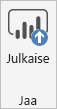
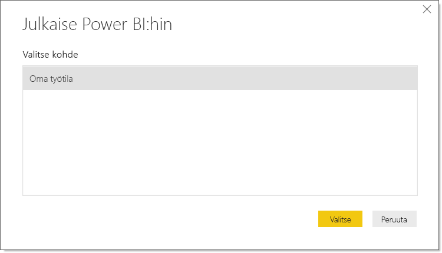
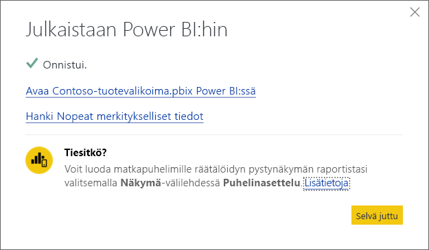

# Power BI Desktopista julkaiseminen
Kun julkaiset **Power BI Desktop** -tiedoston **Power BI -palvelussa**, mallin tiedot ja **Raportti**-näkymässä luomasi raportit julkaistaan Power BI:n työtilassasi. Näet uuden tietojoukon samalla nimellä ja mahdolliset raportit Työtila-siirtymistoiminnossa.

Julkaiseminen **Power BI Desktopista** vaikuttaa samalla tavalla kuin **Nouda tiedot** -toiminnon käyttäminen Power BI:ssä yhteyden muodostamiseksi ja tietojen lataamiseksi **Power BI Desktop** -tiedostosta.

> [!NOTE]
> Raporttiin Power BI:ssä tekemiäsi muutoksia, kuten visualisointien lisäyksiä, poistoja tai muokkauksia raporteissa, ei tallenneta alkuperäiseen **Power BI Desktop** -tiedostoon.
> 
> 

## Power BI Desktop -tietojoukon ja -raporttien julkaiseminen
1. Valitse Power BI Desktopissa \> **Tiedosto** \> **Julkaise** \> **Julkaise Power BI:hin**, tai napsauta valintanauhan **Julkaise**-painiketta.  

   

2. Kirjaudu sisään Power BI:hin.
3. Valitse kohde.

   

Kun olet valmis, saat linkin raporttiin. Napsauttamalla linkkiä voit avata raportin Power BI -sivustossasi.

## Power BI Desktopista julkaistun tietojoukon julkaiseminen uudelleen tai julkaistun tietojoukon korvaaminen
Kun julkaiset **Power BI Desktop** -tiedoston, **Power BI Desktopissa** luomasi tietojoukko ja raportit ladataan Power BI -sivustoosi. Kun julkaiset **Power BI Desktop** -tiedoston uudelleen, Power BI -sivustossasi oleva tietojoukko korvataan **Power BI Desktop** -tiedoston päivitetyllä tietojoukolla.

Tämä on kaikki aika yksinkertaista, mutta seuraavat seikat kannattaa ottaa huomioon:

* Jos Power BI:ssä on jo vähintään kaksi tietojoukkoa **Power BI Desktop** -tiedoston kanssa samalla nimellä, julkaiseminen voi epäonnistua. Varmista, että Power BI:ssä on ainoastaan yksi tietojoukko samalla nimellä. Voit myös nimetä tiedoston uudelleen ja julkaista, jolloin luodaan uusi tietojoukko, jolla on sama nimi kuin tiedostolla.
* Jos nimeät uudelleen tai poistat sarakkeen tai mittarin, kaikki Power BI:ssä jo olevat visualisoinnit kyseisellä kentällä voivat rikkoutua. 
* Power BI ohittaa tietyt olemassa olevien sarakkeiden muotoilumuutokset. Jos esimerkiksi muutat sarakkeen muodon 0,25:stä 25 %:iin.
* Jos olemassa olevalle tietojoukolle on määritetty päivitysaikataulu Power BI:ssä ja lisäät tiedostoon uusia tietolähteitä ja julkaiset sen uudelleen, sinun on kirjauduttava niihin *Tietolähteiden hallinnassa* ennen seuraavaa ajoitettua päivitystä.

