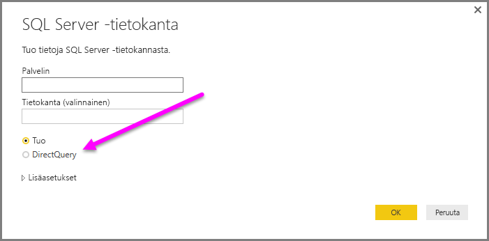
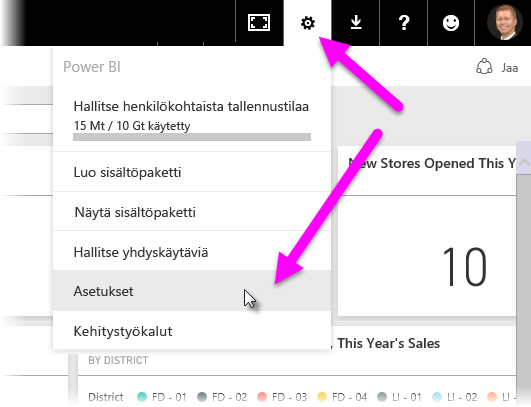
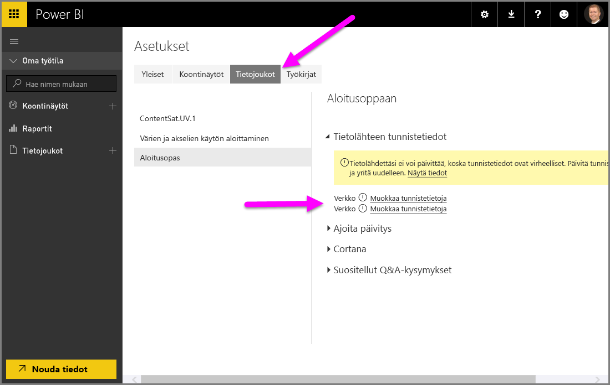

# DirectQueryn käyttö Power BI Desktopissa
Kun muodostat yhteyden tietolähteeseen, voit **Power BI Desktopin** avulla aina tuoda kopion tiedoista **Power BI Desktopiin**. Joillekin tietolähteille on saatavilla vaihtoehtoinen menetelmä: yhteyden muodostaminen suoraan tietolähteeseen **DirectQueryn** avulla.

## Tuetut tietolähteet
Löydät **DirectQueryä** tukevien tietolähteiden täydellisen luettelon artikkelista [DirectQueryn tukemat tietolähteet](desktop-directquery-data-sources.md).

## Yhteyden muodostaminen DirectQueryn avulla
Kun käytät **Nouda tiedot** -komentoa yhteyden muodostamiseen **DirectQueryn** tukemaan tietolähteeseen, voit yhteysikkunan avulla valita yhteystavan.  

**Tuo**- ja **DirectQuery**-komentojen valinnan erot ovat seuraavat:

**Tuo** – Valitut taulukot ja sarakkeet tuodaan **Power BI Desktopiin**. Kun luot tai käsittelet visualisointeja, **Power BI Desktop** käyttää tuotuja tietoja. Tiedot on päivitettävä, mikä tuo jälleen koko tietojoukon. Voit näin nähdä muutokset, jotka ovat tapahtuneet pohjana olevissa tiedoissa alkuperäisen tuonnin tai viimeisimmän päivityksen jälkeen.

**DirectQuery** – Mitään tietoja ei tuoda tai kopioida **Power BI Desktopiin**. Valitut taulukot ja sarakkeet näkyvät relaatiolähteissä **Kentät**-luettelossa. Moniulotteisissa lähteissä, kuten SAP Business Warehouse, valitun kuution dimensiot ja mitat näkyvät **Kentät**-luettelossa. Kun luot tai käsittelet visualisointeja, **Power BI Desktop** lähettää kyselyjä pohjana olevaan tietolähteeseen eli näet aina ajantasaiset tiedot.

Saatavilla on useita tietojen mallinnuksia ja muunnoksia **DirectQueryn** käytön aikana, vaikka siihen liittyykin joitakin rajoituksia. Kun luot tai käsittelet visualisointeja, kyselyjä on lähetettävä pohjana olevaan tietolähteeseen. Visualisoinnin päivitykseen kuluva aika riippuu pohjana olevan tietolähteen suorituskyvystä. Kun palvelupyynnön täyttämiseen tarvittavia tietoja on pyydetty äskettäin, Power BI Desktop käyttää viimeisimpiä tietoja visualisoinnin näyttämiseen vaaditun ajan lyhentämiseksi. Valitsemalla **Päivitä** **Aloitus**-valintanauhasta varmistat, että kaikkiin visualisointeihin päivitetään uusimmat tiedot.

Artikkelissa [Power BI ja DirectQuery](desktop-directquery-about.md) kuvataan **DirectQueryä** tarkemmin. Seuraavissa osioissa on myös lisätietoja eduista, rajoituksista ja tärkeistä huomioon otettavista seikoista, kun käytät **DirectQueryä**.

## DirectQueryn käytön edut
**DirectQueryn** käytöllä on joitakin etuja:

* Voit **DirectQueryn** avulla luoda visualisointeja hyvin laajoista tietojoukoista, kun se muuten olisi mahdotonta, tuomalla ensin kaikki tiedot esikoostettuina.
* Pohjana olevien tietojen muutokset saattavat vaatia tietojen päivittämistä. Joidenkin raporttien tapauksessa nykyisten tietojen näyttäminen voi vaatia suuria tiedonsiirtoja, eikä tietoja voida siten tuoda uudestaan. Sitä vastoin **DirectQuery**-raportit käyttävät aina ajantasaisia tietoja.
* 1 Gt:n tietojoukkorajoitusta *ei* sovelleta **DirectQueryyn**.

## DirectQueryn rajoitukset
**DirectQueryn** käyttöön liittyy nykyisin joitakin rajoituksia:

* Kaikkien taulukoiden on oltava peräisin yksittäisestä tietokannasta.
* Jos **kyselyeditorin** kysely on liian monimutkainen, tapahtuu virhe. Virheen korjaamiseksi on joko poistettava ongelmallinen vaihe **kyselyeditorissa** tai *tuotava* tiedot **DirectQueryn** käytön sijasta. Moniulotteisten tietolähteiden, kuten SAP Business Warehousen, tapauksessa ei voi käyttää **kyselyeditoria**.
* Suhteen suodatus on rajoitettu yhteen suuntaan molempien suuntien sijasta (vaikka on mahdollista ottaa käyttöön ristisuodatus molempiin suuntiin **DirectQuerylle** esikatseluominaisuutena). Moniulotteisten lähteiden, kuten SAP Business Warehousen, tapauksessa mallissa ei ole määritetty suhteita.
* Aikatieto-ominaisuudet eivät ole käytettävissä **DirectQueryssä**. Esimerkiksi päivämääräsarakkeiden (vuosi, vuosineljännes, kuukausi, päivä jne.) erityiskohtelua ei tueta **DirectQuery**-tilassa.
* Oletusarvoisesti rajoitukset sijoitetaan DAX-lausekkeisiin sallittuina toimenpiteinä. Katso lisätietoja seuraavasta kappaleesta (luettelomerkeillä varustetun luettelon jälkeen).
* Tietojen palautuksen tapauksessa on miljoonan rivin rajoitus käytettäessä **DirectQueryä**. Tämä ei vaikuta koosteisiin tai laskelmiin, joita on käytetty **DirectQueryn** avulla palautetun tietojoukon luontiin, vaan pelkästään palautettuihin riveihin. Voit esimerkiksi koostaa 10 miljoonaa riviä tietolähteestä tehdystä kyselystä ja palauttaa tarkasti tämän koosteen tulokset Power BI:hin **DirectQueryn** avulla, jos Power BI:hin palautettujen tietojen koko on alle miljoona riviä. Jos **DirectQuerystä** palautetaan yli miljoona riviä, Power BI palauttaa virheen.

Sen varmistamiseksi, että pohjana olevaan tietolähteeseen lähetettyjen kyselyjen suorituskyky on riittävä, mitoille määritetään oletusarvoisesti rajoituksia. Edistyneet käyttäjät voivat ohittaa tämän rajoituksen valitsemalla **Tiedosto > Vaihtoehdot ja asetukset > Vaihtoehdot** ja sitten **DirectQuery**, ja valitsemalla sitten vaihtoehdon *Salli rajoittamattomat toimenpiteet DirectQuery-tilassa*. Kun tämä vaihtoehto on valittu, voidaan käyttää mitä tahansa DAX-lauseketta, joka on kelvollinen mitalle. Käyttäjien on kuitenkin pantava merkille, että jotkin lausekkeet, jotka suoriutuvat erittäin hyvin tietojen tuonnin aikana, voivat hidastaa paljonkin kyselyjä taustalähteeseen DirectQuery-tilassa.

## DirectQueryn käytössä huomioitavia tärkeitä seikkoja
Kun käytät **DirectQueryä**, ota huomioon seuraavat kolme seikkaa:

* **Suorituskyky ja kuormitus** – Kaikki **DirectQuery**-pyynnöt lähetetään lähdetietokantaan, joten visualisoinnin päivitykseen vaadittava aika riippuu siitä, miten kauan taustalähteeltä menee vastaamiseen kyselyn (tai kyselyjen) tulosten avulla. Suositeltu vastausaika (kun pyydetyt tiedot palautetaan) käyttämällä **DirectQueryä** visualisoinneille on korkeintaan viisi sekuntia. Suositeltu tulosten enimmäisvastausaika on 30 sekuntia. Jos aika on tätä pidempi, raportin käyttökokemus heikkenee selvästi. Lisäksi kun raportti on julkaistu Power BI -palvelussa, yli pari minuuttia kestävä kysely aikakatkaistaan, ja käyttäjä saa virheen.
  
  Tässä yhteydessä olisi myös otettava huomioon lähdetietokannan kuormitus julkaistua raporttia hyödyntävien Power BI -käyttäjien määrän mukaan. *Row Level Security* (RLS) -tason käytöllä voi olla myös merkittävä vaikutus; useiden käyttäjien jakama muu kuin RLS-koontinäyttö johtaa yhteen tietokantakyselyyn, mutta RLS:n käyttö koontinäyttöruudussa tarkoittaa yleensä sitä, että ruudun päivitys vaatii yhtä kyselyä *käyttäjää kohti*. Tämä vuorostaan lisää merkittävästi lähdetietokannan kuormitusta ja saattaa heikentää suorituskykyä.
  
  Power BI luo kyselyjä, jotka ovat mahdollisimman tehokkaita. Luotu kysely ei ehkä kuitenkaan tietyissä tilanteissa ole riittävän tehokas mahdollisesti epäonnistuneen päivityksen välttämiseksi. Yksi esimerkki tästä tilanteesta on se, kun luotu kysely noutaa liikaa rivejä (yli miljoona) taustatietolähteestä. Tällöin tapahtuu seuraavia virheitä:
  
      The resultset of a query to external data source has exceeded
      the maximum allowed size of '1000000' rows.
  
  Tällainen tilanne voi ilmetä yksinkertaisen kaavion tapauksessa, kun se sisältää hyvin suuren kardinaliteettisarakkeen, jonka koostevaihtoehdoksi on määritetty *Älä tee yhteenvetoa*. Visualisoinnissa on oltava vain sarakkeita, joiden kardinaliteetti on alle miljoona, tai siihen on sovellettava asianmukaisia suodattimia.
* **Suojaus** – Kaikki julkaistua raporttia hyödyntävät käyttäjät muodostavat yhteyden taustatietolähteeseen tunnistetiedoilla, jotka annetaan kirjautumisen jälkeen Power BI -palveluun. Tämä on sama tilanne kuin tuotujen tietojen tapauksessa: kaikki käyttäjät näkevät samat tiedot riippumatta taustalähteessä määritetyistä suojaussäännöistä. Asiakkaiden, jotka haluavat soveltaa DirectQuery-lähteisiin käyttäjäkohtaista suojausta, on käytettävä RLS-tasoa. [Lue lisää RLS-tasosta](service-admin-rls.md).
* **Tuetut ominaisuudet** – **Power BI Desktopin** kaikkia ominaisuuksia ei tueta **DirectQuery**-tilassa tai niihin liittyy joitakin rajoituksia. Lisäksi Power BI -palvelussa on joitakin ominaisuuksia (kuten *Nopeat merkitykselliset tiedot*), joita eivät ole saatavilla **DirectQueryä** käyttäville tietojoukoille. Käyttäjän olisi siten otettava huomioon tällaiset **DirectQueryn** käyttöön liittyvät ominaisuudet harkitessaan **DirectQueryn** käyttöä.   

## Power BI -palveluun kirjautuminen
**DirectQueryn** avulla luodut raportit voidaan kirjata Power BI -palveluun.

Jos käytetty tietolähde ei tarvitse **paikallista tietoyhdyskäytävää** (**Azure SQL -tietokanta**, **Azure SQL Data Warehouse** tai **Redshift**), tunnistetiedot on annettava ennen kuin kirjattu raportti näytetään Power BI -palvelussa.

Voit antaa tunnistetiedot valitsemalla **Asetukset**-rataskuvakkeen Power B:ssä ja valitsemalla sitten **Asetukset**.

Power BI näyttää **Asetukset**-ikkunan. Voit täältä valita **Tietojoukot**-välilehden ja valita tietojoukon, joka käyttää **DirectQueryä**, ja valita **Muokkaa tunnistetietoja**.

Ennen kuin tunnistetiedot on annettu, kirjatun raportin avaaminen, tai tietojoukon, joka on luotu **DirectQuery**-yhteyden avulla tällaisiin tietolähteisiin, tarkasteleminen palauttaa virheen.

Muille tietolähteille kuin **Azure SQL -tietokanta**, **Azure SQL Data Warehouse** ja **Redshift**, jotka käyttävät DirectQueryä **, on asennettava paikallinen tietoyhdyskäytävä**, ja tietolähde on rekisteröitävä tietoyhteyden muodostamiseksi. Voit [lukea lisää paikallisesta tietoyhdyskäytävästä](http://go.microsoft.com/fwlink/p/?LinkID=627094).

## Seuraavat vaiheet
Saat lisätietoja **DirectQuerystä** seuraavista resursseista:

* [DirectQueryn käyttö Power BI:ssä](desktop-directquery-about.md)
* [DirectQueryn tukemat tietolähteet](desktop-directquery-data-sources.md)
* [DirectQuery ja SAP BW](desktop-directquery-sap-bw.md)
* [DirectQuery ja SAP HANA](desktop-directquery-sap-hana.md)
* [Paikallinen tietoyhdyskäytävä](service-gateway-onprem.md)

