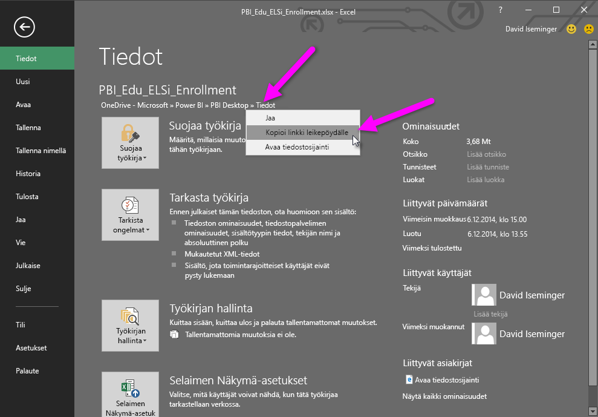
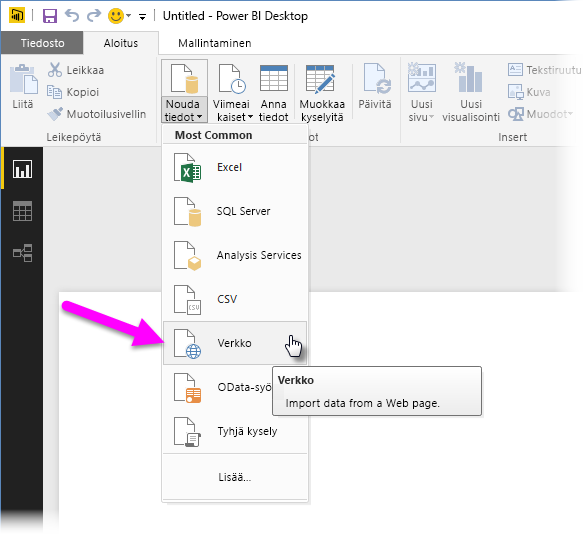

# OneDrive for Business -linkkien käyttö Power BI Desktopissa
Monilla käyttäjillä on Excel-työkirjoja, jotka on tallennettu OneDrive for Business-asemaan, joka sopisi hyvin käytettäväksi Power BI Desktopin kanssa. **Power BI Desktopilla** voit käyttää online-linkkejä **OneDrive for Businessiin** tallennetuille **Excel**-tiedostoille raporttien ja visualisointien luomiseen. Voit käyttää **OneDrive for Business** -ryhmätiliä tai omaa **OneDrive for Business** -tiliäsi.

Online-linkin hakeminen **OneDrive for Businessista** edellyttää muutamia erityisiä vaiheita. Seuraavassa kerrotaan nämä vaiheet, joiden avulla voit jakaa tiedostolinkin ryhmien kesken, eri koneiden välillä ja työtovereidesi kanssa.

## Linkin hakeminen Excelistä, aloitus selaimessa
1. Siirry OneDrive for Business -sijaintiin selaimessa. Napsauta hiiren kakkospainikkeella haluamaasi tiedostoa ja valitse **Avaa Excelissä**.
   
   > [!NOTE]
> Selaimesi käyttöliittymä ei välttämättä näytä täsmälleen samalta kuin seuraavassa kuvassa. Käytettävissä on monia eri tapoja **Avaa Excelissä** -kohdan valitsemiseen tiedostoille, jotka ovat **OneDrive for Business** -selaimen käyttöliittymässä. Voit käyttää mitä tahansa vaihtoehtoa, jonka avulla voit avata tiedoston Excelissä.
   > 
   > 
   
   
2. Valitse **Excel**, valitse **Tiedosto > Tiedot** ja valitse **Suojaa työkirja** -painikkeen yläpuolella oleva linkki. Valitse **Kopioi linkki leikepöydälle** (käyttämässäsi versiossa saattaa lukea **Kopioi polku leikepöydälle**).
   
   

## Power BI Desktop-linkin käyttö
Power BI Desktopissa voit käyttää linkkiä, jonka juuri kopioit leikepöydälle. Tee seuraavat toimet:

1. Valitse Power BI Desktopissa **Nouda tiedot > Verkko**.
   
   
2. Liitä linkki **Verkosta**-valintaikkunaan ( **älä** valitse vielä OK).
   
    
3. Huomaa *?web=1* -merkkijono linkin lopussa – sinun täytyy *poistaa tämä osa WWW-URL-merkkijonosta* **ennen kuin** valitset **OK**, jotta **Power BI Desktop** siirtyy tiedostoon oikein.
4. Jos **Power BI Desktop** kehottaa antamaan tunnistetiedot, valitse joko **Windows** (paikallisille SharePoint-sivustoille) tai **Organisaatiotili** (Office 365:lle tai OneDrive for Business -sivustoille).
   
   

Näkyviin tulee **Siirtymistoiminto**-ikkuna, josta voit valita luettelosta taulukoita, laskentataulukoita ja alueita, joita Excel-työkirjasta löytyy. Sieltä voit käyttää OneDrive for Business -tiedostoa samalla tavalla kuin muitakin Excel-tiedostoja, ja luoda raportteja ja käyttää sitä tietojoukoissa samaan tapaan kuin muissakin tietolähteissä.

> [!NOTE]
> Voit käyttää **OneDrive for Business** -tiedostoa tietolähteenä Power BI -palvelussa, ja kun **Palvelun päivitys** on käytössä kyseiselle tiedostolle, varmista, että valitset **OAuth2**-vaihtoehdon **Todennusmenetelmäksi** päivitysasetuksiasi määrittäessäsi. Muussa tapauksessa voit kohdata virheen (kuten *Tietolähteen tunnistetietojen päivittäminen epäonnistui*), kun yrität muodostaa yhteyttä tai päivittää. Valitsemalla **OAuth2** todennusmenetelmäksi voidaan korjata kyseinen tunnistetietoja koskeva virhe.
> 
> 

