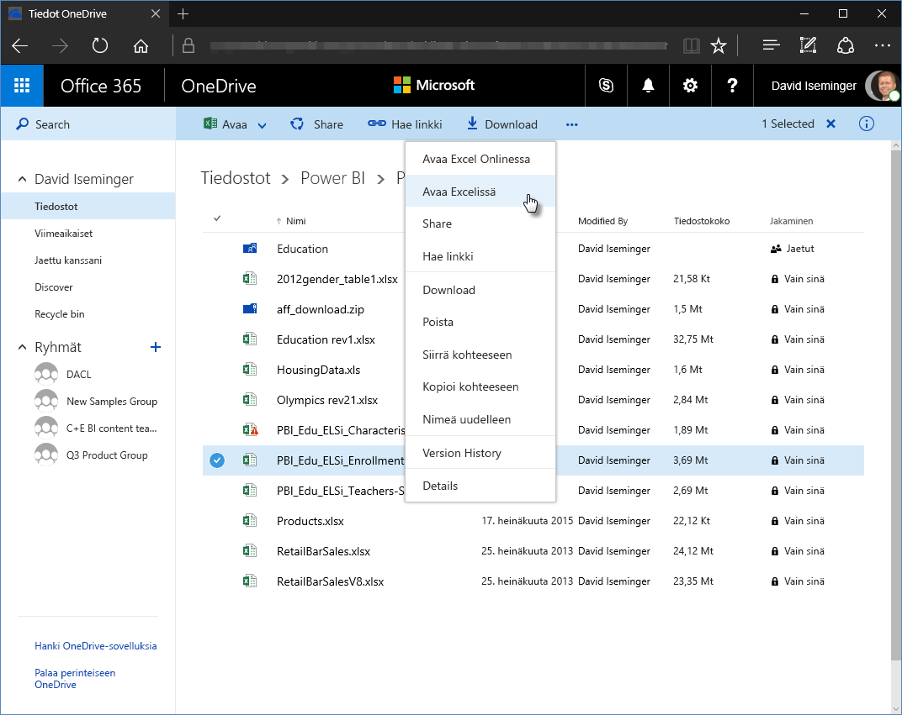
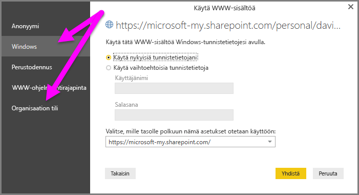

# OneDrive for Business -linkkien käyttö Power BI Desktopissa
Monilla käyttäjillä on Excel-työkirjoja tallennettuina OneDrive for Businessiin, joka sopisi hyvin käytettäväksi Power BI Desktopin kanssa. Power BI Desktopilla voit käyttää online-linkkejä OneDrive for Businessiin tallennetuille Excel-tiedostoille raporttien ja visualisointien luomiseen. Voit käyttää OneDrive for Business -ryhmätiliä tai omaa OneDrive for Business -tiliäsi.

Online-linkin hakeminen OneDrive for Businessista edellyttää muutamia erityisiä vaiheita. Seuraavassa kerrotaan nämä vaiheet, joiden avulla voit jakaa tiedostolinkin ryhmien kesken, eri koneiden välillä ja työtovereidesi kanssa.

## Hae linkki Excelistä
1. Siirry OneDrive for Business -sijaintiin selaimessa. Napsauta hiiren kakkospainikkeella haluamaasi tiedostoa ja valitse **Avaa Excelissä**.
   
   > [!NOTE]
   > Selaimesi käyttöliittymä ei välttämättä näytä täsmälleen samalta kuin seuraavassa kuvassa. Käytettävissä on monia eri tapoja **Avaa Excelissä** -kohdan valitsemiseen tiedostoille, jotka ovat OneDrive for Business -selaimen käyttöliittymässä. Voit käyttää mitä tahansa vaihtoehtoa, jonka avulla voit avata tiedoston Excelissä.
   > 
   > 
   
   
2. Valitse Excelissä **Tiedosto** > **Tiedot** ja valitse sitten **Kopioi polku** kohdan **Suojaa työkirja** yläpuolelta.
   
   

## Power BI Desktop-linkin käyttö
Power BI Desktopissa voit käyttää linkkiä, jonka juuri kopioit leikepöydälle. Tee seuraavat toimet:

1. Valitse Power BI Desktopissa **Nouda tiedot** > **Verkko**.
   
   
2. Kun **Perus**-vaihtoehto on valittuna, liitä linkki **Verkosta**-valintaikkunaan.
3. Poista merkkijono *?web=1* linkin lopusta niin, että Power BI Desktop voi siirtyä tiedostoosi oikein, ja valitse sitten **OK**.
   
     
4. Jos Power BI Desktop vaatii tunnistetietoja, valitse joko **Windows** (paikallisille SharePoint-sivustoille) tai **Organisaatiotili** (Office 365- tai OneDrive for Business -sivustoille).
   
   

   Näkyviin tulee **Siirtymistoiminto**-valintaikkuna, josta voit valita luettelosta taulukoita, laskentataulukoita ja alueita, joita Excel-työkirjasta löytyy. Sieltä käsin voit käyttää OneDrive for Business -tiedostoa aivan kuten mitä tahansa muutakin Excel-tiedostoa. Voit luoda raportteja ja käyttää sitä tietojoukoissa aivan kuten mitä tahansa muutakin tietolähdettä.

> [!NOTE]
> Voit käyttää OneDrive for Business -tiedostoa tietolähteenä Power BI -palvelussa, ja kun **Palvelun päivitys** on käytössä kyseiselle tiedostolle, varmista, että valitset **OAuth2**-vaihtoehdon **Todennusmenetelmäksesi** päivitysasetuksiasi määrittäessäsi. Muussa tapauksessa voit kohdata virheen (kuten *Tietolähteen tunnistetietojen päivittäminen epäonnistui*), kun yrität muodostaa yhteyttä tai päivittää. Valitsemalla **OAuth2** todennusmenetelmäksi voidaan korjata kyseinen tunnistetietoja koskeva virhe.
> 
> 

