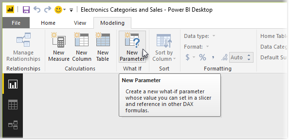
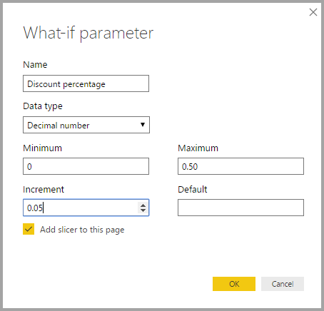
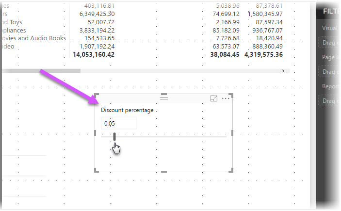
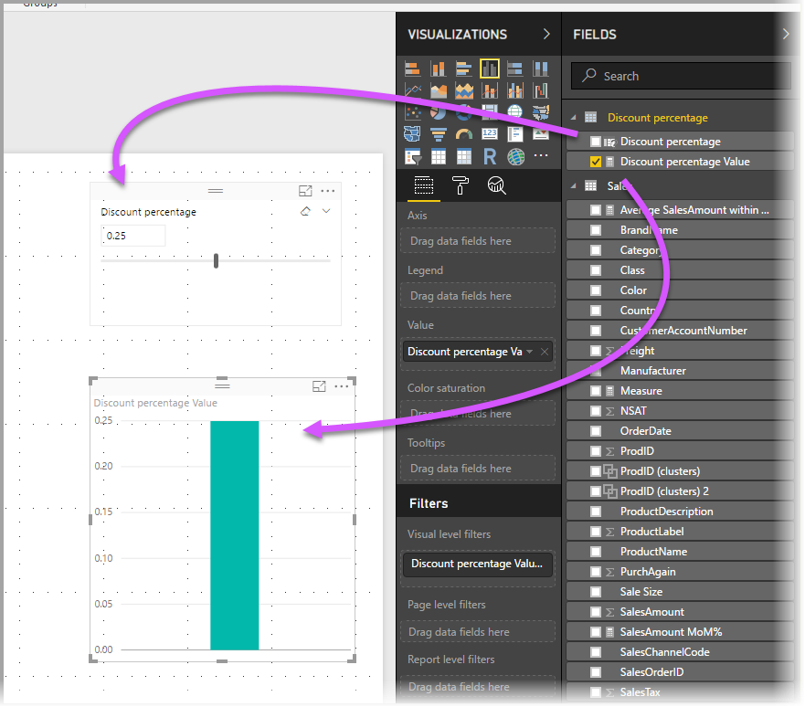
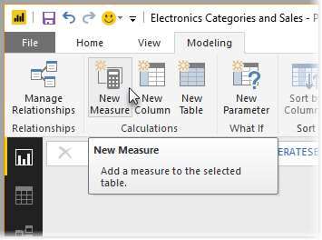
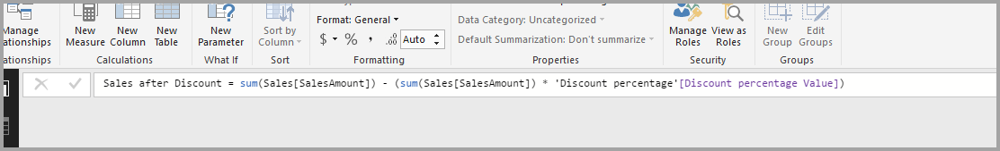
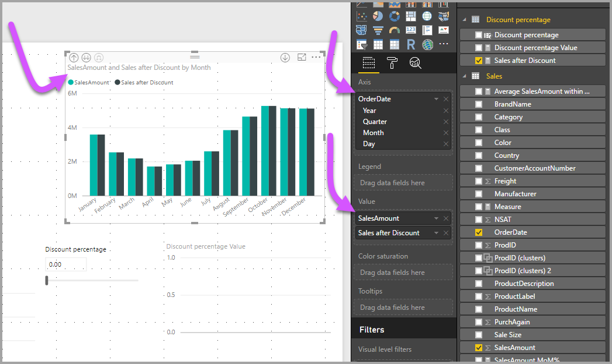

# Entä jos -parametrin luominen ja käyttäminen muuttujien visualisointiin Power BI Desktopissa
Elokuussa 2017 julkaistusta **Power BI Desktop** -versiosta lähtien voit luoda raportteihin **Entä jos** -muuttujia, käsitellä muuttujaa osittajana ja näin visualisoida ja kvantifioida eri avainarvoja raporteissasi.

**Entä jos** -parametrin voi valita **Power BI Desktopin** **Mallinnus**-välilehdessä. Tällöin näyttöön tulee valintaikkuna, jossa voit määrittää parametrin.

## Entä jos -parametrin luominen
Voit luoda **Entä jos** -parametrin **Power BI Desktopin** **Mallinnus**-välilehdessä sijaitsevalla **Entä jos** -painikkeella. Seuraavassa kuvassa on luotu *Alennusprosentti*-parametri, jonka tietotyypiksi on määritetty *Desimaaliluku.* *Pienin* arvo on nolla, *suurin* taas 0,50 (viisikymmentä prosenttia). *Lisäykseksi* on määritetty 0,05 eli viisi prosenttia. Tämän arvon verran parametria säädetään, kun sitä käsitellään raportissa.

> [!NOTE]
> Kun käytät desimaalilukuja, varmista, että ne alkavat nollalla. Kirjoita siis ruutuun 0,50 äläkä vain .50. Muussa tapauksessa lukua ei voida vahvistaa eikä **OK**-painike ole valittavissa.
> 
> 

**Entä jos** -parametrin mukainen osittaja lisätään automaattisesti nykyiseen raporttisivuun, kun valitset **Lisää osittaja tähän sivuun** -valintaruudun.

Kun **Entä jos** -parametri luodaan, luodaan itse parametrin lisäksi myös mittari, jonka avulla voit visualisoida **Entä jos** -parametrin nykyisen arvon.

On tärkeää ja hyödyllistä tietää, että **Entä jos** -parametrin luomisen jälkeen sekä parametrista että mittarista tulee osa malliasi. Ne ovat siis käytettävissä koko raportissa, ja niitä voi käyttää raportin muilla sivuilla. Koska ne ovat osa mallia, voit poistaa osittajan raporttisivulta ja saat sen helposti takaisin halutessasi. Voit palauttaa **Entä jos** -parametrin raporttiin tarttumalla **Entä jos** -parametriin **Kentät**-luettelossa ja vetämällä sen pohjaan (muuta visualisointi tämän jälkeen osittajaksi).

## Entä jos -parametrin käyttäminen
Luodaan seuraavaksi yksinkertainen esimerkki **Entä jos** -parametrin käyttämisestä. Edellisessä osiossa loimme **Entä jos** -parametrin, ja nyt otamme sen käyttöön luomalla uuden mittarin, jonka arvoa säädetään liukusäätimellä. Teemme tämän luomalla uuden mittarin.

Uusi mittari on yksinkertaisesti myynnin kokonaismäärä, jossa huomioidaan alennusprosentti. Voit tietenkin luoda monimutkaisia ja mielenkiintoisia mittareita, joiden avulla raporttiesi käyttäjät voivat visualisoida **Entä jos** -parametrin muuttujan. Voit esimerkiksi luoda raportin, joka kertoo myyntihenkilöstölle, mikä heidän kompensaationsa on, jos tietyt myyntitavoitteet tai -prosentit täyttyvät, tai tarkastella myynnin lisääntymisen ja suurempien alennusten suhdetta.

Kun mittarin kaava on kirjoitettu kaavariville ja sille on annettu nimeksi **Myynti alennuksen jälkeen**, lopputulos näyttää tältä:

Seuraavaksi luomme pylväskaavion, jonka akseliksi valitaan *OrderDate* ja arvoiksi sekä *SalesAmount* että juuri luomamme mittari *Myynti alennuksen jälkeen*.

Kun liukusäädintä siirretään, *Myynti alennuksen jälkeen* -pylväs osoittaa myynnin määrän kyseistä alennusta käytettäessä.

Siinä kaikki. Voit käyttää **Entä jos** -parametreja kaikenlaisissa tilanteissa, kun haluat antaa raporttien käyttäjille mahdollisuuden tutkia raportteihin luomiasi erilaisia skenaarioita.

