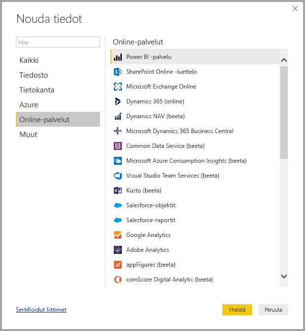
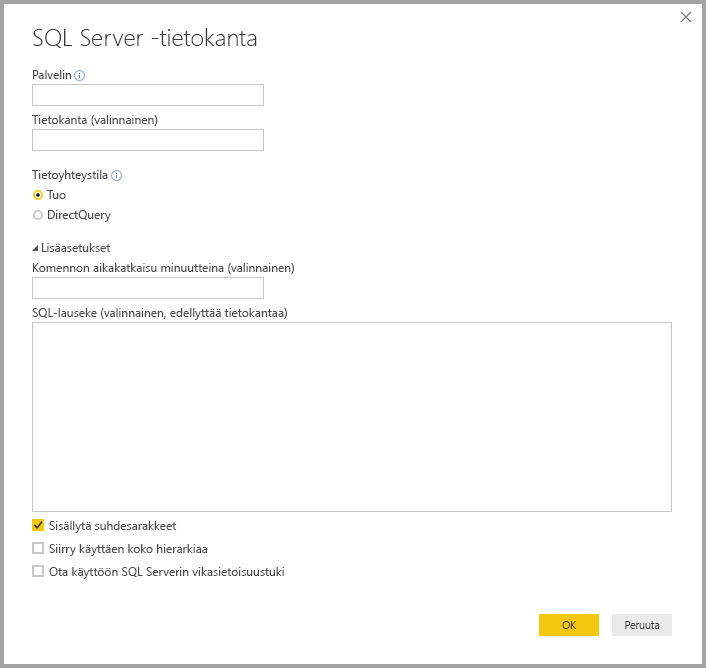
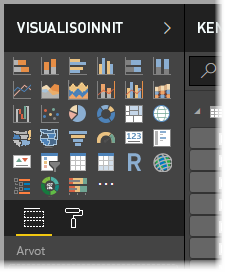
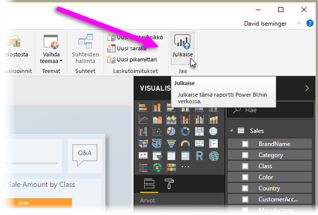

# Mikä on Power BI Desktop?

**Power BI Desktop** on ilmainen sovellus, jonka voit asentaa paikalliseen tietokoneeseen ja jonka avulla voit muodostaa yhteyden tietoihin sekä muuntaa ja visualisoida niitä. **Power BI Desktopin** avulla voit muodostaa yhteyden moniin eri tietolähteisiin ja yhdistää ne tietomalliksi (tätä kutsutaan usein mallintamiseksi). Tietomallia käyttämällä voit luoda visualisointeja ja visualisointien kokoelmia, jotka voit jakaa raportteina muille organisaatiosi jäsenille. Useimmat liiketoimintatietoprojekteissa työskentelevät käyttäjät luovat raportit **Power BI Desktopilla** ja jakavat ne sitten muille **Power BI -palvelun** avulla.

**Power BI Desktopin** yleisimmät käyttötavat ovat seuraavat:

* Tietoihin yhdistäminen
* Tietojen muuntaminen ja siistiminen sekä tietomallin luominen
* Kaavioiden ja muiden visualisointien luominen – tiedot esitetään visuaalisessa muodossa
* Raporttien luominen – visualisoinnit kootaan yhdelle tai useammalle raporttisivulle
* Raporttien jakaminen muiden kanssa **Power BI -palvelun** avulla

Tällaisista tehtävistä vastaavina henkilöinä pidetään useimmiten *tietoanalyytikkoja* (joita kutsutaan joskus vain *analyytikoiksi*) ja liiketoimintatiedon asiantuntijoita (joita kutsutaan usein *raportin laatijoiksi*). Kuitenkin monet, jotka eivät pidä itseään analyytikkoina tai raportin laatijoina, laativat vakuuttavia raportteja tai noutavat tietoja eri lähteistä ja luovat työtovereille ja organisaatioille jaettavia tietomalleja **Power BI Desktopin** avulla.

Power BI Desktopissa on kolme näkymää, jotka näkyvät piirtoalustan vasemmassa reunassa. Näkymät, jotka näkyvät niiden näkymisjärjestyksessä, ovat seuraavat:
* **Raporttinäkymä** – tässä näkymässä voit luoda raportteja ja visualisointeja, ja siinä myös vietät suurimman osan luontiajastasi.
* **Tietonäkymä** – tässä näkymässä voit tarkastella raporttiisi liittyvässä tietomallissa käytettäviä taulukoita, mittareita ja muita tietoja sekä muuntaa tiedot parhaalla tavalla raportin mallissa.
* **Mallinäkymä** – tässä näkymässä voit tarkastella ja hallita tietomallisi taulukoiden välisiä suhteita.

Seuraavassa kuvassa näkyvät nämä kolme näkymää piirtoalustan vasemmassa reunassa:

**Power BI Desktopilla** voit luoda monitasoisia ja visuaalisesti monipuolisia raportteja. Voit yhdistää tietoja useista lähteistä yhdeksi kattavaksi raportiksi, jonka voit jakaa muiden organisaatiosi jäsenten kanssa. 

## Tietoihin yhdistäminen
Kun aloitat **Power BI Desktopin** käytön, sinun on ensiksi muodostettava yhteys tietoihin. **Power BI Desktopilla** voit muodostaa yhteyden moniin eri tietolähteisiin. Yhteyden muodostaminen tietoihin on helppoa: valitse ensin **Aloitus**-valintanauha ja sitten **Nouda tiedot > Lisää**. Seuraavassa kuvassa näkyy avautuva **Nouda tiedot** -ikkuna, joka sisältää kaikki ne vaihtoehdot, joihin Power BI Desktop voi muodostaa yhteyden.

Kun valitset tietotyypin, sinulta pyydetään tietoja, kuten URL-osoite ja tunnistetiedot. Niitä tarvitaan, jotta Power BI Desktop voi muodostaa yhteyden tietolähteeseen puolestasi.

Kun olet muodostanut yhteyden vähintään yhteen tietolähteeseen, voit halutessasi muuntaa tiedot omaan käyttötarkoitukseesi sopivaan muotoon.

## Tietojen muuntaminen ja siistiminen sekä mallin luominen

Power BI Desktopissa voit siistiä ja muuntaa tietoja ohjelman sisäisen **kyselyeditorin** avulla. Kyselyeditorilla voit tehdä tietoihin muutoksia, kuten vaihtaa tietotyyppiä, poistaa sarakkeita tai yhdistää useiden lähteiden tietoja. Periaate on samantapainen kuin kuvanveistossa – voit aloittaa suuresta savikimpaleesta (tai tietomassasta), poistaa joitakin palasia ja lisätä toisia tarpeen mukaan, kunnes tietojen muoto on juuri sellainen kuin haluat. 

Kaikki suorittamasi tiedon muuntamisen vaiheet (esimerkiksi taulukon nimeäminen uudelleen, tietotyypin muuntaminen tai sarakkeiden poistaminen) kirjataan **kyselyeditoriin**. Nämä vaiheet suoritetaan sitten aina, kun kysely muodostaa yhteyden tietolähteeseen, jotta tiedot ovat aina määrittämässäsi muodossa.

Seuraavassa kuvassa näkyy muotoillun ja malliksi muunnetun kyselyn **Kyselyasetukset**-ruutu.

 

Kun tiedot ovat haluamassasi muodossa, voit luoda visualisointeja. 

## Visualisointien luominen 

Kun käytössäsi on tietomalli, voit luoda *visualisointeja* vetämällä *kenttiä* raporttipohjalle. *Visualisoinnit* ovat mallisi tietojen graafisia esityksiä. Seuraavassa visualisoinnissa näkyy yksinkertainen pylväskaavio. 

Power BI Desktopissa on valittavissa monia erilaisia visualisointityyppejä. Voit luoda visualisoinnin tai muuttaa sitä helposti napsauttamalla **Visualisoinnit**-ruudussa olevaa visualisoinnin kuvaketta. Jos jokin raporttipohjalla oleva visualisointi on valittuna, kyseinen visualisointi muuttuu valintasi mukaan. Jos visualisointeja ei ole valittu, ohjelma luo uuden visualisoinnin valintasi perusteella.

## Raporttien luominen

Useimmiten kannattaa luoda kokoelma visualisointeja kuvaamaan eri näkökulmista niitä tietoja, joita mallin luomiseen Power BI Desktopissa on käytetty. Yhdessä Power BI Desktop -tiedostossa olevien visualisointien kokoelmaa kutsutaan *raportiksi*. Raportissa voi olla yksi tai useampi sivu, aivan kuten Excel-tiedostossa voi olla yksi tai useampi laskentataulukko. Seuraavassa kuvassa näet Power BI Desktop -raportin ensimmäisen sivun, jonka nimi on Yleiskatsaus (välilehti näkyy kuvan alaosassa). Kyseisessä raportissa on kymmenen sivua.

## Jaa raportteja

Kun raportti on valmis jaettavaksi, voit **julkaista** sen **Power BI -palveluun** ja antaa sen kaikkien niiden organisaatiosi jäsenten käyttöön, joilla on Power BI -käyttöoikeus. Voit julkaista Power BI Desktop -raportin napsauttamalla Power BI Desktopin **Aloitus**-valintanauhassa sijaitsevaa **Julkaise**-painiketta.

Kun napsautat **Julkaise**-painiketta, Power BI Desktop muodostaa yhteyden **Power BI -palveluun** käyttämällä Power BI -tiliäsi ja pyytää sinua sitten valitsemaan, missä kohtaa Power BI -palvelua haluat jakaa raportin: omassa työtilassasi, tiimin työtilassa vai jossakin muussa Power BI -palveluun kuuluvassa sijainnissa. Sinulla on oltava Power BI -käyttöoikeus, jotta voit jakaa raportteja Power BI -palveluun.

## Seuraavat vaiheet

Jotta voit aloittaa **Power BI Desktopin** käytön, sinun on ensin ladattava ja asennettava sovellus. Saat **Power BI Desktopin** käyttöösi kahdella eri tavalla:

* [Lataa Power BI Desktop verkosta](desktop-get-the-desktop.md)
* [Lataa Power BI Desktop Windows-kaupasta](https://aka.ms/pbidesktopstore)
