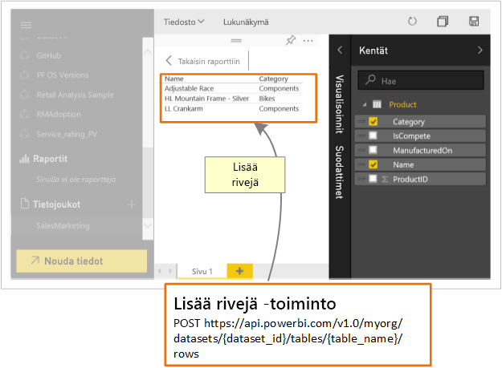

# Mitä kehittäjät voivat tehdä Power BI -ohjelmointirajapinnalla?

Power BI:n REST-ohjelmointirajapinnan avulla voit luoda sovelluksia, jotka integroidaan Power BI -raportteihin, koontinäyttöihin ja ruutuihin.

Power BI:n REST-ohjelmointirajapinnan avulla on mahdollista suorittaa hallintatehtäviä Power BI -objekteissa, kuten raporteissa, tietojoukoissa ja työtiloissa.

Seuraavassa on joitakin asioita, joita voit tehdä Power BI -ohjelmointirajapinnan avulla.

| **Lisätietoja** | **Viittaa näihin tietoihin** |
|----------------------------------------------------------------------------------|------------------------------------------------------------------------------------|
| Upottaa raportteja, koontinäyttöjä ja ruutuja sekä Power BI:tä käyttävien että Power BI:tä käyttämättömien käyttäjien saataville. | [Power BI:n koontinäyttöjen, raporttien ja ruutujen upottaminen](../embed-sample-for-customers.md) |
| Suorittaa hallintatehtäviä Power BI -objekteille | [Power BI:n REST-ohjelmointirajapinnan viite](https://docs.microsoft.com/rest/api/power-bi/) |
| Laajentaa aiemmin luotua liiketoiminnan työnkulkua työntääksesi avaintietoja Power BI ‑koontinäyttöön | [Tietojen lähettäminen koontinäyttöön](walkthrough-push-data.md) |
| Todentaa käyttäjiä Power BI -palvelussa | [Todentaa käyttäjiä Power BI -palvelussa](../get-azuread-access-token.md) |

> [!NOTE]
> Power BI -ohjelmointirajapinnat viittaavat työtiloihin edelleen ryhminä. Mitkä tahansa viittaukset ryhmiin tarkoittavat sitä, että työskentelet työtilojen parissa.

## Ohjelmointirajapinnan kehitystyökalut

| Työkalu(t) | Kuvaus |  |  |
|-------------------------|---------------------------------------------------------------------------------------------------------------------------------------------------|---|---|
| [Playground-työkalu](https://microsoft.github.io/PowerBI-JavaScript/demo) | Täydellinen malli Power BI JavaScript -ohjelmointirajapintojen käyttämisestä. Tämä työkalu on lisäksi nopea tapa kokeilla erilaisia Power BI Embedded -malleja. |  |  |
| [Power BI JavaScript wiki](https://github.com/Microsoft/powerbi-javascript/wiki) | Lisätietojen saaminen Power BI JavaScript -ohjelmointirajapinnoista. |  |  |
| [Postman](https://www.getpostman.com/) | Pyyntöjen suorittaminen, testaaminen, virheiden korjaaminen, seuranta, automaattisten testien suorittaminen ja paljon muuta. |

## Tietojen työntäminen Power BI:hin

Power BI ‑ohjelmointirajapinnan avulla voit [lähettää tietoja tietojoukkoon](walkthrough-push-data.md). Tämän ominaisuuden avulla voit lisätä tietojoukkoon sisältyvään taulukkoon uuden rivin. Uudet tiedot esitetään sitten koontinäytön ruuduissa sekä raporttiin sisältyvissä visualisoinneissa.

## GitHub-säilöt

* [Power BI:n kehittäjämallit](https://github.com/Microsoft/PowerBI-Developer-Samples)
* [.NET SDK](https://github.com/Microsoft/PowerBI-CSharp)
* [JavaScript-ohjelmointirajapinta](https://github.com/Microsoft/PowerBI-JavaScript)

## Seuraavat vaiheet

* [Tietojen työntäminen tietojoukkoon](walkthrough-push-data.md)
* [Power BI -visualisoinnin kehittäminen](../visuals/custom-visual-develop-tutorial.md)
* [Power BI:n REST-ohjelmointirajapinnan viite](rest-api-reference.md)
* [Power BI:n REST-ohjelmointirajapinnat](https://docs.microsoft.com/rest/api/power-bi/)

Onko sinulla kysyttävää? [Voit esittää kysymyksiä Power BI -yhteisössä](https://community.powerbi.com/)
