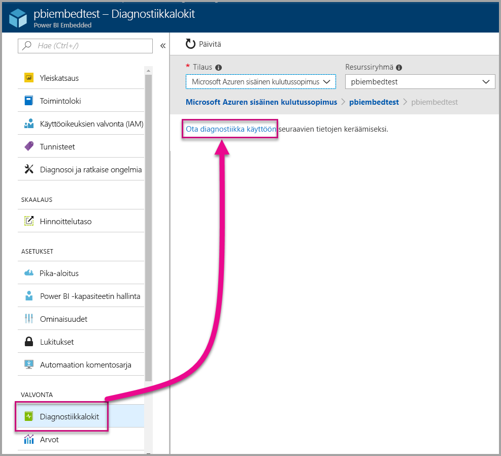
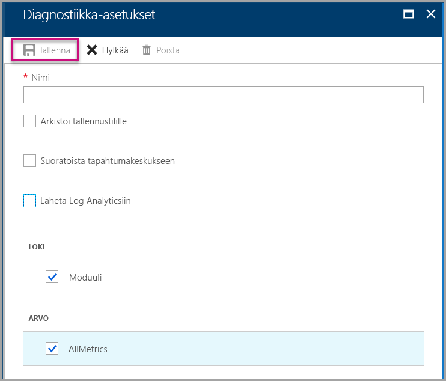
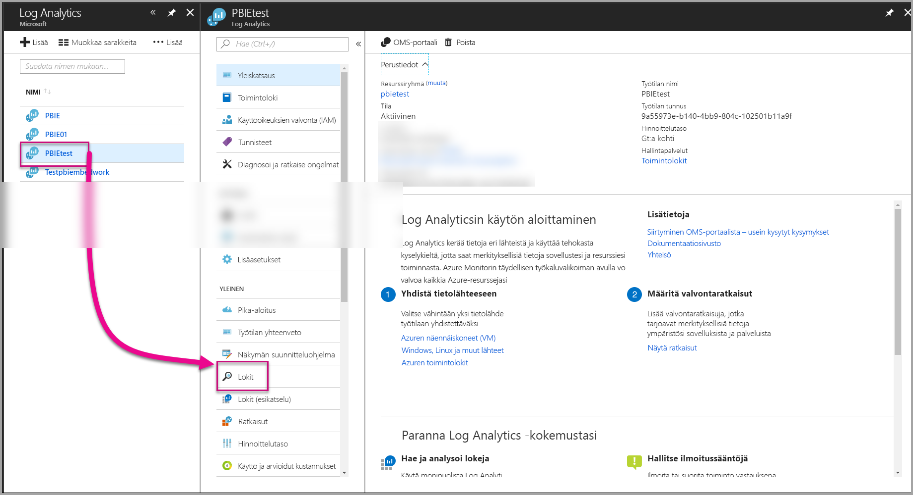
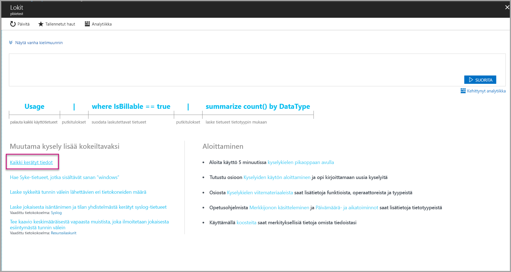
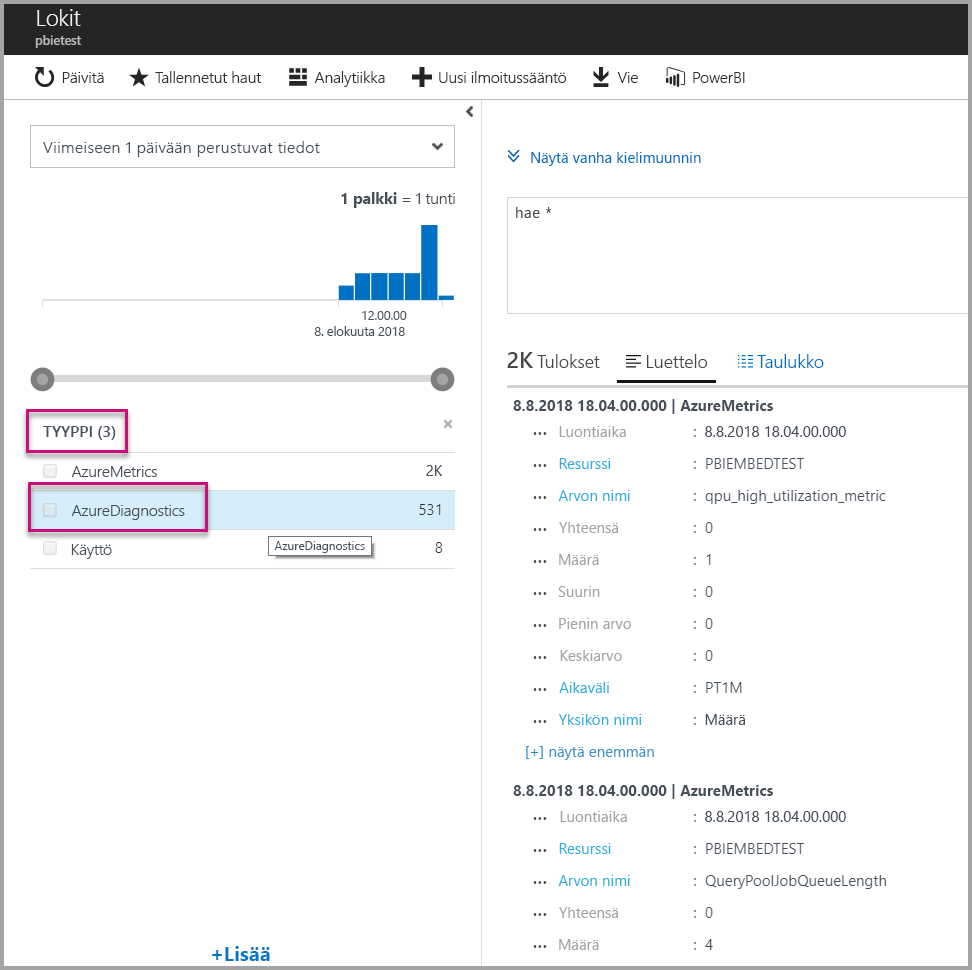
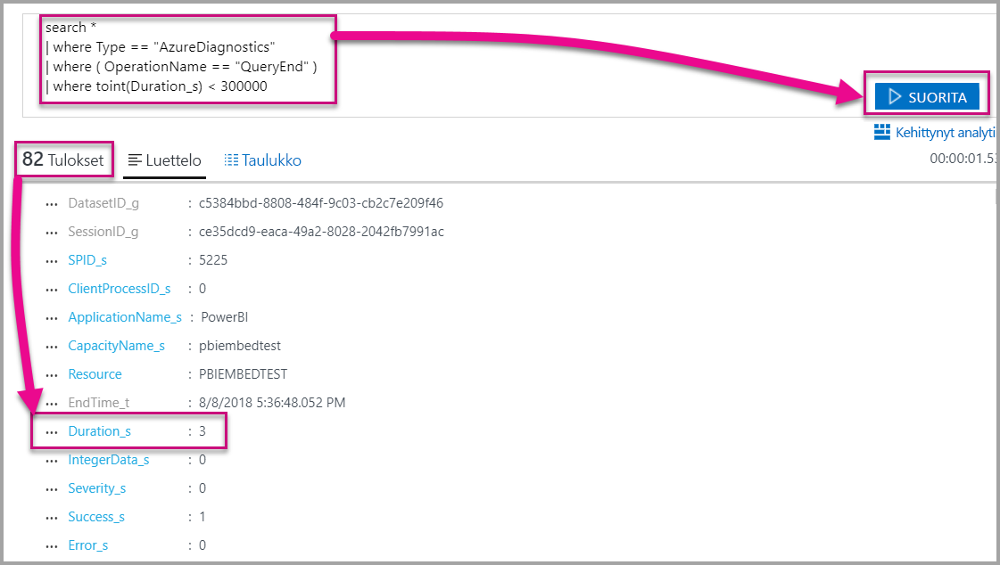
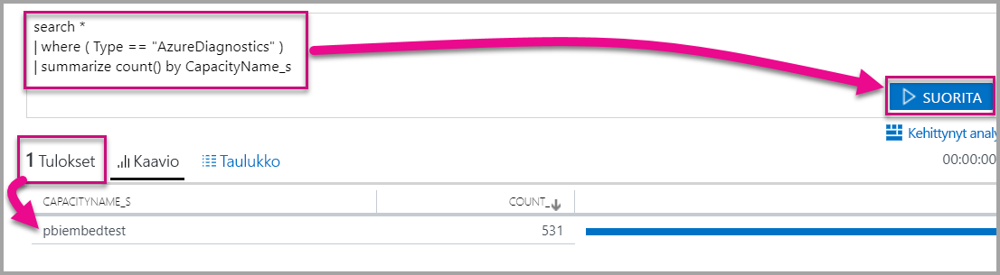

# <a name="diagnostic-logging-for-power-bi-embedded-in-azure"></a>Power BI Embedded -palvelun diagnostiikan kirjaus Azuressa

[Azuren resurssien diagnostiikkalokien](https://docs.microsoft.com/azure/monitoring-and-diagnostics/monitoring-overview-of-diagnostic-logs) avulla voit kirjata lokeihin monia kapasiteetin tapahtumia, siirtää ne analysoinnin työkaluun ja saada merkityksellisiä tietoja resurssin toiminnasta.

Diagnostiikan avulla voit hoitaa monenlaisia skenaarioita. Voit esimerkiksi

* havaita pitkäaikaiset tai ongelmalliset kyselyt
* johtaa [kapasiteetin mittaustietoja](https://powerbi.microsoft.com/blog/power-bi-developer-community-april-update/)
* seurata tiettyjen tietojoukkojen käyttöä.

## <a name="set-up-diagnostics-logging"></a>Diagnostiikan kirjauksen määrittäminen

### <a name="azure-portal"></a>Azure-portaali

1. Valitse [Azure-portaalissa](https://portal.azure.com) Power BI Embedded -resurssin siirtymisruudussa **Vianmäärityslokit** ja valitse sitten **Ota diagnostiikka käyttöön**.

    

2. Määritä **Diagnostic settings (Diagnostiikka-asetukset)** -kohdassa seuraavat asetukset:

    * **Name (Nimi)** – Anna luotavalle diagnostiikka-asetukselle nimi.

    * **Archive to a storage account (Arkistoi tallennustiliin)** – Jos haluat käyttää tätä vaihtoehtoa, sinun on muodostettava yhteys aiemmin luotuun tallennustiliin. Katso [Create a storage account (Tallennustilin luonti)](https://docs.microsoft.com/azure/storage/common/storage-create-storage-account) ja luo tallennustili ohjeita noudattamalla. Valitse sitten tallennustilisi palaamalla portaalissa tälle sivulle. Saattaa kestää jonkin aikaa, ennen kuin juuri luodut tallennustilit näkyvät avattavassa valikossa. Lokitiedosto tallentuu JSON-muodossa.
    * **Stream to an event hub (Suoratoisto tapahtumatoimintoon)** – Jos haluat käyttää tätä vaihtoehtoa, sinun on muodostettava yhteys aiemmin luotuun Tapahtumatoiminto-nimitilaan ja tapahtumatoimintoon. Lisätietoja on artikkelissa [Create an Event Hubs namespace and an event hub using the Azure portal (Tapahtumatoiminto-nimitilan ja tapahtumatoiminnon luonti Azure-portaalissa)](https://docs.microsoft.com/azure/event-hubs/event-hubs-create).
    * **Send to Log Analytics (Lähetä Log Analytics -toimintoon)** – Jos haluat käyttää tätä vaihtoehtoa, käytä joko aiemmin luotua työtilaa tai luo uusi Log Analytics -työtila noudattamalla [uuden työtilan luontiohjeita](https://docs.microsoft.com/azure/log-analytics/log-analytics-quick-collect-azurevm#create-a-workspace) portaalissa. Tämä hyödyntää [Azure Log Analytics](https://docs.microsoft.com/azure/log-analytics/log-analytics-overview) -toimintoa, joka sisältää sisäiset analyysi-, raporttinäkymä- ja ilmoitustoiminnot. Log Analytics -toiminnon avulla voit yhdistää enemmän tietoja muihin resursseihin sekä saada yhden, kattavan näkymän kaikista sovelluksesi resurssien tiedoista. Se voidaan myös yhdistää [Power BI -työkaluun yhdellä napsautuksella](https://docs.microsoft.com/azure/log-analytics/log-analytics-powerbi).
    Lisätietoja lokien tarkastelusta Log Analytics -toiminnossa on artikkelissa [View logs in Log Analytics (Lokien näyttäminen Log Analytics -toiminnossa)](https://docs.microsoft.com/azure/log-analytics/log-analytics-activity).
    * **Engine (Moduuli)** – Valitse tämä vaihtoehto, jos haluat kirjata lokiin [alla kuvatut moduulitapahtumat](#whats-logged).
    * **AllMetrics (Kaikki mittarit)** – Valitse tämä vaihtoehto, jos haluat tallentaa yksityiskohtaiset tiedot kohteeseen [Metrics (Mittarit)](https://docs.microsoft.com/azure/analysis-services/analysis-services-monitor#server-metrics). Jos arkistoit tietoja tallennustilillesi, voit valita diagnostiikan lokien säilytysajan. Lokit poistetaan automaattisesti säilytysajan päätyttyä.

3. Valitse **Tallenna**.

    Jos haluat muuttaa diagnostiikan lokien tallennustapaa, voit palata tälle sivulle ja muokata asetuksia.

    

### <a name="using-powershell-to-enable-diagnostics"></a>Diagnostiikan ottaminen käyttöön PowerShellin avulla

Jos haluat ottaa mittarit ja diagnostiikan kirjauksen käyttöön PowerShelliä käyttämällä, käytä seuraavia komentoja:

* Jos haluat ottaa käyttöön diagnostiikan lokien tallennuksen tallennustilillä, käytä seuraavaa komentoa:

    ```powershell
    Set-AzureRmDiagnosticSetting -ResourceId [your resource id] -StorageAccountId [your storage account id] -Enabled $true
    ```
    Tallennustilin tunnus on sen tallennustilin resurssitunnus, johon haluat lähettää lokit.

* Jos haluat mahdollistaa diagnostiikan lokien suoratoiston tapahtumatoimintoon, käytä seuraavaa komentoa:

    ```powershell
    Set-AzureRmDiagnosticSetting -ResourceId [your resource id] -ServiceBusRuleId [your service bus rule id] -Enabled $true
    ```
* Azuren palveluväylän sääntötunnus on merkkijono, jonka muoto on seuraava:

    ```powershell
    {service bus resource ID}/authorizationrules/{key name}
    ```

* Jos haluat mahdollistaa diagnostiikan lokien lähettämisen Log Analytics -työtilaan, käytä seuraavaa komentoa:

    ```powershell
        Set-AzureRmDiagnosticSetting -ResourceId [your resource id] -WorkspaceId [resource id of the log analytics workspace] -Enabled $true
    ```

* Voit selvittää Log Analytics -työtilasi resurssitunnuksen käyttämällä seuraavaa komentoa:

    ```powershell
    (Get-AzureRmOperationalInsightsWorkspace).ResourceId
    ```

Voit yhdistää nämä parametrit ja hyödyntää useita tulostusasetuksia.

### <a name="rest-api"></a>REST-ohjelmointirajapinta

Lue, miten voit [muuttaa diagnostiikka-asetuksia käyttämällä Azure Monitorin REST-ohjelmointirajapintaa](https://docs.microsoft.com/rest/api/monitor/). 

### <a name="resource-manager-template"></a>Resource Manager -malli

Lue, miten voit [ottaa diagnostiikka-asetukset käyttöön resurssin luonnin yhteydessä käyttämällä Resource Manager -mallia](https://docs.microsoft.com/azure/monitoring-and-diagnostics/monitoring-enable-diagnostic-logs-using-template).

## <a name="whats-logged"></a>Mitä kirjataan?

Voit valita **Engine (Moduuli)** ja/tai **AllMetrics (KaikkiMittarit)** -luokan.

### <a name="engine"></a>Engine (Moduuli)

Engine (Moduuli) -luokka ohjeistaa resurssin kirjaamaan seuraavat tapahtumat, ja kuhunkin tapahtumaan liittyy ominaisuuksia:

|     Tapahtuman nimi     |     Tapahtuman kuvaus     |
|----------------------------|----------------------------------------------------------------------------------|
|    Audit Login (Valvo kirjautumisia)    |    Kirjaa kaikki Uusi yhteys moduuliin -tapahtumat jäljityksen aloittamisen jälkeen.    |
|    Session Initialize (Istunnon alustaminen)    |    Kirjaa kaikki istunnon alustamistapahtumat jäljityksen aloittamisen jälkeen.    |
|    Vertipaq Query Begin (Vertipaq-kyselyn alku)    |    Kirjaa kaikki VertiPaq SE -kyselyn aloitustapahtumat jäljityksen aloittamisen jälkeen.    |
|    Query Begin (Kyselyn alku)    |    Kirjaa kaikki kyselyn aloitustapahtumat jäljityksen aloittamisen jälkeen.    |
|    Query End (Kyselyn loppu)    |    Kirjaa kaikki kyselyn lopetustapahtumat jäljityksen aloittamisen jälkeen.    |
|    Vertipaq Query End (Vertipaq-kyselyn loppu)    |    Kirjaa kaikki VertiPaq SE -kyselyn lopetustapahtumat jäljityksen aloittamisen jälkeen.    |
|    Audit Logout (Valvo uloskirjautumisia)    |    Kirjaa kaikki Katkaise yhteys moduuliin -tapahtumat jäljityksen aloittamisen jälkeen.    |
|    Virhe    |    Kirjaa kaikki virhetapahtumat jäljityksen aloittamisen jälkeen.    |

<br>
<br>

| Ominaisuuden nimi | Vertipaq-kyselyn lopun esimerkki | Ominaisuuden kuvaus |
|-------------------|---------------------------------------------------------------------------------------------------------------------------------------------------------------------------------------------------------|--------------------------------------------------------------------------------------------------------------------------|
| EventClass | XM_SEQUERY_END | Tapahtumaluokan avulla luokitellaan tapahtumia. |
| EventSubclass | 0 | Tapahtuman aliluokka tarjoaa lisätietoja jokaisesta tapahtumaluokasta. (Esimerkiksi 0: VertiPaq Scan) |
| RootActivityId | ff217fd2-611d-43c0-9c12-19e202a94f70 | Pääsolmun toiminnon tunnus. |
| CurrentTime | 2018-04-06T18:30:11.9137358Z | Tapahtuman alkamisen aika, kun se on käytettävissä. |
| StartTime | 2018-04-06T18:30:11.9137358Z | Tapahtuman alkamisen aika, kun se on käytettävissä. |
| JobID | 0 | Työn tunnus edistymistä varten. |
| ObjectId | 464 | Objektitunnus |
| ObjectType | 802012 | ObjectType |
| EndTime | 2018-04-06T18:30:11.9137358Z | Aika, jolloin tapahtuma on päättynyt. |
| Kesto | 0 | Tapahtumaan kulunut aika (millisekunteina). |
| SessionType | Käyttäjä | Istuntotyyppi (toiminnon aiheuttanut entiteetti). |
| ProgressTotal | 0 | Edistyminen yhteensä. |
| IntegerData | 0 | Kokonaislukutiedot. |
| Vakavuus | 0 | Poikkeuksen vakavuus. |
| Onnistui | 1 | 1 = onnistuminen. 0 = epäonnistuminen (esimerkiksi 1 tarkoittaa käyttöoikeustarkistuksen onnistumista ja 0 epäonnistumista). |
| Virhe | 0 | Määritetyn tapahtuman virheen numero. |
| ConnectionID | 3 | Yksilöivä yhteystunnus. |
| DatasetID | 5eaa550e-06ac-4adf-aba9-dbf0e8fd1527 | Sen tietojoukon tunnus, jossa käyttäjän lauseketta suoritetaan. |
| SessionID | 3D063F66-A111-48EE-B960-141DEBDA8951 | Istunnon GUID-tunnus. |
| SPID | 180 | Palvelimen prosessitunnus. Tämä yksilöi käyttäjäistunnon. Vastaa suoraan istunnon GUID-tunnusta, jota XML/A käyttää. |
| ClientProcessID | null | Asiakassovelluksen prosessitunnus. |
| ApplicationName | null | Sen asiakasohjelman nimi, joka loi yhteyden palvelimeen. |
| CapacityName | pbi641fb41260f84aa2b778a85891ae2d97 | Power BI Embedded -kapasiteettiresurssin nimi. |


### <a name="allmetrics"></a>AllMetrics

**AllMetrics**-vaihtoehdon valitseminen kirjaa tiedot kaikista mittareista, joita voit käyttää Power BI Embedded -resurssin kanssa.

   

## <a name="manage-your-logs"></a>Lokien hallinta

Lokit ovat yleensä käytettävissä muutaman tunnin sisällä siitä, kun kirjaaminen on määritetty. Voit itse hallita tallennustilisi lokeja:

* Azuren normaalien hallintamenetelmien avulla voit suojata lokisi rajoittamalla sitä, ketkä voivat käyttää niitä.
* Poista lokit, joita et enää halua säilyttää tallennustililläsi.
* Muista määrittää säilytysaika, niin että vanhat lokit poistetaan tallennustililtäsi.

## <a name="view-logs-in-log-analytics"></a>Lokien katselu Log Analytics -toiminnossa

Mittarit ja palvelimen tapahtumat on Log Analytics -toiminnossa integroitu xEvents-tapahtumien kanssa rinnakkaisanalyysia varten. Log Analytics voidaan määrittää myös vastaanottamaan tapahtumia muista Azure-palveluista, jotka antavat kokonaisvaltaisen kuvan diagnostiikan kirjaustiedoista koko arkkitehtuurissa.

Jos haluat tarkastella diagnostiikkatietojasi Log Analytics -toiminnossa, avaa **Logs (Lokit)** -sivu vasemmanpuoleisesta valikosta tai Management (Hallinta) -alueelta, kuten alla on esitetty.



Kun olet nyt ottanut käyttöön tietojen keräämisen, valitse **Logs (Lokit)** -kohdassa **All collected data (Kaikki kerätyt tiedot)** .



Valitse **Type (Tyyppi)** -kohdasta **AzureDiagnostics** ja valitse sitten **Apply (Käytä)** . AzureDiagnostics-vaihtoehto sisältää moduulin tapahtumat. Huomaa, että Log Analytics -kysely luodaan lennosta.



Valitse **EventClass\_s** tai jokin tapahtumien nimistä, niin Log Analytics jatkaa kyselyn muodostamista. Muista tallentaa kyselyt uudelleenkäyttöä varten.

Muista tarkistaa [Log Analytics](https://docs.microsoft.com/azure/log-analytics/), jonka kautta pääset tutkimaan verkkosivustoa, jossa on kerättyihin tietoihin liittyvät parannellut kysely-, raporttinäkymä- ja ilmoitusmahdollisuudet.

### <a name="queries"></a>Kyselyt

Käytettävissä on satoja kyselyitä. Seuraavassa on muutamia, joiden avulla pääset alkuun. Lisätietoja uudesta Log Search -kyselykielestä on artikkelissa [Understanding log searches in Log Analytics (Lokihaut Log Analytics -toiminnossa)](https://docs.microsoft.com/azure/log-analytics/log-analytics-log-search).

* Kyselyn tulokset, joiden saaminen kesti alle viisi minuuttia (300 000 millisekuntia).

    ```
    search *
    | where Type == "AzureDiagnostics"
    | where ( OperationName == "QueryEnd" )
    | where toint(Duration_s) < 300000
    ```

    

* Tunnista kapasiteetin nimet.

    ```
    search *
    | where ( Type == "AzureDiagnostics" )
    | summarize count() by CapacityName_s 
    ```

    

## <a name="next-steps"></a>Seuraavat vaiheet

Voit hankkia lisätietoja Azure-resurssien diagnostiikan kirjauksesta.

> [!div class="nextstepaction"]
> [Azure-resurssien diagnostiikan kirjaus](https://docs.microsoft.com/azure/monitoring-and-diagnostics/monitoring-overview-of-diagnostic-logs)

> [!div class="nextstepaction"]
> [Set-AzureRmDiagnosticSetting](https://docs.microsoft.com/powershell/module/azurerm.insights/Set-AzureRmDiagnosticSetting)
