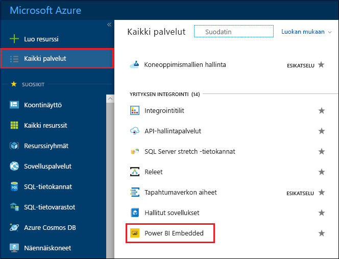
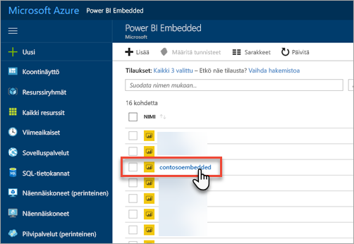
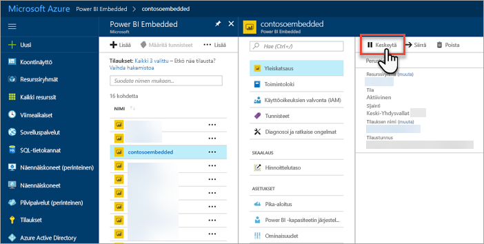
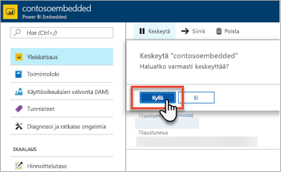
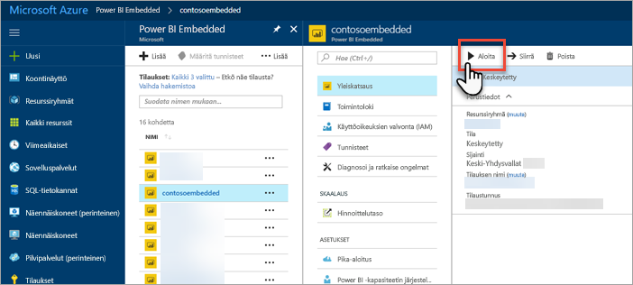
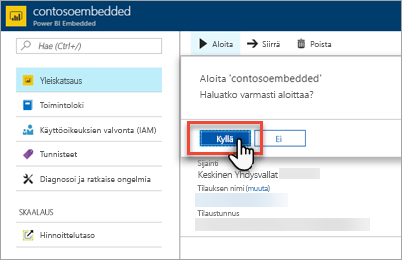

# Power BI Embedded -kapasiteetin keskeyttäminen ja käynnistäminen Azure-portaalissa

Tässä artikkelissa esitellään, miten voit keskeyttää ja käynnistää Power BI Embedded -kapasiteetin Microsoft Azuressa. Tässä oletetaan, että olet luonut Power BI Embedded -kapasiteetin. Jos et ole tehnyt niin, katso ohjeet kohdasta [Power BI Embedded -kapasiteetin luominen Azure-portaalissa](azure-pbie-create-capacity.md).

Jos sinulla ei ole Azure-tilausta, luo [ilmainen tili](https://azure.microsoft.com/free/) ennen aloittamista.

## Kapasiteetin keskeyttäminen

Kapasiteettisi keskeyttäminen estää sen, että sinua ei laskuteta. Kapasiteettisi keskeyttäminen on kätevää, jos sinun ei tarvitse käyttää kapasiteettia hetkeen. Seuraavien vaiheiden avulla voit keskeyttää kapasiteettisi.

> [!NOTE]
> Kapasiteetin keskeyttäminen saattaa estää sisällön käyttämisen Power BI:ssä. Varmista, että poistat työtilat kapasiteetistasi ennen keskeyttämistä häiriöiden välttämiseksi.

1. Kirjaudu sisään [Azure-portaaliin](https://portal.azure.com/).

2. Voit tarkastella kapasiteetteja valitsemalla **Kaikki palvelut** > **Power BI Embedded**.

    

3. Valitse kapasiteetti, jonka haluat keskeyttää.

    

4. Valitse **Keskeytä** kapasiteetin tiedoissa.

    

5. Valitse **Kyllä**, joka vahvistaa, että haluat keskeyttää kapasiteetin.

    

## Kapasiteetin käynnistäminen

Jatka käyttöä käynnistämällä kapasiteetti. Kapasiteettisi käynnistäminen jatkaa myös laskutustasi.

1. Kirjaudu sisään [Azure-portaaliin](https://portal.azure.com/).

2. Voit tarkastella kapasiteetteja valitsemalla **Kaikki palvelut** > **Power BI Embedded**.

    

3. Valitse kapasiteetti, jonka haluat käynnistää.

    

4. Valitse **Käynnistä** kapasiteetin tiedoissa.

    

5. Valitse **Kyllä**, joka vahvistaa, että haluat käynnistää kapasiteetin.

    

Jos kapasiteetille on varattu sisältöä, se on käytettävissä käynnistämisen jälkeen.

## Seuraavat vaiheet

Jos haluat skaalata kapasiteettiasi ylös tai alas, katso kohta [Power BI Embedded -kapasiteetin skaalaaminen](azure-pbie-scale-capacity.md).

Jos haluat aloittaa Power BI -sisällön upottamisen sovellukseesi, katso kohta [Power BI -koontinäyttöjen, -raporttien ja -ruutujen upottaminen](https://powerbi.microsoft.com/documentation/powerbi-developer-embedding-content/).

Onko sinulla kysyttävää? [Voit esittää kysymyksiä Power BI -yhteisössä](http://community.powerbi.com/)