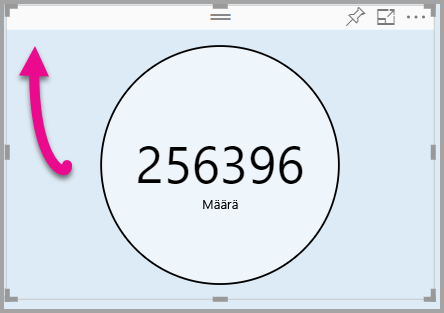

# <a name="tutorial-adding-formatting-options-to-a-power-bi-visual"></a>Opetusohjelma: Muotoiluasetusten lisääminen Power BI -visualisointiin

Tässä opetusohjelmassa opetellaan lisäämään visualisointiin yleisiä ominaisuuksia.

Tässä opetusohjelmassa opit:
> [!div class="checklist"]
> * Visualisoinnin ominaisuuksien lisääminen
> * Visualisoinnin paketointi
> * Mukautetun visualisoinnin tuominen Power BI Desktop -raporttiin

## <a name="adding-formatting-options"></a>Muotoiluasetusten lisääminen

1. Valitse **Power BI:ssä** **Muoto-sivu**.

    Sinun tulisi nähdä viesti *Muotoiluasetukset eivät ole käytettävissä tälle visualisoinnille*.

    

2. Avaa *capabilities.json*-tiedosto **Visual Studio Codessa**.

3. Lisää **objektit** rivin 8 jälkeen ennen **dataViewMappings**-matriisia.

    ```json
    "objects": {},
    ```
    

4. Tallenna **capabilities.json**-tiedosto.

5. Tarkista **Power BI:ssä** muotoilun asetukset uudelleen.

    > [!Note]
    > Jos et näe muotoiluasetukset eivät ole muuttuneet, valitse **Lataa mukautettu visualisointi uudelleen**.

    

6. Valitse **Otsikko**-asetukseksi *Ei käytössä*. Huomaa, että visualisointi ei enää näytä mittarin nimeä vasemmassa yläkulmassa.

    

    

### <a name="adding-custom-formatting-options"></a>Mukautettujen muotoiluasetusten lisääminen

Voit lisätä mukautettuja ominaisuuksia, joiden avulla voit määrittää ympyrän värin ja reunan leveyden.

1. Pysäytä mukautettu visualisointi PowerShellissä.

2. Lisää Visual Studio Codessa **capabilities.json**-tiedostoon seuraava JSON-koodipätkä **objects**-tunnisteella merkittyyn objektiin.

    ```json
    "circle": {
     "displayName": "Circle",
     "properties": {
         "circleColor": {
             "displayName": "Color",
             "description": "The fill color of the circle.",
             "type": {
                 "fill": {
                     "solid": {
                         "color": true
                     }
                 }
             }
         },
         "circleThickness": {
             "displayName": "Thickness",
             "description": "The circle thickness.",
             "type": {
                 "numeric": true
                 }
             }
         }
     },
    ```

    JSON-koodipätkä kuvaa ryhmän nimeltä ympyrä, joka koostuu kahdesta asetuksesta nimeltä circleColor ja circleThickness.

   

3. Tallenna **capabilities.json**-tiedosto.

4. Laajenna **resurssienhallintaruudussa** **src**-kansio ja valitse kansiosta **settings.ts**. *Tämä tiedosto edustaa aloitusvisualisoinnin asetuksia*.

5. Korvaa **settings.ts**-tiedostossa kaksi luokkaa seuraavalla koodilla.

    ```typescript
    export class CircleSettings {
     public circleColor: string = "white";
     public circleThickness: number = 2;
    }
    export class VisualSettings extends DataViewObjectsParser {
     public circle: CircleSettings = new CircleSettings();
    }
    ```

    

    Tämä moduuli määrittää kaksi luokkaa. **CircleSettings**-luokka määrittää kaksi ominaisuutta, joiden nimet vastaavat **capabilities.json**-tiedostossa määritettyjä objekteja (**circleColor** ja **circleThickness**), ja asettaa myös oletusarvot. **VisualSettings**-luokka perii **DataViewObjectParser**-luokan ja lisää ominaisuuden nimeltä **circle**, joka vastaa *capabilities.json*-tiedostossa määritettyä objektia, ja palauttaa **CircleSettings**-luokan esiintymän.

6. Tallenna **settings.ts**-tiedosto.

7. Avaa **visual.ts**-tiedosto.

8. Lisää seuraava ominaisuus **Visual**-luokkaan.

    ```typescript
    private visualSettings: VisualSettings;
    ```
    Tämä ominaisuus sisältää viittauksen **VisualSettings**-objektiin, joka kuvaa visualisoinnin asetuksia.

    

9. Lisää **Visual**-luokassa seuraava menetelmä ennen **päivitysmenetelmää**. Tätä menetelmää käytetään muotoiluasetusten täyttämiseen.

    ```typescript
    public enumerateObjectInstances(options: EnumerateVisualObjectInstancesOptions): VisualObjectInstanceEnumeration {
     const settings: VisualSettings = this.visualSettings ||
    VisualSettings.getDefault() as VisualSettings;
     return VisualSettings.enumerateObjectInstances(settings, options);
    }
    ```
    Tätä menetelmää käytetään muotoiluasetusten täyttämiseen.

    

10. Lisää seuraava koodi **päivitysmenetelmään** **radius**-sädemuuttujan esittelyn jälkeen.

    ```typescript
    this.visualSettings = VisualSettings.parse<VisualSettings>(dataView);

    this.visualSettings.circle.circleThickness = Math.max(0, this.visualSettings.circle.circleThickness);

    this.visualSettings.circle.circleThickness = Math.min(10, this.visualSettings.circle.circleThickness);
    ```
    Tämä koodi noutaa muotoiluasetukset. Se säätää mitä tahansa **circleThickness**-ominaisuuteen välitettyä arvoa. Se muuttaa sen arvoksi 0, jos se on negatiivinen, tai arvoksi 10, jos se on suurempi kuin 10.

    

11. Muokkaa **täyttötyyliin** välitettyä arvoa seuraavaksi lausekkeeksi **ympyräelementtiä** varten.

    ```typescript
    this.visualSettings.circle.circleColor
    ```

    

12. Muokkaa **viivanleveystyyliin** välitettyä arvoa seuraavaksi lausekkeeksi **ympyräelementtiä** varten.

    ```typescript
    this.visualSettings.circle.circleThickness
    ```

    

13. Tallenna visual.ts-tiedosto.

14. Käynnistä visualisointi PowerShellissä.

    ```powershell
    pbiviz start
    ```

15. Valitse **Power BI:ssä** visualisoinnin päällä olevalta irralliselta työkaluriviltä **Automaattinen uudelleenlataus käytössä tai ei käytössä**.

16. Laajenna **Ympyrä**-kohta **visualisoinnin muotoiluasetuksissa**.

    

    Muokkaa **väri**- ja **paksuusasetuksia**.

    Anna **paksuusasetuksen** arvoksi on pienempi kuin nolla ja arvo, joka on suurempi kuin 10. Huomaa, että visualisointi päivittää arvon toteutettavaksi enimmäis- tai vähimmäisarvoksi.

## <a name="packaging-the-custom-visual"></a>Mukautetun visualisoinnin pakkaaminen

Anna mukautetun visualisointiprojektin ominaisuusarvot, päivitä kuvaketiedosto ja pakkaa mukautettu visualisointi.

1. Pysäytä mukautettu visualisointi **PowerShellissä**.

2. Avaa **pbiviz.json**-tiedosto **Visual Studio Codessa**.

3. Vaihda **visual**-objektiin **displayName**-ominaisuudeksi *Circle Card*.

    Näet näyttönimen viemällä hiiren **Visualisoinnit**-ruudussa kuvakkeen päälle.

    

4. Kirjoita seuraava teksti **description**-ominaisuutta varten.

    *Näyttää muotoillun mittariarvon ympyrän sisällä*

5. Voit halutessasi kirjoittaa omat tietosi **author**-objektiin.

6. Tallenna **pbiviz.json**-tiedosto.

7. Huomaa, että asiakirja määrittää polun kuvakkeeseen **assets**-objektissa. Kuvake on kuva, joka näkyy **_Visualisoinnit_** -ruudussa. Sen on oltava **PNG**-tiedosto, jonka koko on *20 × 20 kuvapistettä*.

8. Kopioi Windowsin Resurssienhallinnassa icon.png-tiedosto ja korvaa sillä assets-kansiossa oleva oletustiedosto.

9. Laajenna assets-kansio Visual Studio Coden resurssienhallintaruudussa ja valitse icon.png-tiedosto.

10. Tarkista kuvake.

    

11. Varmista Visual Studio Codessa, että kaikki tiedostot on tallennettu.

12. Pakkaa mukautettu visualisointi PowerShellissä seuraavalla komennolla.

    ```powershell
    pbiviz package
    ```

    

Paketti on nyt tulostettu projektin **dist**-kansioon. Paketti sisältää kaiken tarvittavan mukautetun visualisoinnin tuomiseen joko Power BI -palveluun tai Power BI Desktopin raporttiin. Olet nyt paketoinut mukautetun visualisoinnin, ja se on nyt valmis käytettäväksi.

## <a name="importing-the-custom-visual"></a>Mukautetun visualisoinnin tuominen

Voit nyt avata Power BI Desktop -raportin ja tuoda mukautetun Circle Card -visualisoinnin.

1. Avaa **Power BI Desktop** ja luo uusi raportti millä tahansa *mallitietojoukolla*.

2. Valitse **_Visualisoinnit_** -ruudussa **pistekuvake** ja valitse sitten **Tuo tiedostosta**.

    

3. Valitse **tuonti-ikkunassa** **Tuo**.

4. Siirry Avaa ikkuna -kohdassa projektihakemiston **dist**-kansioon.

5. Valitse **circleCard.pbiviz**-tiedosto ja sitten **Avaa**.

6. Kun visualisointi on tuotu onnistuneesti, valitse **OK**.

7. Varmista, että visualisointi on lisätty **_Visualisoinnit_** -ruutuun.

    

8. Vie hiiri **Circle Card** -kuvakkeen päälle, niin näet työkaluvihjeen.

## <a name="debugging"></a>Virheenkorjaus

Katso vihjeitä mukautetun visualisoinnin virheenkorjauksesta [virheenkorjauksen oppaasta](https://microsoft.github.io/PowerBI-visuals/docs/how-to-guide/how-to-debug/).

## <a name="next-steps"></a>Seuraavat vaiheet

Voit antaa luomasi visualisoinnin muiden käyttöön lähettämällä sen **AppSourceen**. Lisätietoja tästä prosessista on artikkelissa [Power BI -visualisointien julkaiseminen AppSourceen](office-store.md).