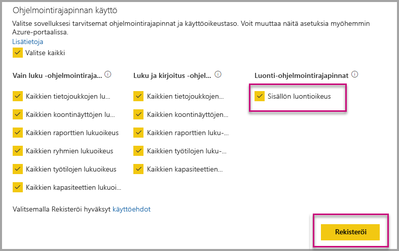

# Asenna automaattisesti Power BI-sovellukset, kun organisaatiolle tarkoitettu upotus

Jos haluat upottaa sovelluksen sisältöä, käyttäjälle, joka on upottaminen on oltava [sovelluksen käyttöoikeus](../service-create-distribute-apps.md). Jos sovellus on asennettu käyttäjälle, sitten upottaminen toimii sujuvasti. Jos haluat lisätietoja, katso [upottaa raporteissa tai raporttinäkymissä sovelluksesta](embed-from-apps.md). Se on mahdollista powerbi.comissa, johon kaikki sovellukset voidaan määrittää [asennetaan automaattisesti](https://powerbi.microsoft.com/blog/automatically-install-apps/). Tämä toiminto tehdään vuokraajan tasolla. lisäksi koskee kaikkia sovelluksia.

## Automaattinen asennus sovelluksen upottaminen

Jos käyttäjällä on käyttöoikeus sovellukseen, mutta sovellus ei ole asennettu, upottaminen epäonnistuu. Jotta voit välttää nämä virheet upottamiseen sovelluksesta, voit sallia automaattinen asennus sovelluksen upottaminen yhteydessä. Tämä toiminto tarkoittaa sitä, jos käyttäjä yrittää Upota sovellus ei ole asennettu, se asennetaan automaattisesti puolestasi. Joten haluamasi sisältö noutaa upotettu välittömästi, käyttäjän tasainen tuloksena.

## Upota Power BI-käyttäjille (käyttäjä omistaa tiedot)

Jotta sovellusten asentaminen automaattisesti käyttäjille, sinun on annettava sovelluksesi 'Sisällön Luo' käyttöoikeutta kun [rekisteröidään sovelluksesi](register-app.md#register-with-the-power-bi-application-registration-tool), tai lisätä sen, jos sovellus on jo rekisteröity.

Seuraavaksi sinun on annettava liitetty URL-osoite app-tunnus. Anna Sovellustunnus sovelluksen luojan ensin täytyy asentaa sovelluksen ja sitten jollakin tuetussa [Power BI Rest-Ohjelmointirajapinnan](https://docs.microsoft.com/rest/api/power-bi/) kutsujen - [Hanki raportit](https://docs.microsoft.com/rest/api/power-bi/reports/getreports) tai [Hanki koontinäytöt](https://docs.microsoft.com/rest/api/power-bi/dashboards/getdashboards). Sovelluksen luojan on toteutettava REST-Ohjelmointirajapinnan vastauksesta liitetty URL-osoite. Sovellustunnus näkyy URL-osoite, jos sisältö on sovelluksesta.  Kun sinulla on liitetty URL-osoite, voit käyttää upottaa säännöllisesti.

## Suojaa upottaa

Jos haluat käyttää sovellusten automaattinen asennus, sovelluksen luojan on ensin Asenna sovellus ja siirry siirtymällä PowerBI.com sovelluksen, raportin ja hanki linkki tavallista deterministisesti. Kaikki muut käyttäjät, joilla on käyttöoikeus sovellukseen, joka käyttää linkkiä voit upottaa raportin.

## Huomioitavat asiat ja rajoitukset

* Voit upottaa vain raportteja ja koontinäyttöjä tämän skenaarion.

* Tämä ominaisuus on tällä hetkellä tueta sovellus omistaa tiedot ja SharePoint upottaa skenaarioita.