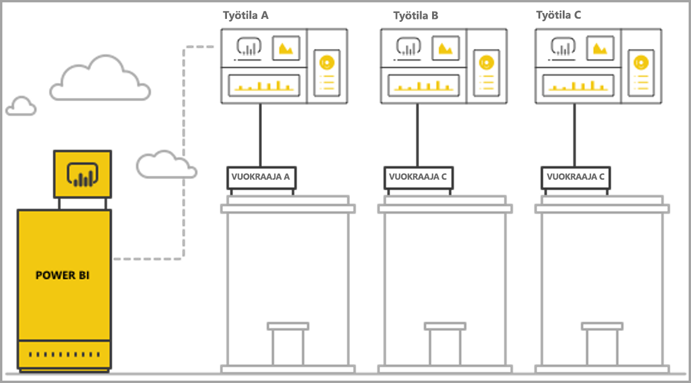
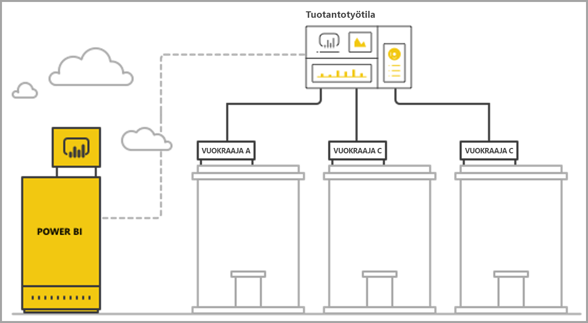

# Usean vuokraajan hallinta Power BI Embeddedin analyysitoiminnoilla

Kun suunnittelet usean vuokraajan SaaS-sovellusta, valitse huolella sellainen vuokraamismalli, joka sopii parhaiten SaaS-sovelluksesi tarpeisiin. Tämä prosessi pätee myös Power BI -ympäristöön SaaS-sovelluksen upotettuna analyysiosana. Vuokraamismalli määrittää, miten kunkin vuokraajan tiedot yhdistetään ja kuinka niitä hallitaan Power BI -ympäristössä ja tallennustilillä. Vuokraamismalli vaikuttaa sovellusten suunnitteluun ja hallintaan. Myöhemmin toiseen malliin siirtyminen saattaa olla kallista ja hankalaa.

Power BI Embedded -ympäristössä vuokraajat voidaan pitää erillään toisistaan kahdella eri tavalla.

   1. **Työtilaan perustuva eristys** – Kullekin vuokraajalle luodaan erillinen Power BI -työtila.
   2. **Rivitason suojaukseen perustuva eristys** – Tietojen käyttöoikeuksia ohjataan ja hallitaan käyttäjä- tai ryhmäkohtaisesti pohjana olevien tietojen avulla.

Tässä artikkelissa kuvataan eri lähestymistapoja ja analysoidaan niitä erilaisten arviointitapojen mukaan.

## Käsitteet ja terminologia

**[AAD](https://docs.microsoft.com/azure/active-directory/fundamentals/active-directory-whatis)** - Azure Active Directory.

**AAD-sovellus** - Sovelluksen tunnus AAD:ssä. Todentamiseen tarvitaan AAD-sovellus.

**SaaS-sovellus (Software-as-a-Service)** - Yrityksen tai riippumattoman ohjelmistokehittäjän toteuttama järjestelmä, joka on yleensä online-palvelu. Myös toisiinsa liittyviä ohjelmistojärjestelmiä, joiden avulla voidaan palvella useita vuokraavia asiakkaita (organisaatioita). Tässä artikkelissa **SaaS-sovellus tarjoaa Power BI Embeddedin avulla analyyseja eri vuokraajille**. Power BI Embedded voi toimia kaikenlaisten sovellusten yhteydessä, kunhan niillä on online-yhteys.

**Vuokraaja** – Yksi asiakas (organisaatio), joka käyttää SaaS-sovellusta sekä resursseja tai tietoja, jotka asiakas tuo SaaS-sovellukseen.

**[Power BI](../power-bi-overview.md)**  – Power BI -pilvipalvelu, jossa Power BI Embedded toimii.

**Power BI -vuokraaja** – Joukko yhteen AAD-vuokraajaan liittyviä Power BI -resursseja.

**[Power BI -työtila](../service-create-workspaces.md)**  – Sisällön säilö Power BI:ssä.

**Power BI -artefaktit** – Power BI -työtiloissa on useita Power BI -artefakteja, joita ovat esimerkiksi koontinäytöt, raportit, tietojoukot ja tietovuot.

**[Power BI Embedded](azure-pbie-what-is-power-bi-embedded.md)**  – Joukko julkisia ohjelmointirajapintoja, joiden avulla kehittäjät voivat luoda sellaisia sovelluksia, jotka hallitsevat Power BI -sisältöä ja upottavat Power BI -elementtejä.

**[Rivitason suojaus (RLS)](embedded-row-level-security.md)**  – Antaa mahdollisuuden hallita käyttäjän käyttöoikeuksia taulukon yksittäisissä riveissä oleviin tietoihin. Rivitason suojauksen voi ottaa käyttöön tietolähteen tasolla tai Power BI:n semanttisessa mallissa.

**Pääkäyttäjä** – Käyttäjätiedot, jotka edustavat SaaS-sovellusta Power BI -ympäristössä ja joita SaaS-sovellus käyttää kutsuessaan Power BI -ohjelmointirajapintoja. Pääkäyttäjän on oltava AAD-käyttäjä, jolla on Power BI Pro -käyttöoikeus.

**AAD-sovelluksen käyttäjä (palvelun päänimi)** – Käyttäjätiedot, jotka edustavat SaaS-sovellusta Power BI -ympäristössä ja joita SaaS-sovellus käyttää kutsuessaan Power BI -ohjelmointirajapintoja. Tämän on oltava AAD-verkkosovellus. Voi korvata *pääkäyttäjän*, kun suoritetaan Power BI -todennusta.

**Kapasiteetti** – Joukko resursseja, jotka on omistettu Power BI -palvelun suoritukseen. [Power BI Premium -kapasiteetit](../service-premium-what-is.md) – Nämä on tarkoitettu suurille yrityksille, joissa Power BI on sisäisessä käytössä, kun taas [Power BI Embedded -kapasiteetit](azure-pbie-create-capacity.md) on tarkoitettu sovelluskehittäjille, jotka kehittävät SaaS-sovelluksia kolmansille osapuolille.

**[Power BI Pro -käyttöoikeus](../service-admin-purchasing-power-bi-pro.md)** – Käyttäjäkohtainen käyttöoikeus, joka antaa oikeuden julkaista sisältöä sovellusten työtiloihin, kuluttaa sovelluksia ilman Premium-kapasiteettia, jakaa koontinäyttöjä sekä tilata koontinäyttöjä ja raportteja.

**[Tietoyhteystilat](../desktop-directquery-about.md)**  – Tietolähteiden yhdistäminen Power BI:hin voidaan tehdä eri tiloissa:

   * Tuonti – Yleisin tapa hakea tietoja.
   * DirectQuery – Muodostetaan suora yhteys tietoihin niiden lähdesäilössä.
   * Reaaliaikainen yhteys – Toinen tila, joka muodostaa suoran yhteyden Analysis Services -tietoihin (sekä Azuren tietoihin että paikallisiin tietoihin).

## Arvioinnin ehdot

SaaS-sovelluksen oikean vuokraamismallin valinta määräytyy kulloistenkin liiketoiminnan ja teknisten vaatimusten, data-arkkitehtuurin ja muiden tekijöiden mukaan. Jos ymmärrät hyvin nämä vaatimukset sekä käytettävissä olevat vuokraamismallit ja kompromissit, voit määrittää SaaS-sovelluksellesi elinvoimaisen, suorituskykyisen, kustannustehokkaan ja skaalautuvan arkkitehtuurin.

Seuraavassa on joukko osa-alueita, jotka tulee ottaa huomioon vuokraajan mallia valittaessa.

### Tietojen arkkitehtuuri

Power BI Embeddedin avulla sovelluksia luovilla kehittäjillä on yleensä jo yhden tai usean vuokraajan tietokanta. Power BI Embeddedin kanssa on helpointa käyttää samaa vuokraajamallia kuin tietokannan kanssa. Jos tietokannan vuokraajamallia ei ole vielä määritetty, kannattaa ehkä harkita muita tekijöitä ennen tietojen arkkitehtuurin valitsemista.

### Tietojen eristys

Kuinka arkaluontoisia tallennettavat tiedot ovat? Miten vahvasti eri asiakasvuokraajat tulee erotella toisistaan? Vastaus saattaa vaihdella eri toimialojen välillä, tai joillakin asiakkailla saattaa olla tiettyjä vaatimuksia.

### Skaalattavuus

Jotta löytäisit parhaan ratkaisun, määritä lähitulevaisuudessa saavutettava skaala. Muista, että nyt sopivalta tuntuva ratkaisu ei ehkä riitäkään, kun käyttö ja datamäärä kasvavat. Kun analysoit skaalattavuutta, ota huomioon seuraavat asiat:

   * vuokraajien (asiakkaiden) määrä
   * raporttien, koontinäyttöjen ja tietojoukkojen määrä kutakin vuokraajaa kohti
   * kunkin tietojoukon tietojen koko sekä päivitysten tiheys
   * käyttäjien määrä
   * samanaikaisten käyttäjien määrä ruuhka-aikoina.

Joissakin SaaS-sovelluksissa saattaa olla vähän asiakkaita ja alhainen käyttöaste – mutta suuri määrä tietoja. Toisissa taas saattaa olla paljon asiakkaita ja suuri käyttöaste, mutta kullekin asiakkaalle on vain pieni määrä tietoja ja raportteja. Kummassakin tilanteessa suuret määrät saattavat vaikuttaa tuleviin kustannuksiin ja toiminnalliseen monimutkaisuuteen.

### Automaatio ja toiminnallinen monimutkaisuus

Selvitä usein tapahtuvat prosessit, joissa tarvitaan automaatiota.

   * Kuinka usein otetaan uusia vuokraajia? Mitä toimia kunkin perehdyttämiseen tarvitaan?
   * Kuinka usein julkaistaan sellaista uutta tai päivitettyä Power BI -sisältöä, joka on otettava käyttöön?
   * Kuinka monta rivitason suojauksen roolia kullekin vuokraajalle määritetään?  

Jos saat määritettyä nämä prosessit ja selvitettyä, miten ne käsitellään, ymmärrät paremmin kunkin mallin ylläpitämiseen liittyvän toiminnallisen monimutkaisuuden.

### Tietojen sijaintivaatimukset ja tarve tukea useita alueita

Power BI Embedded tukee usean alueen käyttöönottoa (esikatselutoiminto). [Multi-Geo](embedded-multi-geo.md) mahdollistaa sen, että Power BI Embeddedin resursseja otetaan käyttöön eri alueilla, niin että tietty sisältö voidaan määrittää sijaitsemaan tietyillä alueilla. Tätä ominaisuutta voidaan käyttää kaikissa malleissa, mutta se saattaa vaikuttaa hallittavan sisällön määrään sekä kustannuksiin. Tällä hetkellä Multi-Geo-toiminto on suunniteltu vastaamaan tietojen sijaintivaatimuksiin, joten se ei paranna suorituskykyä siirtämällä tietoja lähemmäs kuluttajia.

### Kustannukset

[Power BI Embeddediin](https://azure.microsoft.com/services/power-bi-embedded/) liittyy resurssipohjainen ostomalli, samoin kuin **Power BI Premiumiin**. Voit ostaa yhden tai useita kapasiteetteja, joihin liittyy kiinteä laskentateho ja muisti. Kapasiteetti on tärkein kustannustekijä **Power BI Embeddediä** käytettäessä. Kapasiteetin käyttäjien määrää ei ole rajoitettu. Ainoa rajoitus on kapasiteetin suorituskyky. Kullakin *pääkäyttäjällä* eli sellaisilla käyttäjillä, joiden on voitava käsitellä Power BI -portaalia, on oltava oma [Power BI Pro -käyttöoikeus](../service-admin-licensing-organization.md).

Suosittelemme kapasiteetin oletetun kuormituksen testaamista ja mittaamista niin, että todellista ympäristöä ja käyttömäärää simuloidaan ja samalla suoritetaan kuormitustestaus. Kuormituksen ja suorituskyvyn voi mitata hyödyntämällä Azure-kapasiteetin eri mittareita tai [Premium-kapasiteetin mittarisovellusta](../service-admin-premium-monitor-capacity.md).

### Sisällön mukauttaminen ja tuottaminen

SaaS-sovelluksia, jotka antavat käyttäjille mahdollisuuden muokata ja luoda raportteja tai ladata tietoja palveluun työnkulun osana, voi käsitellä kahdella tavalla:

   * [Muokkaa/Luo-tila upotetussa iFrame-kehyksessä](https://github.com/Microsoft/PowerBI-JavaScript/wiki/Create-Report-in-Embed-View) - Käyttäjät saavat raportin näkymän tai uuden tyhjän pohjan SaaS-sovellukseen. Tällä tavoin käyttäjät voivat luoda tietojoukkoon perustuvaa sisältöä työtilassa Power BI -työkaluriviä käyttämällä. Suosittelemme tätä vaihtoehtoa, koska käyttäjä toimii omassa kontekstissaan tutussa ympäristössä. Työskentelyn aloittaminen ja muokkaaminen on helpompaa, ja käyttäjä luo aiemmin luotuun tietojoukkoon liittyvän raportin.

   * Sisällön luominen Power BI Desktopin avulla ja sen lataaminen SaaS-sovelluksen käyttöliittymän kautta työtilaan. Tätä lähestymistapaa käytettäessä käyttäjät voivat hyödyntää useampia työkaluja, kun he käyttävät Power BI Desktopia. Emme kuitenkaan suosittele tätä lähestymistapaa, koska käyttäjien on tällöin tunnettava työkaluja, jotka eivät kuulu SaaS-sovelluksen kontekstiin. PBIX-tiedoston lataaminen palvelimeen tarkoittaa, että käyttäjä lisää uuden tietojoukon, joka saattaa olla työtilassa jo olevien tietojoukkojen kaksoiskappale.

## Power BI -työtilaan perustuva eristys

Power BI-työtilaan perustuvaa eristystä käytettäessä SaaS-sovellus tukee useita vuokraajia yhdestä Power BI -vuokraajasta. Työtilaan perustuva eristys sisältää kaiken Power BI -sisällön, jota eri vuokraajat käyttävät. Vuokraajien erottelu suoritetaan Power BI-työtilan tasolla, useita työtiloja luomalla. Kukin työtila sisältää kyseisen vuokraajan tietojoukot, raportit ja koontinäytöt. Lisäksi kukin työtila on yhdistetty vain kyseisen vuokraajan tietoihin. Jos tarvitset enemmän eristystä, voit luoda kullekin työtilalle sisältöineen *pääkäyttäjän* tai palvelun päänimen.

### Tietojen arkkitehtuuri

Vuokraajan tietojen hallintaan on kaksi perusmenetelmää.

* Erillinen tietokanta kutakin vuokraajaa kohden
* Yksi usean vuokraajan tietokanta

Jos SaaS-sovelluksen tallennustilassa on erillinen tietokanta kutakin vuokraajaa kohden, on luontevaa käyttää Power BI:ssä yhden vuokraajan tietojoukkoja, niin että kunkin tietokannan yhteysmerkkijono osoittaa vastaavaan tietokantaan.

Jos SaaS-sovelluksen tallennustila käyttää usean vuokraajan tietokantaa kaikille vuokraajille, vuokraajat voi helposti erotella työtilan mukaan. Voit määrittää tietokantayhteyden Power BI -tietojoukkoon käyttämällä parametrisoitua tietokantakyselyä, joka hakee vain kyseessä olevan vuokraajan tiedot. Yhteyden voi päivittää käyttämällä [Power BI Desktopia](../desktop-query-overview.md) tai käyttämällä kyselyssä [ohjelmointirajapintaa](https://docs.microsoft.com/rest/api/power-bi/datasets/updatedatasourcesingroup) ja [parametreja](https://docs.microsoft.com/rest/api/power-bi/datasets/updateparametersingroup).

### Tietojen eristys

Tässä vuokraajamallissa tiedot erotetaan työtilan tasolla. Yksinkertainen työtilan ja vuokraajan yhdistäminen estää yhden vuokraajan käyttäjiä näkemästä toisen vuokraajan sisältöä. Jos käytössä on yksittäinen *pääkäyttäjä*, tällä on oltava käyttöoikeus kaikkiin työtiloihin. Kullekin loppukäyttäjälle näytettävien tietojen määritys suoritetaan [upotustunnuksen luonnin](https://docs.microsoft.com/rest/api/power-bi/embedtoken) yhteydessä. Kyseessä on taustaprosessi, jota loppukäyttäjät eivät näe ja johon he eivät voi vaikuttaa.

Sovelluskehittäjä voi lisätä eristystä määrittämällä kullekin työtilalle *pääkäyttäjän* tai sovelluksen sen sijaan, että käytössä olisi yksittäinen *pääkäyttäjä* tai sovellus, joka voisi käsitellä useita työtiloja. Näin voit varmistaa, että inhimilliset virheet tai tunnistetietojen vuodot eivät paljasta useiden käyttäjien tietoja.

### Skaalattavuus

Tämän mallin yhtenä etuna on, että kun tiedot erotellaan useisiin tietojoukkoihin kutakin vuokraajaa varten, voidaan välttää [yksittäisen tietojoukon kokorajoitukset](https://docs.microsoft.com/power-bi/service-premium-large-datasets) (kapasiteetti tällä hetkellä 10 Gt). Kun kapasiteetti on ylikuormittunut, se voi poistaa käyttämättömät tietojoukot Vapauta muistia aktiivisia tietojoukkoja. Tämä ei ole mahdollista yksittäisen suuren tietojoukon kanssa. Jos käytössä on useita tietojoukkoja, vuokraajia voidaan tarvittaessa myös erotella useisiin Power BI -kapasiteetteihin.

Näistä eduista huolimatta tulee aina ottaa huomioon, millaisen laajuuden SaaS-sovellus saattaa tavoittaa tulevaisuudessa. Vastaan saattaa tulla rajoituksia esimerkiksi sen suhteen, montako artefaktia voi hallita. Lisätietoja aiheesta on edempänä tässä artikkelissa käyttöönoton [rajoitusten](#summary-comparison-of-the-different-approaches) yhteydessä. Kapasiteetin SKU: N käyttää esittelee, että tietojoukot tarvitsevat mahtumaan, kuinka monta päivitykset voidaan suorittaa aikaa ja tietojen päivityksiä enimmäistaajuus muistin koon rajoitettu. Jos hallittavana on satoja tai tuhansia tietojoukkoja, testaamista suositellaan. On suositeltavaa ottaa huomioon myös keskimääräinen käyttö ja enimmäiskäyttö sekä vuokraajat, joilla on suuria tietojoukkoja tai erilaisia käyttömalleja ja joita tulee hallita eri tavalla kuin muita vuokraajia.

### Automaatio ja toiminnallinen monimutkaisuus

Power BI -työtilaan perustuvan eristyksen myötä sovelluskehittäjän on ehkä hallittava satoja tai tuhansia artefakteja. On tärkeää määrittää sovelluksen elinkaaren hallinnassa sellaiset prosessit, jotka ilmenevät usein, sekä varmistaa, että käytössä ovat oikeat työkalut, joiden avulla näitä toimintoja voidaan suorittaa kyseisen vuokraajamallin mittakaavassa. Tällaisia toimintoja ovat esimerkiksi seuraavat:

   * uuden vuokraajan (asiakkaan) lisääminen
   * raportin tai koontinäytön päivittäminen joillekin vuokraajille tai kaikille vuokraajille
   * tietojoukkorakenteen päivittäminen joillekin vuokraajille tai kaikille vuokraajille
   * suunnittelemattomat mukautukset tietyille vuokraajille
   * tietojoukkojen päivitystiheys.

Esimerkiksi työtilan luominen uudelle vuokraajalle on usein toistuva tehtävä, johon tarvitaan automaatiota. [Power BI REST -ohjelmointirajapinnan](https://docs.microsoft.com/rest/api/power-bi/) avulla voit saavuttaa [täydellisen automaation työtiloja luotaessa](https://powerbi.microsoft.com/blog/duplicate-workspaces-using-the-power-bi-rest-apis-a-step-by-step-tutorial/).

### Multi-Geon tarpeita

Multi-Geohon sisältyy kapasiteetin ostaminen halutuille alueille sekä työtilan määrittäminen kyseiselle kapasiteetille. Jos haluat tukea vuokraajia eri alueilla, vuokraajan työtila on määritettävä halutun alueen kapasiteettiin. Tämä on yksinkertainen tehtävä, jonka kustannukset eivät ole sen suurempia kuin kaikkien työtilojen pitäminen samassa kapasiteetissa. Jos joidenkin vuokraajien tietojen tulee kuitenkin sijaita useilla alueilla, kaikki työtilan artefaktit on monistettava kunkin alueen kapasiteettiin, mikä kasvattaa sekä kustannuksia että hallinnan monimutkaisuutta.

### Kustannukset

Power BI Embeddediä käyttävien sovelluskehittäjien tulee [ostaa Power BI Embedded -kapasiteettia tuotantoon siirtymistä varten](embed-sample-for-customers.md#move-to-production).  On tärkeää ymmärtää työtilaan perustuvan eristysmallin yleinen vaikutus sekä vaikutus kapasiteetteihin.

Työtilaan perustuva eristysmalli sopii hyvin kapasiteettien yhteyteen seuraavista syistä:

   * Pienin kohde, jonka kapasiteettiin voi erillisenä määrittää, on työtila (eli esimerkiksi raporttia ei voi määrittää kapasiteettiin). Kun siis vuokraajat erotellaan työtilan perusteella, voit täysin joustavasti hallita kutakin vuokraajaa suorituskykytarpeineen sekä optimoida kapasiteetin hyödyntämisen skaalaamalla kapasiteettia ylös- tai alaspäin. Suuria ja olennaisia vuokraajia, joiden tietojen määrä ja vaihtelevaisuus on suuri, voidaan hallita erillisessä kapasiteetissa yhtenäisen palvelutason varmistamiseksi, kun kustannuksia voidaan optimoida ryhmittelemällä pienempiä vuokraajia toiseen kapasiteettiin.

   * Erottelemalla työtilat voidaan myös erottaa eri vuokraajien tietojoukot, joten tietomallit voivat olla pienempiä kokonaisuuksia yksittäisen suuren tietojoukon sijasta. Näin kapasiteetti voi hallita muistinkäyttöä paremmin, kun se voi poistaa pienet, käyttämättömät tietojoukot, kun niitä ei tarvita, samalla kun käyttäjät pysyvät tyytyväisinä suorituskykyyn.

Sovelluskehittäjien tulee ottaa huomioon, että samanaikaisten päivitysten määrä on rajallinen, sillä päivitysprosessit saattavat tarvita ylimääräistä kapasiteettia, jos tietojoukkoja on useita.

### Sisällön mukauttaminen ja tuottaminen

Sisällönluonnin ensisijaisten käyttötapausten yhteydessä sovelluskehittäjän tulee tarkoin harkita, mitkä vuokraajat voivat saada muokkausmahdollisuuden ja kuinka moni käyttäjä kussakin vuokraajassa voi muokata. Jos monet käyttäjät kussakin vuokraajassa voivat muokata, saatetaan luoda useita sisältöjä, mikä voi johtaa tietojoukon jonkin rajoituksen täyttymiseen. Tällaisia rajoituksia ovat esimerkiksi raporttien määrä tietojoukossa ja tietojoukkojen määrä työtilassa. Jos annat käyttäjille tämän mahdollisuuden, suosittelemme sisällönluonnin tarkkaa valvontaa ja tarvittaessa kapasiteetin skaalausta ylöspäin. Samasta syystä emme suosittele, että tätä mahdollisuutta käytettäisiin sisällön mukauttamiseen, jolloin kukin käyttäjä voisi tehdä raporttiin pieniä muutoksia ja tallentaa sen itselleen. Jos SaaS-sovellus sallii sisällön mukauttamisen, harkitse työtilan säilytyskäytäntöjä käyttäjäkohtaista sisältöä varten, jotta sisällön poiston työkulku helpottuisi siinä tapauksessa, että käyttäjät siirtyvät uuteen positioon, jättävät yrityksen tai lopettavat alustan käytön.

## Rivitason suojaukseen perustuva eristys

Rivitason suojaukseen perustuvaa eristystä käytettäessä SaaS-sovellus käyttää yksittäistä työtilaa, jossa isännöidään useita vuokraajia. Kun siis kukin Power BI -artefaktiraportti, raporttinäkymä tai tietojoukko luodaan, kaikki vuokraajat käyttävät sitä. Tietojen erittely vuokraajien välillä suoritetaan käyttämällä [rivitason suojausta](embedded-row-level-security.md) usean vuokraajan tietojoukossa. Kun loppukäyttäjät kirjautuvat SaaS-sovellukseen ja avaavat sisältöä, käyttäjän istunnolle luodaan upotustunnus, johon liittyvien roolien ja suodattimien perusteella käyttäjä näkee vain ne tiedot, joita hän saakin nähdä. Jos samaan vuokraajaan liittyvät käyttäjät eivät saa nähdä samoja tietoja, sovelluskehittäjän tulee käyttää hierarkkisia rooleja sekä vuokraajien välillä että saman vuokraajan sisällä.

### Tietojen arkkitehtuuri

Rivitason suojauksen käyttöönotto on vaivattominta, jos kaikkien vuokraajien tiedot tallennetaan yksittäiseen tietovarastoon. Tässä tapauksessa sovelluskehittäjä voi välittää vain tarvittavat tiedot tietovarastosta Power BI -tietojoukkoon joko DirectQueryn kautta tai tuomalla tietoja. Jos tietokannan tiedot on eroteltu vuokraajan mukaan, ne on yhdistettävä yhdeksi tietojoukoksi, jolloin tietokannassa olleiden vuokralaisten välinen erittely vähenee.

### Tietojen eristys

Rivitason suojaukseen perustuvaa eristystä käytettäessä tietojen erittely suoritetaan käyttämällä tietojoukkoon [rivitason suojauksen määrityksiä](embedded-row-level-security.md), jolloin kaikki tiedot ovat olemassa samanaikaisesti. Tällainen tietojen erittely on alttiimpi kehittäjien virheistä aiheutuville tietovuodoille. Rivitason suojaus suoritetaan taustalla ja loppukäyttäjältä suojattuna, mutta jos tiedot ovat hyvin arkaluontoisia tai asiakkaat pyytävät tietojen erittelyä, saattaa olla parempi käyttää työtilaan perustuvaa eristystä.

### Skaalattavuus

Rivitason suojaukseen perustuvaa eristystä käytettäessä tiedot eivät saa ylittää tietojoukon kokorajoitusta, joka on tällä hetkellä 10 Gt. [Lisäävän päivityksen](../service-premium-incremental-refresh.md) ja Power BI -tietojoukkojen XMLA-päätepisteen tulevan julkaisun myötä tietojoukon kokorajoituksen odotetaan suurenevan huomattavasti. Tietojen täytyy kuitenkin yhä sopia kapasiteetin muistiin, ja muistia tulee jäädä riittävästi tietojen päivitysten suorittamiseen. Suurikokoiset käyttöönotot tarvitsevat suuren kapasiteetin, jotta käyttäjillä ei ilmenisi ongelmia sen vuoksi, että muisti ylittää nykyisen kapasiteetin rajat. Vaihtoehtoisia keinoja koon hallintaan ovat **[koosteiden](../desktop-aggregations.md)** käyttö ja yhteyden muodostaminen suoraan tietolähteeseen DirectQuery- tai Live-yhteyden avulla sen sijaan, että kaikki tiedot tallennettaisiin Power BI -kapasiteetissa välimuistiin.

### Automaatio ja toiminnallinen monimutkaisuus

Artefaktien hallinta on mukavampaa käytettäessä rivitason suojaukseen perustuvaa eristystä kuin työtilaan perustuvaa eristystä, koska artefakteista on kussakin ympäristössä (kehitys/testaus/tuotanto) vain yksi versio sen sijaan, että niistä olisi yksi versio kutakin vuokraajaa kohden. Suuressa mittakaavassa artefaktien hallinta tarkoittaa kymmenien artefaktien hallintaa ja päivittämistä sen sijaan, että artefakteja olisi tuhansia tai kymmeniätuhansia.

Power BI:ssä ei vielä ole ohjelmointirajapintaa rivitason suojauksen roolien ja sääntöjen hallintaan tai luomiseen. Roolien lisääminen ja muuttaminen voidaan suorittaa vain manuaalisesti Power BI Desktopissa. Jos rivitason suojauksen hierarkiaa on käytettävä, sen hallinta voi olla monimutkaista ja virhealtista, jos sitä ei suunnitella huolellisesti.

Jos sovelluskehittäjän tulee hallita useita rooleja ja roolimäärityksiä, joita on luotava tai päivitettävä usein, rivitason suojaukseen perustuva eristys ei ole hallittavuuden näkökulmasta skaalautuvaa.

Toinen käyttöä vaikeuttava tekijä on tarve valvoa tarkasti muistin käyttöä ja kehittää tehokas mekanismi hälytyksiä ja skaalautuvuutta varten, jotta käyttäjät saavat varmasti sulavan käyttökokemuksen.  

### Multi-Geon tarpeita

Kaikki tiedot on tallennettu yhteen tietojoukkoon, joten on haastavaa vastata sellaisiin tietojen sijaintivaatimuksiin, joiden mukaan tietyt tiedot on sidottava tiettyihin sijainteihin. Tämä saattaa myös huomattavasti kasvattaa useiden alueiden käyttökustannuksia, koska kaikki tiedot replikoidaan ja tallennetaan kullekin alueelle. Jos vain rajoitettu määrä vuokraajia tarvitsee eri alueita, voit pitää vain kyseisten vuokraajien tiedot eri alueella ja käyttää yllä kuvattua työtilaan perustuvaa eristysmallia.

### Kustannukset

Rivitason suojaukseen perustuvassa eristyksessä kustannuksiin vaikuttaa ensisijaisesti tietojoukon vaatima muistimäärä. Tarvitaan riittävästi kapasiteettia tietojoukon tallentamiseen, minkä lisäksi tarvitaan jonkin verran muistipuskuria muistitarpeen huippuja varten. Tilannetta voi helpottaa esimerkiksi tallentamalla tiedot SQL Server -tietokantaan tai SQL Server Analysis Services -kuutioon ja noutamalla tiedot tietolähteestä reaaliaikaisesti DirectQuery- tai Live-yhteyden avulla. Tämä lähestymistapa kasvattaa tietolähteiden kustannuksia mutta vähentää muistiin liittyvää suuren kapasiteetin tarvetta, joten se vähentää Power BI -kapasiteetin kustannuksia.

### Sisällön mukauttaminen ja tuottaminen

Kun loppukäyttäjät muokkaavat tai luovat raportteja, he voivat käyttää tuotannon usean vuokraajan tietojoukkoa. Näin ollen kehotamme käyttämään vain upotettua iFrame-asetusta, jos haluat muokata tai [luoda raportteja](https://github.com/Microsoft/PowerBI-JavaScript/wiki/Create-Report-in-Embed-View), koska tällöin käytetään samaa tietojoukkoa ja rivitason suojaus on käytössä. Se, että käyttäjät lataavat PBIX-tiedostoja, joihin liittyy muita tietojoukkoja, voi tulla kalliiksi, minkä lisäksi tällaisen toiminnan hallinta rivitason suojaukseen perustuvan eristyksen yhteydessä saattaa olla hankalaa. Lisäksi kun käyttäjät luovat uutta sisältöä, joka on samassa työtilassa, sinun tulee varmistaa, että tuotannon työtilan rajoitukset eivät tule vastaan, sekä kehittää tehokas mekanismi, jolla erotetaan kuhunkin vuokraajaan liittyvä sisältö.

## Eri lähestymistapojen yhteenveto ja vertailu

> [!Important]
> Seuraava analyysi perustuu tuotteen nykyiseen tilaan. Julkaisemme uusia ominaisuuksia kuukausittain, joten tuomme edelleen tarjolle uusia ominaisuuksia ja toimintoja, jotka toimivat vastauksina nykyisiin rajoituksiin ja heikkoihin kohtiin. Muista lukea kuukausittaiset blogiviestimme, niin pysyt ajan tasalla uusien toimintojen suhteen. Voit myös palata tähän artikkeliin ja selvittää, miten uudet toiminnot vaikuttavat suositeltavaan vuokraajamalliin.

| Arvioinnin ehdot | Työtilaan perustuva   | Rivitason suojaukseen perustuva  |  |  |
|--------------------------------------|----------------------------------------------------------------------------------------------------------------------|---------------------------------------------------------------------------------------|---|---|
| Tietojen arkkitehtuuri  | Helpoin vaihtoehto, kun kullakin vuokraajalla on oma, erillinen tietokantansa.  | Helpoin vaihtoehto, kun kaikkien vuokraajien kaikki tiedot ovat samassa tietovarastossa.   |  |  |
| Tietojen eristys  | Hyvä. Kullakin vuokraajalla on oma tietojoukkonsa.  | Keskitasoinen. Kaikki tiedot ovat samassa jaetussa tietojoukossa, mutta niitä hallitaan käyttöoikeuksien hallinnan kautta.  |  |  |
| Skaalattavuus  | Keskitasoinen. Tietojen jakaminen useisiin tietojoukkoihin mahdollistaa optimoinnin.  | Heikoin. Tietojoukon rajoitusten rajoittama.  |  |  |
| Multi-Geon tarpeita  | Sopii hyvin, jos useimmat vuokraajat ovat vain yhdellä alueella.  | Ei suositella. Koko tietojoukko on pidettävä tallennettuna useisiin alueisiin.  |  |  |
| Automaatio ja toiminnallinen monimutkaisuus  | Hyvä automaatio yksittäiselle vuokraajalle.   Useiden artefaktien hallinta skaalauksessa on monimutkaista.  | Power BI -artefaktien hallinta on helppoa, mutta rivitason suojauksen hallinta mittakaavassa on monimutkaista.  |  |  |
| Kustannukset  | Pienet tai keskitasoiset. Käyttöä voi optimoida vuokraajakohtaisten kustannusten pienentämiseksi.  Kustannukset saattavat kasvaa, jos päivityksiä on tehtävä usein.  | Keskitasoiset tai suuret tuontitilaa käytettäessä.  Pienet tai keskitasoiset käytettäessä DirectQuery-tilaa.  |  |  |
| Sisällön mukauttaminen ja tuottaminen  | Hyvä vastaavuus. Suuressa mittakaavassa saattaa ilmetä rajoituksia.  | Sisällön luonnissa vain upotetut iFrame-kehykset.  |  |  |

## Käyttöönotossa huomioitavat asiat ja rajoitukset

**Power BI:n artefaktirajoitukset:**

* Sellaisia työtiloja V1 (ryhmät), joissa yksittäinen käyttäjä/sovellus voi olla jäsen/järjestelmänvalvoja, voi olla 250.
* Sellaisia työtiloja V2 (kansiot), joissa yksittäinen käyttäjä/sovellus voi olla jäsen/järjestelmänvalvoja, voi olla 1 000.
* Yhden työtilan tietojoukkojen määrä on 1 000.
* Yhteen tietojoukkoon yhdistettyjen raporttien/koontinäyttöjen määrä on 1 000.
* Tietojoukon muistin kokorajoitus *.pbix*-tiedoston lataamisen yhteydessä on 10 Gt.

**Power BI -kapasiteetin huomioitavat asiat ja rajoitukset:**

* Kukin kapasiteetti voi käyttää [ostetun varastointiyksikön](../service-premium-what-is.md) mukaisesti vain sille varattua muistia ja näennäisytimiä.
* Kunkin varastointiyksikön suositellut tietojoukkokoot ovat kohdassa [Suuret Premium-tietojoukot](../service-premium-what-is.md#large-datasets).
* Varatun kapasiteetin suurin mahdollinen tietojoukon koko on 10 gigatavua.
* Ajoitettujen päivitysten määrä *tuontitilan* tietojoukolle on 48 päivässä.
* Ajoitettujen päivitysten välinen aika *tuontitilan* tietojoukolle on 30 minuuttia.
* Kapasiteetissa samanaikaisesti mahdollisesti suoritettavien päivitysten määrä on annettu kohdassa [resurssien hallinta ja optimointi](../service-premium-what-is.md#capacity-nodes).
* Kapasiteetin skaalaukseen keskimäärin kuluva aika on 1–2 minuuttia. Tänä aikana kapasiteetti ei ole käytettävissä. Suosittelemme [käyttökatkojen välttämiseksi](https://powerbi.microsoft.com/blog/power-bi-developer-community-november-update-2018/#scale-script) skaalausratkaisua.

## Seuraavat vaiheet

* [Upotettu analysointi Power BI:n avulla](embedding.md)
* [Power BI Embedded](azure-pbie-what-is-power-bi-embedded.md)
* [Power BI Premium](../service-premium-what-is.md)
* [Rivitason suojaus](embedded-row-level-security.md)