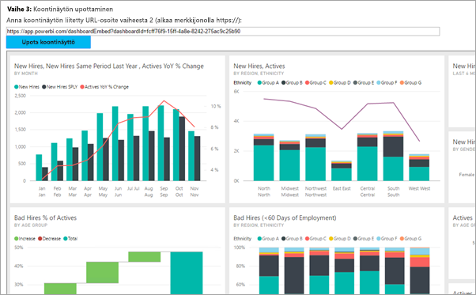

# <a name="embed-a-power-bi-dashboard-tile-or-report-into-your-application-for-sovereign-clouds"></a>Power BI:n koontinäytön, ruudun tai raportin upottaminen maakohtaisen pilvipalvelun sovellukseen
Lue ohjeet siihen, miten voit integroida tai upottaa koontinäytön, ruudun tai raportin verkkosovellukseen asiakkaillesi Power BI .NET SDK:n ja Power BI JavaScript -ohjelmointirajapinnan avulla upotuksen yhteydessä. Tämä on yleensä riippumattoman ohjelmistokehittäjän toteuttama skenaario.

Power BI tukee myös maakohtaisia (yksityisiä) pilviä. Jokaisella maakohtaisella pilvipalvelulla on oma tarkoituksensa. Tarjottavat maakohtaiset pilvipalvelut ovat seuraavat:

* U.S. Government Community Cloud (GCC)

* U. S. Military Contractors (DoDCON)

* U. S. Military (DoD)

* Power BI for Germany Cloud.



Jotta voit käydä toimia näiden vaiheittaisten ohjeiden mukaisesti, tarvitset **Power BI** -tilin. Jos sinulla ei ole tiliä, voit [rekisteröidä U. S. Government Power BI -tilin](../service-govus-signup.md) tai [Power BI for Germany Cloud -tilin](https://powerbi.microsoft.com/en-us/power-bi-germany/?ru=https%3A%2F%2Fapp.powerbi.de%2F%3FnoSignUpCheck%3D1) tarpeidesi mukaisesti.

> [!NOTE]
> Haluatko sen sijaan upottaa koontinäytön organisaatiolle? Lue ohjeet artikkelista [Koontinäytön integrointi sovellukseen organisaatiolle](integrate-dashboard.md).
>

Voit integroida koontinäytön verkkosovellukseen **Power BI** -ohjelmointirajapinnalla ja hankkia koontinäytön Azure Active Directory (AD) -valtuutuksen **käyttöoikeustietueen** avulla. Tämän jälkeen voit ladata koontinäytön upotetun käyttöoikeustietueen avulla. **Power BI** -ohjelmointirajapinta tarjoaa ohjelmallisen käyttöoikeuden tiettyihin **Power BI** -resursseihin. Saat lisätietoja artikkelista [Power BI REST -ohjelmointirajapinnan yleiskatsaus](https://msdn.microsoft.com/library/dn877544.aspx), [Power BI .NET SDK](https://github.com/Microsoft/PowerBI-CSharp) ja [Power BI JavaScript -ohjelmointirajapinta](https://github.com/Microsoft/PowerBI-JavaScript).

## <a name="download-the-sample"></a>Mallin lataaminen
Tässä artikkelissa näytetään koodi, jolla [upotetaan asiakasmalli](https://github.com/Microsoft/PowerBI-Developer-Samples/tree/master/App%20Owns%20Data/PowerBIEmbedded_AppOwnsData) GitHubissa. Voit ladata mallin, jonka avulla voit noudattaa näitä vaiheittaisia ohjeita.

* Government Community Cloud (GCC):
    1. Korvaa Cloud.config-tiedosto tiedoston GCCCloud.config sisällöllä.
    2. Päivitä clientid- (natiivisovelluksen asiakastunnus), groupid-, user- (pääkäyttäjä) ja password-kohdat tiedostossa Web.config.
    3. Muokkaa tiedoston web.config GCC-parametreja seuraavasti.

```xml
<add key="authorityUrl" value="https://login.windows.net/common/oauth2/authorize/" />

<add key="resourceUrl" value="https://analysis.usgovcloudapi.net/powerbi/api" />

<add key="apiUrl" value="https://api.powerbigov.us/" />

<add key="embedUrlBase" value="https://app.powerbigov.us" />
```

* Military Contractors (DoDCON):
    1. Korvaa tiedosto Cloud.config tiedoston TBCloud.config sisällöllä.
    2. Päivitä clientid- (natiivisovelluksen asiakastunnus), groupid-, user- (pääkäyttäjä) ja password-kohdat tiedostossa Web.config.
    3. Lisää DoDCON-parametrit tiedostoon web.config seuraavasti.

```xml
<add key="authorityUrl" value="https://login.windows.net/common/oauth2/authorize/" />

<add key="resourceUrl" value="https://high.analysis.usgovcloudapi.net/powerbi/api" />

<add key="apiUrl" value="https://api.high.powerbigov.us/" />

<add key="embedUrlBase" value="https://app.high.powerbigov.us" />
```

* Military (DoD):
    1. Korvaa tiedosto Cloud.config tiedoston PFCloud.config sisällöllä.
    2. Päivitä clientid- (natiivisovelluksen asiakastunnus), groupid-, user- (pääkäyttäjä) ja password-kohdat tiedostossa Web.config.
    3. Lisää DoDCON-parametrit tiedostoon web.config seuraavasti.

```xml
<add key="authorityUrl" value="https://login.windows.net/common/oauth2/authorize/" />

<add key="resourceUrl" value="https://mil.analysis.usgovcloudapi.net/powerbi/api" />

<add key="apiUrl" value="https://api.mil.powerbigov.us/" />

<add key="embedUrlBase" value="https://app.mil.powerbigov.us" />
```

* Power BI for Germany Cloud -parametrit
    1. Korvaa tiedosto Cloud.config Power BI for Germany Cloud -sisällöllä.
    2. Päivitä clientid- (natiivisovelluksen asiakastunnus), groupid-, user- (pääkäyttäjä) ja password-kohdat tiedostossa Web.config.
    3. Lisää Power BI for Germany Cloud -parametrit tiedostoon web.config seuraavasti.

```xml
<add key="authorityUrl" value=https://login.microsoftonline.de/common/oauth2/authorize/" />

<add key="resourceUrl" value="https://analysis.cloudapi.de/powerbi/api" />

<add key="apiUrl" value="https://api.powerbi.de/" />

<add key="embedUrlBase" value="https://app.powerbi.de" />
```

## <a name="step-1---register-an-app-in-azure-ad"></a>Vaihe 1 – rekisteröi sovellus Azure AD:ssä
Sinun on rekisteröitävä sovellus Azure AD:ssä, jossa voit tehdä REST-ohjelmointirajapinnan kutsuja. Saat lisätietoja artikkelista [Azure AD -sovelluksen rekisteröinti upotettuun Power BI -sisältöön](register-app.md). Koska maakohtaiset pilvipalvelut eroavat toisistaan, sovelluksen rekisteröintiin on omat URL-osoitteensa.

* Government Community Cloud (GCC): https://app.powerbigov.us/apps 

* Military Contractors (DoDCON): https://app.high.powerbigov.us/apps 

* Military (DoD): https://app.mil.powerbigov.us/apps

* Power BI for Germany Cloud: https://app.powerbi.de/apps

Jos latasit [asiakkaan upottamisen mallin](https://github.com/Microsoft/PowerBI-Developer-Samples/tree/master/App%20Owns%20Data), rekisteröinnin jälkeen voit todentaa mallin Azure AD:hen saamasi **asiakastunnuksen** avulla. Voit määrittää mallin muuttamalla **clientid**-arvoa *web.config*-tiedostossa.


## <a name="step-2---get-an-access-token-from-azure-ad"></a>Vaihe 2 – hanki käyttöoikeustietue Azure AD:stä
Sinun on hankittava sovelluksessa **käyttöoikeustietue** Azure AD:stä, ennen kuin voit lähettää kutsuja Power BI REST -ohjelmointirajapintaan. Saat lisätietoja artikkelista [Käyttäjien todentaminen ja Azure AD -käyttöoikeustietueen hankkiminen Power BI -sovellukselle](get-azuread-access-token.md). Koska maakohtaiset pilvipalvelut eroavat toisistaan, sovelluksen käyttöoikeustunnuksen hankkimiseen on omat URL-osoitteensa.

* Government Community Cloud (GCC): https://login.microsoftonline.com

* Military Contractors (DoDCON): http://login.microsoftonline.us

* Military (DoD): https://login.microsoftonline.us

* Power BI for Germany Cloud: https://login.microsoftonline.de

Näet esimerkit tästä kussakin sisältökohdetehtävässä kohdassa **Controllers\HomeController.cs**.

## <a name="step-3---get-a-content-item"></a>Vaihe 3 – hanki sisältökohde
Jos haluat upottaa Power BI -sisältöä, sinun täytyy tehdä muutama asia, joilla varmistat, että upottaminen onnistuu oikein. Vaikka voitkin tehdä kaikki nämä toimenpiteet suoraan REST-ohjelmointirajapinnalla, mallisovellus ja tässä näytetyt esimerkiksi tehdään kuitenkin .NET SDK:lla.

### <a name="create-the-power-bi-client-with-your-access-token"></a>Power BI -asiakasohjelman luominen käyttöoikeustietueen avulla
Käyttöoikeustietueen avulla voit luoda Power BI -asiakasohjelmaobjektin, jonka avulla voit käyttää Power BI -ohjelmointirajapintoja. Tämä tehdään sijoittamalla käyttöoikeustietue objektiin *Microsoft.Rest.TokenCredentials*.

```csharp
using Microsoft.IdentityModel.Clients.ActiveDirectory;
using Microsoft.Rest;
using Microsoft.PowerBI.Api.V2;

var tokenCredentials = new TokenCredentials(authenticationResult.AccessToken, "Bearer");

// Create a Power BI Client object. It will be used to call Power BI APIs.
using (var client = new PowerBIClient(new Uri(ApiUrl), tokenCredentials))
{
    // Your code to embed items.
}
```

### <a name="get-the-content-item-you-want-to-embed"></a>Upotettavan sisältökohteen hankkiminen
Power BI -asiakasohjelmaobjektin avulla voit noutaa viitteen upotettavalle kohteelle. Voit upottaa koontinäyttöjä, ruutuja tai raportteja. Tässä on esimerkki siitä, miten voit noutaa ensimmäisen koontinäytön, ruudun tai raportin tietystä työtilasta.

Malli tästä on saatavilla [App Owns Data -mallin](https://github.com/Microsoft/PowerBI-Developer-Samples/tree/master/App%20Owns%20Data) kohdasta **Controllers\HomeController.cs**.

**Koontinäytöt**

```csharp
using Microsoft.PowerBI.Api.V2;
using Microsoft.PowerBI.Api.V2.Models;

// You will need to provide the GroupID where the dashboard resides.
ODataResponseListDashboard dashboards = client.Dashboards.GetDashboardsInGroup(GroupId);

// Get the first report in the group.
Dashboard dashboard = dashboards.Value.FirstOrDefault();
```

**Ruutu**

```csharp
using Microsoft.PowerBI.Api.V2;
using Microsoft.PowerBI.Api.V2.Models;

// To retrieve the tile, you first need to retrieve the dashboard.

// You will need to provide the GroupID where the dashboard resides.
ODataResponseListDashboard dashboards = client.Dashboards.GetDashboardsInGroup(GroupId);

// Get the first report in the group.
Dashboard dashboard = dashboards.Value.FirstOrDefault();

// Get a list of tiles from a specific dashboard
ODataResponseListTile tiles = client.Dashboards.GetTilesInGroup(GroupId, dashboard.Id);

// Get the first tile in the group.
Tile tile = tiles.Value.FirstOrDefault();
```

**Raportti**

```csharp
using Microsoft.PowerBI.Api.V2;
using Microsoft.PowerBI.Api.V2.Models;

// You will need to provide the GroupID where the dashboard resides.
ODataResponseListReport reports = client.Reports.GetReportsInGroupAsync(GroupId);

// Get the first report in the group.
Report report = reports.Value.FirstOrDefault();
```

### <a name="create-the-embed-token"></a>Upotustunnuksen luominen
Sinun on luotava upotustunnus, jota voidaan käyttää JavaScript-ohjelmointirajapinnasta. Upotustunnus on yksilöllinen upotettavalle kohteelle. Tämä tarkoittaa sitä, että kun upotat tietyn Power BI -sisältökohteen, sinun on luotava sille uusi upotustunnus. Saat lisätietoja tästä ja käytettävästä **käyttöoikeustasosta** artikkelista [GenerateToken-ohjelmointirajapinta](https://msdn.microsoft.com/library/mt784614.aspx).

> [!IMPORTANT]
> Koska upotustunnukset on tarkoitettu vain kehitystestaukseen, Power BI -päätilin luomien upotustunnusten määrää on rajoitettu. [Sinun on ostettava kapasiteettia](https://docs.microsoft.com/power-bi/developer/embedded-faq#technical), jos haluat toteuttaa upotusskenaarioita hyötykäytössä. Kun ostat kapasiteettia, voit luoda upotustunnuksia rajattomasti.

Malli tästä on saatavilla artikkelin [Organisaation mallin upotus](https://github.com/Microsoft/PowerBI-Developer-Samples/tree/master/App%20Owns%20Data) kohdasta **Controllers\HomeController.cs**.

Tämä edellyttää luokan luomista kohteille **EmbedConfig** ja **TileEmbedConfig**. Malli näistä on saatavilla kohdissa **Models\EmbedConfig.cs** ja **Models\TileEmbedConfig.cs**.

**Koontinäyttö**

```csharp
using Microsoft.PowerBI.Api.V2;
using Microsoft.PowerBI.Api.V2.Models;

// Generate Embed Token.
var generateTokenRequestParameters = new GenerateTokenRequest(accessLevel: "view");
EmbedToken tokenResponse = client.Dashboards.GenerateTokenInGroup(GroupId, dashboard.Id, generateTokenRequestParameters);

// Generate Embed Configuration.
var embedConfig = new EmbedConfig()
{
    EmbedToken = tokenResponse,
    EmbedUrl = dashboard.EmbedUrl,
    Id = dashboard.Id
};
```

**Ruutu**

```csharp
using Microsoft.PowerBI.Api.V2;
using Microsoft.PowerBI.Api.V2.Models;

// Generate Embed Token for a tile.
var generateTokenRequestParameters = new GenerateTokenRequest(accessLevel: "view");
EmbedToken tokenResponse = client.Tiles.GenerateTokenInGroup(GroupId, dashboard.Id, tile.Id, generateTokenRequestParameters);

// Generate Embed Configuration.
var embedConfig = new TileEmbedConfig()
{
    EmbedToken = tokenResponse,
    EmbedUrl = tile.EmbedUrl,
    Id = tile.Id,
    dashboardId = dashboard.Id
};
```

**Raportti**

```csharp
using Microsoft.PowerBI.Api.V2;
using Microsoft.PowerBI.Api.V2.Models;

// Generate Embed Token.
var generateTokenRequestParameters = new GenerateTokenRequest(accessLevel: "view");
EmbedToken tokenResponse = client.Reports.GenerateTokenInGroup(GroupId, report.Id, generateTokenRequestParameters);

// Generate Embed Configuration.
var embedConfig = new EmbedConfig()
{
    EmbedToken = tokenResponse,
    EmbedUrl = report.EmbedUrl,
    Id = report.Id
};
```
## <a name="step-4---load-an-item-using-javascript"></a>Vaihe 4 – lataa kohde JavaScriptin avulla
JavaScriptin avulla voit ladata koontinäytön verkkosivun jakoelementtiin. Malli käyttää EmbedConfig/TileEmbedConfig-mallia yhdessä koontinäytön, ruudun tai raportin näkymien kanssa. Jos haluat täydellisen mallin JavaScript-ohjelmointirajapinnan käytöstä, voit käyttää [Microsoft Power BI:n upotettua mallia](https://microsoft.github.io/PowerBI-JavaScript/demo).

Sovellusmalli tästä on saatavilla artikkelista [Organisaation mallin upotus](https://github.com/Microsoft/PowerBI-Developer-Samples/tree/master/App%20Owns%20Data).

**Views\Home\EmbedDashboard.cshtml**

```csharp
<script src="~/scripts/powerbi.js"></script>
<div id="dashboardContainer"></div>
<script>
    // Read embed application token from Model
    var accessToken = "@Model.EmbedToken.Token";

    // Read embed URL from Model
    var embedUrl = "@Html.Raw(Model.EmbedUrl)";

    // Read dashboard Id from Model
    var embedDashboardId = "@Model.Id";

    // Get models. models contains enums that can be used.
    var models = window['powerbi-client'].models;

    // Embed configuration used to describe the what and how to embed.
    // This object is used when calling powerbi.embed.
    // This also includes settings and options such as filters.
    // You can find more information at https://github.com/Microsoft/PowerBI-JavaScript/wiki/Embed-Configuration-Details.
    var config = {
        type: 'dashboard',
        tokenType: models.TokenType.Embed,
        accessToken: accessToken,
        embedUrl: embedUrl,
        id: embedDashboardId
    };

    // Get a reference to the embedded dashboard HTML element
    var dashboardContainer = $('#dashboardContainer')[0];

    // Embed the dashboard and display it within the div container.
    var dashboard = powerbi.embed(dashboardContainer, config);
</script>
```

**Views\Home\EmbedTile.cshtml**

```csharp
<script src="~/scripts/powerbi.js"></script>
<div id="tileContainer"></div>
<script>
    // Read embed application token from Model
    var accessToken = "@Model.EmbedToken.Token";

    // Read embed URL from Model
    var embedUrl = "@Html.Raw(Model.EmbedUrl)";

    // Read tile Id from Model
    var embedTileId = "@Model.Id";

    // Read dashboard Id from Model
    var embedDashboardeId = "@Model.dashboardId";

    // Get models. models contains enums that can be used.
    var models = window['powerbi-client'].models;

    // Embed configuration used to describe the what and how to embed.
    // This object is used when calling powerbi.embed.
    // This also includes settings and options such as filters.
    // You can find more information at https://github.com/Microsoft/PowerBI-JavaScript/wiki/Embed-Configuration-Details.
    var config = {
        type: 'tile',
        tokenType: models.TokenType.Embed,
        accessToken: accessToken,
        embedUrl: embedUrl,
        id: embedTileId,
        dashboardId: embedDashboardeId
    };

    // Get a reference to the embedded tile HTML element
    var tileContainer = $('#tileContainer')[0];

    // Embed the tile and display it within the div container.
    var tile = powerbi.embed(tileContainer, config);
</script>
```

**Views\Home\EmbedReport.cshtml**

```csharp
<script src="~/scripts/powerbi.js"></script>
<div id="reportContainer"></div>
<script>
    // Read embed application token from Model
    var accessToken = "@Model.EmbedToken.Token";

    // Read embed URL from Model
    var embedUrl = "@Html.Raw(Model.EmbedUrl)";

    // Read report Id from Model
    var embedReportId = "@Model.Id";

    // Get models. models contains enums that can be used.
    var models = window['powerbi-client'].models;

    // Embed configuration used to describe the what and how to embed.
    // This object is used when calling powerbi.embed.
    // This also includes settings and options such as filters.
    // You can find more information at https://github.com/Microsoft/PowerBI-JavaScript/wiki/Embed-Configuration-Details.
    var config = {
        type: 'report',
        tokenType: models.TokenType.Embed,
        accessToken: accessToken,
        embedUrl: embedUrl,
        id: embedReportId,
        permissions: models.Permissions.All,
        settings: {
            filterPaneEnabled: true,
            navContentPaneEnabled: true
        }
    };

    // Get a reference to the embedded report HTML element
    var reportContainer = $('#reportContainer')[0];

    // Embed the report and display it within the div container.
    var report = powerbi.embed(reportContainer, config);
</script>
```

## <a name="next-steps"></a>Seuraavat vaiheet

* GitHubissa on saatavilla mallisovellus, jota voit hyödyntää. Edellä olevat esimerkit perustuvat tähän malliin. Saat lisätietoja artikkelista [Organisaation mallin upotus](https://github.com/Microsoft/PowerBI-Developer-Samples/tree/master/App%20Owns%20Data).
* Saat lisätietoja JavaScript-ohjelmointirajapinnasta artikkelista [Power BI JavaScript -ohjelmointirajapinta](https://github.com/Microsoft/PowerBI-JavaScript).
* Saat lisätietoja Power BI for Germany Cloudista ohjeartikkelista [Power BI for Germany Cloudin usein kysytyt kysymykset](https://docs.microsoft.com/en-us/power-bi/service-govde-faq)
* [Power BI -työtilan kokoelman sisällön siirtäminen Power BI:hin](migrate-from-powerbi-embedded.md)

Rajoitukset ja huomioitavat seikat
* GCC-tukevat tällä hetkellä vain P- ja EM-kapasiteetteja.

Onko sinulla muuta kysyttävää? [Voit esittää kysymyksiä Power BI -yhteisössä](http://community.powerbi.com/)
