# <a name="tutorial-embed-a-power-bi-report-dashboard-or-tile-into-an-application-for-your-organization"></a>Opetusohjelma: Power BI -raportin, raporttinäkymän tai ruudun upottaminen sovellukseen organisaatiolle
Tämä opetusohjelma esittelee, miten raportti integroidaan sovellukseen käyttämällä **Power BI .NET SDK:ta** yhdessä **Power BI JavaScript -ohjelmointirajapinnan** kanssa, kun upotat **Power BI:n** organisaatiosi sovellukseen. **Power BI:n** avulla, voit upottaa sovellukseen raportteja, raporttinäkymiä tai ruutuja käyttämällä **user owns data** -hakemiston malleja. **User owns data** -mallien avulla voit laajentaa sovelluksesi Power BI-palveluun.


Tässä opetusohjelmassa opit:
>[!div class="checklist"]
>* Rekisteröimään sovelluksen Azuressa.
>* Upottamaan Power BI -raportin sovellukseen.

## <a name="prerequisites"></a>Edellytykset
Tarvitset **Power BI Pro** -tilin ja **Microsoft Azure** -tilauksen aloittaaksesi.

* Jos et ole rekisteröitynyt **Power BI:hin**, [rekisteröi ilmainen kokeiluversio](https://powerbi.microsoft.com/en-us/pricing/) ennen aloittamista.
* Jos sinulla ei ole Azure-tilausta, luo [ilmainen tili](https://azure.microsoft.com/free/?WT.mc_id=A261C142F) ennen aloittamista.
* Sinulla on oltava oma [Azure Active Directory -vuokraaja ](create-an-azure-active-directory-tenant.md) asetettuna.
* [Visual Studion](https://www.visualstudio.com/) (2013 tai uudempi versio) on oltava asennettuna.

## <a name="setup-your-embedded-analytics-development-environment"></a>Upotettujen analyysitoimintojen kehitysympäristön määrittäminen

Ennen kuin ryhdyt upottamaan raportteja, raporttinäkymiä tai ruutuja sovellukseesi, varmista, että ympäristösi on määritetty niin, että upottaminen on siinä sallittu. Määritys edellyttää myös seuraavia toimia:

Voit käyttää [Perehdyttämiskokemustyökalua](https://aka.ms/embedsetup/UserOwnsData) päästäksesi nopeasti alkuun ja ladata mallisovelluksen, jossa käydään läpi sekä käyttöympäristön luominen että raportin upottaminen.

Jos haluat määrittää ympäristön manuaalisesti, jatka lukemista.
### <a name="register-an-application-in-azure-active-directory-azure-ad"></a>Sovelluksen rekisteröiminen Azure Active Directoryyn (Azure AD)

Rekisteröi sovellus Azure Active Directoryyn, jotta sovellus saa käyttöoikeuden Power BI REST -ohjelmointirajapintoihin. Tämä sallii sinun määrittää sovelluksen käyttäjätiedot ja käyttöoikeudet Power BI REST -resursseihin.

1. Hyväksy [Microsoft Power BI -ohjelmointirajapinnan ehdot](https://powerbi.microsoft.com/api-terms).

2. Kirjaudu sisään [Azure-portaaliin](https://portal.azure.com).

    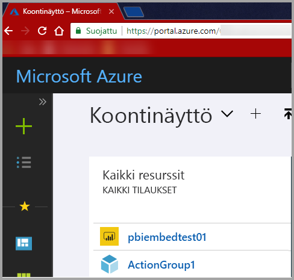

3. Valitse vasemmassa siirtymisruudussa **Kaikki palvelut**, valitse sitten **Sovelluksen rekisteröinti** ja sitten **Uuden sovelluksen rekisteröinti**.

    </br>
    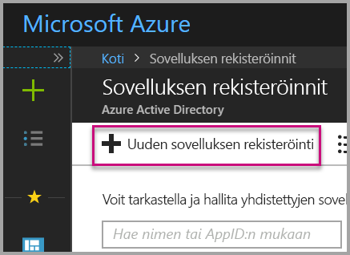

4. Noudata kehotteita ja luo uusi sovellus. **User owns data** -mallien kanssa on käytettävä **verkkosovellus/ohjelmointirajapinta**-sovellustyyppiä. Sinun täytyy antaa myös **Sisäänkirjautumis-URL-osoite**, jota **Azure AD** käyttää palauttaessaan tunnusvastauksia. Anna sovellukseen liittyvä arvo (esim. http://localhost:13526/).

    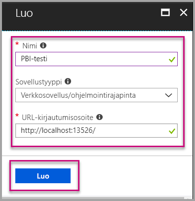

### <a name="apply-permissions-to-your-application-within-azure-active-directory"></a>Määritä sovellukselle käyttöoikeudet Azure Active Directorystä

Sinun on otettava käyttöön sovellukselle lisäkäyttöoikeuksia sovelluksen rekisteröintisivulla annettujen käyttöoikeuksien lisäksi. Sinun on kirjauduttava sisään *yleisen järjestelmänvalvojan* -tilillä, ottaaksesi oikeudet käyttöön.

### <a name="use-the-azure-active-directory-portal"></a>Azure Active Directory -portaalin käyttäminen

1. Selaa kohtaan [Sovelluksen rekisteröinnit](https://portal.azure.com/#blade/Microsoft_AAD_IAM/ApplicationsListBlade) Azure-portaalissa ja valitse sovellus, jota käytät upottamiseen.

    

2. Valitse **Asetukset**, valitse sitten **Ohjelmointirajapinnan käyttöoikeudet** ja valitse vielä **Tarvittavat käyttöoikeudet**.

    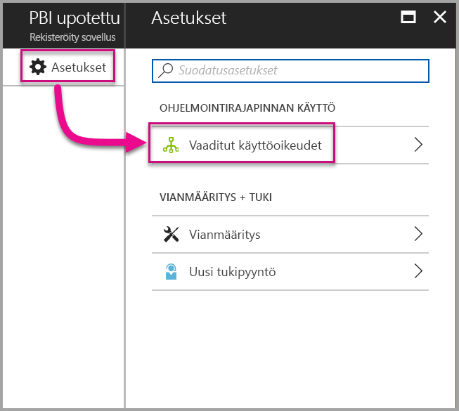

3. Valitse **Windows Azure Active Directory** ja varmista sitten, että **Käytä hakemistoa kirjautuneena käyttäjänä** on valittuna. Valitse **Tallenna**.

    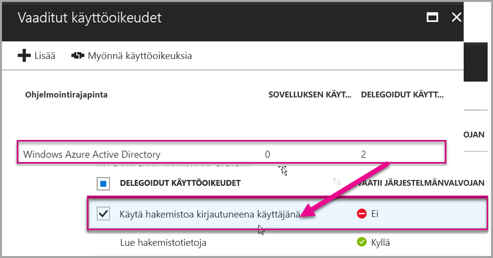

4. Valitse **Lisää**.

    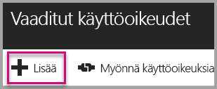

5. Valitse **Valitse ohjelmointirajapinta**.

    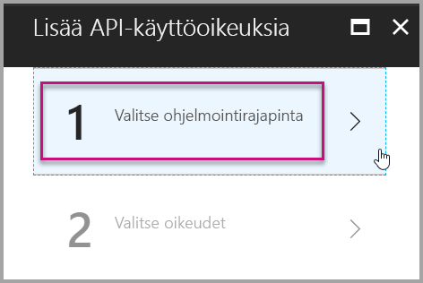

6. Valitse **Power BI -palvelu** ja sitten **Valitse**.

    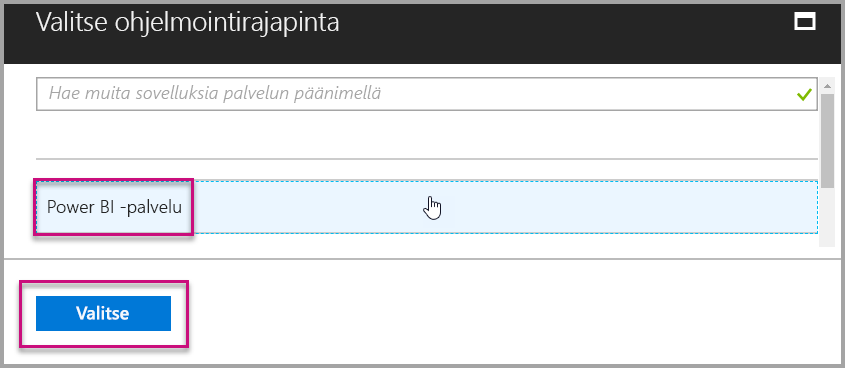

7. Valitse kaikki käyttöoikeudet kohdasta **Delegoidut käyttöoikeudet**. Ne on valittava yksi kerrallaan valintojen tallentamiseksi. Kun olet valmis, valitse **Tallenna**.

    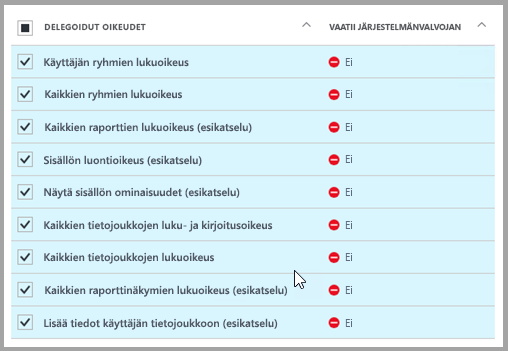

## <a name="setup-your-power-bi-environment"></a>Määritä Power BI -ympäristö

### <a name="create-an-app-workspace"></a>Sovelluksen työtilan luominen

Jos upotat asiakkaille raportteja, raporttinäkymiä tai ruutuja, sinun tulee sijoittaa sisältösi sovelluksen työtilaan.

1. Aloita luomalla työtila. Valitse **Työtilat** > **Luo sovelluksen työtila**. Tänne sijoitetaan sisältö, johon sovelluksesi on päästävä.

    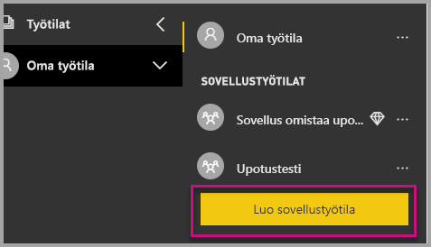

2. Anna työtilalle nimi. Jos vastaava **työtilan tunnus** ei ole käytettävissä, muokkaa nimeä niin, että saat yksilöllisen tunnuksen. Sen on oltava myös sovelluksen nimi.

    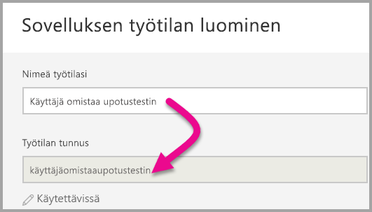

3. Sinun täytyy määrittää joitakin asetuksia. Jos valitset vaihtoehdon **Julkinen**, kuka tahansa organisaatiossasi voi nähdä, mitä työtilassa on. **Yksityinen** puolestaan tarkoittaa, että vain työtilan jäsenet voivat nähdä sen sisällön.

    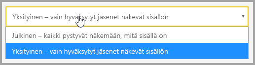

    Julkinen/Yksityinen-asetusta ei voi enää muuttaa, kun olet kerran luonut ryhmän.

4. Voit myös valita, onko jäsenillä **muokkaus-** vai **vain tarkastelu** ‑käyttöoikeudet.

    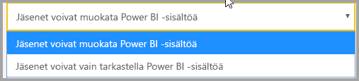

5. Lisää niiden ihmisten sähköpostiosoitteet, joille haluat antaa työtilan käyttöoikeudet, ja valitse **Lisää**. Et voi lisätä ryhmien aliaksia, vain yksittäisiä ihmisiä.

6. Päätä, onko kukin henkilö jäsen vai järjestelmänvalvoja. Järjestelmänvalvojat voivat muokata työtilaa itse ja muun muassa lisätä muita jäseniä. Jäsenet voivat muokata sisältöä työtilassa, ellei heillä ole käyttöoikeuksia pelkästään tarkasteluun. Sekä järjestelmänvalvojat että jäsenet voivat julkaista sovelluksen.

    Voit nyt tarkastella uutta työtilaa. Power BI luo työtilan ja avaa sen. Työtila ilmestyy luetteloon työtiloista, joiden jäsen olet. Järjestelmänvalvojana voit valita kolme pistettä (...) ja palata takaisin tekemään työtilaan muutoksia, lisäämään uusia jäseniä ja muuttamaan jäsenten käyttöoikeuksia.

    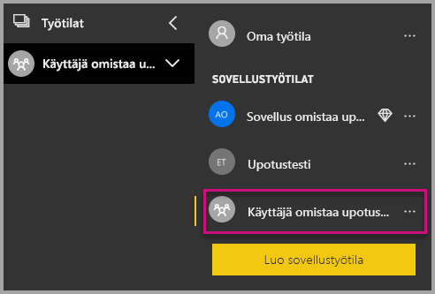

### <a name="create-and-publish-your-reports"></a>Luo ja julkaise raportteja

Voit luoda Power BI Desktopia käyttämällä raportteja ja tietojoukkoja ja julkaista raportit sitten sovellustyötilassa. Raportit julkaiseva loppukäyttäjä tarvitsee Power BI Pro ‑käyttöoikeudet sovellustyötilassa julkaisemiseen.

1. Lataa malli [blogiesittely](https://github.com/Microsoft/powerbi-desktop-samples) GitHubista.

    

2. Avaa PBIX raporttimalli **Power BI Desktopissa**

   

3. Julkaise **sovelluksen työtilassa**

   

    Voit nyt tarkastella raporttia verkossa Power BI -palvelussa.

   

## <a name="embed-your-content-using-the-sample-application"></a>Upota sisältöä saman mallisovelluksen avulla

Seuraa näitä ohjeita aloittaaksesi sisällön upottamisen mallisovelluksen avulla.

1. Lataa [User Owns Data -malli](https://github.com/Microsoft/PowerBI-Developer-Samples) GitHubista aloittaaksesi.  On olemassa kolme eri mallisovellusta, yksi [raportteja](https://github.com/Microsoft/PowerBI-Developer-Samples/tree/master/User%20Owns%20Data/integrate-report-web-app), yksi [koontinäyttöjä](https://github.com/Microsoft/PowerBI-Developer-Samples/tree/master/User%20Owns%20Data/integrate-dashboard-web-app) ja yksi[ruutuja](https://github.com/Microsoft/PowerBI-Developer-Samples/tree/master/User%20Owns%20Data/integrate-tile-web-app) varten.  Tässä artikkelissa, alla olevat vaiheet viittaavat **raportti**-sovellukseen.

    

2. Avaa mallisovelluksessa Cloud.config-tiedosto. Sinun on täytettävä muutamia kenttiä, jotta sovellus voidaan suorittaa onnistuneesti. **ClientID** ja **ClientSecret**.

    

    Täytä **Asiakastunnus**-tiedot **Sovellustunnuksilla** **Azuresta**. **Asiakastunnuksen** avulla sovellus tunnistautuu käyttäjille, joilta pyydät käyttöoikeuksia.

    Saat **Asiakastunnuksen** seuraavasti:

    Kirjaudu sisään [Azure-portaaliin](https://portal.azure.com).

    

    Valitse vasemmassa siirtymisruudussa **Kaikki palvelut** ja sitten **Sovelluksen rekisteröinnit**.

    

    Valitse sovellus, joka tarvitsee **Asiakastunnusta**.

    

    Sinun pitäisi nähdä **Sovellustunnus** , joka on merkitty GUID-tunnuksena. Käytä tätä **Sovellustunnusta** sovelluksen **Asiakastunnuksena**.

    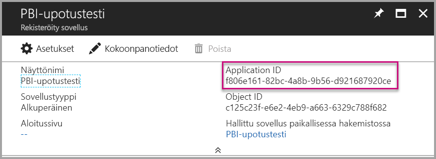

    Täytä **ClientSecret** -tiedot **Avaimet**-osiosta **sovelluksen rekisteröinnit** -kohdasta **Azuressa**.

    Saat **ClientSecret**-tiedot seuraavasti:

    Kirjaudu sisään [Azure-portaaliin](https://portal.azure.com).

    

    Valitse vasemmassa siirtymisruudussa **Kaikki palvelut** ja sitten **Sovelluksen rekisteröinnit**.

    

    Valitse sovellus, joka käyttää **ClientSecretiä**.

    

    Valitse **Asetukset**.

    

    Valitse **Avaimet**.

    

    Täytä **Kuvaus** nimellä ja valitse **Kesto**, ja valitse sitten **Tallenna** saadaksesi sovellukselle **Arvon**. Kun suljet **Avaimet**-välilehden **avaimen arvon** tallentamisen jälkeen, arvokenttä näkyy vain **_Piilotettuna_**, etkä pysty noutamaan **avaimen arvoa**. Jos kadotat **avainarvon**, sinun on luotava uusi **Azure-portaalissa**.

    

     Täytä **ryhmätunnus** Power BI:n **sovelluksen työtila GUID** -tiedoilla.

    

    Täytä **raporttitunnus** Power BI:n **raportin GUID** -tiedoilla.

    

3. Suorita sovellus!

    Valitse ensin **Suorita** **Visual Studiossa**.

    

    Valitse **Hae raportti**.

    

    Voit nyt tarkastella raporttia mallisovelluksessa.

    

## <a name="embed-your-content-within-your-application"></a>Upota sisältö sovellukseen
Vaikka sisältöä voidaan upottaa [Power BI REST -ohjelmointirajapintojen](https://docs.microsoft.com/rest/api/power-bi/) avulla, tässä artikkelissa kuvatut esimerkkikoodit on luotu **.NET SDK**:n avulla.

Voit integroida raportin verkkosovellukseen **Power BI REST -ohjelmointirajapinnan** tai **Power BI C# SDK:n** avulla ja saada raportin Azure Active Directory (AD) -valtuutuksen **käyttöoikeustietueen** avulla. Voit sitten ladata raportin käyttämällä samaa **käyttöoikeustietuetta**. **Power BI -ohjelmointirajapinta** tarjoaa ohjelmallisen käyttöoikeuden tiettyihin **Power BI** -resursseihin. Katso lisätietoja artikkeleista [Power BI REST -ohjelmointirajapinta](https://docs.microsoft.com/rest/api/power-bi/) ja [Power BI JavaScript -ohjelmointirajapinta](https://github.com/Microsoft/PowerBI-JavaScript).

### <a name="get-an-access-token-from-azure-ad"></a>Hanki käyttöoikeustietue Azure AD:stä
Sinun on hankittava sovelluksessa **käyttöoikeustietue** Azure AD:stä, ennen kuin voit lähettää kutsuja Power BI REST -ohjelmointirajapintaan. Saat lisätietoja artikkelista [Käyttäjien todentaminen ja Azure AD -käyttöoikeustietueen hankkiminen Power BI -sovellukselle](get-azuread-access-token.md).

### <a name="get-a-report"></a>Hanki raportti
Voit hankkia **Power BI** -raportin käyttämällä [Hanki raportit](https://docs.microsoft.com/rest/api/power-bi/reports/getreports) -toimintoa, joka antaa **Power BI -raporttien** luettelon. Saat raporttien luettelosta raporttitunnuksen.

### <a name="get-reports-using-an-access-token"></a>Hanki raportit käyttöoikeustietueen avulla
[Hanki raportit](https://docs.microsoft.com/rest/api/power-bi/reports/getreports) -toiminto palauttaa raporttiluettelon. Voit noutaa yksittäisen raportin raporttiluettelosta.

Jotta voit lähettää REST-ohjelmointirajapinnan kutsun, sinun on sisällytettävä *Valtuutus*-otsikko *Haltija {käyttöoikeustietue}* -muodossa.

#### <a name="get-reports-with-the-rest-api"></a>Raporttien hankinta REST-ohjelmointirajapinnan avulla

Tässä on koodiesimerkki siitä, miten voit noutaa raportteja **REST-ohjelmointirajapinnan** avulla.

*Esimerkki siitä, miten saat haluamasi sisältöyksikön (raportin, koontinäytön tai ruudun) on nähtävissä  **_Default.aspx.cs_** -tiedostossa [ mallisovelluksessa](#embed-your-content-using-the-sample-application).*

```csharp
using Newtonsoft.Json;

//Get a Report. In this sample, you get the first Report.
protected void GetReport(int index)
{
    //Configure Reports request
    System.Net.WebRequest request = System.Net.WebRequest.Create(
        String.Format("{0}/Reports",
        baseUri)) as System.Net.HttpWebRequest;

    request.Method = "GET";
    request.ContentLength = 0;
    request.Headers.Add("Authorization", String.Format("Bearer {0}", accessToken.Value));

    //Get Reports response from request.GetResponse()
    using (var response = request.GetResponse() as System.Net.HttpWebResponse)
    {
        //Get reader from response stream
        using (var reader = new System.IO.StreamReader(response.GetResponseStream()))
        {
            //Deserialize JSON string
            PBIReports Reports = JsonConvert.DeserializeObject<PBIReports>(reader.ReadToEnd());

            //Sample assumes at least one Report.
            //You could write an app that lists all Reports
            if (Reports.value.Length > 0)
            {
                var report = Reports.value[index];

                txtEmbedUrl.Text = report.embedUrl;
                txtReportId.Text = report.id;
                txtReportName.Text = report.name;
            }
        }
    }
}

//Power BI Reports used to deserialize the Get Reports response.
public class PBIReports
{
    public PBIReport[] value { get; set; }
}
public class PBIReport
{
    public string id { get; set; }
    public string name { get; set; }
    public string webUrl { get; set; }
    public string embedUrl { get; set; }
}
```

#### <a name="get-reports-using-the-net-sdk"></a>Raporttien hankinta .NET SDK:n avulla
.NET SDK:n avulla voit noutaa raporttiluettelon sen sijaan, että lähetät kutsun suoraan REST-ohjelmointirajapintaan. Tässä on koodiesimerkki siitä, miten voit luoda raporttiluettelon.

```csharp
using Microsoft.IdentityModel.Clients.ActiveDirectory;
using Microsoft.PowerBI.Api.V2;
using Microsoft.PowerBI.Api.V2.Models;

var tokenCredentials = new TokenCredentials(<ACCESS TOKEN>, "Bearer");

// Create a Power BI Client object. It is used to call Power BI APIs.
using (var client = new PowerBIClient(new Uri(ApiUrl), tokenCredentials))
{
    // Get the first report all reports in that workspace
    ODataResponseListReport reports = client.Reports.GetReports();

    Report report = reports.Value.FirstOrDefault();

    var embedUrl = report.EmbedUrl;
}
```

### <a name="load-a-report-using-javascript"></a>Lataa raportti JavaScriptin avulla
Voit JavaScriptin avulla ladata raportin verkkosivun jako-elementtiin.

Tässä on koodimalli siitä, miten voit noutaa raportin tietystä työtilasta.

*Malli sisältökohteen lataamisesta sen mukaan, onko upotettava raportti, koontinäyttö tai ruutu saatavilla **_mallisovelluksen_** Default.aspx[-tiedostosta](#embed-your-content-using-the-sample-application).*

```javascript
<!-- Embed Report-->
<div> 
    <asp:Panel ID="PanelEmbed" runat="server" Visible="true">
        <div>
            <div><b class="step">Step 3</b>: Embed a report</div>

            <div>Enter an embed url for a report from Step 2 (starts with https://):</div>
            <input type="text" id="tb_EmbedURL" style="width: 1024px;" />
            <br />
            <input type="button" id="bEmbedReportAction" value="Embed Report" />
        </div>

        <div id="reportContainer"></div>
    </asp:Panel>
</div>
```

**Site.master**

```javascript
window.onload = function () {
    // client side click to embed a selected report.
    var el = document.getElementById("bEmbedReportAction");
    if (el.addEventListener) {
        el.addEventListener("click", updateEmbedReporte, false);
    } else {
        el.attachEvent('onclick', updateEmbedReport);
    }

    // handle server side post backs, optimize for reload scenarios
    // show embedded report if all fields were filled in.
    var accessTokenElement = document.getElementById('MainContent_accessTokenTextbox');
    if (accessTokenElement !== null) {
        var accessToken = accessTokenElement.value;
        if (accessToken !== "")
            updateEmbedReport();
    }
};

// update embed report
function updateEmbedReport() {

    // check if the embed url was selected
    var embedUrl = document.getElementById('tb_EmbedURL').value;
    if (embedUrl === "")
        return;

    // get the access token.
    accessToken = document.getElementById('MainContent_accessTokenTextbox').value;

    // Embed configuration used to describe the what and how to embed.
    // This object is used when calling powerbi.embed.
    // You can find more information at https://github.com/Microsoft/PowerBI-JavaScript/wiki/Embed-Configuration-Details.
    var config = {
        type: 'report',
        accessToken: accessToken,
        embedUrl: embedUrl
    };

    // Grab the reference to the div HTML element that will host the report.
    var reportContainer = document.getElementById('reportContainer');

    // Embed the report and display it within the div container.
    var report = powerbi.embed(reportContainer, config);

    // report.on will add an event handler which prints to Log window.
    report.on("error", function (event) {
        var logView = document.getElementById('logView');
        logView.innerHTML = logView.innerHTML + "Error<br/>";
        logView.innerHTML = logView.innerHTML + JSON.stringify(event.detail, null, "  ") + "<br/>";
        logView.innerHTML = logView.innerHTML + "---------<br/>";
    }
  );
}
```

## <a name="using-a-power-bi-premium-dedicated-capacity"></a>Power BI Premiumille varatun kapasiteetin käyttö

Kun olet nyt kehittänyt sovelluksesi, on aika varata sovelluksen työtilalle kapasiteettia.

### <a name="create-a-dedicated-capacity"></a>Luo varattua kapasiteettia
Luomalla varattua kapasiteettia voit hyödyntää sitä, että sovellustyötilan sisällölle varataan tietty resurssi. Voit luoda varattua kapasiteettia käyttämällä [Power BI Premiumia ](../service-premium.md).

Seuraavassa taulukossa esitetään Power BI Premiumin SKU:t, jotka ovat käytettävissä [Office 365:ssä](../service-admin-premium-purchase.md).

| Kapasiteetin solmu | V-ytimiä yhteensä<br/>*(Tausta ja edusta)* | Taustan v-ytimet | Edustan v-ytimet | DirectQueryn/live-yhteyden rajoitukset | Sivun hahmonnuksia enintään huipputuntina |
| --- | --- | --- | --- | --- | --- |
| EM1 |1 näennäisydin |0,5 v-ydintä, 10 Gt RAM |0,5 v-ydintä |3,75 sekunnissa |150–300 |
| EM2 |2 näennäisydintä |1 v-ydin, 10 Gt RAM |1 näennäisydin |7,5 sekunnissa |301–600 |
| EM3 |4 näennäisydintä |2 v-ydintä, 10 Gt RAM |2 näennäisydintä |15 sekunnissa |601–1 200 |
| P1 |8 näennäisydintä |4 v-ydintä, 25 Gt RAM |4 näennäisydintä |30 sekunnissa |1 201–2 400 |
| P2 |16 näennäisydintä |8 v-ydintä, 50 Gt RAM |8 näennäisydintä |60 sekunnissa |2 401–4 800 |
| P3 |32 näennäisydintä |16 v-ydintä, 100 Gt RAM |16 näennäisydintä |120 sekunnissa |4 801–9 600 |
| P4 |64 v-ydintä |32 v-ydintä, 200 Gt RAM |32 näennäisydintä |240 sekunnissa |9601-19200
| P5 |128 v-ydintä |64 v-ydintä, 400 Gt RAM |64 v-ydintä |480 sekunnissa |19201-38400

***_EM-varastointiyksiköillä_** **voit** käyttää sisältöä ilmaisella Power BI -käyttöoikeudella, kun yrität upottaa **_MS Office -sovelluksilla_**, mutta **et voi käyttää**  sisältöä ilmaisella Power BI -käyttöoikeudella, kun käytössäsi on **_Powerbi.com_** tai **_Power BI -mobiilisovellus_**.*

***_P-varastointiyksiköillä_** **voit** käyttää sisältöä ilmaisella Power BI -käyttöoikeudella, kun yrität upottaa **_MS Office -sovelluksilla_** tai kun käytössäsi on **_Powerbi.com_**, tai **_Power BI -mobiilisovellus_**.*

### <a name="assign-an-app-workspace-to-a-dedicated-capacity"></a>Määritä sovellustyötila varattuun kapasiteettiin

Kun olet luonut varatun kapasiteetin, voit määrittää sovellustyötilan kyseiselle varatulle kapasiteetille. Seuraa näitä ohjeita.

1. Laajenna **Power BI -palvelussa** työtiloja ja valitse ellipsikuvake työtilalle, jotka käytät sisällön upottamiseen. Valitse **Muokkaa työtiloja**.

    

2. Avaa **Lisäasetukset**, ota sitten käyttöön **Varattu kapasiteetti**, ja valitse luomasi varattu kapasiteetti. Valitse **Tallenna**.

    

3. **Tallennuksen** jälkeen sovellustyötilan nimen vieressä pitäisi näkyä **vinoneliö**.

    

## <a name="admin-settings"></a>Järjestelmänvalvojan asetukset

Yleiset järjestelmänvalvojat eli Power BI -palvelun järjestelmänvalvojat voivat ottaa käyttöön REST-ohjelmointirajapintojen käytön vuokraajassa ja poistaa sen käytöstä. Power BI ‑järjestelmänvalvojat voivat määrittää asetuksen koskemaan koko organisaatiota tai yksittäisiä käyttöoikeusryhmiä. Oletusarvoisesti se on käytössä koko organisaatiolle. Asetus määritetään [Power BI -hallintaportaalista](../service-admin-portal.md).

## <a name="next-steps"></a>Seuraavat vaiheet
Tässä opetusohjelmassa olet oppinut, miten voit upottaa Power BI-sisältöä sovellukseen **Power BI-organisaatiotiliä** käyttämällä. Voit nyt yrittää upottaa Power BI -sisältöä sovellukseen sovellusten avulla.  Voit myös yrittää upottaa Power BI -sisältöä asiakkaillesi.

> [!div class="nextstepaction"]
> [Upottaminen sovelluksista](embed-from-apps.md)

> [!div class="nextstepaction"]
>[Upottaminen asiakkaillesi](embed-sample-for-customers.md)

Onko sinulla kysyttävää? [Voit esittää kysymyksiä Power BI -yhteisössä](http://community.powerbi.com/)
