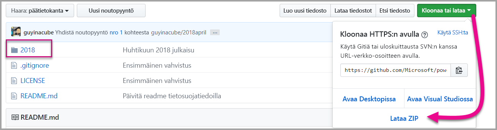
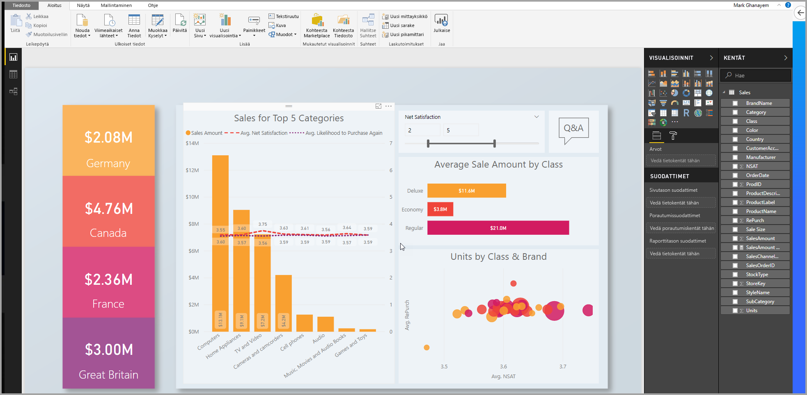
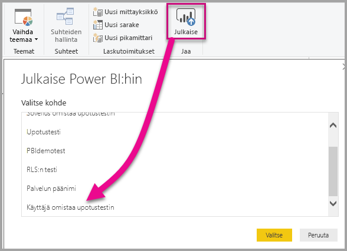
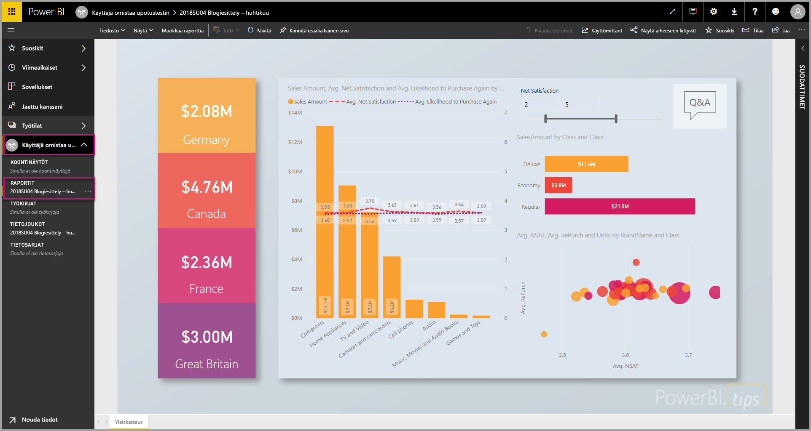
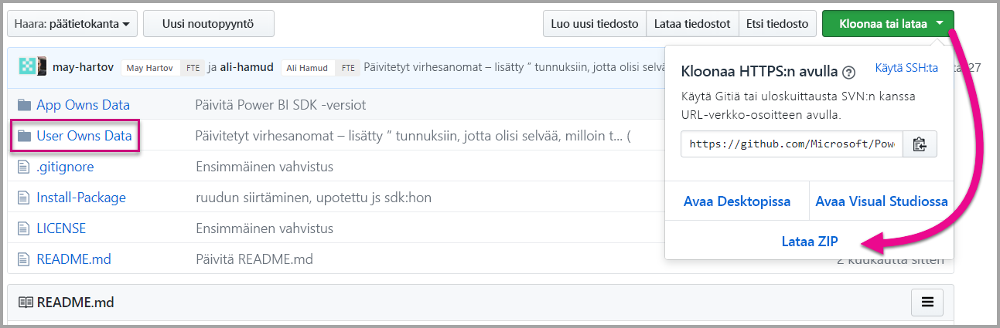
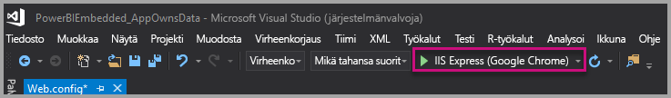
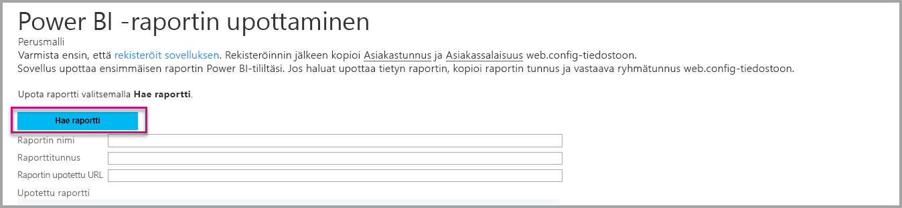
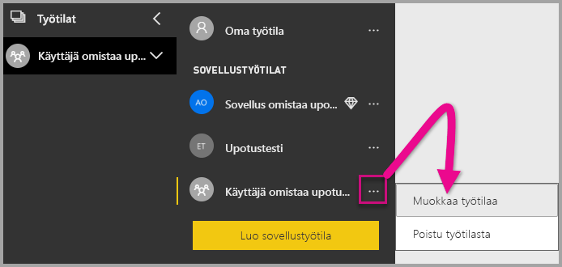
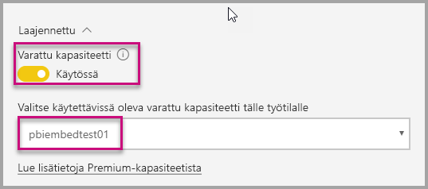
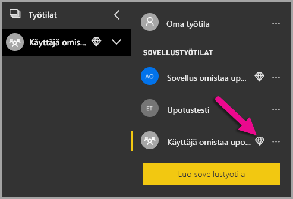

# <a name="tutorial-embed-power-bi-content-into-an-application-for-your-organization"></a>Opetusohjelma: Power BI -sisällön upottaminen sovellukseen organisaatiolle

Power BI:ssä voit upottaa sovellukseen raportteja, koontinäyttöjä tai ruutuja käyttämällä **user owns data** -malleja. **User owns data** -mallien avulla sovelluksesi voi laajentaa Power BI -palvelua niin, että se voi käyttää upotettua analysointia. Tässä opetusohjelmassa näytetään, miten voit integroida raportin sovellukseen. Voit käyttää Power BI .NET SDK:ta sekä Power BI JavaScript -ohjelmointirajapintaa Power BI:n upottamiseksi sovellukseen organisaatiollesi.


Tässä opetusohjelmassa opit tekemään seuraavat asiat:
> [!div class="checklist"]
> * Rekisteröimään sovelluksen Azuressa.
> * Upottamaan Power BI -raportin sovellukseen, joka käyttää Power BI -vuokralaistasi.

## <a name="prerequisites"></a>Edellytykset

Tarvitset seuraavat:

* [Power BI Pro -tili](../service-self-service-signup-for-power-bi.md).
* Tarvitset [Microsoft Azure](https://azure.microsoft.com/) -tilauksen.
* Sinulla on oltava oma [Azure Active Directory -vuokraaja ](create-an-azure-active-directory-tenant.md) käyttövalmiina.

Jos et ole rekisteröitynyt **Power BI:hin**, [rekisteröi ilmainen kokeiluversio](https://powerbi.microsoft.com/pricing/) ennen aloittamista.

Jos sinulla ei ole Azure-tilausta, luo [ilmainen tili](https://azure.microsoft.com/free/?WT.mc_id=A261C142F) ennen aloittamista.

## <a name="set-up-your-embedded-analytics-development-environment"></a>Upotettujen analyysitoimintojen kehitysympäristön määrittäminen

Ennen kuin ryhdyt upottamaan raportteja, raporttinäkymiä tai ruutuja sovellukseesi, varmista, että ympäristösi sallii upottamisen Power BI:n avulla.

Voit käyttää [upottamisen määritystyökalua](https://aka.ms/embedsetup/UserOwnsData). Sillä pääset nopeasti alkuun ja sillä voit ladata mallisovelluksen, jossa käydään läpi sekä käyttöympäristön luominen että raportin upottaminen.

Jos haluat määrittää ympäristön manuaalisesti, jatka lukemista.

### <a name="register-an-application-in-azure-active-directory"></a>Sovelluksen rekisteröiminen Azure Active Directoryyn

[Rekisteröi sovellus](register-app.md) Azure Active Directoryyn, jotta sovellus saa käyttöoikeuden [Power BI REST -ohjelmointirajapintoihin](https://docs.microsoft.com/rest/api/power-bi/). Kun rekisteröit sovelluksesi, voit määrittää sovelluksen käyttäjätiedot ja käyttöoikeudet Power BI REST -resursseihin.

Sinun on suoritettava loppuun **palvelinpuolen verkkosovelluksen** rekisteröinti. Rekisteröimällä palvelinpuolen verkkosovelluksen luot sovellussalaisuuden.

## <a name="set-up-your-power-bi-environment"></a>Power BI -ympäristön määrittäminen

### <a name="create-an-app-workspace"></a>Sovelluksen työtilan luominen

Jos upotat asiakkaille raportteja, raporttinäkymiä tai ruutuja, sisältö tulee sijoittaa sovelluksen työtilaan. Voit ottaa käyttöön erityyppisiä työtiloja: [perinteisiä työtiloja](../service-create-workspaces.md) tai [uusia työtiloja](../service-create-the-new-workspaces.md).

### <a name="create-and-publish-your-reports"></a>Luo ja julkaise raportteja

Voit luoda raportteja ja tietojoukkoja käyttämällä Power BI Desktopia. Voit sitten julkaista raportit sovellustyötilassa. Raportit julkaiseva loppukäyttäjä tarvitsee Power BI Pro ‑käyttöoikeudet sovellustyötilassa julkaisemiseen.

1. Lataa malli [Esittely](https://github.com/Microsoft/powerbi-desktop-samples) GitHubista.

    

2. Avaa .pbix-raporttimalli Power BI Desktopissa.

   

3. Julkaise sovelluksen työtilassa.

   

    Voit nyt tarkastella raporttia verkossa Power BI -palvelussa.

   

## <a name="embed-your-content-by-using-the-sample-application"></a>Upota sisältöä mallisovelluksen avulla

Tämä malli on tarkoituksellisesti yksinkertainen esittelyä varten.

Voit aloittaa sisällön upottamisen mallisovelluksen avulla alla annettujen ohjeiden mukaisesti.

1. Lataa [Visual Studio](https://www.visualstudio.com/) (2013 tai uudempi versio). Muista ladata uusin [NuGet-paketti](https://www.nuget.org/profiles/powerbi).

2. Lataa [User Owns Data -malli](https://github.com/Microsoft/PowerBI-Developer-Samples) GitHubista aloittaaksesi.

    

3. Avaa mallisovelluksessa **Cloud.config**-tiedosto.

    Sinun on täytettävä joitain kenttiä, jotta sovellus voidaan suorittaa.

    | Kenttä |
    |--------------------|
    | **[Sovelluksen tunnus](#application-id)** |
    | **[Sovelluksen salauskoodi](#application-secret)** |
    | **[Työtilan tunnus](#workspace-id)** |
    | **[Raporttitunnus](#report-id)** |
    | **[AADAuthorityUrl](#aadauthorityurl)** |

    

### <a name="application-id"></a>Sovelluksen tunnus

Täytä **applicationId**-tiedot **Sovellustunnuksilla** **Azuresta**. **applicationID**:n avulla sovellus tunnistautuu käyttäjille, joilta pyydät käyttöoikeuksia.

Saat **ApplicationID**:n seuraavasti:

1. Kirjaudu sisään [Azure-portaaliin](https://portal.azure.com).

2. Valitse vasemmassa siirtymisruudussa **Kaikki palvelut** ja sitten **Sovelluksen rekisteröinnit**.

    

3. Valitse sovellus, joka tarvitsee **applicationId**-arvon.

    

4. Näet **sovellustunnuksen**, joka on merkitty GUID-tunnuksena. Käytä tätä **Sovellustunnusta** sovelluksen **applicationId**:nä.

    

### <a name="application-secret"></a>Sovellussalaisuus

Täytä **ApplicationSecret** -tiedot **Avaimet**-osiosta **Sovelluksen rekisteröinnit** -kohdasta **Azuressa**.  Tämä määrite toimii, kun käytät [palvelun päänimeä](embed-service-principal.md).

Saat **ApplicationSecretin** seuraavasti:

1. Kirjaudu sisään [Azure-portaaliin](https://portal.azure.com).

2. Valitse vasemmassa siirtymisruudussa **Kaikki palvelut** ja sitten **Sovelluksen rekisteröinnit**.

    

3. Valitse sovellus, joka käyttää **ApplicationSecretiä**.

    

4. Valitse **Asetukset**.

    

5. Valitse **Avaimet**.

    

6. Kirjoita nimi **Kuvaus**-ruutuun ja valitse kesto. Valitse sitten **Tallenna** saadaksesi sovellukselle **arvon**. Kun suljet **Avaimet**-ruudun avainarvon tallentamisen jälkeen, arvokenttä näkyy vain piilotettuna. Tässä vaiheessa et pysty noutamaan avaimen arvoa. Jos kadotat avainarvon, luo uusi Azure-portaalissa.

    

### <a name="workspace-id"></a>Työtilan tunnus

Anna **workspaceId**-kohtaan Power BI:n sovelluksen työtilan GUID. Voit hakea nämä tiedot joko URL-osoitteesta, kun olet kirjautunut Power BI -palveluun, tai PowerShellin avulla.

URL-OSOITE <br>


Powershell <br>

```powershell
Get-PowerBIworkspace -name "User Owns Embed Test"
```

   

### <a name="report-id"></a>Raporttitunnus

Anna **reportId**-kohtaan Power BI:n raportin GUID. Voit hakea nämä tiedot joko URL-osoitteesta, kun olet kirjautunut Power BI -palveluun, tai PowerShellin avulla.

URL-OSOITE <br>


Powershell <br>

```powershell
Get-PowerBIworkspace -name "User Owns Embed Test" | Get-PowerBIReport
```


### <a name="aadauthorityurl"></a>AADAuthorityUrl

Täytä kohdan **AADAuthorityUrl** tietoihin se URL-osoite, joka joko sallii upotuksen joko organisaation vuokraajaan tai vieraskäyttäjään.

Käytä organisaation vuokraajaan upottamiseen URL-osoitetta *https://login.microsoftonline.com/common/oauth2/authorize*.

Käytä vieraaseen upottamiseen URL-osoitetta *https://login.microsoftonline.com/report-owner-tenant-id*, jolloin korvaat kohdan *report-owner-tenant-id* raportin omistajan vuokraajatunnuksella.

### <a name="run-the-application"></a>Suorita sovellus

1. Valitse **Suorita** **Visual Studiossa**.

    

2. Valitse sitten **Upota raportti**. Riippuen siitä mitä sisältöä valitset testattavaksi - raportteja, raporttinäkymiä vai ruutuja - valitse kyseinen vaihtoehto sovelluksessa .

    

3. Voit nyt tarkastella raporttia mallisovelluksessa.

    

## <a name="embed-your-content-within-your-application"></a>Upota sisältö sovellukseen

Vaikka sisältöä voidaan upottaa [Power BI REST -ohjelmointirajapintojen](https://docs.microsoft.com/rest/api/power-bi/) avulla, tässä artikkelissa kuvatut esimerkkikoodit on luotu .NET SDK:n avulla.

Voit integroida raportin verkkosovellukseen käyttämällä Power BI REST -ohjelmointirajapintaa tai Power BI C# SDK:ta. Voit käyttää myös Azure Active Directory -käyttöoikeustietuetta raportin saamiseen. Voit sitten ladata raportin käyttämällä samaa käyttöoikeustietuetta. Power BI -ohjelmointirajapinta tarjoaa ohjelmallisen käyttöoikeuden tiettyihin Power BI -resursseihin. Katso lisätietoja artikkeleista [Power BI REST -ohjelmointirajapinta](https://docs.microsoft.com/rest/api/power-bi/) ja [Power BI JavaScript -ohjelmointirajapinta](https://github.com/Microsoft/PowerBI-JavaScript).

### <a name="get-an-access-token-from-azure-ad"></a>Hanki käyttöoikeustietue Azure AD:stä

Sinun on hankittava sovelluksessa käyttöoikeustietue Azure AD:stä, ennen kuin voit lähettää kutsuja Power BI REST -ohjelmointirajapintaan. Saat lisätietoja artikkelista [Käyttäjien todentaminen ja Azure AD -käyttöoikeustietueen hankkiminen Power BI -sovellukselle](get-azuread-access-token.md).

### <a name="get-a-report"></a>Hanki raportti

Voit hankkia Power BI -raportin käyttämällä [Hanki raportit](https://docs.microsoft.com/rest/api/power-bi/reports/getreports) -toimintoa, joka antaa Power BI -raporttien luettelon. Saat raporttien luettelosta raporttitunnuksen.

### <a name="get-reports-by-using-an-access-token"></a>Hanki raportit käyttöoikeustietueen avulla

[Hanki raportit](https://docs.microsoft.com/rest/api/power-bi/reports/getreports) -toiminto palauttaa raporttiluettelon. Voit noutaa yksittäisen raportin raporttiluettelosta.

Jotta voit lähettää REST-ohjelmointirajapinnan kutsun, sinun on sisällytettävä *Valtuutus*-otsikko *Haltija {käyttöoikeustietue}* -muodossa.

#### <a name="get-reports-with-the-rest-api"></a>Raporttien hankinta REST-ohjelmointirajapinnan avulla

Seuraava koodiesimerkki näyttää, miten voit noutaa raportteja REST-ohjelmointirajapinnan avulla:

> [!Note]
> Esimerkki siitä, miten saat haluamasi sisältöyksikön, on nähtävissä Default.aspx.cs-tiedostossa [mallisovelluksessa](https://github.com/Microsoft/PowerBI-Developer-Samples). Esimerkkejä ovat raportti, koontinäyttö tai ruutu.

```csharp
using Newtonsoft.Json;

//Get a Report. In this sample, you get the first Report.
protected void GetReport(int index)
{
    //Configure Reports request
    System.Net.WebRequest request = System.Net.WebRequest.Create(
        String.Format("{0}/Reports",
        baseUri)) as System.Net.HttpWebRequest;

    request.Method = "GET";
    request.ContentLength = 0;
    request.Headers.Add("Authorization", String.Format("Bearer {0}", accessToken.Value));

    //Get Reports response from request.GetResponse()
    using (var response = request.GetResponse() as System.Net.HttpWebResponse)
    {
        //Get reader from response stream
        using (var reader = new System.IO.StreamReader(response.GetResponseStream()))
        {
            //Deserialize JSON string
            PBIReports Reports = JsonConvert.DeserializeObject<PBIReports>(reader.ReadToEnd());

            //Sample assumes at least one Report.
            //You could write an app that lists all Reports
            if (Reports.value.Length > 0)
            {
                var report = Reports.value[index];

                txtEmbedUrl.Text = report.embedUrl;
                txtReportId.Text = report.id;
                txtReportName.Text = report.name;
            }
        }
    }
}

//Power BI Reports used to deserialize the Get Reports response.
public class PBIReports
{
    public PBIReport[] value { get; set; }
}
public class PBIReport
{
    public string id { get; set; }
    public string name { get; set; }
    public string webUrl { get; set; }
    public string embedUrl { get; set; }
}
```

#### <a name="get-reports-by-using-the-net-sdk"></a>Raporttien hankinta .NET SDK:n avulla

.NET SDK:n avulla voit noutaa raporttiluettelon sen sijaan, että lähetät kutsun suoraan REST-ohjelmointirajapintaan. Seuraava koodiesimerkki näyttää, miten voit luetteloida raportteja:

```csharp
using Microsoft.IdentityModel.Clients.ActiveDirectory;
using Microsoft.PowerBI.Api.V2;
using Microsoft.PowerBI.Api.V2.Models;

var tokenCredentials = new TokenCredentials(<ACCESS TOKEN>, "Bearer");

// Create a Power BI Client object. It is used to call Power BI APIs.
using (var client = new PowerBIClient(new Uri(ApiUrl), tokenCredentials))
{
    // Get the first report all reports in that workspace
    ODataResponseListReport reports = client.Reports.GetReports();

    Report report = reports.Value.FirstOrDefault();

    var embedUrl = report.EmbedUrl;
}
```

### <a name="load-a-report-by-using-javascript"></a>Lataa raportti JavaScriptin avulla

Voit JavaScriptin avulla ladata raportin verkkosivun jako-elementtiin. Seuraava koodiesimerkki näyttää, miten voit noutaa raportin tietystä työtilasta:

> [!NOTE]  
> Esimerkki siitä, miten voit ladata upotettavan sisältöyksikön, on nähtävissä **Default.aspx.cs** -tiedostossa [mallisovelluksessa](https://github.com/Microsoft/PowerBI-Developer-Samples).

```javascript
<!-- Embed Report-->
<div> 
    <asp:Panel ID="PanelEmbed" runat="server" Visible="true">
        <div>
            <div><b class="step">Step 3</b>: Embed a report</div>

            <div>Enter an embed url for a report from Step 2 (starts with https://):</div>
            <input type="text" id="tb_EmbedURL" style="width: 1024px;" />
            <br />
            <input type="button" id="bEmbedReportAction" value="Embed Report" />
        </div>

        <div id="reportContainer"></div>
    </asp:Panel>
</div>
```

#### <a name="sitemaster"></a>Site.master

```javascript
window.onload = function () {
    // client side click to embed a selected report.
    var el = document.getElementById("bEmbedReportAction");
    if (el.addEventListener) {
        el.addEventListener("click", updateEmbedReport, false);
    } else {
        el.attachEvent('onclick', updateEmbedReport);
    }

    // handle server side post backs, optimize for reload scenarios
    // show embedded report if all fields were filled in.
    var accessTokenElement = document.getElementById('MainContent_accessTokenTextbox');
    if (accessTokenElement !== null) {
        var accessToken = accessTokenElement.value;
        if (accessToken !== "")
            updateEmbedReport();
    }
};

// update embed report
function updateEmbedReport() {

    // check if the embed url was selected
    var embedUrl = document.getElementById('tb_EmbedURL').value;
    if (embedUrl === "")
        return;

    // get the access token.
    accessToken = document.getElementById('MainContent_accessTokenTextbox').value;

    // Embed configuration used to describe the what and how to embed.
    // This object is used when calling powerbi.embed.
    // You can find more information at https://github.com/Microsoft/PowerBI-JavaScript/wiki/Embed-Configuration-Details.
    var config = {
        type: 'report',
        accessToken: accessToken,
        embedUrl: embedUrl
    };

    // Grab the reference to the div HTML element that will host the report.
    var reportContainer = document.getElementById('reportContainer');

    // Embed the report and display it within the div container.
    var report = powerbi.embed(reportContainer, config);

    // report.on will add an event handler which prints to Log window.
    report.on("error", function (event) {
        var logView = document.getElementById('logView');
        logView.innerHTML = logView.innerHTML + "Error<br/>";
        logView.innerHTML = logView.innerHTML + JSON.stringify(event.detail, null, "  ") + "<br/>";
        logView.innerHTML = logView.innerHTML + "---------<br/>";
    }
  );
}
```

## <a name="using-a-power-bi-premium-dedicated-capacity"></a>Power BI Premiumille varatun kapasiteetin käyttö

Kun olet nyt kehittänyt sovelluksesi, on aika varata sovelluksen työtilalle kapasiteettia.

### <a name="create-a-dedicated-capacity"></a>Luo varattua kapasiteettia

Luomalla varattua kapasiteettia voit hyödyntää sitä, että sovellustyötilan sisällölle varataan tietty resurssi. Voit luoda varattua kapasiteettia käyttämällä [Power BI Premiumia](../service-premium.md).

Seuraavassa taulukossa esitetään Power BI Premiumin SKU:t, jotka ovat käytettävissä [Microsoft Office 365:ssä](../service-admin-premium-purchase.md):

| Kapasiteetin solmu | Näennäisytimiä yhteensä<br/>(tausta ja edusta) | Taustan näennäisytimet | Edustan näennäisytimet | DirectQueryn/live-yhteyden rajoitukset |
| --- | --- | --- | --- | --- | --- |
| EM1 |1 näennäisydin |0,5 näennäisydintä, 10 Gt RAM |0,5 näennäisydintä |3,75 sekunnissa |
| EM2 |2 näennäisydintä |1 näennäisydin, 10 Gt RAM |1 näennäisydin |7,5 sekunnissa |
| EM3 |4 näennäisydintä |2 näennäisydintä, 10 Gt RAM |2 näennäisydintä |15 sekunnissa |
| P1 |8 näennäisydintä |4 näennäisydintä, 25 Gt RAM |4 näennäisydintä |30 sekunnissa |
| P2 |16 näennäisydintä |8 näennäisydintä, 50 Gt RAM |8 näennäisydintä |60 sekunnissa |
| P3 |32 näennäisydintä |16 näennäisydintä, 100 Gt RAM |16 näennäisydintä |120 sekunnissa |
| P4 |64 näennäisydintä |32 näennäisydintä, 200 Gt RAM |32 näennäisydintä |240 sekunnissa |
| P5 |128 näennäisydintä |64 näennäisydintä, 400 Gt RAM |64 näennäisydintä |480 sekunnissa |

> [!NOTE]
> - Kun yrität upottaa Microsoft Office -sovelluksilla, EM SKU:iden avulla voit käyttää maksuttoman Power BI -käyttöoikeuden sisältöä. Et kuitenkaan voi käyttää sisältöä maksuttomalla Power BI -käyttöoikeudella, kun käytössäsi on Powerbi.com tai Power BI -mobiilisovellus.
> - Kun yrität upottaa Microsoft Office -sovelluksilla, Powerbi.comin tai Power BI -mobiilisovellusten avulla voit käyttää maksuttoman Power BI -käyttöoikeuden sisältöä.

### <a name="assign-an-app-workspace-to-a-dedicated-capacity"></a>Määritä sovellustyötila varattuun kapasiteettiin

Kun olet luonut varatun kapasiteetin, voit määrittää sovellustyötilan kyseiselle varatulle kapasiteetille. Seuraa näitä ohjeita:

1. Laajenna Power BI -palvelussa työtiloja ja valitse ellipsikuvake työtilalle, jota käytät sisällön upottamiseen. Valitse **Muokkaa työtiloja**.

    

2. Laajenna **Lisäasetukset**-kohta ja ota käyttöön **Varattu kapasiteetti**. Valitse luomasi varattu kapasiteetti. Valitse **Tallenna**.

    

3. **Tallennuksen** jälkeen sovellustyötilan nimen vieressä pitäisi näkyä vinoneliö.

    

## <a name="admin-settings"></a>Järjestelmänvalvojan asetukset

Yleiset järjestelmänvalvojat eli Power BI -palvelun järjestelmänvalvojat voivat ottaa käyttöön REST-ohjelmointirajapintojen käytön vuokraajassa ja poistaa sen käytöstä. Power BI ‑järjestelmänvalvojat voivat määrittää asetuksen koskemaan koko organisaatiota tai yksittäisiä käyttöoikeusryhmiä. Oletusarvoisesti se on käytössä koko organisaatiolle. Voit tehdä nämä muutokset [Power BI -hallintaportaalissa](../service-admin-portal.md).

## <a name="next-steps"></a>Seuraavat vaiheet

Tässä opetusohjelmassa olet oppinut, miten voit upottaa Power BI-sisältöä sovellukseen Power BI -organisaatiotiliä käyttämällä. Voit nyt yrittää upottaa Power BI -sisältöä sovellukseen sovellusten avulla. Voit myös yrittää upottaa Power BI -sisältöä asiakkaillesi:

> [!div class="nextstepaction"]
> [Upottaminen sovelluksista](embed-from-apps.md)

> [!div class="nextstepaction"]
>[Upottaminen asiakkaillesi](embed-sample-for-customers.md)

Jos sinulla on lisää kysymyksiä, [voit esittää niitä Power BI -yhteisössä](http://community.powerbi.com/).
