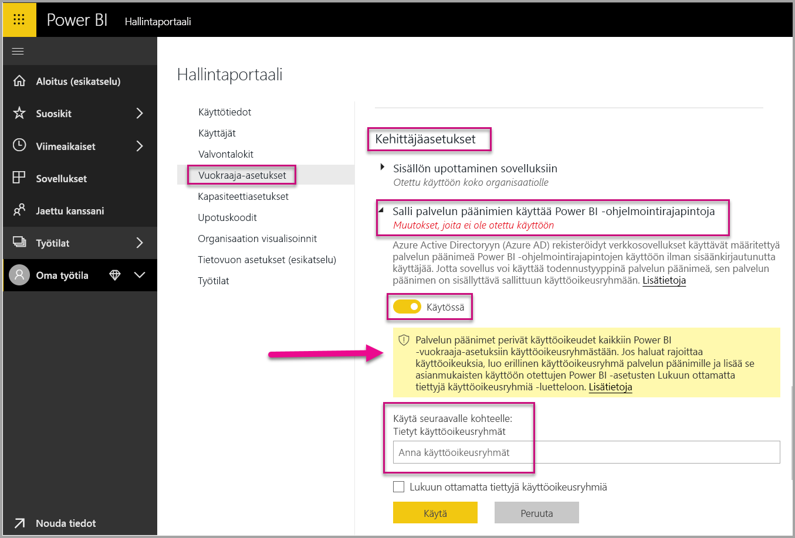
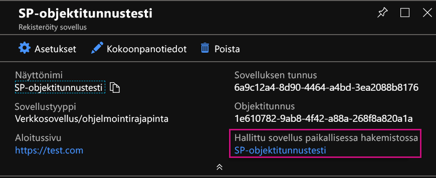
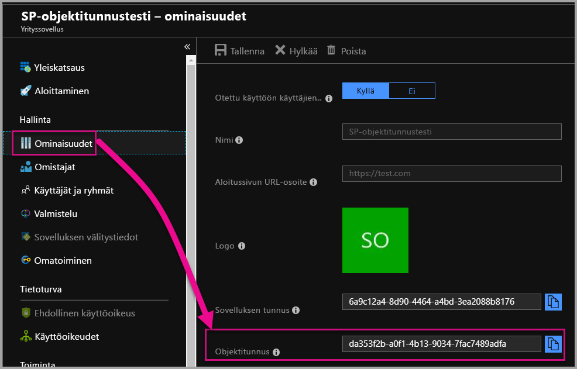

# <a name="service-principal-with-power-bi-preview"></a>Palvelun päänimi ja Power BI (esikatselu)

**Palvelun päänimellä** voit upottaa Power BI -sisältöä sovellukseen ja hyödyntää Power BI -automaatiota. Tämä on mahdollista **sovellustunnuksen** avulla. Palvelun päänimestä on hyötyä, kun käytät **Power BI Embeddediä** tai **automatisoit Power BI:n tehtäviä ja prosesseja**.

Kun käytät Power BI Embeddediä, palvelun päänimen käytöllä on monia etuja. Suurin hyöty on se, että et tarvitset sovellukseen todentautumiseen päätiliä (Power BI Pro -käyttöoikeus, joka on käytännössä käyttäjänimi ja salasana, joilla kirjaudutaan sisään). Palvelun päänimi todennetaan sovellukseen sovellustunnuksella ja sovellussalaisuudella.

Kun automatisoit Power BI -tehtäviä, voit luoda komentosarjoja, joilla voit käsitellä ja hallita palvelun päänimiä suuressa mittakaavassa.

## <a name="application-and-service-principal-relationship"></a>Sovelluksen ja palvelun päänimen suhde

Jos haluat käyttää resursseja, jotka suojaavat Azure AD -vuokraajan, taho, joka edellyttää käyttöoikeutta, on suojausobjekti. Tämä koskee sekä käyttäjiä (täydellinen käyttäjätunnus) että sovelluksia (palvelun päänimi).

Suojausobjekti määrittää käyttöoikeuskäytännön ja käyttöoikeudet käyttäjille sekä sovelluksille Azure AD -vuokraajassa. Tämä käyttöoikeuskäytäntö ottaa käyttöön ydintoiminnot, esimerkiksi käyttäjien ja sovellusten todennuksen kirjautumisen yhteydessä sekä valtuutuksen resurssien käytön yhteydessä. Saat lisätietoja ohjeartikkelista, jossa käsitellään [sovelluksia ja palvelun päänimiä Azure Active Directoryssa (AAD)](https://docs.microsoft.com/azure/active-directory/develop/app-objects-and-service-principals).

Kun rekisteröit Azure AD -sovelluksen Azure-portaalissa, Azure AD -vuokraajaasi luodaan kaksi objektia:

* [sovellusobjekti](https://docs.microsoft.com/azure/active-directory/develop/app-objects-and-service-principals#application-object)
* [palvelun päänimen objekti.](https://docs.microsoft.com/azure/active-directory/develop/app-objects-and-service-principals#service-principal-object)

Sovellusobjekti on *yleinen* objekti sovelluksestasi, jota käytetään kaikissa vuokraajissa, kun palvelun päänimen objekti taas on *paikallinen* objekti, jota käytetään tietyssä vuokraajassa.

Sovellusobjekti tarjotaan mallina, josta yleiset ominaisuudet ja oletusominaisuudet *johdetaan*, jotta niitä voidaan käyttää vastaavien palvelun päänimien objektien luomiseen.

Palvelun päänimi edellytetään vuokraajakohtaisesti, kun sovellusta käytetään. Tämän avulla se voi luoda sellaiset käyttäjätiedot kirjautumista ja resurssien käyttöä varten, jotka vuokraaja suojaa. Yhden vuokraajan sovelluksella on vain yksi palvelun päänimi (sen kotivuokraajassa), joka luodaan ja jolle annetaan käyttöoikeus sovelluksen rekisteröinnin yhteydessä.

## <a name="service-principal-with-power-bi-embedded"></a>Palvelun päänimi ja Power BI Embedded

Palvelun päänimellä voit piilottaa päätilitietosi sovelluksessasi, kun käytät sovellustunnusta ja sovellussalaisuutta. Sinun ei tarvitse koodata päätiliä sovellukseesi todennusta varten.

Koska **Power BI -ohjelmointirajapinnat** ja **Power BI .NET SDK** tukevat nyt kutsuja palvelun päänimellä, voit käyttää [Power BI REST -ohjelmointirajapintoja](https://docs.microsoft.com/rest/api/power-bi/) palvelun päänimen kanssa. Voit esimerkiksi tehdä muutoksia työtiloihin: luoda työtiloja, lisätä ja poistaa työtilojen käyttäjiä sekä tuoda sisältöä työtiloihin.

Voit käyttää palvelun päänimeä vain, jos Power BI -artefaktisi ja resurssisi tallennetaan [uuteen Power BI -työtilaan](../service-create-the-new-workspaces.md).

## <a name="service-principal-vs-master-account"></a>Palvelun päänimi ja päätili

Todentaminen palvelun päänimellä ja tavallisella päätilillä (Power BI Pro -käyttöoikeus) eroavat toisistaan. Alla olevaan taulukkoon on koottu joitain merkittävimpiä eroja.

| funktiota | Pääkäyttäjätili <br> (Power BI Pro -käyttöoikeus) | Palvelun päänimi <br> (sovellustunnus) |
|------------------------------------------------------|---------------------|-------------------|
| Voi kirjautua Power BI -palveluun  | Kyllä | Ei |
| Käytössä Power BI -hallintaportaalissa | Ei | Kyllä |
| [Toimii sovellustyötilojen (v1) kanssa](../service-create-workspaces.md) | Kyllä | Ei |
| [Toimii uusien sovellustyötilojen (v2) kanssa](../service-create-the-new-workspaces.md) | Kyllä | Kyllä |
| Edellyttää järjestelmänvalvojan oikeuksia työtilaan, jos käytetään Power BI Embeddedin kanssa | Kyllä | Kyllä |
| Voi käyttää Power BI REST -ohjelmointirajapintoja | Kyllä | Kyllä |
| Luomiseen edellytetään yleisen järjestelmänvalvojan oikeuksia | Kyllä | Ei |
| Voi asentaa paikallisen tietoyhdyskäytävän ja hallita sitä | Kyllä | Ei |

## <a name="get-started-with-a-service-principal"></a>Palvelun päänimen käytön aloittaminen

Palvelun päänimen (sovellustunnus) käyttö eroaa tavallisen päätilin käytöstä, joten se edellyttää tiettyjä määritystoimia. Jos haluat aloittaa palvelun päänimen (sovellustunnus) käytön, sinun täytyy määrittää ja ottaa käyttöön oikeanlainen ympäristö.

1. [Rekisteröi palvelinpuolen verkkosovellus](register-app.md) Azure Active Directoryssä Power BI:n kanssa käytettäväksi. Kun olet rekisteröinyt sovelluksen, saat sovellustunnuksen, sovellussalaisuuden ja palvelun päänimen objektitunnuksen, joiden avulla voit käyttää Power BI -sisältöäsi. Voit luoda palvelun päänimen [PowerShellillä](https://docs.microsoft.com/powershell/azure/create-azure-service-principal-azureps?view=azps-1.1.0).

    Alla on esimerkkikomentosarja, jolla luodaan uusi Azure Active Directory -sovellus.

    ```powershell
    # The app id - $app.appid
    # The service principal object id - $sp.objectId
    # The app key - $key.value

    # Sign in as a user that is allowed to create an app.
    Connect-AzureAD

    # Create a new AAD web application
    $app = New-AzureADApplication -DisplayName "testApp1" -Homepage "https://localhost:44322" -ReplyUrls "https://localhost:44322"

    # Creates a service principal
    $sp = New-AzureADServicePrincipal -AppId $app.AppId

    # Get the service principal key.
    $key = New-AzureADServicePrincipalPasswordCredential -ObjectId $sp.ObjectId
    ```

   > [!Important]
   > Kun otat palvelun päänimen käyttöön käytettäväksi Power BI:n kanssa, sovelluksen AD-käyttöoikeudet eivät ole enää voimassa. Sovelluksen käyttöoikeuksia hallitaan tässä tapauksessa Power BI -hallintaportaalissa.

2. Luo [käyttöoikeusryhmä Azure Active Directoryssa (AAD)](https://docs.microsoft.com/azure/active-directory/fundamentals/active-directory-groups-create-azure-portal) ja lisää luomasi sovellus tähän käyttöoikeusryhmään. Voit luoda AAD-käyttöoikeusryhmän [PowerShellillä](https://docs.microsoft.com/powershell/azure/create-azure-service-principal-azureps?view=azps-1.1.0).

    Alla on esimerkkikomentosarja, jolla luodaan uusi käyttöoikeusryhmä ja lisätään sovellus tähän käyttöoikeusryhmään.

    ```powershell
    # Required to sign in as a tenant admin
    Connect-AzureAD

    # Create an AAD security group
    $group = New-AzureADGroup -DisplayName <Group display name> -SecurityEnabled $true -MailEnabled $false -MailNickName notSet

    # Add the service principal to the group
    Add-AzureADGroupMember -ObjectId $($group.ObjectId) -RefObjectId $($sp.ObjectId)
    ```

3. Power BI -järjestelmänvalvojana sinun täytyy ottaa palvelun päänimi käyttöön Power BI -hallintaportaalin **kehittäjäasetuksissa**. Lisää Azure AD:ssä luomasi käyttöoikeusryhmä **kehittäjäasetusten** **tietyn käyttöoikeusryhmän** osiossa.

   > [!Important]
   > Palvelun päänimet perivät käyttöoikeudet kaikkiin Power BI -vuokraaja-asetuksiin käyttöoikeusryhmästään. Jos haluat rajoittaa käyttöoikeuksia, luo erillinen käyttöoikeusryhmä palvelun päänimille ja lisää se asianmukaisten käyttöön otettujen Power BI -asetusten Lukuun ottamatta tiettyjä käyttöoikeusryhmiä -luetteloon.

    

4. Määritä [Power BI -ympäristösi](embed-sample-for-customers.md#set-up-your-power-bi-environment).

5. Lisää palvelun päänimi **järjestelmänvalvojaksi** uuteen luomaasi työtilaan. Voit hallita tätä [ohjelmointirajapinnoilla](https://docs.microsoft.com/rest/api/power-bi/groups/addgroupuser) tai Power BI -palvelussa.

6. Nyt voit upottaa sisältöä mallisovellukseen tai omaan sovellukseesi.

    * [Sisällön upottaminen mallisovelluksen avulla](embed-sample-for-customers.md#embed-content-using-the-sample-application)
    * [Sisällön upottaminen oman sovelluksen avulla](embed-sample-for-customers.md#embed-content-within-your-application)

7. Nyt olet valmis [siirtymään hyötykäyttöön](embed-sample-for-customers.md#move-to-production).

## <a name="migrate-to-service-principal"></a>Palvelun päänimeen siirtyminen

Voit siirtyä palvelun päänimeen, jos käytät tällä hetkellä päätiliä Power BI:ssä tai Power BI Embeddedissä.

Suorita kolme ensimmäistä vaihetta osiosta [Palvelun päänimen käytön aloittaminen](#get-started-with-a-service-principal). Kun olet tehnyt tämän, toimi alla annettujen ohjeiden mukaisesti.

Jos käytät jo [uusia työtiloja](../service-create-the-new-workspaces.md) Power BI:ssä, lisää palvelun päänimi **järjestelmänvalvojaksi** työtiloihin, jotka sisältävät Power BI -artefaktisi. Jos taas käytät [perinteisiä työtiloja](../service-create-workspaces.md), kopioi tai siirrä Power BI -artefaktit ja -resurssit uusiin työtiloihin ja lisää sitten palvelun päänimi **järjestelmänvalvojaksi** näihin työtiloihin.

Power BI -artefaktien ja -resurssien siirtämiseen työtilasta toiseen ei ole tarjolla käyttöliittymää, joten sinun täytyy tehdä tämä [ohjelmointirajapinnoilla](https://powerbi.microsoft.com/pt-br/blog/duplicate-workspaces-using-the-power-bi-rest-apis-a-step-by-step-tutorial/). Kun käytät ohjelmointirajapintoja palvelun päänimen kanssa, tarvitset palvelun päänimen objektitunnuksen.

### <a name="how-to-get-the-service-principal-object-id"></a>Palvelun päänimen objektitunnuksen hakeminen

Jos haluat määrittää palvelun päänimen uuteen työtilaan, voit tehdä sen [Power BI REST -ohjelmointirajapinnoilla](https://docs.microsoft.com/rest/api/power-bi/groups/addgroupuser). Jos haluat viitata palvelun päänimeen toiminnoissa tai tehdä muutoksia, käytä **palvelun päänimen objektitunnusta** (ottaa esimerkiksi palvelun päänimen käyttöön työtilan järjestelmänvalvojana).

Ohjeet palvelun päänimen objektitunnuksen hakemiseen Azure-portaalista annetaan alla.

1. Luo uusi sovellusrekisteröinti Azure-portaalissa.  

2. Valitse sitten **Hallittu sovellus paikallisessa hakemistossa** -kohdassa luomasi sovellus.

   

    > [!Note]
    > Yllä olevassa kuvassa oleva objektitunnus ei ole se tunnus, jota käytetään palvelun päänimen kanssa.

3. Näet objektitunnuksen valitsemalla **Ominaisuudet**.

    

Alla on esimerkkikomentosarja, jolla voit hakea palvelun päänimen objektitunnuksen PowerShellissä.

   ```powershell
   Get-AzureADServicePrincipal -Filter "DisplayName eq '<application name>'"
   ```

## <a name="considerations-and-limitations"></a>Huomioitavat asiat ja rajoitukset

* Palvelun päänimi toimi vain [uusien sovellustyötilojen](../service-create-the-new-workspaces.md) kanssa.
* **Omaa työtilaa** ei tueta, kun käytät palvelun päänimeä.
* Tarvitset varattua Premium-kapasiteettia, kun siirryt hyötykäyttöön.
* Et voi kirjautua Power BI -portaaliin palvelun päänimellä.
* Power BI -järjestelmänvalvojan oikeuksia edellytetään, kun otat palvelun päänimen käyttöön Power BI -hallintaportaalin kehittäjäasetuksissa.
* Et voi asentaa tai hallita paikallista tietoyhdyskäytävää palvelun päänimellä.
* [Organisaatiosi upotetut sovellukset](embed-sample-for-your-organization.md) eivät voi käyttää palvelun päänimeä.
* [Tietovoiden](../service-dataflows-overview.md) hallintaa ei tueta.

## <a name="next-steps"></a>Seuraavat vaiheet

* [Sovelluksen rekisteröiminen](register-app.md)
* [Power BI Embedded asiakkaillesi](embed-sample-for-customers.md)
* [Sovellusobjektit ja palvelun päänimen objektit Azure Active Directoryssa](https://docs.microsoft.com/azure/active-directory/develop/app-objects-and-service-principals)
