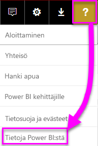
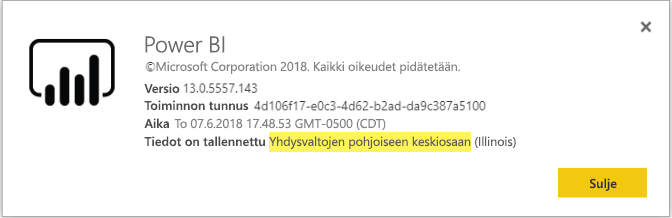

# <a name="frequently-asked-questions-about-power-bi-embedded"></a>Usein kysyttyjä kysymyksiä – Power BI Embedded

* Jos sinulla on muita kysymyksiä, [voit esittää niitä Power BI -yhteisössä](http://community.powerbi.com/).
* Eikö ongelma ratkennut? Vieraile [Power BI -tukisivulla](https://powerbi.microsoft.com/support/).

## <a name="general"></a>Yleinen

### <a name="what-is-power-bi-embedded"></a>Mikä Power BI Embedded on?

Microsoft Power BI Embeddedin (PBIE) avulla sovelluskehittäjät voivat upottaa näyttäviä, täysin interaktiivisia raportteja sovelluksiin ilman, että aikaa ja kustannuksia kuluu omien tietojen visualisointien ja ohjausobjektien luomiseen alusta alkaen.

### <a name="who-is-the-target-audience-for-power-bi-embedded"></a>Mikä on Power BI Embeddedin kohderyhmä?

Omia sovelluksiaan luovat sovelluskehittäjät ja ohjelmistoyritykset, joita kutsutaan riippumattomiksi ohjelmistotoimittajiksi (ISV).

### <a name="how-is-power-bi-embedded-different-from-power-bi-the-service"></a>Miten Power BI Embedded poikkeaa Power BI -palvelusta?

Power BI Embedded on tarkoitettu riippumattomille ohjelmistotoimittajille tai kehittäjille, jotka kehittävät sovelluksia ja haluavat upottaa niihin asiakkaidensa päätöksentekoa helpottavia visualisointeja ilman analytiikkaratkaisun luomista alusta alkaen. Upotetut analyysitoiminnot mahdollistavat yrityskäyttäjille pääsyn liiketoimintatietoihin ja kyselyt, joiden avulla niistä voidaan luoda sovelluksessa merkityksellisiä tietoja.

Power BI on puolestaan ohjelmisto palveluna -tyyppinen analytiikkaratkaisu, joka mahdollistaa organisaatioille kriittisimpien liiketoimintatietojen tarkastelun yhdessä näkymässä.

### <a name="what-is-the-difference-between-power-bi-premium-and-power-bi-embedded"></a>Mikä on Power BI Premiumin ja Power BI Embeddedin välinen ero?

Power BI Premium on optimoitu yrityksille, jotka haluavat täydellisen BI-ratkaisun, joka mahdollistaa organisaation, kumppanien, asiakkaiden ja toimittajien tietojen tarkastelun yhdessä näkymässä. Power BI Premium auttaa organisaatiotasi tekemään päätöksiä. Power BI Premium on SaaS-tuote, jonka käyttäjät voivat käyttää sisältöä Power BI-portaalin, mobiilisovelluksen ja sisäisesti kehitettyjen sovellusten välityksellä.

Power BI Embedded on tarkoitettu ISV-ohjelmistotoimittajille tai kehittäjille, jotka kehittävät sovelluksia ja haluavat upottaa niihin visualisointeja. Power BI Embedded auttaa asiakkaitasi tekemään päätöksiä, sillä se on suunnattu sovelluskehittäjille, joiden sovelluksia käyttävät asiakkaat voivat käyttää Power BI Embedded -kapasiteettiin tallennettua sisältöä organisaation sisällä tai ulkopuolella. Power BI Embedded -kapasiteetin sisältöä ei voida jakaa yhden napsautuksen julkaisulla verkkoon tai yhden napsautuksen julkaisulla SharePointiin, eikä se tue SSRS-raportteja.

### <a name="what-is-the-microsoft-recommendation-for-when-a-customer-should-buy-power-bi-premium-vs-power-bi-embedded"></a>Mikä on Microsoftin suositus sen suhteen, milloin asiakkaan kannattaa ostaa Power BI Premium ja milloin Power BI Embedded?

Microsoft suosittelee, että yritykset ostaisivat Power BI Premiumin, joka on yritystason omatoiminen BI-pilviratkaisu, ja ISV-ohjelmistotoimittajat Power BI Embeddedin, joka tarjoaa pilvipohjaisia upotettuja analyysitoimintoja. Ei kuitenkaan ole mitään rajoituksia sen suhteen, minkä tuotteen asiakas voi ostaa.

Joissain tapauksissa (tavallisesti suuri) ISV haluaa käyttää P-varastointiyksikköä saadakseen organisaatiolleen esimääritetyn Power BI -palvelun hyödyt sekä upotusmahdollisuuden sovelluksiin. Jotkin yritykset voivat tietysti myös päättää käyttää A-varastointiyksiköitä Azuressa, jos niitä kiinnostaa vain yrityssovellusten kehittäminen ja analyysitoimintojen upottaminen näihin sovelluksiin esimääritetyn Power BI -palvelun käytön sijaan.

### <a name="how-many-embed-tokens-can-i-create"></a>Kuinka monta upotettavaa tunnusta voit luoda?

PRO-käyttöoikeudella upotettavat tunnukset on tarkoitettu kehitystestaukseen, joten Power BI -päätili voi luoda vain rajallisen määrän upotettavia tunnuksia. Tuotantoympäristössä upottamista varten täytyy [ostaa kapasiteettia](#technical). Kun olet ostanut kapasiteettia, voit luoda upotettavia tunnuksia rajattomasti. Siirry [Käytettävissä olevat ominaisuudet](https://docs.microsoft.com/rest/api/power-bi/availablefeatures) -kohtaan tarkistaaksesi käyttöarvon, joka ilmaisee nykyisen upotetun käytön prosenttilukuna.

## <a name="technical"></a>Tekniset

### <a name="what-is-the-difference-between-the-a-skus-in-azure-and-the-em-skus-in-office-365"></a>Mikä on Azuren A-varastointiyksiköiden ja Office 365:n EM-varastointiyksiköiden välinen ero?

PowerBI.com on yritysratkaisu, joka sisältää useita sosiaalisen yhteistyön ja sähköpostitilauksen kaltaisia toimintoja palveluna ohjelmistossa

Power BI Embedded on ohjelmointirajapintojen joukko, joiden avulla kehittäjät voivat luoda upotetun analytiikkaratkaisun palveluksi tietyssä ympäristössä. Upotettujen analyysitoimintojen yhteydessä PowerBI.comia tulee käyttää ISV-toimittajien ja kehittäjien auttamiseen upotetun analytiikkaratkaisun sisällön ja vuokraajatason asetusten hallinnassa.

Alla on osittainen luettelo eroista näiden ratkaisujen yhteydessä käytettävien ominaisuuksien välillä.

| Ominaisuus | Power BI Embedded | Power BI Premium -kapasiteetti | Power BI Premium -kapasiteetti |
|----------------------------------------------------------------------------------|-------------------|---------------------------|---------------------------|
|   | (A-varastointiyksiköt) | (EM-varastointiyksiköt) | (P-varastointiyksiköt) |
| Upotusartefaktit Power BI -sovelluksen työtilasta | Azure-kapasiteetti | Office 365 -kapasiteetti | Office 365 -kapasiteetti |
| Power BI -raporttien käyttäminen Embedded-sovelluksessa | Kyllä | Kyllä | Kyllä |
| Power BI -raporttien käyttäminen SharePointissa | Ei | Kyllä | Kyllä |
| Power BI -raporttien käyttäminen Dynamicsissa | Ei | Kyllä | Kyllä |
| Power BI -raporttien käyttäminen Teamsissa (ei sisällä mobiilisovellusta) | Ei | Kyllä | Kyllä |
| Sisällön käyttäminen ilmaisella Power BI -käyttöoikeudella Powerbi.comissa ja Power BI -mobiilisovelluksessa | Ei | Ei | Kyllä |
| Sisällön käyttäminen ilmaisella Power BI -käyttöoikeudella upotettuna MS Office -sovelluksiin | Ei | Kyllä | Kyllä |

### <a name="power-bi-now-offers-three-skus-for-embedding-a-skus-em-skus-and-p-skus-which-one-should-i-purchase-for-my-scenario"></a>Power BI tarjoaa nyt upottamiseen kolme varastointiyksikköä: A-, EM- ja P-varastointiyksiköt. Mikä niistä minun tulisi ostaa omaa skenaariotani varten?

|  |A-varastointiyksikkö (Power BI Embedded)  |EM-varastointiyksikkö (Power BI Premium)  |P-varastointiyksikkö (Power BI Premium)  |
|---------|---------|---------|---------|
|Ostaminen  |Azure-portaali |Office |Office |
|Käyttötapaukset | Sisällön upottaminen omaan sovellukseen | <li> Sisällön upottaminen omaan sovellukseen <br><br></br> <li> Sisällön upottaminen MS Office -sovelluksiin: <br> - [SharePoint](https://powerbi.microsoft.com/blog/integrate-power-bi-reports-in-sharepoint-online/) <br> - [Teams (ei sisällä mobiilisovellusta)](https://powerbi.microsoft.com/blog/power-bi-teams-up-with-microsoft-teams/) <br> - [Dynamics 365](https://docs.microsoft.com/dynamics365/customer-engagement/basics/add-edit-power-bi-visualizations-dashboard) | <li> Sisällön upottaminen omaan sovellukseen <br><br></br> <li> Sisällön upottaminen MS Office -sovelluksiin: <br> - [SharePoint](https://powerbi.microsoft.com/blog/integrate-power-bi-reports-in-sharepoint-online/) <br> - [Teams (ei sisällä mobiilisovellusta)](https://powerbi.microsoft.com/blog/power-bi-teams-up-with-microsoft-teams/) <br> - [Dynamics 365](https://docs.microsoft.com/dynamics365/customer-engagement/basics/add-edit-power-bi-visualizations-dashboard) <br><br></br> <li> Sisällön jakaminen Power BI -käyttäjien kanssa [Power BI -palvelun](https://powerbi.microsoft.com/en-us/) kautta  |
|Laskutus |Tunneittain |Kuukausittain |Kuukausittain |
|Sitoutuminen  |Ei sitoutumista |Vuosittain  |Kuukausittain/vuosittain |
|Erot |Täysi joustavuus – skaalaus ylös/alas, resurssien keskeytys/jatkaminen Azure-portaalissa tai ohjelmointirajapinnan kautta  |Voidaan käyttää sisällön upottamiseen SharePoint Onlinessa ja Microsoft Teamsissa (ei sisällä mobiilisovellusta) |Yhdistää sovelluksiin upottamisen ja Power BI -palvelun käytön samassa kapasiteetissa |

### <a name="what-are-the-prerequisites-to-create-a-pbie-capacity-in-azure"></a>Mitkä ovat ennakkoedellytykset PBIE-kapasiteetin luomiseksi Azuressa?

* Sinun on kirjauduttava organisaation hakemistoon (MSA-tilejä ei tueta).
* Sinulla on oltava Power BI -vuokraaja, eli vähintään yhden käyttäjän hakemistossasi on täytynyt rekisteröityä Power BI:n käyttäjäksi. 
* Sinulla täytyy olla Azure-tilaus organisaatiosi hakemistossa.

### <a name="how-can-i-monitor-power-bi-embedded-capacity-consumption"></a>Miten voin valvoa Power BI Embedded -kapasiteetin käyttöä?

* Käyttämällä [Power BI -hallintaportaalia](../service-admin-portal.md#power-bi-embedded-settings).

* Lataamalla [mittausarvosovelluksen](https://review.docs.microsoft.com/power-bi/service-admin-premium-monitor-capacity) Power BI:ssä.

* Käyttämällä [Azuren diagnostiikan kirjausta](azure-pbie-diag-logs.md).

### <a name="will-my-capacity-scale-automatically-to-adjust-to-the-consumption-of-my-app"></a>Skaalautuuko kapasiteettini automaattisesti sovellukseni kulutuksen mukaiseksi?

Automaattista skaalausta ei tällä hetkellä ole, mutta kaikki ohjelmointirajapinnat ovat skaalattavissa milloin tahansa.

### <a name="why-creatingscalingresuming-a-capacity-results-in-putting-the-capacity-into-a-suspended-state"></a>Miksi kapasiteetin luominen/skaalaaminen/jatkaminen aiheuttaa sen, että kapasiteetti siirtyy keskeytettyyn tilaan?

Kapasiteetin valmisteleminen (skaalaaminen/jatkaminen/luominen) voi epäonnistua. Valmistelukutsun kutsujan olisi tarkistettava kapasiteetin ProvisioningState Hae tiedot -ohjelmointirajapinnan avulla: [Kapasiteetit – Hae tiedot](https://docs.microsoft.com/rest/api/power-bi-embedded/capacities/getdetails).

### <a name="why-can-i-only-create-pbie-in-a-specific-region"></a>Miksi voin luoda PBIE:n vain tietyllä alueella?

Voit luoda PBIE-kapasiteetit vain PBI-vuokraajan alueelle.

### <a name="how-can-i-find-what-is-my-pbi-tenant-region"></a>Miten voin selvittää, mikä on oma PBI-vuokraajan alueeni?

PBI-portaalin avulla voit selvittää, mikä on PBI-vuokraajan alueesi.

https://app.powerbi.com/ > ? > Tietoja Power BI:stä




### <a name="what-is-supported-with-the-communicating-sequential-processes-csp-channel"></a>Mitä ominaisuuksia CSP-kanava tukee?

* Voit luoda PBIE:n vuokraajalle CSP-tilaustyypillä
* Kumppanitili voi kirjautua sisään asiakkaan vuokraajaan ja hankkia PBIE:n asiakkaan vuokraajalle. Tällöin asiakkaan vuokraajan käyttäjälle on määritettävä Power BI -kapasiteetin järjestelmänvalvojan oikeudet.

### <a name="why-do-i-get-an-unsupported-account-message"></a>Miksi saan tukematonta tiliä koskevan viestin?

Power BI edellyttää kirjautumista sisään organisaation tilillä. Sovellus ei tue kirjautumista sisään Power BI:hin MSA-tilin (Microsoft-tili) avulla.

### <a name="can-i-use-apis-to-create--manage-azure-capacities"></a>Voinko luoda ja hallita Azure-kapasiteetteja ohjelmointirajapintojen avulla?

Kyllä, voit luoda ja hallita PBIE-resursseja Powershellin cmdlet-komentojen ja Azure Resource Manager (ARM) -ohjelmointirajapintojen avulla.

* REST-ohjelmointirajapinnat - https://docs.microsoft.com/rest/api/power-bi-embedded/
* Powershellin cmdlet-komennot - https://docs.microsoft.com/powershell/module/azurerm.powerbiembedded/

### <a name="what-is-the-pbi-embedded-dedicated-capacity-role-in-a-pbi-embedded-solution"></a>Mikä on PBI Embeddedin varatun kapasiteetin rooli PBI Embedded -ratkaisussa?

Jotta voit [viedä ratkaisusi tuotantoon](https://docs.microsoft.com/power-bi/developer/embedding-content#step-3-promote-your-solution-to-production), tarvitset Power BI -sisältöä (sovellustyötila, jota käytät sovelluksessa ja joka määritetään Power BI Embedded -kapasiteetille eli A-varastointiyksikölle).

### <a name="what-are-the-azure-regions-pbi-embedded-is-available"></a>Millä Azure-alueilla PBI Embedded on saatavilla?

[PAM](https://ecosystemmanager.azurewebsites.net/home) (EcoManager) – kysy asiaa tuotteen saatavuudesta vastaavalta esimieheltä

Saatavilla olevat alueet (16 – samat alueet kuin Power BI)
* Yhdysvallat (6) – Itä-Yhdysvallat, Itä-Yhdysvallat 2, Yhdysvaltojen pohjoinen keskiosa, Yhdysvaltojen eteläinen keskiosa, Länsi-Yhdysvallat, Länsi-Yhdysvallat 2
* Eurooppa (2) – Pohjois-Eurooppa, Länsi-Eurooppa
* Tyynenmeren Aasia (2) – Kaakkois-Aasia, Itä-Aasia
* Brasilia (1) – Brasilia, etelä
* Japani (1) – Japani, itä
* Australia (1) – Kaakkois-Australia
* Intia (1) – Länsi-Intia
* Kanada (1) – Kanada, keskinen
* Yhdistynyt kuningaskunta (1) – Yhdistyneen kuningaskunta, eteläinen

### <a name="what-is-the-authentication-model-for-power-bi-embedded"></a>Mikä on Power BI Embeddedin todennusmalli?

Power BI Embedded käyttää edelleen Azure AD:tä pääkäyttäjän (nimetty käyttäjä, jolla on Power BI Pro -käyttöoikeus) todennukseen ja todentaa sovelluksen Power BI:n sisällä.

Sovelluksen käyttäjien todentamisen ja käyttöoikeuksien myöntämisen toteuttaa ISV, joka voi toteuttaa oman todennuksensa sovelluksilleen.

Jos sinulla on jo Azure AD -vuokraaja, voit käyttää olemassa olevaa hakemistoa tai voit luoda uuden Azure AD-vuokraajan upotetun sovelluksen sisällön suojaamista varten.

Voit käyttää Azure Active Directoryn todentamiskirjastoa saadaksesi AAD -tunnuksen - https://docs.microsoft.com/azure/active-directory/develop/active-directory-authentication-libraries. Asiakaskirjastot ovat saatavilla useille alustoille.

### <a name="my-application-already-uses-aad-for-user-authentication-how-can-we-use-this-identity-when-authenticating-to-power-bi-in-a-user-owns-data-scenario"></a>Oma sovellus käyttää jo AAD:tä käyttäjien todentamiseen. Miten voimme käyttää tätä identiteettiä, kun todennamme Power BI: hin ”Käyttäjä omistaa tiedot” -skenaariossa? 

Kyse on OAuth-vakiotodennuksesta toisen puolesta suoritettavassa työnkulussa (https://docs.microsoft.com/azure/active-directory/develop/active-directory-authentication-scenarios#web-application-to-web-api) sovellus on määritettävä siten, että se edellyttää käyttöoikeuksia PowerBI -palveluun (vaadittujen soveltamisalueiden kanssa). Kun olet antanut käyttäjätunnuksen sovellukseen, voit kutsua ADAL API AcquireTokenAsyncin käyttämällä käyttäjätunnusta ja määrittämällä Power BI -resurssin URL-osoitteen resurssin tunnukseksi. Katso alla olevaa koodikatkelmaa, joka näyttää, miten tämä tehdään:

```csharp
var context = new AD.AuthenticationContext(authorityUrl);
var userAssertion = new AD.UserAssertion(userAccessToken);
var clientAssertion = new AD.ClientAssertionCertificate(MyAppId, MyAppCertificate)
var authenticationResult = await context.AcquireTokenAsync(resourceId, clientAssertion, userAssertion);
```

### <a name="how-is-power-bi-embedded-different-from-other-azure-services"></a>Miten Power BI Embedded poikkeaa muista Azure-palveluista?

ISV:llä/kehittäjällä on oltava Power BI -tili, jotta Power BI Embedded on mahdollista ostaa Azuressa. Oma Power BI Embedded -käyttöönottoalueesi määräytyy Power BI -tilisi mukaan. Hallitse Power BI Embedded -resurssia Azuressa seuraavien toimintojen suorittamiseksi:

* Skaalaus ylös/alas
* Kapasiteetin järjestelmänvalvojien lisääminen
* Palvelun keskeytys/jatkaminen

PowerBI.comissa voit määrittää työtiloja Power BI Embedded -kapasiteettiin tai poistaa niiden määrityksen.

### <a name="what-deploy-regions-are-supported"></a>Mitä käyttöönottoalueita tuetaan?

Kaakkois-Australia; Brasilia, etelä; Kanada, keskinen; Itä-Yhdysvallat 2; Intia, länsiosa; Japani, itä; Yhdysvaltojen pohjoinen keskiosa; Pohjois-Eurooppa; Yhdysvaltojen eteläinen keskiosa; Kaakkois-Aasia; Yhdistynyt kuningaskunta, eteläinen; Länsi-Eurooppa; Länsi-Yhdysvallat ja Länsi-Yhdysvallat 2.

### <a name="what-type-of-content-pack-data-can-be-embedded"></a>Minkä tyyppisiä sisältöpaketin tietoja voidaan upottaa?

**Koontinäyttöjä** ja **ruutuja**, jotka on rakennettu sisältöpaketin tietojoukoista, *ei voida* upottaa, mutta sisältöpaketin tietojoukosta luotuja **raportteja** *voidaan* upottaa.

## <a name="licensing"></a>Käyttöoikeudet

### <a name="how-do-i-purchase-power-bi-embedded"></a>Miten voin ostaa Power BI Embeddedin?

Power BI Embedded on saatavissa Azuren kautta.

### <a name="what-happens-if-i-already-purchased-power-bi-premium-and-now-i-want-some-of-the-benefits-of-power-bi-embedded-in-azure"></a>Mitä tapahtuu, jos olen jo ostanut Power BI Premiumin ja haluan nyt hyödyntää joitain Power BI Embeddedin etuja Azuressa?

Asiakkaat jatkavat aiempien Power BI Premium -ostosten maksamista kuluvan sopimusjakson loppuun saakka ja voivat sitten vaihtaa Power BI Premium -ostoksiaan tarpeen mukaan.

### <a name="do-i-still-have-to-buy-power-bi-premium-to-get-access-to-power-bi-embedded"></a>Pitääkö minun yhä ostaa Power BI Premium, jotta voin käyttää Power BI Embeddediä?

Ei. Power BI Embedded sisältää Azure-pohjaisen kapasiteetin. Sinun täytyy ottaa se käyttöön ja jakaa ratkaisusi asiakkaille.

### <a name="whats-the-purchase-commitment-for-power-bi-embedded"></a>Mihin asiakkaan on sitouduttava, kun hän ostaa Power BI Embeddedin? 

Asiakkaat voivat muuttaa käyttötapaansa tuntipohjaisesti. Power BI Embedded -palvelu ei vaadi kuukausittaista tai vuosittaista sitoutumista.

### <a name="how-does-the-usage-of-power-bi-embedded-show-up-on-my-bill"></a>Miten Power BI Embeddedin käyttö näkyy laskussani?

Power BI Embeddedin laskutus perustuu ennustettavissa olevaan tuntihintaan, joka pohjautuu käyttöön otetun solmun (tai käyttöön otettujen solmujen) tyyppiin. Ota huomioon, että sinua laskutetaan niin kauan kuin resurssi on aktiivinen, vaikka et käyttäisi sitä. Jos haluat laskutuksen loppuvan, sinun täytyy aktiivisesti keskeyttää resurssi.

### <a name="who-needs-a-power-bi-pro-license-for-power-bi-embedded-and-why"></a>Kuka tarvitsee Power BI Pro -käyttöoikeuden Power BI Embeddediä varten ja miksi?

Power BI Pro -käyttöoikeus vaaditaan analyytikolta, jonka täytyy lisätä raportteja Power BI -työtilaan, kehittäjältä, joka tarvitsee REST-ohjelmointirajapintojen käyttöä, ja jokaiselta vuokraajan järjestelmänvalvojalta, jonka on hallittava Power BI -vuokraajaa ja kapasiteettia.

Power BI Embedded sallii Power BI -portaalin käytön upotetun sisällön hallintaan ja vahvistamiseen, joten Power BI Pro -käyttöoikeus vaaditaan sovelluksen todentamiseen PowerBI.comissa, jotta voit käyttää oikeissa säilöissä olevia raportteja.

Loppukäyttäjä ei kuitenkaan tarvitse Pro-käyttöoikeutta [upotettujen raporttien luomiseen tai muokkaamiseen](https://github.com/Microsoft/PowerBI-JavaScript/wiki/Create-Report-in-Embed-View) oman sovelluksensa sisällä, koska hänen ei tarvitse olla Power BI-käyttäjä.

### <a name="can-i-get-started-for-free"></a>Voinko aloittaa käytön maksutta?

Kyllä, voit käyttää [Azure-saldoasi](https://azure.microsoft.com/free/) Power BI Embeddediä varten.

### <a name="can-i-get-a-trial-experience-for-power-bi-embedded-in-azure"></a>Onko Power BI Embedded -kokeiluversiota mahdollista käyttää Azuressa?

Power BI Embedded on osa Azurea, joten palvelua on mahdollista käyttää [rekisteröitymisen yhteydessä saadulla 170 euron saldolla](https://azure.microsoft.com/free/).

### <a name="is-power-bi-embedded-available-for-sovereign-clouds-us-government-germany-china"></a>Onko Power BI Embedded saatavilla maakohtaisissa pilvipalveluissa (Yhdysvaltain julkishallinto, Saksa, Kiina)?

Power BI Embedded on saatavilla joissakin [maakohtaisissa pilvipalveluissa](embed-sample-for-customers-sovereign-clouds.md). Se **EI** ole vielä saatavilla Kiinan pilvipalvelussa.

### <a name="is-power-bi-embedded-available-for-non-profits-and-educational"></a>Onko Power BI Embedded käytettävissä järjestö- ja opetustarkoituksiin?

Voittoa tavoittelemattomat järjestöt ja oppilaitokset voivat ostaa Azuren. Näille asiakastyypeille ei ole erikoishinnoittelua Azuressa.

## <a name="power-bi-workspace-collection"></a>Power BI ‑työtilakokoelma

### <a name="what-is-power-bi-workspace-collection"></a>Mikä on Power BI ‑työtilakokoelma?

**Power BI -työtilakokoelman** (**Power BI Embedded** Versio 1) on ratkaisu, joka perustuu **Power BI -työtilakokoelman** Azure-resurssiin. Tämän ratkaisun avulla voit luoda asiakkaillesi **Power BI Embedded** -sovelluksia **Power BI -työtilakokoelma** -ratkaisun Power BI -sisältöä käyttämällä, erillisiä ohjelmointirajapintoja ja työtilakokoelma-avaimia antaaksesi sovellukselle käyttöoikeuden Power BI:hin.

### <a name="can-i-migrate-from-power-bi-workspace-collection-to-power-bi-embedded"></a>Voinko siirtyä Power BI -työtilakokoelmasta Power BI Embeddediin?

1. Voit käyttää siirtotyökalua kloonataksesi **Power BI -työtilakokoelma** -sisällön Power BI:hin - https://docs.microsoft.com/power-bi/developer/migrate-from-powerbi-embedded#content-migration.

2. Aloita **Power BI Embedded** -sovelluksen soveltuvuusselitys, joka käyttää Power BI -sisältöä.

3. Kun olet valmis tuotantoon, osta **Power BI Embeddedille** varattua kapasiteettia ja määritä Power BI sisältö (työtila) kyseiselle kapasiteetille.

> [!Note]
> Voit jatkaa **Power BI t-työtilakokoelman** käyttöä sillä aikaa kun rinnakkaista työtilaa luodaan **Power BI Embedded** -ratkaisulla. Kun olet valmis, voit siirtää asiakkaasi uuteen **Power BI Embeddediin** ja poistaa **Power BI Workspace Collection** käytöstä.

Katso lisätietoja artikkelista [Miten Power BI -työtilakokoelman sisältö siirretään Power Embeddediin](https://docs.microsoft.com/power-bi/developer/migrate-from-powerbi-embedded)

### <a name="is-power-bi-workspace-collection-on-a-path-to-be-deprecated"></a>Ollaanko Power BI -työtilakokoelmaa lakkauttamassa?

Kyllä, mutta asiakkaat, jotka käyttävät **Power BI -työtilakokoelmaa**, voivat jatkaa sen käyttöä kunnes se poistetaan käytöstä. Asiakkaat voivat luoda uusia työtilakokoelmia ja **Power BI Embedded** -sovelluksia, jotka käyttävät vielä **Power BI -työtilakokoelmaa**.

Tämä tarkoittaa kuitenkin sitä, ettei uusia ominaisuuksia lisätä **Power BI -työtilakokoelmaan** ja asiakkaita kehotetaan valmistautumaan siirtymään uuteen **Power BI Embeddediin**.
### <a name="when-will-power-bi-workspace-collection-support-be-discontinued"></a>Koska Power BI -työtilakokoelman tuki lakkautetaan?

Asiakkaat, jotka käyttävät **Power BI -työtilakokoelmaa** voivat jatkaa sen käyttöä 2018 kesäkuun loppuun asti tai tukisopimuksensa loppuun asti.

### <a name="in-what-regions-can-pbi-workspace-collection-be-created"></a>Millä alueilla PBI-työtilakokoelmia voi luoda?

Saatavilla alueilla: Kaakkois-Australia; Brasilia, etelä; Kanada, keskinen; Itä-Yhdysvallat 2; Japani, itä; Yhdysvaltojen pohjoinen keskiosa; Pohjois-Eurooppa; Yhdysvaltojen eteläinen keskiosa; Kaakkois-Aasia; Yhdistynyt kuningaskunta, eteläinen; Länsi-Eurooppa; Intia, läntinen ja Länsi-Yhdysvallat.

### <a name="why-should-i-migrate-from-pbi-workspace-collection-to-power-bi-embedded"></a>Miksi minun pitäisi siirtyä PBI -työtilakokoelmasta Power BI Embeddediin?

**Power BI Embedded** sisältää uusia ominaisuuksia ja toimintoja, jotka eivät ole käytössä **Power BI -työtilakokoelmassa**.

Seuraavassa joitakin ominaisuuksista:
* Kaikki PBI-tietolähteet ovat tuettuja **Power BI -työtilakokoelman**sisältämän kahden tietolähteen sijaan). 
* Uusia ominaisuuksia, kuten usein kysyttyjä kysymyksiä, päivityksiä, kirjanmerkkejä, koontinäyttöjen ja ruutujen upottamista ja mukautettuja valikoimia tuetaan vain **Power BI Embedded** -ratkaisussa.
* Kapasiteettilaskutusmalli.

## <a name="embedding-setup-tool-for-embedding"></a>Upottamisen määritystyökalu upottamista varten

### <a name="what-is-the-embedding-setup-tool"></a>Mikä on upottamisen määritystyökalu?

[Upottamisen määritystyökalun](https://aka.ms/embedsetup) avulla voit nopeasti päästä alkuun ja ladata mallisovelluksen, joilla voit aloittaa upottamisen Power BI:ssä.

### <a name="which-solution-should-i-choose"></a>Kumpi ohjelma kannattaa valita?

* [Asiakkaille tarkoitettu upotus](embedding.md#embedding-for-your-customers) mahdollistaa raporttinäkymien ja raporttien upottamisen käyttäjille, joilla ei ole Power BI -tiliä. Suorita [asiakkaille tarkoitettu upotus](https://aka.ms/embedsetup/AppOwnsData).
* [Organisaatiolle tarkoitettu upotus](embedding.md#embedding-for-your-organization) mahdollistaa Power BI -palvelun laajentamisen. Suorita [organisaatiolle tarkoitettu upotus](https://aka.ms/embedsetup/UserOwnsData).

### <a name="ive-downloaded-the-sample-app-which-solution-do-i-choose"></a>Olen ladannut mallisovelluksen, kumpaa ohjelmaa minun tulee käyttää?

Jos käytät **asiakkaille tarkoitettua upotusta**, tallenna ja pura *PowerBI-Developer-Samples.zip* -tiedosto. Avaa sitten *PowerBI-Developer-Samples-master\App Owns Data*-kansio ja suorita *PowerBIEmbedded_AppOwnsData.sln*-tiedosto.

Jos käytät **organisaatiolle tarkoitettua upotusta**, tallenna ja pura *PowerBI-Developer-Samples.zip* -tiedosto. Avaa sitten *PowerBI-Developer-Samples-master\User Owns Data\integrate-report-web-app* -kansio ja suorita *pbi-saas-embed-report.sln* -tiedosto.

### <a name="how-can-i-edit-my-registered-application"></a>Miten voi muokata rekisteröityä sovellusta?

Voit oppia muokkaamaan AAD-rekisteröityjä sovelluksia [täällä](https://docs.microsoft.com/azure/active-directory/develop/active-directory-integrating-applications#updating-an-application).

### <a name="how-can-i-edit-my-power-bi-user-profile-or-data"></a>Miten voit muokata Power BI käyttäjäprofiilia tai tietoja?

Voit oppia muokkaamaan Power BI -tietoja [täällä](https://docs.microsoft.com/power-bi/service-basic-concepts).

Jos haluat lisätietoja, katso [upotettujen sovellusten vianmääritys](embedded-troubleshoot.md)

Onko sinulla kysyttävää? [Kokeile Power BI -yhteisöä](http://community.powerbi.com/)
