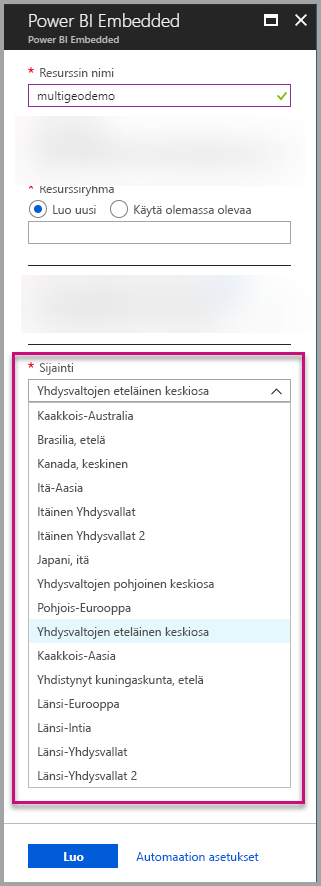
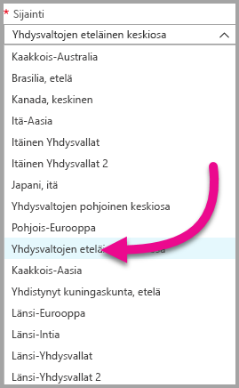
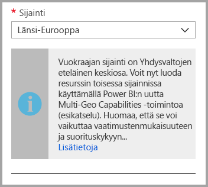
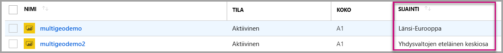
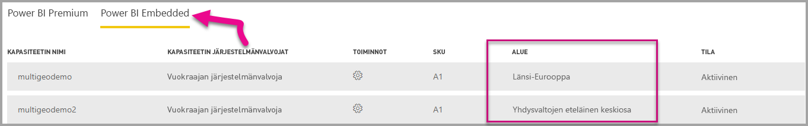

# Power BI Embeddedin Multi-Geo-tuki (esikatselu)

**Power BI Embeddedin Multi-Geo-tuki (esikatselu)** tarkoittaa, että ISV:t ja organisaatiot, jotka luovat sovelluksia Power BI Embeddedin avulla analyysin upottamiseksi sovelluksiinsa, voivat nyt käyttää tietojaan eri alueilla ympäri maailmaa.

**Power BI Embeddediä** käyttävät asiakkaat voivat nyt määrittää **kapasiteetin** käyttämällä **Multi-Geo**-asetuksia samojen ominaisuuksien ja rajoitusten perusteella kuin joita [Power BI Premium tukee Multi-Geon avulla](../service-admin-premium-Multi-Geo.md).

## Uuden Power BI Embedded -kapasiteettiresurssin luominen Multi-Geon avulla

Sinun on valittava kapasiteettisi sijainti **Luo resurssi** -näytössä. Tähän asti sijainniksi oli rajoitettu vain Power BI -vuokraajan sijainti, joten käytettävissä oli vain yksi sijainti. Multi-Geon avulla voit valita kapasiteettisi käyttöönoton eri alueilla.

Huomaa, että kun avaat avattavan sijaintivalikon, kotialueen vuokraaja on oletusvalinta.
  

Kun valitset eri sijainnin, viestissä kehotetaan varmistamaan, että olet tietoinen valinnasta.

## Kapasiteetin sijainnin tarkasteleminen

Voit nähdä kapasiteettien sijainnin helposti siirtymällä Power BI Embeddedin päähallintasivulle Azure-portaalissa.

Sijainti on käytettävissä myös powerbi.comin hallintaportaalissa. Valitse hallintaportaalissa Kapasiteettiasetukset ja siirry Power BI Embedded -välilehdelle.

[Lue lisätietoja kapasiteettien luomisesta Power BI Embeddedissä.](azure-pbie-create-capacity.md)

## Olemassa olevien kapasiteettien sijainnin hallinta

Et voi muuttaa Power BI Embedded -resurssin sijaintia, kun olet luonut uuden kapasiteetin.

Siirrä Power BI -sisältösi eri alueelle toimimalla seuraavasti:

1. [Luo uusi kapasiteetti](azure-pbie-create-capacity.md) eri alueelle.
2. Määritä kaikki työtilat olemassa olevasta kapasiteetista uuteen kapasiteettiin.
3. Poista tai keskeytä vanha kapasiteetti.

On tärkeää huomata, että jos päätät poistaa kapasiteetin määrittämättä sen sisältöä uudelleen, kaikki kyseisen kapasiteetin sisältö siirtyy jaettuun kapasiteettiin, joka on kotialueellasi.

## Multi-Geon ohjelmointirajapintatuki

Jotta voidaan tukea kapasiteettien hallintaa Multi-Geossa ohjelmointirajapinnan kautta, olemassa oleviin ohjelmointirajapintoihin on tehty joitakin muutoksia:

1. **[Kapasiteettien hakeminen](https://docs.microsoft.com/rest/api/power-bi/capacities/getcapacities)** – Ohjelmointirajapinta palauttaa kapasiteettiluettelon, jota käyttäjä voi käyttää. Vastaus sisältää nyt alue-nimisen lisäominaisuuden, joka määrittää kapasiteetin sijainnin.
2. **[Kapasiteettiin määrittäminen](https://docs.microsoft.com/rest/api/power-bi/capacities)** – Ohjelmointirajapinnan avulla tietty työtila voidaan määrittää kapasiteettiin. Tämä toiminto ei salli työtilojen määrittämistä kotialueesi ulkopuoliseen kapasiteettiin tai työtilojen siirtämistä eri alueilla sijaitsevien kapasiteettien välillä. Jotta käyttäjä voi tehdä tämän toiminnon, hänellä on edelleen oltava järjestelmänvalvojan oikeudet työtilaan ja kohdekapasiteetin järjestelmänvalvonta- tai määritysoikeudet.
3. **[Azure Resource Manager -ohjelmointirajapinta](https://docs.microsoft.com/rest/api/power-bi-embedded/capacities)** – Kaikki Azure Resource Manager -ohjelmointirajapinnan toiminnot, mukaan lukien *luominen* ja *poistaminen*, tukevat Multi-Geoa.

## Rajoitukset ja huomioitavat asiat

* Vahvista, että kaikki aloittamasi alueiden väliset siirtymät noudattavat kaikkia yrityksen ja julkishallinnon edellyttämiä vaatimustenmukaisuusehtoja ennen tiedonsiirron aloittamista.

* Etäalueelle tallennettu välimuistissa oleva kysely pysyy alueellaan levossa. Muut siirrettävät tiedot voivat kuitenkin liikkua edestakaisin eri maantieteellisten alueiden välillä.

* Kun siirrät tietoja alueelta toiselle Multi-Geo-ympäristössä, lähdetiedot saattavat jäädä jopa 30 päivän ajaksi alueelle, jolta ne on siirretty. Tänä aikana käyttäjät eivät pysty käyttämään niitä. Tiedot poistetaan tältä alueelta ja tuhotaan 30 päivän aikana.

* Multi-Geon käyttäminen ei paranna yleistä suorituskykyä. Raporttien ja raporttinäkymien lataamiseen liittyy edelleen metatietopyyntöjä kotialueelle.

## Seuraavat vaiheet

Lue lisätietoja Power BI Embedded -kapasiteeteista ja kaikkien kapasiteettien Multi-Geo-asetuksista alla olevista linkeistä.

* [Mikä Power BI Embedded on?](azure-pbie-what-is-power-bi-embedded.md)

* [Power BI Embedded -kapasiteetin luominen](azure-pbie-create-capacity.md)

* [Multi-Geo Power BI Premium -kapasiteeteissa](../service-admin-premium-multi-geo.md)

Onko sinulla kysyttävää? [Voit esittää kysymyksiä Power BI -yhteisössä](http://community.powerbi.com/)