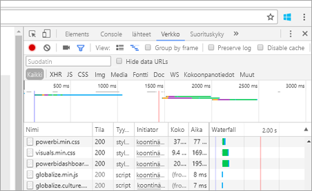

# <a name="troubleshooting-your-embedded-application"></a>Upotetun sovelluksen vianmääritys

Tässä artikkelissa käsitellään joitain yleisiä ongelmia, joita saattaa ilmetä upotettaessa sisältöä Power BI:stä.

## <a name="tools-for-troubleshooting"></a>Työkalut vianmääritykseen

### <a name="fiddler-trace"></a>Fiddler-jäljitys

[Fiddler](http://www.telerik.com/fiddler) on Telerikin ilmainen työkalu, joka valvoo HTTP-liikennettä.  Voit tarkastella Power BI -ohjelmointirajapinnan tiedonsiirtoa asiakaskoneelta. Tämä saattaa näyttää virheitä ja muita olennaisia tietoja.


### <a name="f12-in-browser-for-front-end-debugging"></a>F12 selainpuolen virheenkorjausta varten

F12 käynnistää kehittäjä-ikkunan selaimeltasi. Tämä mahdollistaa verkkoliikenteen ja muiden tietojen tarkastelun.



### <a name="extracting-error-details-from-power-bi-response"></a>Virhetietojen poimiminen Power BI:n vastauksesta

Tämä koodikatkelma näyttää, miten voit poimia virhetiedot HTTP:n poikkeamasta:

```
public static string GetExceptionText(this HttpOperationException exc)
{
    var errorText = string.Format("Request: {0}\r\nStatus: {1} ({2})\r\nResponse: {3}",
    exc.Request.Content, exc.Response.StatusCode, (int)exc.Response.StatusCode, exc.Response.Content);
    if (exc.Response.Headers.ContainsKey("RequestId"))
    {
        var requestId = exc.Response.Headers["RequestId"].FirstOrDefault();
        errorText += string.Format("\r\nRequestId: {0}", requestId);
    }

    return errorText;
}
```
Suosittelemme kirjaamaan pyyntötunnukset (sekä virhetiedot vianmääritystä varten).
Anna pyyntötunnus, kun otat yhteyttä Microsoft-tukeen.

## <a name="app-registration"></a>Sovelluksen rekisteröinti

**Virhe sovelluksen rekisteröinnissä**

Virheilmoitukset Azure-portaalissa tai Power BI -sovelluksen rekisteröintisivulla ilmoittavat puutteellisista käyttöoikeuksista. Voidaksesi rekisteröidä sovelluksen sinun on oltava Azure AD -vuokraajan järjestelmänvalvoja tai sovellusten rekisteröiminen pitää sallia erikseen myös muille kuin järjestelmänvalvojille.

**Power BI Service ei tule esiin Azure-portaalissa uutta sovellusta rekisteröitäessä**

Vähintään yhden käyttäjän on oltava rekisteröitynyt Power BI:hin. Jos et näe **Power BI -palvelua** ohjelmointirajapinta-luettelossa, kukaan käyttäjistä ei ole rekisteröitynyt Power BI:hin.

## <a name="rest-api"></a>REST-ohjelmointirajapinta

**Ohjelmointirajapinnan kutsuminen ilmoittaa 401**

Fiddler-sieppaus saattaa vaatia tarkempaa tutkimusta. Rekisteröidyn sovelluksen käyttöön vaadittavien käyttöoikeuksien laajuus saattaa olla puutteellinen Azure AD:ssa. Varmista Azure-portaalista, että käyttölaajuus on vaadittavalla tasolla Azure AD:n sovellusten rekisteröinnissä.

**Ohjelmointirajapinnan kutsuminen ilmoittaa 403**

Fiddler-sieppaus saattaa vaatia tarkempaa tutkimusta. 403-virheeseen voi olla useita syitä.

* Käyttäjä on ylittänyt niiden upotettujen tunnusten määrän, jotka voidaan luoda jaettuun kapasiteettiin. Sinun on ostettava Azure-kapasiteetit luodaksesi upotettavia tunnuksia ja määritettävä työtila kyseiselle kapasiteetille. Katso [Power BI Embedded -kapasiteetin luominen Azure-portaalissa](https://docs.microsoft.com/azure/power-bi-embedded/create-capacity).
* Azure AD:n todennustunnus on vanhentunut.
* Todennettu käyttäjä ei ole ryhmän jäsen (sovellus-työtila).
* Todennettu käyttäjä ei ole ryhmän järjestelmänvalvoja (sovellus-työtila).
* Käyttöoikeuksien myöntämisen otsikkoa ei ehkä ole lueteltu oikein. Varmista, että kirjoitusvirheitä ei ole.

Sovelluksen taustatietokanta saattaa joutua päivittämään todennustunnuksen ennen GenerateTokenin kutsumista.

```
    GET https://wabi-us-north-central-redirect.analysis.windows.net/metadata/cluster HTTP/1.1
    Host: wabi-us-north-central-redirect.analysis.windows.net
    ...
    Authorization: Bearer eyJ0eXAiOi...
    ...
 
    HTTP/1.1 403 Forbidden
    ...
     
    {"error":{"code":"TokenExpired","message":"Access token has expired, resubmit with a new access token"}}
```

**Voimassa olevista käyttäjätiedoista huolimatta tunnussanoman luominen epäonnistuu**

Vaikka käyttäjätiedot olisivat voimassa GenerateToken voi epäonnistua muutamasta eri syystä.

* Tietojoukko ei tue voimassa olevia käyttäjätietoja
* Käyttäjänimeä ei ole annettu
* Roolia ei ole annettu
* Tietojoukon tunnusta ei ole annettu
* Käyttäjällä ei ole tarvittavia oikeuksia

Selvittääksesi syyn, kokeile seuraavaa.

* Suorita [hae tietojoukko](https://docs.microsoft.com/rest/api/power-bi/datasets). Onko ominaisuus IsEffectiveIdentityRequired tosi?
* Mikä tahansa EffectiveIdentity vaatii käyttäjänimen.
* Mikäli IsEffectiveIdentityRolesRequired on tosi, rooli vaaditaan.
* Tietojoukon tunnus on pakollinen, minkä tahansa EffectiveIdentityn kanssa.
* Pääkäyttäjän on oltava yhdyskäytävän järjestelmänvalvoja käyttääkseen Analysis Servicesiä.

## <a name="data-sources"></a>Tietolähteet

**ISV haluaa eri tunnistetiedot samalle tietolähteelle**

Tietolähteellä voi olla vain yhdet tunnistetiedot yhtä pääkäyttäjää kohden. Mikäli haluat käyttää eri tunnistetietoja, luo ylimääräisiä pääkäyttäjiä. Seuraavaksi määritä eri tunnistetiedot kunkin pääkäyttäjän kohdalla ja upota ne käyttämällä käyttäjän Azure AD -tunnusta.

## <a name="content-rendering"></a>Sisällön hahmontaminen

**Upotetun sisällön hahmontaminen tai kuluttaminen epäonnistuu tai aika katkeaa**

Varmista, että upotettu tunnus ei ole vanhentunut. Tarkista upotetun tunnuksen voimassaoloaika ja päivitä se. Jos tarvitset lisätietoja, katso [päivitä tunnus JavaScript SDK:n avulla](https://github.com/Microsoft/PowerBI-JavaScript/wiki/Refresh-token-using-JavaScript-SDK-example).

**Raportti tai raporttinäkymä ei lataudu**

Jos käyttäjä ei näe raporttia tai raporttinäyttöä, varmista että ne latautuvat oikein powerbi.comissa. Raportti tai raporttinäkymä ei toimi sovelluksessasi, jos se ei lataudu powerbi.comissa.

**Raportti tai raporttinäkymä toimii hitaasti**

Avaa tiedosto Power BI Desktopissa tai powerbi.comissa ja varmista, että suorituskyky on hyväksyttävällä tasolla sulkeaksesi ulos sovelluksiisi tai upottaviin ohjelmointirajapintoihin liittyvät ongelmat.

## <a name="onboarding-experience-tool-for-embedding"></a>Upottamiseen tarkoitettu perehdyttämiskokemustyökalu

Voit käyttää [Perehdyttämiskokemustyökalua](https://aka.ms/embedsetup) ladataksesi mallisovelluksen nopeasti. Sitten voit verrata sovellustasi malliin.

### <a name="prerequisites"></a>Edellytykset

Varmista, että sinulla on kaikki asianmukaiset edellytykset ennen perehdyttämiskokemustyökalun käyttöä. Tarvitset **Power BI Pro** -tilin ja **Microsoft Azure** -tilauksen.

* Jos et ole rekisteröitynyt **Power BI:hin**, [rekisteröi ilmainen kokeiluversio](https://powerbi.microsoft.com/en-us/pricing/) ennen aloittamista.
* Jos sinulla ei ole Azure-tilausta, luo [ilmainen tili](https://azure.microsoft.com/free/?WT.mc_id=A261C142F) ennen aloittamista.
* Sinulla on oltava oma [Azure Active Directory -vuokraaja ](create-an-azure-active-directory-tenant.md) asetettuna.
* [Visual Studion](https://www.visualstudio.com/) (2013 tai uudempi versio) on oltava asennettuna.

### <a name="common-issues"></a>Yleisiä ongelmia

Seuraavaksi joitakin yleisiä ongelmia, joita saattaa ilmetä perehdyttämiskokemustyökalua testattaessa:

#### <a name="using-the-embed-for-your-customers-sample-application"></a>Käyttämällä asiakkaille tarkoitettua upotus -mallisovellusta

Jos käytät **asiakkaille tarkoitettua upotusta**, tallenna ja pura *PowerBI-Developer-Samples.zip*-tiedosto. Avaa sitten *PowerBI-Developer-Samples-master\App Owns Data*-kansio ja suorita *PowerBIEmbedded_AppOwnsData.sln*-tiedosto.

Valitsemalla **Myönnä käyttöoikeuksia** (myönnä käyttöoikeuksia -vaihe), saat seuraavan virheen:

    AADSTS70001: Application with identifier <client ID> was not found in the directory <directory ID>

Ratkaisu on sulkea ponnahdusikkuna, odottaa hetki ja yrittää uudelleen. Saatat joutua toistamaan tämän muutaman kerran. Aikaväli aiheuttaa ongelman sovelluksen rekisteröintiprosessin loppuun suorittamisessa, kun se on saatavilla ulkoisille ohjelmointirajapinnoille.

Mallisovellusta käytettäessä ilmestyy seuraava virhesanoma:

    Password is empty. Please fill password of Power BI username in web.config.

Tämä virhe ilmenee, koska ainoa arvo, jota ei ole syötetty mallisovellukseen, on käyttäjän salasanan. Avaa Web.config-tiedosto ja täytä pbisalasana-kenttään käyttäjän salasana.

#### <a name="using-the-embed-for-your-organization-sample-application"></a>Organisaatiolle tarkoitetun upotuksen -mallisovellus

Jos käytät **Organisaatiolle tarkoitettua upotusta**, tallenna ja pura *PowerBI-Developer-Samples.zip*-tiedosto. Avaa sitten *Power BI-Developer-Samples-master\User Owns Data\integrate-report-web-app*-kansio ja suorita *pbi-saas-upottaa-report.sln*-tiedosto.

Käyttäessäsi **organisaatiolle tarkoitettu upotus** -mallisovellusta, saat seuraavan virheen:

    AADSTS50011: The reply URL specified in the request does not match the reply URLs configured for the application: <client ID>

Tämä johtuu siitä, että verkkopalvelinsovellukselle määritetty uudelleenohjauksen URL-osoite on eri kuin mallisovelluksen URL-osoite. Jos haluat rekisteröidä mallisovelluksen, käytä *http://localhost:13526/* uudelleenohjauksen URL-osoitteena.

Jos haluat muokata rekisteröityä sovellusta, ja opettele muokkaamaan [AAD-rekisteröityä sovellusta](https://docs.microsoft.com/azure/active-directory/develop/active-directory-integrating-applications#updating-an-application), jolloin sovellus tarjoaa pääsyn verkon ohjelmointirajapintoihin.

Jos haluat muokata Power BI -käyttäjäprofiilia tai tietoja, opettele muokkaamaan [Power BI -tietoja](https://docs.microsoft.com/en-us/power-bi/service-basic-concepts).

Jos haluat lisätietoja, katso [Power BI Embedded - usein kysytyt kysymykset](embedded-faq.md).

Onko sinulla kysyttävää? [Kokeile Power BI -yhteisöä](http://community.powerbi.com/)