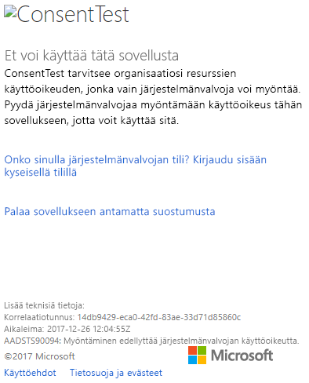
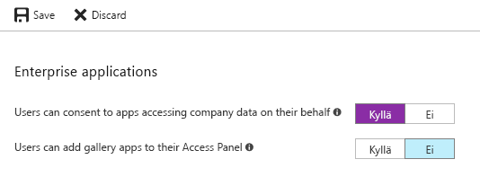

# <a name="troubleshoot-your-embedded-application"></a>Upotetun sovelluksen vianmääritys

Tässä artikkelissa käsitellään joitain yleisiä ongelmia, joita saattaa ilmetä, kun upotat sisältöä Power BI:stä.

## <a name="tools-to-troubleshoot"></a>Vianmäärityksen työkalut

### <a name="fiddler-trace"></a>Jäljitys Fiddlerillä

[Fiddler](https://www.telerik.com/fiddler) on Telerikin ilmainen työkalu, joka valvoo HTTP-liikennettä.  Voit tarkastella Power BI -ohjelmointirajapinnan tiedonsiirtoa asiakaskoneelta. Tämä työkalu saattaa näyttää virheitä ja muita olennaisia tietoja.


### <a name="f12-in-browser-for-front-end-debugging"></a>F12 selainpuolen virheenkorjausta varten

F12 käynnistää kehittäjä-ikkunan selaimeltasi. Tämä työkalu mahdollistaa verkkoliikenteen ja muiden tietojen tarkastelun.


### <a name="extract-error-details-from-power-bi-response"></a>Virhetietojen poimiminen Power BI:n vastauksesta

Tämä koodikatkelma näyttää, miten voit poimia virhetiedot HTTP:n poikkeamasta:

```csharp
public static string GetExceptionText(this HttpOperationException exc)
{
    var errorText = string.Format("Request: {0}\r\nStatus: {1} ({2})\r\nResponse: {3}",
    exc.Request.Content, exc.Response.StatusCode, (int)exc.Response.StatusCode, exc.Response.Content);
    if (exc.Response.Headers.ContainsKey("RequestId"))
    {
        var requestId = exc.Response.Headers["RequestId"].FirstOrDefault();
        errorText += string.Format("\r\nRequestId: {0}", requestId);
    }

    return errorText;
}
```

On suositeltavaa kirjata pyyntötunnus (sekä virhetiedot vianmääritystä varten).
Anna pyyntötunnus, kun otat yhteyttä Microsoft-tukeen.

## <a name="app-registration"></a>Sovelluksen rekisteröinti

### <a name="app-registration-failure"></a>Virhe sovelluksen rekisteröinnissä

Virheilmoitukset Azure-portaalissa tai Power BI -sovelluksen rekisteröintisivulla ilmoittavat puutteellisista käyttöoikeuksista. Jotta voit rekisteröidä sovelluksen, sinun on oltava Azure AD -vuokraajan järjestelmänvalvoja tai sovellusten rekisteröiminen pitää sallia erikseen myös muille kuin järjestelmänvalvojille.

### <a name="power-bi-service-doesnt-appear-in-the-azure-portal-when-registering-a-new-app"></a>Power BI -palvelu ei näy Azure-portaalissa uutta sovellusta rekisteröitäessä

Vähintään yhden käyttäjän on oltava rekisteröitynyt Power BI:hin. Jos et näe **Power BI -palvelua** ohjelmointirajapintaluettelossa, kukaan käyttäjistä ei ole rekisteröitynyt Power BI:hin.

## <a name="rest-api"></a>REST-ohjelmointirajapinta

### <a name="api-call-returning-401"></a>Ohjelmointirajapinnan kutsuminen palauttaa 401-virheen

Fiddler-sieppaus saattaa vaatia tarkempaa tutkimusta. Rekisteröidyn sovelluksen käyttöön vaadittavien käyttöoikeuksien laajuus saattaa olla puutteellinen Azure AD:ssa. Varmista Azure-portaalista, että käyttölaajuus on vaadittavalla tasolla Azure AD:n sovellusten rekisteröinnissä.

### <a name="api-call-returning-403"></a>Ohjelmointirajapinnan kutsuminen palauttaa 403-virheen

Fiddler-sieppaus saattaa vaatia tarkempaa tutkimusta. 403-virheeseen voi olla useita syitä.

* Käyttäjä on ylittänyt niiden upotettujen tunnusten määrän, jotka voidaan luoda jaettuun kapasiteettiin. Osta Azure-kapasiteetteja upotettujen tunnusten luomiseen ja määritä työtila kyseiselle kapasiteetille. Katso [Power BI Embedded -kapasiteetin luominen Azure-portaalissa](https://docs.microsoft.com/azure/power-bi-embedded/create-capacity).
* Azure AD:n todennustunnus on vanhentunut.
* Todennettu käyttäjä ei ole ryhmän (työtila) jäsen.
* Todennettu käyttäjä ei ole ryhmän (työtila) järjestelmänvalvoja.
* Valtuutetulla käyttäjällä ei ole oikeuksia. Voit päivittää oikeudet [refreshUserPermissions-ohjelmointirajapinnan](https://docs.microsoft.com/rest/api/power-bi/users/refreshuserpermissions) kautta
* Käyttöoikeuksien myöntämisen otsikkoa ei ehkä ole lueteltu oikein. Varmista, että kirjoitusvirheitä ei ole.

Sovelluksen taustatietokanta saattaa joutua päivittämään todennustunnuksen ennen GenerateTokenin kutsumista.

    ```
    GET https://wabi-us-north-central-redirect.analysis.windows.net/metadata/cluster HTTP/1.1
    Host: wabi-us-north-central-redirect.analysis.windows.net
    ...
    Authorization: Bearer eyJ0eXAiOi...
    ...

    HTTP/1.1 403 Forbidden
    ...

    {"error":{"code":"TokenExpired","message":"Access token has expired, resubmit with a new access token"}}
    ```

## <a name="authentication"></a>Todentaminen

### <a name="authentication-failed-with-aadsts90002-tenant-authorize-not-found"></a>Todentaminen epäonnistui virheellä AADSTS90002: Tenant 'authorize' not found

 Jos saat virheilmoituksia (esimerkiksi ***error: invalid_request, error_description: AADSTS90002: Tenant 'authorize' not found***) tämä johtuu siitä, että "https://login.microsoftonline.com/{Tenant}/oauth2/authorize/" ei ole tuettu valtuutuksen URL-osoite ADAL 4.x:ssä.
 
Voit ratkaista tämän poistamalla kohdan oauth2/authorize/ valtuutuksen URL-osoitteesi lopusta. Saat lisätietoja [Power BI:n kehittäjämallien](https://github.com/Microsoft/PowerBI-Developer-Samples) ohjeartikkelista.

 Tarkista kohta [Better Authority validation](https://github.com/AzureAD/azure-activedirectory-library-for-dotnet/wiki/Changes-adalnet-4.0#better-authority-validation) ADAL 4.x;n julkaisutiedoista.

### <a name="authentication-failed-with-aadsts70002-or-aadsts50053"></a>Todentaminen epäonnistui AADSTS70002:n tai AADSTS50053:n kanssa

**_(AADSTS70002: Virhe vahvistettaessa tunnistetietoja. AADSTS50053: Olet yrittänyt kirjautua sisään liian monta kertaa virheellisellä käyttäjätunnuksella tai salasanalla)_**

Jos käytät Power BI Embedded -palvelua ja Azure AD:n suoraa todennusta ja saat kirjautumisviestejä, kuten ***error:unauthorized_client, error_description:AADSTS70002: Virhe vahvistettaessa tunnistetietoja. AADSTS50053: Olet yrittänyt kirjautua sisään liian monta kertaa virheellisellä käyttäjätunnuksella tai salasanalla***, koska suora todennus ei ole ollut oletusarvoisesti käytössä 14.6.2018 jälkeen.

Voit ottaa toiminnon takaisin käyttöön [Azure AD -käytännöllä](https://docs.microsoft.com/azure/active-directory/manage-apps/configure-authentication-for-federated-users-portal#enable-direct-authentication-for-legacy-applications), joka voidaan suodattaa organisaatiolle tai [palvelun päänimelle](https://docs.microsoft.com/azure/active-directory/develop/active-directory-application-objects#service-principal-object).

On suositeltavaa, että käytäntö otetaan käyttöön vain sovelluskohtaisesti.

Jotta voit luoda tämän käytännön, sinun on oltava sen hakemiston **yleinen järjestelmänvalvoja**, johon luot ja määrität käytännön. Seuraavassa on esimerkki komentosarjasta käytännön luomiseksi ja sen määrittämiseksi tämän sovelluksen SP:lle:

1. Asenna [Azure AD Preview PowerShell -moduuli](https://docs.microsoft.com/powershell/azure/active-directory/install-adv2?view=azureadps-2.0).

2. Suorita seuraavat PowerShell-komennot rivi riviltä (varmista, että muuttujalle $sp saadaan tulokseksi vain yksi sovellus).

```powershell
Connect-AzureAD
```

```powershell
$sp = Get-AzureADServicePrincipal -SearchString "Name_Of_Application"
```

```powershell
$policy = New-AzureADPolicy -Definition @("{`"HomeRealmDiscoveryPolicy`":{`"AllowCloudPasswordValidation`":true}}") -DisplayName EnableDirectAuth -Type HomeRealmDiscoveryPolicy -IsOrganizationDefault $false
```

```powershell
Add-AzureADServicePrincipalPolicy -Id $sp.ObjectId -RefObjectId $policy.Id 
```

Odota käytännön määrittämisen jälkeen noin 15–20 sekuntia välittämistä varten ennen testausta.

### <a name="generate-token-fails-when-providing-effective-identity"></a>Voimassa olevista käyttäjätiedoista huolimatta tunnussanoman luominen epäonnistuu

Vaikka käyttäjätiedot olisivat voimassa GenerateToken voi epäonnistua muutamasta eri syystä.

* Tietojoukko ei tue voimassa olevia käyttäjätietoja
* Käyttäjänimeä ei ole annettu
* Roolia ei ole annettu
* Tietojoukon tunnusta ei ole annettu
* Käyttäjällä ei ole tarvittavia oikeuksia

Yritä selvittää syy kokeilemalla seuraavaa.

* Suorita [hae tietojoukko](https://docs.microsoft.com/rest/api/power-bi/datasets). Onko ominaisuus IsEffectiveIdentityRequired tosi?
* Mikä tahansa EffectiveIdentity vaatii käyttäjänimen.
* Mikäli IsEffectiveIdentityRolesRequired on tosi, rooli vaaditaan.
* Tietojoukon tunnus on pakollinen, minkä tahansa EffectiveIdentityn kanssa.
* Pääkäyttäjän on oltava yhdyskäytävän järjestelmänvalvoja käyttääkseen Analysis Servicesiä.

### <a name="aadsts90094-the-grant-requires-admin-permission"></a>AADSTS90094: Myöntäminen edellyttää järjestelmänvalvojan käyttöoikeutta

**_Oireet:_**<br>
Kun muu kuin järjestelmänvalvojana toimiva käyttäjä yrittää ensimmäistä kertaa kirjautua sisään sovellukseen luvan myöntämiseksi ja näkyviin jokin seuraavista virheistä:

* ConsentTest tarvitsee organisaatiosi resurssien käyttöoikeuden, jonka vain järjestelmänvalvoja voi myöntää. Pyydä järjestelmänvalvojaa myöntämään käyttöoikeus tähän sovellukseen, jotta voit käyttää sitä.
* AADSTS90094: Myöntäminen edellyttää järjestelmänvalvojan käyttöoikeutta.

    

Järjestelmänvalvojana toimiva käyttäjä voi kirjautua sisään ja myöntää luvan.

**_Pääsyy:_**<br>
Käyttäjän lupa on poistettu käytöstä vuokraajalle.

**_Ongelma voidaan korjata eri tavoin:_**

*Ota käyttäjän lupa käyttöön koko vuokraajalle (kaikki käyttäjät, kaikki sovellukset)*

1. Valitse Azure-portaalissa Azure Active Directory -> Käyttäjät ja ryhmät -> Käyttäjäasetukset
2. Ota käyttöön ”Käyttäjät voivat antaa sovelluksille luvan käyttää yrityksen tietoja puolestaan” -asetus ja tallenna muutokset

    

*Myönnä käyttöoikeudet* sovellukseen järjestelmänvalvojana joko koko vuokraajalle tai tietylle käyttäjälle.

### <a name="cs1061-error"></a>CS1061-virhe

Lataa [Microsoft.IdentityModel.Clients.ActiveDirectory](https://www.nuget.org/packages/Microsoft.IdentityModel.Clients.ActiveDirectory/2.22.302111727), jos saat virheilmoitukset "'AuthenticationContext' ei sisällä 'AcquireToken'-määritettä, eikä löytynyt käytettävissä olevaa 'AcquireToken'-tunnistetta, joka hyväksyisi 'AuthenticationContext'-arvon (puuttuuko using-direktiivi tai kokoonpanoviittaus?).

## <a name="data-sources"></a>Tietolähteet

### <a name="isv-wants-to-have-different-credentials-for-the-same-data-source"></a>ISV haluaa eri tunnistetiedot samalle tietolähteelle

Tietolähteellä voi olla vain yhdet tunnistetiedot yhtä pääkäyttäjää kohden. Mikäli haluat käyttää eri tunnistetietoja, luo ylimääräisiä pääkäyttäjiä. Määritä sitten eri tunnistetiedot kunkin pääkäyttäjän kohdalla ja upota ne käyttämällä käyttäjän Azure AD -tunnusta.

## <a name="troubleshoot-your-embedded-application-with-the-ierror-object"></a>Upotetun sovelluksen vianmääritys IError-objektin avulla

Korjaa sovelluksen virheet ja selvitä virheiden syy käyttämällä [**IError-objektia**, jonka *virhetapahtuma* palautti **JavaScript SDK:sta**](https://github.com/Microsoft/PowerBI-JavaScript/wiki/Troubleshooting-and-debugging-of-embedded-parts).

IError-objektin hankkimisen jälkeen sinun on tarkasteltava asianmukaista yleisten virheiden taulukkoa, joka soveltuu käyttämääsi upotustyyppiin. Vertaa **IError-ominaisuuksia** taulukossa oleviin ja etsi mahdolliset syyt virheeseen.

### <a name="typical-errors-when-embedding-for-power-bi-users"></a>Tavalliset virheet käytettäessä upotusta Power BI -käyttäjien käyttöön

| Viesti | Yksityiskohtainen viesti | Virhekoodi | Mahdolliset syyt |
|-------------------------------------------------------|-----------------------------------------------------------------------------------------------------------------------------|-----------|--------------------------------------------------------|
| TokenExpired | Käyttöoikeustietue on vanhentunut, lähetä uudelleen uudella käyttöoikeustietueella | 403 | Vanhentunut tunnus  |
| PowerBIEntityNotFound | Raportin hakeminen epäonnistui | 404 | <li> Väärä raporttitunnus <li> Raporttia ei ole olemassa  |
| Virheelliset parametrit | powerbiToken-parametria ei määritetty | – | <li> Käyttöoikeustietuetta ei ole annettu <li> Raporttitunnusta ei ole annettu |
| LoadReportFailed | Alustaminen epäonnistui – klusteria ei voitu selvittää | 403 | * Virheellinen käyttöoikeustietue * Upotustyyppi ei vastaa tunnistetyyppiä |
| PowerBINotAuthorizedException | Raportin hakeminen epäonnistui | 401 | <li> Väärä ryhmän tunnus <li> Valtuuttamaton ryhmä |
| TokenExpired | Käyttöoikeustietue on vanhentunut, lähetä uudelleen uudella käyttöoikeustietueella. Seuraavaa raportin visualisointia ei voitu hahmontaa: <visual title> | – | Kyselytietojen vanhentunut tunnus |
| OpenConnectionError | Visualisointia ei voi näyttää. Seuraavaa raportin visualisointia ei voitu hahmontaa: <visual title> | – | Kapasiteetti on keskeytetty tai poistettu, kun kapasiteettiin liittyvä raportti oli avoimena istunnossa |
| ExplorationContainer_FailedToLoadModel_DefaultDetails | Tähän raporttiin liittyvän mallirakenteen lataaminen epäonnistui. Varmista, että palvelimeen on yhteys, ja yritä uudelleen. | – | <li> Kapasiteetti keskeytetty <li> Kapasiteetti poistettu |

### <a name="typical-errors-when-embedding-for-non-power-bi-users-using-an-embed-token"></a>Tavalliset virheet käytettäessä upotusta Power BI -käyttäjien käyttöön (upotustunnuksen avulla)

| Viesti | Yksityiskohtainen viesti | Virhekoodi | Syyt |
|-------------------------------------------------------|-------------------------------------------------------------------------------------------------------------------------------|------------|-------------------------------------------------|
| TokenExpired | Käyttöoikeustietue on vanhentunut, lähetä uudelleen uudella käyttöoikeustietueella | 403 | Vanhentunut tunnus  |
| LoadReportFailed | Raportin hakeminen epäonnistui | 404 | <li> Väärä raporttitunnus <li> Raporttia ei ole olemassa  |
| LoadReportFailed | Raportin hakeminen epäonnistui | 403 | Raporttitunnus ei vastaa tunnusta |
| LoadReportFailed | Raportin hakeminen epäonnistui | 500 | Annettu raporttitunnus ei ole GUID-tunnus |
| Virheelliset parametrit | powerbiToken-parametria ei määritetty | – | <li> Käyttöoikeustietuetta ei ole annettu <li> Raporttitunnusta ei ole annettu |
| LoadReportFailed | Alustaminen epäonnistui – klusteria ei voitu selvittää | 403 | Väärä tunnustyyppi, virheellinen tunnus |
| PowerBINotAuthorizedException | Raportin hakeminen epäonnistui | 401 | Väärä/valtuuttamaton ryhmän tunnus |
| TokenExpired | Käyttöoikeustietue on vanhentunut, lähetä uudelleen uudella käyttöoikeustietueella. Seuraavaa raportin visualisointia ei voitu hahmontaa: <visual title> | – | Kyselytietojen vanhentunut tunnus |
| OpenConnectionError | Visualisointia ei voi näyttää. Seuraavaa raportin visualisointia ei voitu hahmontaa: <visual title> | – | Kapasiteetti on keskeytetty tai poistettu, kun kapasiteettiin liittyvä raportti oli avoimena istunnossa |
| ExplorationContainer_FailedToLoadModel_DefaultDetails | Tähän raporttiin liittyvän mallirakenteen lataaminen epäonnistui. Varmista, että palvelimeen on yhteys, ja yritä uudelleen. | – | <li> Kapasiteetti keskeytetty <li> Kapasiteetti poistettu |

## <a name="content-rendering"></a>Sisällön hahmontaminen

### <a name="performance"></a>Suorituskyky

[Power BI Embeddedin suorituskyky](embedded-performance-best-practices.md)

### <a name="rendering-or-consumption-of-embedded-content-fails-or-times-out"></a>Upotetun sisällön hahmontaminen tai kuluttaminen epäonnistuu tai aikakatkaistaan

Varmista, että upotettu tunnus ei ole vanhentunut. Tarkista upotetun tunnuksen voimassaoloaika ja päivitä se. Jos tarvitset lisätietoja, katso [päivitä tunnus JavaScript SDK:n avulla](https://github.com/Microsoft/PowerBI-JavaScript/wiki/Refresh-token-using-JavaScript-SDK-example).

### <a name="report-or-dashboard-doesnt-load"></a>Raportti tai koontinäyttö ei lataudu

Jos käyttäjä ei näe raporttia tai raporttinäyttöä, varmista että ne latautuvat oikein powerbi.comissa. Raportti tai raporttinäkymä ei toimi sovelluksessasi, jos se ei lataudu powerbi.comissa.

### <a name="report-or-dashboard-is-performing-slowly"></a>Raportti tai koontinäyttö toimii hitaasti

Avaa tiedosto Power BI Desktopissa tai powerbi.comissa ja varmista, että suorituskyky on hyväksyttävällä tasolla sulkeaksesi ulos sovellukseesi tai upottaviin ohjelmointirajapintoihin liittyvät ongelmat.

## <a name="embed-setup-tool"></a>Upottamisen määritystyökalu

Voit käyttää [upottamisen määritystyökalua](https://aka.ms/embedsetup) ladataksesi mallisovelluksen nopeasti. Sitten voit verrata sovellustasi malliin.

### <a name="prerequisites"></a>Edellytykset

Varmista, että sinulla on kaikki asianmukaiset edellytykset ennen upottamisen määritystyökalun käyttöä. Tarvitset **Power BI Pro** -tilin ja **Microsoft Azure** -tilauksen.

* Jos et ole rekisteröitynyt **Power BI:hin**, [rekisteröi ilmainen kokeiluversio](https://powerbi.microsoft.com/pricing/) ennen aloittamista.
* Jos sinulla ei ole Azure-tilausta, luo [ilmainen tili](https://azure.microsoft.com/free/?WT.mc_id=A261C142F) ennen aloittamista.
* Sinulla on oltava oma [Azure Active Directory -vuokraaja ](create-an-azure-active-directory-tenant.md) asetettuna.
* [Visual Studion](https://www.visualstudio.com/) (2013 tai uudempi versio) on oltava asennettuna.

### <a name="common-issues"></a>Yleisiä ongelmia

Seuraavaksi joitakin yleisiä ongelmia, joita saattaa ilmetä upottamisen määritystyökalua testattaessa:

#### <a name="using-the-embed-for-your-customers-sample-application"></a>Käyttämällä asiakkaille tarkoitettua upotus -mallisovellusta

Jos käytät **asiakkaille tarkoitettua upotusta**, tallenna ja pura *PowerBI-Developer-Samples.zip* -tiedosto. Avaa sitten *PowerBI-Developer-Samples-master\App Owns Data*-kansio ja suorita *PowerBIEmbedded_AppOwnsData.sln*-tiedosto.

Valitsemalla **Myönnä käyttöoikeuksia** (myönnä käyttöoikeuksia -vaihe), saat seuraavan virheen:

    AADSTS70001: Application with identifier <client ID> wasn't found in the directory <directory ID>

Ratkaisu on sulkea ponnahdusikkuna, odottaa hetki ja yrittää uudelleen. Saatat joutua toistamaan tämän muutaman kerran. Aikaväli aiheuttaa ongelman sovelluksen rekisteröintiprosessin loppuun suorittamisessa, kun se on saatavilla ulkoisille ohjelmointirajapinnoille.

Mallisovellusta käytettäessä ilmestyy seuraava virhesanoma:

    Password is empty. Please fill password of Power BI username in web.config.

Tämä virhe ilmenee, koska ainoa arvo, jota ei ole syötetty mallisovellukseen, on käyttäjän salasana. Avaa Web.config-tiedosto ja täytä pbisalasana-kenttään käyttäjän salasana.

Jos saat virhesanoman AADSTS50079: käyttäjän pitää käyttää monimenetelmäistä todentamista.

    Need to use an AAD account that doesn't have MFA enabled.

#### <a name="using-the-embed-for-your-organization-sample-application"></a>Organisaatiolle tarkoitetun upotuksen -mallisovellus

Jos käytät **organisaatiolle tarkoitettua upotusta**, tallenna ja pura *PowerBI-Developer-Samples.zip* -tiedosto. Avaa sitten *PowerBI-Developer-Samples-master\User Owns Data\integrate-report-web-app* -kansio ja suorita *pbi-saas-embed-report.sln* -tiedosto.

Käyttäessäsi **organisaatiolle tarkoitettu upotus** -mallisovellusta, saat seuraavan virheen:

    AADSTS50011: The reply URL specified in the request doesn't match the reply URLs configured for the application: <client ID>

Tämä virhe johtuu siitä, että verkkopalvelinsovellukselle määritetty uudelleenohjauksen URL-osoite on eri kuin mallisovelluksen URL-osoite. Jos haluat rekisteröidä mallisovelluksen, käytä `https://localhost:13526/`uudelleenohjauksen URL-osoitteena.

Jos haluat muokata rekisteröityä sovellusta, opettele [päivittämään Azure AD -rekisteröity sovellus](https://docs.microsoft.com/azure/active-directory/develop/quickstart-v1-update-azure-ad-app), jolloin sovellus tarjoaa pääsyn verkon ohjelmointirajapintoihin.

Jos haluat muokata Power BI -käyttäjäprofiilia tai tietoja, opettele muokkaamaan [Power BI -tietoja](https://docs.microsoft.com/power-bi/service-basic-concepts).

Jos saat virhesanoman AADSTS50079: käyttäjän pitää käyttää monimenetelmäistä todentamista.

    Need to use an AAD account that doesn't have MFA enabled.

Jos haluat lisätietoja, katso [Power BI Embedded - usein kysytyt kysymykset](embedded-faq.md).

Onko sinulla kysyttävää? [Kokeile Power BI -yhteisöä](https://community.powerbi.com/)

Jos tarvitset lisäapua, [ota yhteyttä tukeen](https://powerbi.microsoft.com/support/pro/?Type=documentation&q=power+bi+embedded) tai [luo tukipalvelupyyntö Azure-portaalin kautta](https://ms.portal.azure.com/#blade/Microsoft_Azure_Support/HelpAndSupportBlade/newsupportrequest) ja anna saamasi virhesanomat.

## <a name="next-steps"></a>Seuraavat vaiheet

Katso lisätietoja [usein kysytyistä kysymyksistä](embedded-faq.md).

Onko sinulla kysyttävää? [Kokeile Power BI -yhteisöä](https://community.powerbi.com/)
