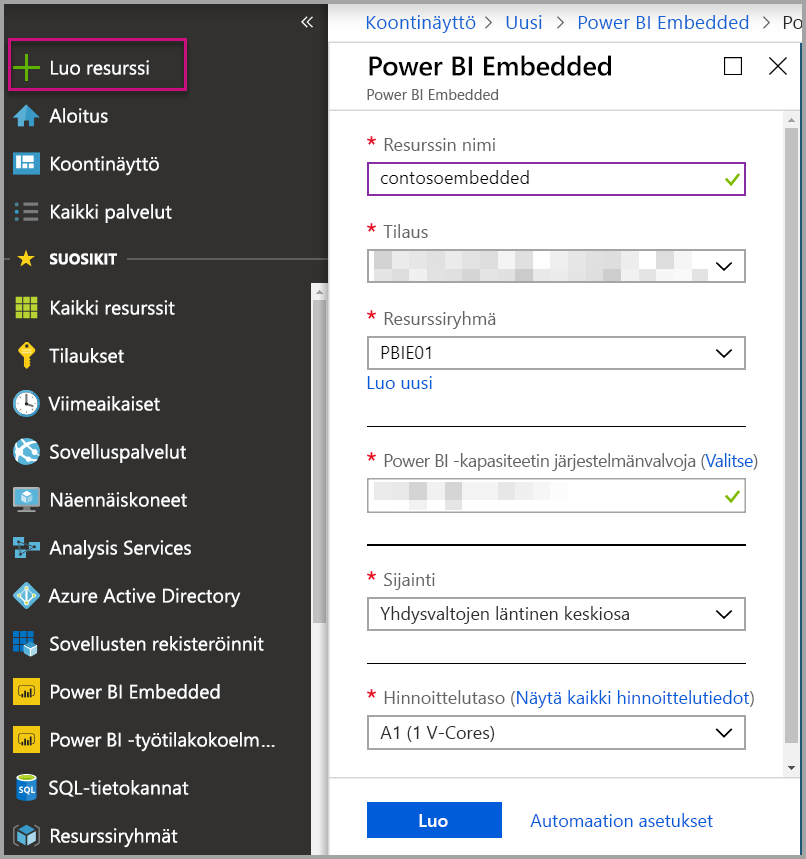
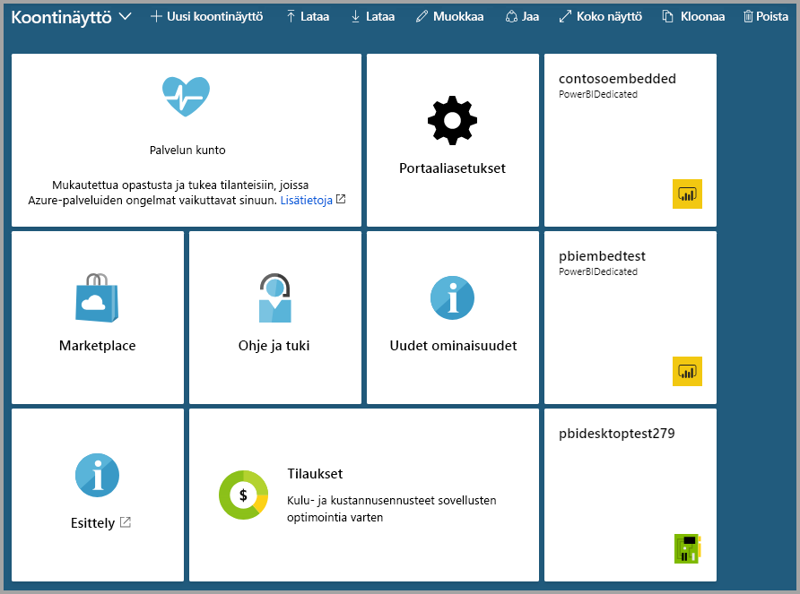

# Power BI Embedded -kapasiteetin luominen Azure-portaalissa

Tässä artikkelissa esitellään, miten voit luoda [Power BI Embedded](azure-pbie-what-is-power-bi-embedded.md) -kapasiteetin Microsoft Azuressa. Power BI Embedded yksinkertaistaa Power BI -ominaisuuksia auttamalla sinua lisäämään upeita visualisointeja, raportteja ja koontinäyttöjä sovelluksiisi nopeasti.

Jos sinulla ei ole Azure-tilausta, luo [ilmainen tili](https://azure.microsoft.com/free/) ennen aloittamista.

> [!VIDEO https://www.youtube.com/embed/aXrvFfg_iSk]

## Alkutoimet

Tarvitset tämän pikaoppaan suorittamiseen seuraavat asiat:

* **Azure-tilaus:** Kohdassa [Azuren ilmainen kokeiluversio](https://azure.microsoft.com/free/) voit luoda tilin.
* **Azure Active Directory:** Tilaukseesi on liityttävä Azure Active Directory (AAD) -vuokraaja. Lisäksi ***sinun on kirjauduttava sisään Azureen tilillä kyseisessä vuokraajassa***. Microsoft-tilejä ei tueta. Lisätietoja on kohdassa [Todentaminen ja käyttäjien käyttöoikeudet](https://docs.microsoft.com/azure/analysis-services/analysis-services-manage-users).
* **Power BI -vuokraaja:** Vähintään yhden tilin AAD-vuokraajassa on oltava rekisteröinyt Power BI:hin.
* **Resurssiryhmä:** Käytä olemassa olevaa resurssiryhmää tai [luo uusi](https://docs.microsoft.com/azure/azure-resource-manager/resource-group-overview).

## Kapasiteetin luominen

1. Kirjaudu sisään [Azure-portaaliin](https://portal.azure.com/).

2. Kirjoita hakuruutuun *Power BI Embedded*.

3. Valitse Power BI Embeddedissä **Luo**.

4. Täytä tarvittavat tiedot ja valitse sitten **Luo**.

    

    |Asetus |Kuvaus |
    |---------|---------|
    |**Resurssin nimi**|Kapasiteetin yksilöivä nimi. Resurssin nimi näkyy Power BI -hallintaportaalissa Azure-portaalin lisäksi.|
    |**Tilaus**|Tilaus, jota vastaan haluat luoda kapasiteetin.|
    |**Resurssiryhmä**|Resurssiryhmä, joka sisältää tämän uuden kapasiteetin. Valitse olemassa olevasta resurssiryhmästä tai luo toinen ryhmä. Saat lisätietoja tutustumalla [Azure Resource Managerin yleiskatsaukseen](https://docs.microsoft.com/azure/azure-resource-manager/resource-group-overview).|
    |**Power BI -kapasiteetin järjestelmänvalvoja**|Power BI -kapasiteetin järjestelmänvalvojat voivat tarkastella kapasiteettia Power BI -hallintaportaalissa ja antaa määrityskäyttöoikeuksia muille käyttäjille. Oletusarvoisesti kapasiteetin järjestelmänvalvoja on tilisi. Kapasiteetin järjestelmänvalvojan on oltava Power BI -vuokraajassa.|
    |**Sijainti**|Sijainti, jossa Power BI sijaitsee vuokraajaasi varten. Oletussijainti on kotialueesi, mutta voit muuttaa sijainnin [Multi-Geo-asetuksissa](embedded-multi-geo.md).
    |**Hinnoittelutaso**|Valitse SKU (näennäisytimien määrä ja muistin koko), joka vastaa tarpeitasi.  Lisätietoja on kohdassa [Power BI Embedded -hinnoittelu](https://azure.microsoft.com/pricing/details/power-bi-embedded/)|

Voit siirtyä kohtaan **Kaikki palvelut** > **Power BI Embedded** ja tarkistaa, onko kapasiteettisi valmis. Jos haluat siirtyä koontinäyttöön tarkastelemaan uutta kapasiteettiasi, voit myös valita ilmoitusosiosta tai ruudusta **Kiinnitä koontinäyttöön**.

## Seuraavat vaiheet

Voit käyttää uutta Power BI Embedded -kapasiteettia siirtymällä Power BI -hallintaportaaliin, jossa voit määrittää työtiloja. Lisätietoja on kohdassa [Kapasiteettien hallinta Power BI Premiumissa ja Power BI Embeddedissä](https://powerbi.microsoft.com/documentation/powerbi-admin-premium-manage/).

Jos sinun ei tarvitse käyttää tätä kapasiteettia, voit keskeyttää sen lopettaaksesi laskutuksen. Katso lisätietoja kohdasta [Power BI Embedded -kapasiteetin keskeyttäminen ja käynnistäminen Azure-portaalissa](azure-pbie-pause-start.md).

Jos haluat aloittaa Power BI -sisällön upottamisen sovellukseesi, katso kohta [Power BI -koontinäyttöjen, -raporttien ja -ruutujen upottaminen](https://powerbi.microsoft.com/documentation/powerbi-developer-embedding-content/).

Onko sinulla kysyttävää? [Voit esittää kysymyksiä Power BI -yhteisössä](https://community.powerbi.com/)