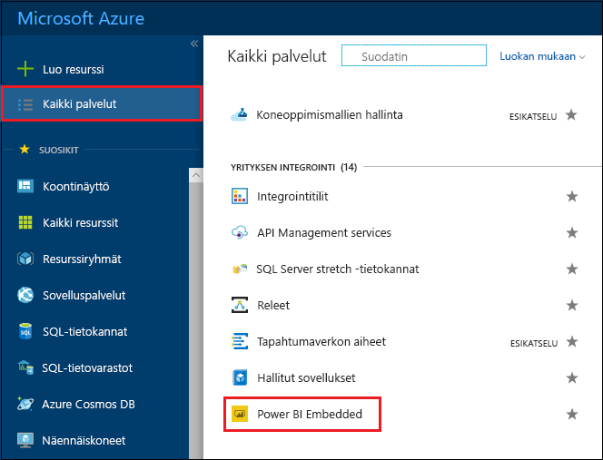
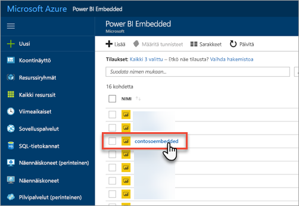
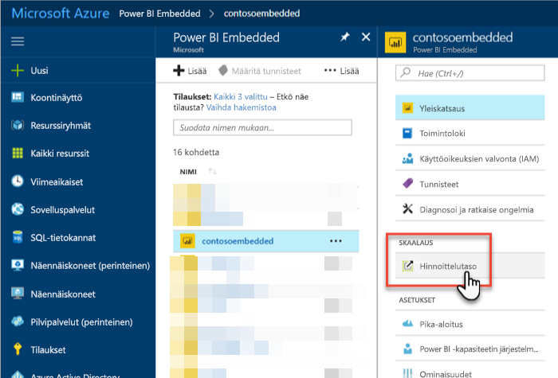
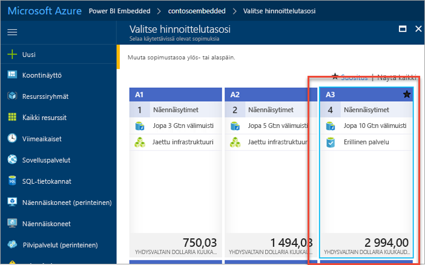
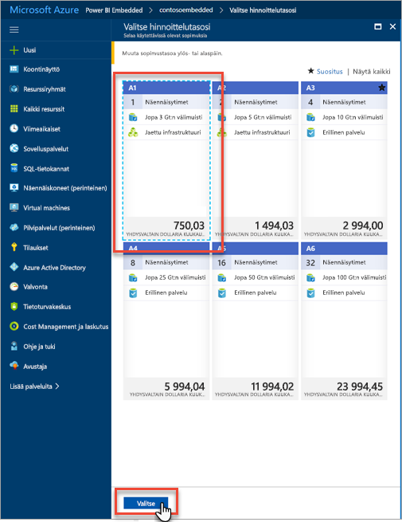
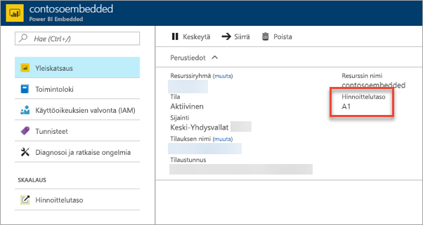

# Power BI Embedded -kapasiteetin skaalaaminen Azure-portaalissa

Tässä artikkelissa esitellään, miten voit skaalata Power BI Embedded -kapasiteetin Microsoft Azuressa. Skaalauksen avulla voit suurentaa tai pienentää kapasiteettisi.

Tässä oletetaan, että olet luonut Power BI Embedded -kapasiteetin. Jos et ole tehnyt niin, katso ohjeet kohdasta [Power BI Embedded -kapasiteetin luominen Azure-portaalissa](azure-pbie-create-capacity.md).

> [!NOTE]
> Skaalaustoiminto voi kestää noin minuutin. Tänä aikana kapasiteetti ei ole käytettävissä. Upotettua sisältöä ei ehkä voi ladata.

## Kapasiteetin skaalaaminen

1. Kirjaudu sisään [Azure-portaaliin](https://portal.azure.com/).

2. Voit tarkastella kapasiteetteja valitsemalla **Kaikki palvelut** > **Power BI Embedded**.

    

3. Valitse kapasiteetti, jonka haluat skaalata.

    

4. Valitse **Hinnoittelutaso** kohdassa **Skaalaus** kapasiteettisi sisällä.

    

    Nykyinen hinnoittelutasosi näkyy sinisenä.

    

5. Voit skaalata ylös tai alas valitsemalla uuden tason, johon haluat siirtyä. Uuden tason valitseminen sijoittaa sinisen katkoviivan valinnan ympärille. Valitse **Valitse** skaalataksesi uuteen tasoon.

    

    Kapasiteettisi skaalaus saattaa kestää muutaman minuutin.

6. Vahvista taso Yleiskatsaus-välilehdessä. Nykyinen hinnoittelutaso on luettelossa.

    

## Seuraavat vaiheet

Katso lisätietoja kapasiteettisi keskeyttämisestä tai käynnistämisestä kohdasta [Power BI Embedded -kapasiteetin keskeyttäminen ja käynnistäminen Azure-portaalissa](azure-pbie-pause-start.md).

Jos haluat aloittaa Power BI -sisällön upottamisen sovellukseesi, katso kohta [Power BI -koontinäyttöjen, -raporttien ja -ruutujen upottaminen](https://powerbi.microsoft.com/documentation/powerbi-developer-embedding-content/).

Onko sinulla kysyttävää? [Voit esittää kysymyksiä Power BI -yhteisössä](https://community.powerbi.com/)
