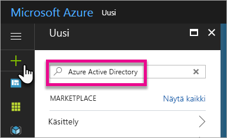
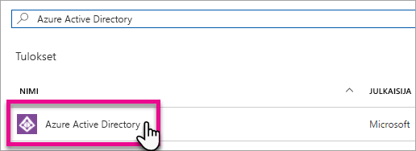
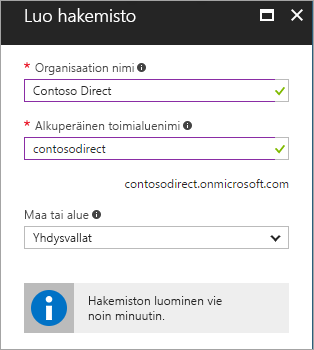
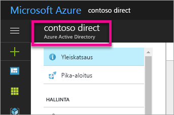
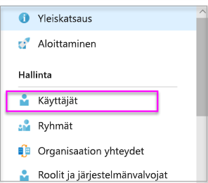
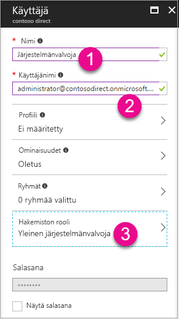

# Luo Azure Active Directory -vuokraaja käytettäväksi Power BI:n kanssa

Katso, miten voit luoda uuden Azure Active Directory (Azure AD) -vuokraajan käytettäväksi mukautetun, [Power BI REST -ohjelmointirajapintoja](../automation/rest-api-reference.md) kutsuvan sovelluksesi kanssa.

Vuokraaja edustaa organisaatiota Azure Active Directoryssa. Se on Azure AD -palvelun erityisesiintymä, jonka organisaatio saa käyttöönsä ja omistaa, kun se liittyy Microsoftin pilvipalveluun, kuten Azureen, Microsoft Intuneen tai Office 365:een. Kukin Azure AD -vuokraaja on yksilöllinen ja erillinen muista Azure AD -vuokraajista.

Kun sinulla on Azure AD -vuokraaja, voit määrittää sovelluksen ja myöntää sille oikeuksia, joilla sovelluksesi voi kutsua [Power BI REST -ohjelmointirajapintoja](../automation/rest-api-reference.md).

Organisaatiollasi saattaa jo olla Azure AD -vuokraaja, jota voit käyttää sovellustasi varten. Voit myös luoda uuden vuokraajan erityisesti omaa sovellustasi varten. Tässä artikkelissa näytetään, miten voit luoda uuden vuokraajan.

## Azure Active Directory -vuokraajan luominen

Jotta voit integroida Power BI:n mukautettuun sovellukseesi, sinun on määritettävä sovellus Azure AD:ssä. Tämä edellyttää Azure AD -hakemistoa. Tämä hakemisto on *vuokraajasi*. Jos organisaatiollasi ei vielä ole vuokraajaa, koska siinä ei käytetä Power BI:tä tai Office 365:tä, [sinun on luotava kehitysympäristö](https://docs.microsoft.com/azure/active-directory/develop/active-directory-howto-tenant). Voit myös joutua luomaan sellaisen, jos et halua sovelluksesi sekoittuvan organisaatiosi vuokraajan kanssa. Tai ehkä haluat luoda vuokraajan testaustarkoituksiin.

Uuden Azure AD -vuokraajan luominen:

1. Selaa [Azure-portaaliin](https://portal.azure.com) ja kirjaudu sisään tilillä, jolla on Azure-tilaus.

2. Valitse **plus-kuvake (+)** ja hae **Azure Active Directory**.

    

3. Valitse hakutuloksista **Azure Active Directory**.

    

4. Valitse **Luo**.

5. Anna **Organisaation nimi** ja **Alkuperäisen toimialueen nimi**. Valitse sitten **Luo**. Hakemisto on nyt luotu.

    

   > [!NOTE]
   > Alkuperäinen toimialueesi on osa toimialuetta onmicrosoft.com. Voit lisätä muita toimialuenimiä myöhemmin. Vuokraajahakemistolle voi olla määritetty useita toimialueita.

6. Kun hakemisto on luotu, valitse tietoruutu hallitaksesi uutta hakemistoasi.

Seuraavaksi lisäät vuokraajan käyttäjiä.

## Azure Active Directory -vuokraajan käyttäjien luominen

Nyt kun hakemisto on luotu, luodaan vähintään kaksi käyttäjää. Toinen on vuokraajan yleinen järjestelmänvalvoja ja toinen pääkäyttäjä upottamista varten. Voit ajatella jälkimmäisen olevan palvelutili.

1. Varmista Azure-portaalissa, että käytössä on Azure Active Directory -pikaikkuna.

    

    Jos ei ole, valitse Azure Active Directory -kuvake vasemmalta palvelusiirtymästä.

    

2. Valitse **Hallinta**-kohdasta **Käyttäjät**.

    

3. Valitse **Kaikki käyttäjät** ja sitten **+ Uusi käyttäjä**.

4. Anna vuokraajan Yleisen järjestelmänvalvojan **nimi** ja **käyttäjänimi**. Muuta **Hakemiston rooli** -kohdan arvoksi **Yleinen järjestelmänvalvoja**. Voit myös näyttää tilapäisen salasanan. Kun olet valmis, valitse **Luo**.

    

5. Luo tavallinen vuokraajan käyttäjä samalla tavalla. Voit käyttää tätä tiliä upottamisen päätilinäsi. Jätä tällä kertaa **Hakemiston rooli** -arvoksi **Käyttäjä**. Kirjoita salasana muistiin ja valitse sitten **Luo**.

    

6. Rekisteröidy Power BI:hin käyttäjätilillä, jonka loit vaiheessa 5. Siirtymällä osoitteeseen [powerbi.com](https://powerbi.microsoft.com/get-started/) ja valitse **Power BI - pilviyhteistyö ja jakaminen** -kohdassa **Kokeile ilmaiseksi**.

    

    Kun rekisteröidyt, sinua kehotetaan kokeilemaan Power BI Pro:ta ilmaiseksi 60 päivän ajan. Jos teet niin, sinusta tulee Pro-käyttäjä, jolloin voit [alkaa kehittää upotettua ratkaisua](embed-sample-for-customers.md).

   > [!NOTE]
   > Varmista, että rekisteröidyt käyttäjätilisi sähköpostiosoitteella.

## Seuraavat vaiheet

Nyt kun sinulla on Azure AD -vuokraaja, voit käyttää vuokraajaa Power BI -kohteiden testaamiseen. Voit myös upottaa Power BI -raporttinäkymiä ja raportteja sovellukseesi. Katso lisätiedot kohdasta [Power BI -raporttinäkymien, -raporttien ja -ruutujen upottaminen](embed-sample-for-customers.md).

[Mikä Azure Active Directory on?](https://docs.microsoft.com/azure/active-directory/active-directory-whatis) 
 
[Pikaopas: Kehitysympäristön määrittäminen](https://docs.microsoft.com/azure/active-directory/develop/active-directory-howto-tenant)  

Onko sinulla kysyttävää? [Voit esittää kysymyksiä Power BI -yhteisössä](https://community.powerbi.com/)
