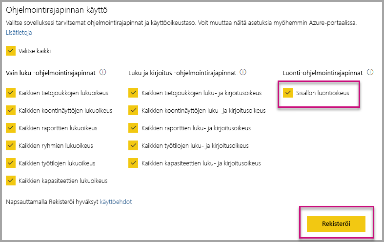

# Power BI -sovellusten automaattinen asennus, kun upotat ne organisaatiosi käyttöön

Jos haluat upottaa sovelluksen sisältöä, upottavalla käyttäjällä on oltava [sovelluksen käyttöoikeus](../../service-create-distribute-apps.md). Jos sovellus on asennettu käyttäjälle, upottaminen toimii saumattomasti. Katso lisätiedot [Sovelluksen raporttien ja raporttinäkymien upottamisesta](embed-from-apps.md). PowerBI.comissa voit määrittää kaikki sovellukset [asennettavaksi automaattisesti](https://powerbi.microsoft.com/blog/automatically-install-apps/). Tämä toiminto tehdään vuokraajan tasolla ja se koskee kaikkia sovelluksia.

## Sovelluksen automaattinen asennus upotettaessa

Jos käyttäjällä on sovelluksen käyttöoikeus, mutta sovellusta ei ole asennettu, upottaminen epäonnistuu. Voit välttää nämä sovelluksesta upottamisen virheet, sallimalla sovelluksen automaattisen asennuksen upotettaessa. Tämä toiminto tarkoittaa sitä, että jos käyttäjä yrittää upottaa sisältöä sovelluksesta, jota ei ole asennettu, se asennetaan automaattisesti puolestasi. Haluamasi sisältö upotetaan välittömästi, jolloin käyttökokemus on saumaton.

## Upottaminen Power BI -käyttäjille (käyttäjä omistaa tiedot)

Jotta voit sallia sovellusten automaattisen asennuksen käyttäjille, sinun on annettava sovelluksellesi sisällön luontioikeudet [rekisteröidessäsi sovellusta](register-app.md#register-with-the-power-bi-application-registration-tool). Jos sovellus on jo rekisteröity, voit lisätä oikeudet jälkikäteen.

Seuraavaksi sinun on annettava liitetyn URL-osoitteen sovellustunnus. Sovelluksen luojan täytyy ensin asentaa sovellus ja käyttää sitten jotakin tuetuista [Power BI:n Rest-ohjelmointirajapinnan](https://docs.microsoft.com/rest/api/power-bi/) kutsuista – [Nouda raportit](https://docs.microsoft.com/rest/api/power-bi/reports/getreports) tai [Nouda raporttinäkymät](https://docs.microsoft.com/rest/api/power-bi/dashboards/getdashboards). Sovelluksen luojan on otettava URL-osoite REST-ohjelmointirajapinnan vastauksesta. Sovellustunnus näkyy URL-osoitteessa, jos sisältö on peräisin sovelluksesta.  Kun sinulla on upotuksen URL-osoite, voit käyttää sitä säännölliseen upottamiseen.

## Suojattu upotus

Jos haluat käyttää sovellusten automaattista asennusta, sovelluksen luojan on ensin asennettava sovellus ja siirryttävä sitten sovellukseen PowerBI.comissa, siirryttävä raporttiin ja noutaa linkki normaalisti. Kaikki muut käyttäjät, joilla on sovelluksen käyttöoikeus ja jotka voivat käyttää linkkiä, voivat upottaa raportin.

## Huomioitavat asiat ja rajoitukset

* Voit upottaa vain raportteja ja koontinäyttöjä tässä skenaariossa.

* Tätä ominaisuutta ei tällä hetkellä tueta tilanteissa, joissa sovellus omistaa tietoja tai joissa yritetään upottaa SharePoint-sisältöä.