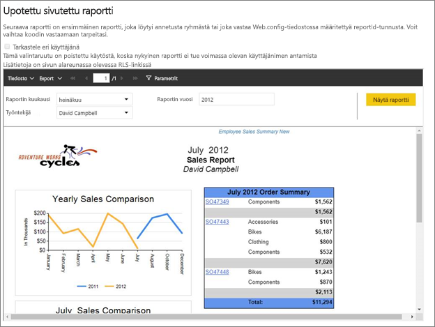
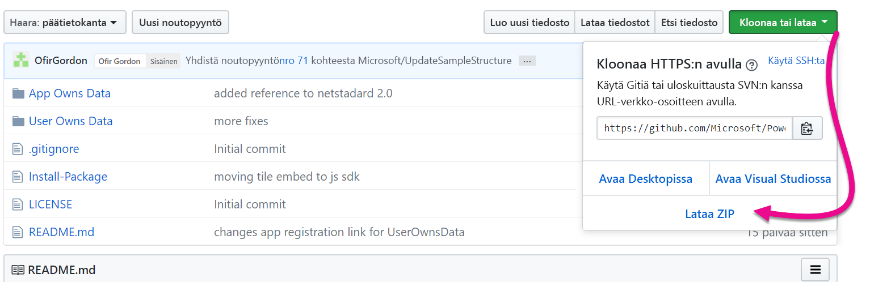
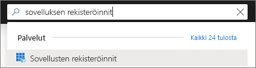
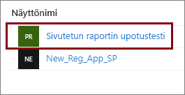
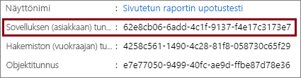
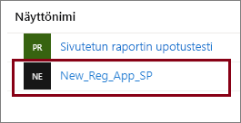
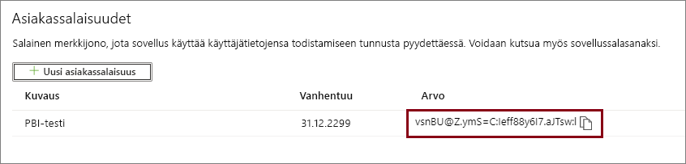
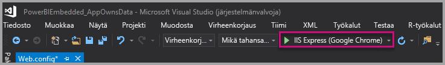
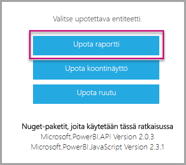

# <a name="tutorial-embed-power-bi-paginated-reports-into-an-application-for-your-customers-preview"></a>Opetusohjelma: Power BI:n sivutetun raportin upottaminen sovellukseen asiakkaitasi varten (esikatselu)

**Azuren Power BI Embeddedin** tai **Officen Power BI -upotuksen** avulla voit upottaa sovellukseen sivutettuja raportteja käyttämällä app owns data -hakemiston malleja. **App owns data**-hakemiston malleja käytetään kun kyseessä on sovellus, joka käyttää Power BI:tä upotettuna analyysiympäristönään. **ISV:nä** tai **kehittäjänä** voit luoda Power BI -sisältöä, joka näyttää sivutetut raportit sovelluksessa, joka on täysin integroitu ja vuorovaikutteinen, edellyttämättä käyttäjiltä Power BI -käyttöoikeutta. Tämä opetusohjelma esittelee, miten sivutettu raportti integroidaan sovellukseen Power BI .NET SDK:n ja Power BI JavaScript -ohjelmointirajapinnan avulla.



Tässä opetusohjelmassa opit:
> [!div class="checklist"]
> * Rekisteröimään sovelluksen Azuressa.
> * Upota Power BI:n sivutettu raportti sovellukseen.

## <a name="prerequisites"></a>Edellytykset

Tarvitset seuraavat:

* [palvelun päänimi (sovelluksen tunnus)](embed-service-principal.md)
* [Microsoft Azure](https://azure.microsoft.com/) -tilaus
* oma [Azure Active Directory -vuokraaja ](create-an-azure-active-directory-tenant.md) käyttövalmiina
* vähintään A4- tai P1-[kapasiteetti](#create-a-dedicated-capacity) ja [sivutettujen raporttien](../../service-admin-premium-workloads.md#paginated-reports) työkuorma otettuna käyttöön.

Jos sinulla ei ole Azure-tilausta, luo [ilmainen tili](https://azure.microsoft.com/free/?WT.mc_id=A261C142F) ennen aloittamista.

> [!IMPORTANT]
> * Sinun täytyy käyttää **palvelun päänimeä.** Pääkäyttäjiä ei tueta.
> * Kertakirjautumista edellyttäviä tietolähteitä ei tueta.
> * Power BI -tietojoukkoa ei tueta [tietolähteenä](../../service-get-data.md).

## <a name="set-up-your-power-bi-environment"></a>Power BI -ympäristön määrittäminen

Sivutetun raportin upottaminen edellyttää työtilan määrittämistä varattuun kapasiteettiin ja raportin lataamista työtilaan.

### <a name="create-an-app-workspace"></a>Sovelluksen työtilan luominen

Koska kirjaudut sovellukseesi [palvelun päänimellä](embed-service-principal.md), sinun on käytettävä [uusia työtiloja](../../service-create-the-new-workspaces.md). *Palvelun päänimeä* käyttävänä käyttäjänä sinun on oltava myös järjestelmänvalvoja tai sovellukseesi liittyvien sovellustyötilojen jäsen.

### <a name="create-a-dedicated-capacity"></a>Luo varattua kapasiteettia

Ennen kuin tuot tai lataat sivutetun raportin upottamista varten, raportin sisältävä työtila on määritettävä vähintään A4-tai P1-kapasiteettiin. Valittavanasi on kahdentyyppisiä kapasiteetteja:
* **Power BI Premium** – sivutetun raportin upottamista varten tarvitaan *P*-SKU-kapasiteetti. Kun upotat Power BI -sisältöä, tähän ratkaisuun viitataan nimellä *Power BI -upottaminen*. Lisätietoja tästä tilauksesta on kohdassa [Mikä on Power BI Premium?](../../service-premium-what-is.md)
* **Azure Power BI Embedded** – voit ostaa varattua kapasiteettia [Microsoft Azure -portaalista](https://portal.azure.com). Tämä tilaus käyttää *A*-SKU:ita. Sivutettujen raporttien upottaminen edellyttää vähintään *A4*-tilausta. Lisätietoa Power BI Embedded ‑kapasiteetin luomisesta saat ohjeaiheesta [Power BI Embedded -kapasiteetin luominen Azure-portaalissa](azure-pbie-create-capacity.md).

Seuraavassa taulukossa kuvataan jokaisen SKU:n resurssit ja rajoitukset. Jos haluat tarkistaa, mikä kapasiteetti sopii parhaiten tarpeisiisi, tarkastele [mikä SKU minun tulisi ostaa omaa skenaariotani varten ](https://docs.microsoft.com/power-bi/developer/embedded-faq#which-solution-should-i-choose)-taulukkoa.

| Kapasiteetin solmut | V-ytimiä yhteensä | Taustan v-ytimet | RAM (GB) | Edustan v-ytimet | 
| --- | --- | --- | --- | --- |
| P1/A4 | 8 | 4 | 25 | 4 |
| P2/A5 | 16 | 8 | 50 | 8 |
| P3/A6 | 32 | 16 | 100 | 16 |
| | | | | |

### <a name="assign-an-app-workspace-to-a-dedicated-capacity"></a>Määritä sovellustyötila varattuun kapasiteettiin

Kun olet luonut varatun kapasiteetin, voit määrittää sovellustyötilan kyseiselle varatulle kapasiteetille.

Jos haluat määrittää varatun kapasiteetin työtilalle [palvelun päänimellä](embed-service-principal.md), käytä [Power BI REST -ohjelmointirajapintaa](https://docs.microsoft.com/rest/api/power-bi/capacities/groups_assigntocapacity). Kun käytät Power BI REST -ohjelmointirajapintoja, muista käyttää [palvelun päänimen objektitunnusta](embed-service-principal.md).

### <a name="create-and-upload-your-paginated-reports"></a>Sivutettujen raporttien luominen ja julkaiseminen

Voit luoda sivutetun raportin käyttämällä [Power BI:n Raportin muodostimella](../../paginated-reports/paginated-reports-report-builder-power-bi.md#create-reports-in-power-bi-report-builder) ja sitten [ladata raportin palveluun](../../paginated-reports/paginated-reports-quickstart-aw.md#upload-the-report-to-the-service).

Voit tuoda sivutettuja raportteja uusiin työtiloihin käyttämällä [Power BI:n REST API -ohjelmointirajapintoja](https://docs.microsoft.com/rest/api/power-bi/imports/postimportingroup).

## <a name="embed-content-using-the-sample-application"></a>Sisällön upottaminen mallisovelluksen avulla

Tämä malli on tarkoituksellisesti yksinkertainen esittelyä varten. Sovellussalaisuuden on sinun ja sovelluskehittäjiesi vastuulla.

Voit aloittaa sisällön upottamisen mallisovelluksen avulla alla annettujen ohjeiden mukaisesti.

1. Lataa [Visual Studio](https://www.visualstudio.com/) (2013 tai uudempi versio). Muista ladata uusin [NuGet-paketti](https://www.nuget.org/profiles/powerbi).

2. Lataa ensin [App Owns Data -malli](https://github.com/Microsoft/PowerBI-Developer-Samples) GitHubista.

    

3. Avaa **Web.config**-tiedosto mallisovelluksessa. Sinun on täytettävä joitain kenttiä, jotta sovellus voidaan suorittaa. Voit valita **AuthenticationType**-asetuksen arvoksi **ServicePrincipal**.

    Täytä seuraavat kentät:
    * [applicationId](#application-id)
    * [workspaceId](#workspace-id)
    * [reportId](#report-id)
    * [applicationsecret](#application-secret)
    * [tenant](#tenant)

    > [!Note]
    > **AuthenticationType**-asetuksen oletusarvo tässä mallissa on MasterUser. Varmista, että muutat sen arvoksi vaihtoehdon **ServicePrincipal**. 


    

### <a name="application-id"></a>Sovelluksen tunnus

Täytä **applicationId**-tiedot **Sovellustunnuksilla** **Azuresta**. **applicationID**:n avulla sovellus tunnistautuu käyttäjille, joilta pyydät käyttöoikeuksia.

Saat **ApplicationID**:n seuraavasti:

1. Kirjaudu sisään [Azure-portaaliin](https://portal.azure.com).

2. Valitse vasemmassa siirtymisruudussa **Kaikki palvelut** ja etsi sitten **Sovelluksen rekisteröinnit**.

    

3. Valitse sovellus, joka tarvitsee **applicationId**-arvon.

    

4. Näet **sovellustunnuksen**, joka on merkitty GUID-tunnuksena. Käytä tätä **Sovellustunnusta** sovelluksen **applicationId**:nä.

    

### <a name="workspace-id"></a>Työtilan tunnus

Anna **workspaceId**-kohtaan Power BI:n sovelluksen työtilan GUID. Voit hakea nämä tiedot joko URL-osoitteesta, kun olet kirjautunut Power BI -palveluun, tai PowerShellin avulla.

URL-OSOITE <br>


PowerShell <br>

```powershell
Get-PowerBIworkspace -name "Paginated Report Embed"
```

   

### <a name="report-id"></a>Raporttitunnus

Anna **reportId**-kohtaan Power BI:n raportin GUID. Voit hakea nämä tiedot joko URL-osoitteesta, kun olet kirjautunut Power BI -palveluun, tai PowerShellin avulla.

URL-OSOITE<br>


PowerShell <br>

```powershell
Get-PowerBIworkspace -name "Paginated Report Embed" | Get-PowerBIReport
```


### <a name="application-secret"></a>Sovellussalaisuus

Täytä **ApplicationSecret** -tiedot **Avaimet**-osiosta **Sovelluksen rekisteröinnit** -kohdasta **Azuressa**.

Saat **ApplicationSecretin** seuraavasti:

1. Kirjaudu sisään [Azure-portaaliin](https://portal.azure.com).

2. Valitse vasemmassa siirtymisruudussa **Kaikki palvelut** ja etsi sitten **Sovelluksen rekisteröinnit**.

    

3. Valitse sovellus, joka käyttää **ApplicationSecretiä**.

    

4. Valitse **Varmenteet ja salaisuudet** kohdassa **Hallitse**.

5. Valitse **Uudet asiakassalaisuudet**.

6. Kirjoita nimi **Kuvaus**-ruutuun ja valitse kesto. Valitse sitten **Tallenna** saadaksesi sovellukselle **arvon**. Kun suljet **Avaimet**-ruudun avainarvon tallentamisen jälkeen, arvokenttä näkyy vain piilotettuna. Tässä vaiheessa et pysty noutamaan avaimen arvoa. Jos kadotat avainarvon, luo uusi Azure-portaalissa.

    

### <a name="tenant"></a>Vuokraaja

Lisää **tenant**-kohtaan Azure-vuokraajatunnuksesi. Voit hakea nämä tiedot [Azure AD -hallintakeskuksesta](/onedrive/find-your-office-365-tenant-id), kun olet kirjautunut Power BI -palveluun, tai PowerShellin avulla.

### <a name="run-the-application"></a>Suorita sovellus

1. Valitse **Suorita** **Visual Studiossa**.

    

2. Valitse sitten **Upota raportti**.

    

3. Voit nyt tarkastella raporttia mallisovelluksessa.

    

## <a name="embed-power-bi-paginated-reports-within-your-application"></a>Power BI:n sivutettujen raporttien upottaminen sovellukseen

Vaikka Power BI:n sivutettu raportti upotetaan [Power BI REST -ohjelmointirajapintojen](https://docs.microsoft.com/rest/api/power-bi/) avulla, tässä artikkelissa kuvatut esimerkkikoodit on luotu **.NET SDK:n** avulla.

Kun upotat Power BI:n sivutettuja raportteja asiakkaitasi varten sovelluksesi sisään, sinulla on oltava **Azure AD** [-palvelun päänimi](embed-service-principal.md) ja sinun on hankittava [Azure AD -käyttöoikeustietue](get-azuread-access-token.md#access-token-for-non-power-bi-users-app-owns-data) Power BI -sovelluksellesi, ennen kuin voit tehdä kutsuja [Power BI:n REST API -ohjelmointirajapinnoille](https://docs.microsoft.com/rest/api/power-bi/).

Jotta voit luoda Power BI -asiakasohjelman **käyttöoikeustietueen** avulla, luo Power BI -asiakasohjelmaobjekti, joka mahdollistaa vuorovaikutuksen [Power BI REST -ohjelmointirajapintojen](https://docs.microsoft.com/rest/api/power-bi/) kanssa. Power BI -asiakasohjelmaobjekti luodaan sijoittamalla **käyttöoikeustietue** ***Microsoft.Rest.TokenCredentials***-objektiin.

```csharp
using Microsoft.IdentityModel.Clients.ActiveDirectory;
using Microsoft.Rest;
using Microsoft.PowerBI.Api.V2;

var tokenCredentials = new TokenCredentials(authenticationResult.AccessToken, "Bearer");

// Create a Power BI Client object. it's used to call Power BI APIs.
using (var client = new PowerBIClient(new Uri(ApiUrl), tokenCredentials))
{
    // Your code to embed items.
}
```

### <a name="get-the-paginated-report-you-want-to-embed"></a>Upotettavan sivutetun raportin noutaminen

Power BI -asiakasohjelmaobjektin avulla voit noutaa viitteen upotettavalle kohteelle.

Tässä on koodimalli siitä, miten voit noutaa ensimmäisen raportin tietystä työtilasta.

*Malli sisältökohteen hankkimisesta sen mukaan, onko upotettava sisältökohde raportti, raporttinäkymä vai ruutu, on saatavilla [mallisovelluksen](https://github.com/Microsoft/PowerBI-Developer-Samples) Services\EmbedService.cs-tiedostosta.*

```csharp
using Microsoft.PowerBI.Api.V2;
using Microsoft.PowerBI.Api.V2.Models;

// You need to provide the workspaceId where the dashboard resides.
ODataResponseListReport reports = await client.Reports.GetReportsInGroupAsync(workspaceId);

// Get the first report in the group.
Report report = reports.Value.FirstOrDefault();
```

### <a name="create-the-embed-token"></a>Upotustunnuksen luominen

Luo upotustunnus, jota voidaan käyttää JavaScript-ohjelmointirajapinnasta. Kun haluat luoda upotetun tunnuksen Power BI:n sivutettujen raporttien upottamista varten, käytä ohjelmointirajapintaa [Reports GenerateTokenForCreateInGroup](https://docs.microsoft.com/rest/api/power-bi/embedtoken/reports_generatetokenforcreateingroup).

Malli sisältökohteen upotustunnuksen luomisesta on saatavilla mallisovelluksen  *Services\EmbedService.cs*[-tiedostosta](https://github.com/Microsoft/PowerBI-Developer-Samples).

```csharp
using Microsoft.PowerBI.Api.V2;
using Microsoft.PowerBI.Api.V2.Models;

// Generate Embed Token.
var generateTokenRequestParameters = new GenerateTokenRequest(accessLevel: "view");
EmbedToken tokenResponse = client.Reports.GenerateTokenInGroup(workspaceId, report.Id, generateTokenRequestParameters);

// Generate Embed Configuration.
var embedConfig = new EmbedConfig()
{
    EmbedToken = tokenResponse,
    EmbedUrl = report.EmbedUrl,
    Id = report.Id
};
```

### <a name="load-an-item-using-javascript"></a>Lataa kohde JavaScriptin avulla

Voit JavaScriptin avulla ladata sivutetun raportin verkkosivun jako-elementtiin.

[Playground-työkalun](https://microsoft.github.io/PowerBI-JavaScript/demo) avulla saat kokonaisen mallin JavaScript-ohjelmointirajapinnan käytöstä. Tämä Playground-työkalu on nopea tapa kokeilla erilaisia Power BI Embedded -malleja. Saat lisätietoja JavaScript-ohjelmointirajapinnasta myös vierailemalla [Power BI-JavaScript wiki](https://github.com/Microsoft/powerbi-javascript/wiki) -sivulla.

## <a name="next-steps"></a>Seuraavat vaiheet

Tässä opetusohjelmassa olet oppinut, miten voit upottaa Power BI:n sivutettuja raportteja sovellukseen asiakkaillesi. Voit myös yrittää upottaa Power BI -sisältöä asiakkaillesi tai organisaatiollesi.

> [!div class="nextstepaction"]
>[Asiakkaille tarkoitetun sisällön upottaminen](embed-sample-for-customers.md)

> [!div class="nextstepaction"]
>[Organisaatiollesi tarkoitetun sisällön upottaminen](embed-sample-for-your-organization.md)

Onko sinulla kysyttävää? [Voit esittää kysymyksiä Power BI -yhteisössä](https://community.powerbi.com/)
