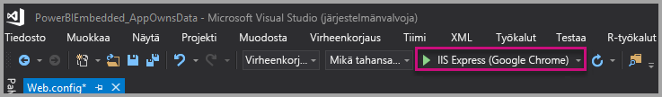
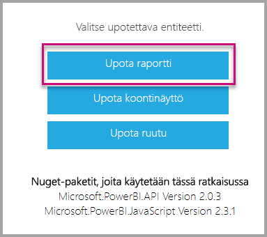

# <a name="tutorial-embed-power-bi-content-into-an-application-for-your-customers"></a>Opetusohjelma: Power BI -sisällön upottaminen sovellukseen asiakkaille

**Azuren Power BI Embeddedin** tai **Officen Power BI -upotuksen** avulla voit upottaa sovellukseen raportteja, raporttinäkymiä tai ruutuja käyttämällä app owns data -hakemiston malleja. **App owns data**-hakemiston malleja käytetään kun kyseessä on sovellus, joka käyttää Power BI:tä upotettuna analyysiympäristönään. **ISV:nä** tai **kehittäjänä** voit luoda Power BI -sisältöä, joka näyttää raportit, raporttinäkymät tai ruudut sovelluksessa, joka on täysin integroitu ja vuorovaikutteinen, edellyttämättä käyttäjiltä Power BI -käyttöoikeutta. Tämä opetusohjelma esittelee, miten raportti integroidaan sovellukseen Power BI .NET SDK:n ja Power BI JavaScript -ohjelmointirajapinnan avulla.


Tässä opetusohjelmassa opit:
> [!div class="checklist"]
> * Rekisteröimään sovelluksen Azuressa.
> * Upottamaan Power BI -raportin sovellukseen.

## <a name="prerequisites"></a>Edellytykset

Tarvitset seuraavat:

* Tarvitset [Power BI Pro -tilin](../../fundamentals/service-self-service-signup-for-power-bi.md) (päätili, jonka käyttäjänimellä ja salasanalla kirjaudut Power BI Pro -tilille) tai [palvelun päänimen (sovellustunnus)](embed-service-principal.md).
* Sinulla on oltava oma [Azure Active Directory -vuokraaja ](create-an-azure-active-directory-tenant.md) käyttövalmiina.

Jos et ole rekisteröitynyt **Power BI:hin**, [rekisteröi ilmainen kokeiluversio](https://powerbi.microsoft.com/pricing/) ennen aloittamista.

## <a name="set-up-your-embedded-analytics-development-environment"></a>Upotettujen analyysitoimintojen kehitysympäristön määrittäminen

Ennen kuin ryhdyt upottamaan raportteja, raporttinäkymiä tai ruutuja sovellukseesi, varmista, että ympäristösi sallii upottamisen Power BI:n avulla.

Voit käyttää [upottamisen määritystyökalua](https://aka.ms/embedsetup/AppOwnsData). Sillä pääset nopeasti alkuun ja sillä voit ladata mallisovelluksen, jossa käydään läpi sekä käyttöympäristön luominen että raportin upottaminen.

Jos haluat määrittää ympäristön manuaalisesti, jatka lukemista.

### <a name="register-an-application-in-azure-active-directory-azure-ad"></a>Sovelluksen rekisteröiminen Azure Active Directoryyn (Azure AD)

[Rekisteröi sovellus](register-app.md) Azure Active Directoryyn, jotta sovellus saa käyttöoikeuden [Power BI REST -ohjelmointirajapintoihin](https://docs.microsoft.com/rest/api/power-bi/). Kun rekisteröit sovelluksesi, voit määrittää sovelluksen käyttäjätiedot ja käyttöoikeudet Power BI REST -resursseihin. Se, käytätkö päätiliä vai [palvelun päänimeä](embed-service-principal.md), määrittää, miten voit aloittaa sovelluksen rekisteröimisen.

Valitsemasi tapa määrittää, millaisen sovelluksen rekisteröit Azureen.

Jos käytät päätiliä, rekisteröi **alkuperäinen** sovellus. Alkuperäistä sovellusta käytetään, koska käytät ei-vuorovaikutteista kirjautumista.

Jos käytät palvelun päänimeä, sinun täytyy rekisteröidä **palvelinpuolen verkkosovellus**. Rekisteröimällä palvelinpuolen verkkosovelluksen luot sovellussalaisuuden.

## <a name="set-up-your-power-bi-environment"></a>Power BI -ympäristön määrittäminen

### <a name="create-a-workspace"></a>Luo työtila

Jos upotat asiakkaille raportteja, raporttinäkymiä tai ruutuja, sisältö tulee sijoittaa työtilaan. Voit ottaa käyttöön erityyppisiä työtiloja: [perinteisiä työtiloja](../../collaborate-share/service-create-workspaces.md) tai [uusia työtiloja](../../collaborate-share/service-create-the-new-workspaces.md). Jos käytät *päätiliä*, käyttämiesi työtilojen tyypillä ei ole väliä. Jos kirjaudut sovellukseesi *[palvelun päänimellä](embed-service-principal.md)* , sinun täytyy käyttää uusia työtiloja. Molemmissa tapauksissa *päätilin* tai *palvelun päänimen* täytyy olla sovellukseesi liittyvien työtilojen järjestelmänvalvoja.

### <a name="create-and-publish-your-reports"></a>Luo ja julkaise raportteja

Voit luoda Power BI Desktopia käyttämällä raportteja ja tietojoukkoja ja julkaista raportit sitten työtilassa. Voit tehdä tämän kahdella tavalla: Loppukäyttäjänä voit julkaista raportteja perinteiseen työtilaan päätilillä (Power BI Pro -käyttöoikeutta). Jos käytät palvelun päänimeä, voit julkaista raportteja uusiin työtiloihin [Power BI REST -ohjelmointirajapinnoilla](https://docs.microsoft.com/rest/api/power-bi/imports/postimportingroup).

Alla annetaan ohjeet siihen, miten voit julkaista PBIX-raportin Power BI -työtilassasi.

1. Lataa malli [blogiesittely](https://github.com/Microsoft/powerbi-desktop-samples) GitHubista.

    

2. Avaa PBIX-raportti **Power BI Desktopissa**.

   

3. Julkaise **työtiloihin**. Tämä prosessi on erilainen siitä riippuen, käytätkö päätiliä (Power BI Pro -käyttöoikeus) vai palvelun päänimeä. Jos käytät päätiliä, voit julkaista raportin Power BI Desktopissa.  Jos käytät palvelun päänimeä, sinun täytyy käyttää Power BI REST -ohjelmointirajapintoja.

## <a name="embed-content-using-the-sample-application"></a>Sisällön upottaminen mallisovelluksen avulla

Tämä malli on tarkoituksellisesti yksinkertainen esittelyä varten. Sovellussalaisuuden tai päätilin tunnistetietojen suojaaminen on sinun ja sovelluskehittäjiesi vastuulla.

Voit aloittaa sisällön upottamisen mallisovelluksen avulla alla annettujen ohjeiden mukaisesti.

1. Lataa [Visual Studio](https://www.visualstudio.com/) (2013 tai uudempi versio). Muista ladata uusin [NuGet-paketti](https://www.nuget.org/profiles/powerbi).

2. Lataa ensin [App Owns Data -malli](https://github.com/Microsoft/PowerBI-Developer-Samples) GitHubista.

    

3. Avaa **Web.config**-tiedosto mallisovelluksessa. Sinun on täytettävä joitain kenttiä, jotta sovellus voidaan suorittaa. Voit valita **AuthenticationType**-asetuksen arvoksi **MasterUser** tai **ServicePrincipal**. Sinun täytyy käyttää eri kenttiä käyttämästäsi todennustavasta riippuen.

    > [!Note]
    > **AuthenticationType**-asetuksen oletusarvo tässä mallissa on MasterUser.

    <center>

    | **MasterUser** <br> (Power BI Pro -käyttöoikeus) | **ServicePrincipal** <br> (sovellustunnus)|
    |---------------|-------------------|
    | [applicationId](#application-id) | [applicationId](#application-id) |
    | [workspaceId](#workspace-id) | [workspaceId](#workspace-id) |
    | [reportId](#report-id) | [reportId](#report-id) |
    | [pbiUsername](#power-bi-username-and-password) |  |
    | [pbiPassword](#power-bi-username-and-password) |  |
    |  | [applicationsecret](#application-secret) |
    |  | [tenant](#tenant) |

   </center>

    

### <a name="application-id"></a>Sovelluksen tunnus

Tämä määrite on pakollinen molemmilla todennustavoilla (päätili ja [palvelun päänimi](embed-service-principal.md)).

Täytä **applicationId**-tiedot **Sovellustunnuksilla** **Azuresta**. **applicationID**:n avulla sovellus tunnistautuu käyttäjille, joilta pyydät käyttöoikeuksia.

Saat **ApplicationID**:n seuraavasti:

1. Kirjaudu sisään [Azure-portaaliin](https://portal.azure.com).

2. Valitse vasemmassa siirtymisruudussa **Kaikki palvelut** ja sitten **Sovelluksen rekisteröinnit**.

    

3. Valitse sovellus, joka tarvitsee **applicationId**-arvon.

    

4. Näet **sovellustunnuksen**, joka on merkitty GUID-tunnuksena. Käytä tätä **Sovellustunnusta** sovelluksen **applicationId**:nä.

    

### <a name="workspace-id"></a>Työtilan tunnus

Tämä määrite on pakollinen molemmilla todennustavoilla (päätili ja [palvelun päänimi](embed-service-principal.md)).

Anna **workspaceId**-kohtaan Power BI:n työtilan (ryhmän) GUID. Voit hakea nämä tiedot joko URL-osoitteesta, kun olet kirjautunut Power BI -palveluun, tai PowerShellin avulla.

URL-OSOITE <br>


Powershell <br>

```powershell
Get-PowerBIworkspace -name "App Owns Embed Test"
```

   

### <a name="report-id"></a>Raporttitunnus

Tämä määrite on pakollinen molemmilla todennustavoilla (päätili ja [palvelun päänimi](embed-service-principal.md)).

Anna **reportId**-kohtaan Power BI:n raportin GUID. Voit hakea nämä tiedot joko URL-osoitteesta, kun olet kirjautunut Power BI -palveluun, tai PowerShellin avulla.

URL-OSOITE<br>


Powershell <br>

```powershell
Get-PowerBIworkspace -name "App Owns Embed Test" | Get-PowerBIReport
```


### <a name="power-bi-username-and-password"></a>Power BI -käyttäjänimi ja -salasana

Näitä määritteitä tarvitaan vain, kun todennustyyppinä on päätili.

Jos todennat [palvelun päänimellä](embed-service-principal.md), sinun ei tarvitse antaa käyttäjänimen ja salasanan määritteitä.

* Lisää **pbiUsername**-kohtaan Power BI -päätili.
* Lisää **pbiPassword**-kohtaan Power BI -päätilin salasana.

### <a name="application-secret"></a>Sovellussalaisuus

Tämä määrite on pakollinen vain, kun käytät todennustyyppinä [palvelun päänimeä](embed-service-principal.md).

Täytä **ApplicationSecret** -tiedot **Avaimet**-osiosta **Sovelluksen rekisteröinnit** -kohdasta **Azuressa**.  Tämä määrite toimii, kun käytät [palvelun päänimeä](embed-service-principal.md).

Saat **ApplicationSecretin** seuraavasti:

1. Kirjaudu sisään [Azure-portaaliin](https://portal.azure.com).

2. Valitse vasemmassa siirtymisruudussa **Kaikki palvelut** ja valitse sitten **Sovelluksen rekisteröinnit**.

    

3. Valitse sovellus, joka käyttää **ApplicationSecretiä**.

    

4. Valitse **Varmenteet ja salaisuudet** kohdassa **Hallitse**.

5. Valitse **Uudet asiakassalaisuudet**.

6. Kirjoita nimi **Kuvaus**-ruutuun ja valitse kesto. Valitse sitten **Tallenna** saadaksesi sovellukselle **arvon**. Kun suljet **Avaimet**-ruudun avainarvon tallentamisen jälkeen, arvokenttä näkyy vain piilotettuna. Tässä vaiheessa et pysty noutamaan avaimen arvoa. Jos kadotat avainarvon, luo uusi Azure-portaalissa.

    

### <a name="tenant"></a>Vuokraaja

Tämä määrite on pakollinen vain, kun käytät todennustyyppinä [palvelun päänimeä](embed-service-principal.md).

Lisää **tenant**-kohtaan Azure-vuokraajatunnuksesi. Voit hakea nämä tiedot [Azure AD -hallintakeskuksesta](/onedrive/find-your-office-365-tenant-id), kun olet kirjautunut Power BI -palveluun, tai PowerShellin avulla.

### <a name="run-the-application"></a>Suorita sovellus

1. Valitse **Suorita** **Visual Studiossa**.

    

2. Valitse sitten **Upota raportti**. Riippuen siitä mitä sisältöä valitset testattavaksi - raportteja, raporttinäkymiä vai ruutuja - valitse kyseinen vaihtoehto sovelluksessa .

    

3. Voit nyt tarkastella raporttia mallisovelluksessa.

    

## <a name="embed-content-within-your-application"></a>Sisällön upottaminen sovellukseen

Vaikka sisältöä upotetaan [Power BI REST -ohjelmointirajapintojen](https://docs.microsoft.com/rest/api/power-bi/) avulla, tässä artikkelissa kuvatut esimerkkikoodit on luotu **.NET SDK:n** avulla.

Jos haluat upottaa sovellukseen sisältöä asiakkaillesi, tarvitset päätilillesi **käyttöoikeustietueen** tai [palvelun päänimen](embed-service-principal.md)**Azure AD:stä**. Sinun täytyy hankkia [Azure AD -käyttöoikeustietue](get-azuread-access-token.md#access-token-for-non-power-bi-users-app-owns-data) Power BI-sovelluksellesi, ennen kuin voit kutsua [Power BI REST -ohjelmointirajapintoja](https://docs.microsoft.com/rest/api/power-bi/).

Jotta voit luoda Power BI -asiakasohjelman **käyttöoikeustietueen** avulla, sinun on luotava Power BI -asiakasohjelmaobjekti, joka mahdollistaa vuorovaikutuksen [Power BI REST -ohjelmointirajapintojen](https://docs.microsoft.com/rest/api/power-bi/) kanssa. Power BI -asiakasohjelmaobjekti luodaan sijoittamalla **käyttöoikeustietue** ***Microsoft.Rest.TokenCredentials***-objektiin.

```csharp
using Microsoft.IdentityModel.Clients.ActiveDirectory;
using Microsoft.Rest;
using Microsoft.PowerBI.Api.V2;

var tokenCredentials = new TokenCredentials(authenticationResult.AccessToken, "Bearer");

// Create a Power BI Client object. it's used to call Power BI APIs.
using (var client = new PowerBIClient(new Uri(ApiUrl), tokenCredentials))
{
    // Your code to embed items.
}
```

### <a name="get-the-content-item-you-want-to-embed"></a>Upotettavan sisältökohteen hankkiminen

Power BI -asiakasohjelmaobjektin avulla voit noutaa viitteen upotettavalle kohteelle.

Tässä on koodimalli siitä, miten voit noutaa ensimmäisen raportin tietystä työtilasta.

*Malli sisältökohteen hankkimisesta sen mukaan, onko upotettava sisältökohde raportti, raporttinäkymä vai ruutu, on saatavilla [mallisovelluksen](https://github.com/Microsoft/PowerBI-Developer-Samples) Services\EmbedService.cs-tiedostosta.*

```csharp
using Microsoft.PowerBI.Api.V2;
using Microsoft.PowerBI.Api.V2.Models;

// You need to provide the workspaceId where the dashboard resides.
ODataResponseListReport reports = await client.Reports.GetReportsInGroupAsync(workspaceId);

// Get the first report in the group.
Report report = reports.Value.FirstOrDefault();
```

### <a name="create-the-embed-token"></a>Upotustunnuksen luominen
Luo upotustunnus, jota voidaan käyttää JavaScript-ohjelmointirajapinnasta. Ohjelmointirajapintoja on kahdenlaisia: Ensimmäisessä ryhmässä on viisi ohjelmointirajapintaa, joista kukin muodostaa tietyn kohteen upotustunnuksen. Toinen ryhmä, joka sisältää vain yhden ohjelmointirajapinnan, luo tunnuksen, jota voidaan käyttää useiden kohteiden upottamiseen.

**Ohjelmointirajapinnat, jotka on tarkoitettu tietyn kohteen upotustunnuksen luontiin**

Näiden ohjelmointirajapintojen avulla luotu upotustunnus on yksilöllinen upotettavalle kohteelle. Aina, kun upotat Power BI -kohteen (esimerkiksi raportin, koontinäytön tai ruudun) näiden ohjelmointirajapintojen avulla, sinun on luotava sille uusi upotustunnus.
* [Dashboards GenerateTokenInGroup](https://docs.microsoft.com/rest/api/power-bi/embedtoken/dashboards_generatetokeningroup)
* [Datasets GenerateTokenInGroup](https://docs.microsoft.com/rest/api/power-bi/embedtoken/datasets_generatetokeningroup)
* [Reports GenerateTokenForCreateInGroup](https://docs.microsoft.com/rest/api/power-bi/embedtoken/reports_generatetokenforcreateingroup)
* [Reports GenerateTokenInGroup](https://docs.microsoft.com/rest/api/power-bi/embedtoken/reports_generatetokeningroup)
* [Tiles GenerateTokenInGroup](https://docs.microsoft.com/rest/api/power-bi/embedtoken/tiles_generatetokeningroup)

Raportin, koontinäytön tai ruudun upotustunnuksen luomisen mallit ovat saatavilla [mallisovelluksen](https://github.com/Microsoft/PowerBI-Developer-Samples) seuraavista tiedostoista.
* Services\EmbedService.cs
* Models\EmbedConfig.cs
* Models\TileEmbedConfig.cs

Alla on koodi esimerkki raporttien generatetokeninengroup upotus Token-ohjelmointi raja pinnan käyttämisestä.
```csharp
using Microsoft.PowerBI.Api.V2;
using Microsoft.PowerBI.Api.V2.Models;

// Generate Embed Token.
var generateTokenRequestParameters = new GenerateTokenRequest(accessLevel: "view");
EmbedToken tokenResponse = client.Reports.GenerateTokenInGroup(workspaceId, report.Id, generateTokenRequestParameters);

// Generate Embed Configuration.
var embedConfig = new EmbedConfig()
{
    EmbedToken = tokenResponse,
    EmbedUrl = report.EmbedUrl,
    Id = report.Id
};
```

**Ohjelmointirajapinta, joka on tarkoitettu useiden kohteiden upotustunnuksen luontiin**<a id="multiEmbedToken"></a>

[Generate Token](https://docs.microsoft.com/rest/api/power-bi/embedtoken/generatetoken)-upotusohjelmointirajapinta luo tunnuksen, jota voidaan käyttää useiden kohteiden upottamiseen.

Sitä voidaan käyttää myös tietojoukon dynaamiseen valitsemiseen raportin upottamisen aikana. Lisätietoja tästä ohjelmointirajapinnan käytöstä on kohdassa [dynaaminen sidonta](embed-dynamic-binding.md).


Alla on esimerkki tämän ohjelmointirajapinnan käytöstä.
 
```csharp
using Microsoft.PowerBI.Api.V2;
using Microsoft.PowerBI.Api.V2.Models;

var reports = new List<GenerateTokenRequestV2Report>()
{ 
    new GenerateTokenRequestV2Report()
    {
        AllowEdit = false,
        Id = report1.Id
    },
    new GenerateTokenRequestV2Report()
    {
        AllowEdit = true,
        Id = report2.Id
    }
};

var datasets= new List<GenerateTokenRequestV2Dataset>()
{
    new GenerateTokenRequestV2Dataset(dataset1.Id),
    new GenerateTokenRequestV2Dataset(dataset2.Id),
    new GenerateTokenRequestV2Dataset(dataset3.Id),
};

var targetWorkspaces = new List<GenerateTokenRequestV2TargetWorkspace>()
{
    new GenerateTokenRequestV2TargetWorkspace(workspace1.Id),
    new GenerateTokenRequestV2TargetWorkspace(workspace2.Id),
};

var request = new GenerateTokenRequestV2()
{
    Datasets = datasetsRequestDetails ?? null,
    Reports = reportsRequestDetails,
    TargetWorkspaces = targetWSRequestdetials ?? null,
};

var token = client.GetClient().EmbedToken.GenerateToken(request);
```

### <a name="load-an-item-using-javascript"></a>Lataa kohde JavaScriptin avulla

Voit JavaScriptin avulla ladata raportin verkkosivun jako-elementtiin.

[Playground-työkalun](https://microsoft.github.io/PowerBI-JavaScript/demo) avulla saat kokonaisen mallin JavaScript-ohjelmointirajapinnan käytöstä. Tämä Playground-työkalu on nopea tapa kokeilla erilaisia Power BI Embedded -malleja. Saat lisätietoja JavaScript-ohjelmointirajapinnasta myös vierailemalla [Power BI-JavaScript wiki](https://github.com/Microsoft/powerbi-javascript/wiki) -sivulla.

Tässä mallissa käytetään **EmbedConfig**-mallia ja **TileEmbedConfig**-mallia yhdessä raportin näkymien kanssa.

*Malli näkymän lisäämisestä raporttia, koontinäyttöä tai ruutua varten on saatavilla [mallisovelluksen](#embed-content-using-the-sample-application) Views\Home\EmbedReport.cshtml-, Views\Home\EmbedDashboard.cshtml- tai Views\Home\Embedtile.cshtml-tiedostoissa.*

```javascript
<script src="~/scripts/powerbi.js"></script>
<div id="reportContainer"></div>
<script>
    // Read embed application token from Model
    var accessToken = "@Model.EmbedToken.Token";

    // Read embed URL from Model
    var embedUrl = "@Html.Raw(Model.EmbedUrl)";

    // Read report Id from Model
    var embedReportId = "@Model.Id";

    // Get models. models contains enums that can be used.
    var models = window['powerbi-client'].models;

    // Embed configuration used to describe what and how to embed.
    // This object is used when calling powerbi.embed.
    // This also includes settings and options such as filters.
    // You can find more information at https://github.com/Microsoft/PowerBI-JavaScript/wiki/Embed-Configuration-Details.
    var config = {
        type: 'report',
        tokenType: models.TokenType.Embed,
        accessToken: accessToken,
        embedUrl: embedUrl,
        id: embedReportId,
        permissions: models.Permissions.All,
        settings: {
            filterPaneEnabled: true,
            navContentPaneEnabled: true
        }
    };

    // Get a reference to the embedded report HTML element
    var reportContainer = $('#reportContainer')[0];

    // Embed the report and display it within the div container.
    var report = powerbi.embed(reportContainer, config);
</script>
```

## <a name="move-to-production"></a>Siirry tuotantoon

Kun olet nyt kehittänyt sovelluksesi, on aika varata työtilalle kapasiteettia. 

> [!Important]
> Varattua kapasiteettia tarvitaan kun siirrytään tuotantoon. Kaikki työtilat (raportit tai koontinäytöt sisältävät ja tietojoukot sisältävät) on määritettävä kapasiteetille.

### <a name="create-a-dedicated-capacity"></a>Luo varattua kapasiteettia

Luomalla varattua kapasiteettia voit hyötyä siitä, että asiakkaalle varataan tietty resurssi. Valittavanasi on kahdentyyppisiä kapasiteetteja:
* **Power BI Premium** – vuokraajatason Office 356: n tilaus, joka on saatavilla kahdesta SKU- perheestä, *EM* ja *P*. Kun upotat Power BI -sisältöä, tähän ratkaisuun viitataan nimellä *Power BI -upottaminen*. Lisätietoja tästä tilauksesta on kohdassa [Mikä on Power BI Premium?](../../admin/service-premium-what-is.md)
* **Azure Power BI Embedded** – voit ostaa varattua kapasiteettia [Microsoft Azure -portaalista](https://portal.azure.com). Tämä tilaus käyttää *A*-SKU:ita. Lisätietoa Power BI Embedded ‑kapasiteetin luomisesta saat ohjeaiheesta [Power BI Embedded -kapasiteetin luominen Azure-portaalissa](azure-pbie-create-capacity.md).
> [!NOTE]
> A-varastointiyksiköillä et pysty käyttämään Power BI -sisältöä ilmaisella Power BI -käyttöoikeudella.

Alla olevassa taulukossa kuvataan kunkin SKU:n resurssit ja rajoitukset. Jos haluat tarkistaa, mikä kapasiteetti sopii parhaiten tarpeisiisi, tarkastele [mikä SKU minun tulisi ostaa omaa skenaariotani varten ](https://docs.microsoft.com/power-bi/developer/embedded-faq#which-solution-should-i-choose)-taulukkoa.

| Kapasiteetin solmut | V-ytimiä yhteensä | Taustan v-ytimet | RAM (GB) | Edustan v-ytimet | DirectQuery/live-yhteys (sekunnissa) | Mallin uudelleen latauksen parallelisointi |
| --- | --- | --- | --- | --- | --- | --- |
| EM1/A1 | 1 | 0,5 | 2.5 | 0,5 | 3.75 | 1 |
| EM2/A2 | 2 | 1 | 5 | 1 | 7.5 | 2 |
| EM3/A3 | 4 | 2 | 10 | 2 | 15 | 3 |
| P1/A4 | 8 | 4 | 25 | 4 | 30 | 6 |
| P2/A5 | 16 | 8 | 50 | 8 | 60 | 12 |
| P3/A6 | 32 | 16 | 100 | 16 | 120 | 24 |
| | | | | | | |

### <a name="development-testing"></a>Kehitystestaus

Upotustunnusten käyttö Pro-käyttöoikeudella on tarkoitettu kehitystestaukseen, joten Power BI -päätili tai palvelun päänimi voi luoda vain rajallisen määrän upotettavia tunnuksia. Hyötykäyttöympäristössä upottamista varten täytyy ostaa varattua kapasiteettia. Varatun kapasiteetin avulla luotavien upotettavien tunnuksien määrää ei ole rajoitettu. Siirry [Käytettävissä olevat ominaisuudet](https://docs.microsoft.com/rest/api/power-bi/availablefeatures/getavailablefeatures) -kohtaan tarkistaaksesi käyttöarvon, joka ilmaisee nykyisen upotetun käytön prosenttilukuna. Käytettävä määrä on päätilikohtainen.

Lisätietoja on ohjeaiheessa [Upotetun analytiikan kapasiteetin suunnittelun tekninen raportti](https://aka.ms/pbiewhitepaper).

### <a name="assign-a-workspace-to-a-dedicated-capacity"></a>Määritä työtila varattuun kapasiteettiin

Kun olet luonut varatun kapasiteetin, voit määrittää työtilan kyseiselle varatulle kapasiteetille.

Kaikki työtilat, jotka sisältävät upotettuun sisältöön (mukaan lukien tietojoukot, raportit ja koontinäytöt) liittyviä Power BI -resursseja, on määritettävä varattuihin kapasiteetteihin. Jos esimerkiksi upotettu raportti ja siihen sidottu tietojoukko sijaitsevat eri työtiloissa, molemmat työtilat on määritettävä varattuun kapasiteettiin.

Jos haluat määrittää varatun kapasiteetin työtilalle [palvelun päänimellä](embed-service-principal.md), käytä [Power BI REST -ohjelmointirajapintaa](https://docs.microsoft.com/rest/api/power-bi/capacities/groups_assigntocapacity). Kun käytät Power BI REST -ohjelmointirajapintoja, muista käyttää [palvelun päänimen objektitunnusta](embed-service-principal.md).

Voit määrittää varatun kapasiteetin työtilalle **päätilillä** alla annettujen ohjeiden mukaisesti.

1. Laajenna **Power BI -palvelussa** työtiloja ja valitse ellipsikuvake työtilalle, jotka käytät sisällön upottamiseen. Valitse **Muokkaa työtiloja**.

    

2. Avaa **Lisäasetukset**, ota sitten käyttöön **Varattu kapasiteetti**, ja valitse luomasi varattu kapasiteetti. Valitse **Tallenna**.

    

3. **Tallennuksen** jälkeen työtilan nimen vieressä pitäisi näkyä **vinoneliö**.

    

## <a name="next-steps"></a>Seuraavat vaiheet

Tässä opetusohjelmassa olet oppinut, miten voit upottaa Power BI-sisältöä sovellukseen asiakkaillesi. Voit myös yrittää upottaa Power BI -sisältöä organisaatiollesi.

> [!div class="nextstepaction"]
>[Upottaminen organisaatiollesi](embed-sample-for-your-organization.md)

Onko sinulla kysyttävää? [Voit esittää kysymyksiä Power BI -yhteisössä](https://community.powerbi.com/)
