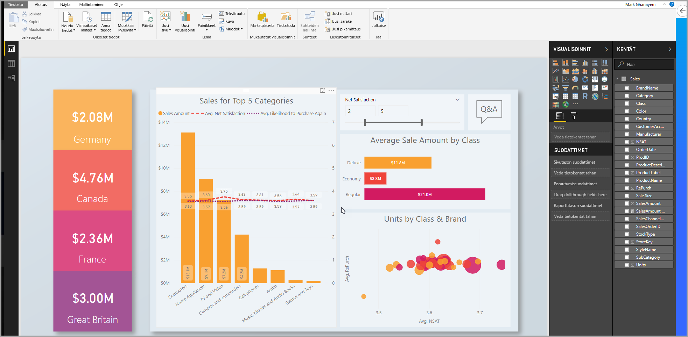
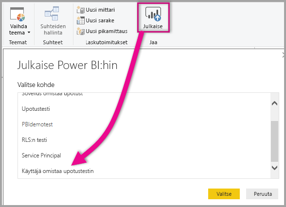
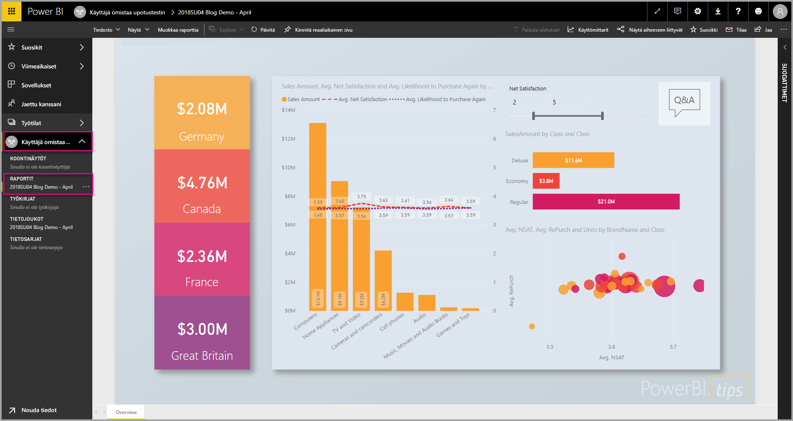
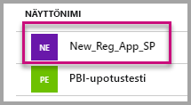
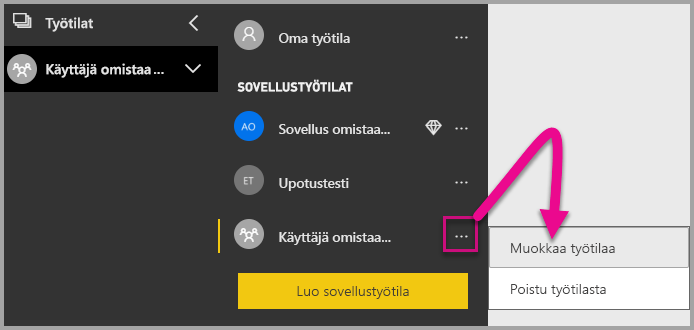
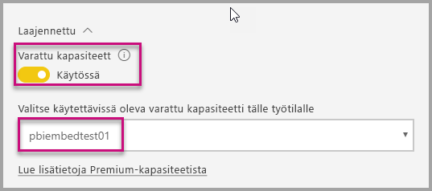
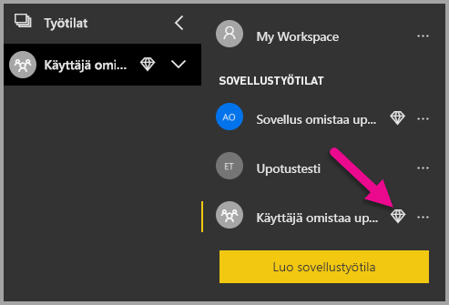

# <a name="tutorial-embed-power-bi-content-into-an-application-for-your-organization"></a>Opetusohjelma: Power BI -sisällön upottaminen sovellukseen organisaatiolle

**Power BI:ssä** voit upottaa sovellukseen raportteja (Power BI- tai sivutettuja raportteja), koontinäyttöjä tai ruutuja käyttämällä user owns data -malleja. **User owns data** -mallien avulla sovelluksesi voi laajentaa Power BI -palvelua niin, että se voi käyttää upotettua analysointia. Tässä opetusohjelmassa näytetään, miten voit integroida raportin (Power BI- tai sivutetun raportin) sovellukseen. Voit käyttää Power BI .NET SDK:ta sekä Power BI JavaScript -ohjelmointirajapintaa Power BI:n upottamiseksi sovellukseen organisaatiollesi.


Tässä opetusohjelmassa opit tekemään seuraavat asiat:
> [!div class="checklist"]
> * Rekisteröimään sovelluksen Azuressa.
> * Upottamaan Power BI- tai sivutetun raportin sovellukseen, joka käyttää Power BI -vuokralaistasi.

## <a name="prerequisites"></a>Edellytykset

Tarvitset seuraavat:

* [Power BI Pro -tili](../../fundamentals/service-self-service-signup-for-power-bi.md).
* Tarvitset [Microsoft Azure](https://azure.microsoft.com/) -tilauksen.
* Sinulla on oltava oma [Azure Active Directory -vuokraaja ](create-an-azure-active-directory-tenant.md) käyttövalmiina.
* Jos haluat upottaa sivutettuja raportteja, tarvitset vähintään P1-kapasiteetin. Katso kohta [Minkä kokoista Premium-kapasiteettia tarvitsen sivutettuja raportteja varten?](../../paginated-reports/paginated-reports-faq.md#what-size-premium-capacity-do-i-need-for-paginated-reports)

Jos et ole rekisteröitynyt **Power BI:hin**, [rekisteröi ilmainen kokeiluversio](https://powerbi.microsoft.com/pricing/) ennen aloittamista.

Jos sinulla ei ole Azure-tilausta, luo [ilmainen tili](https://azure.microsoft.com/free/?WT.mc_id=A261C142F) ennen aloittamista.

## <a name="set-up-your-embedded-analytics-development-environment"></a>Upotettujen analyysitoimintojen kehitysympäristön määrittäminen

Ennen kuin ryhdyt upottamaan raportteja, raporttinäkymiä tai ruutuja sovellukseesi, varmista, että ympäristösi sallii upottamisen Power BI:n avulla.

Voit käyttää [upottamisen määritystyökalua](https://aka.ms/embedsetup/UserOwnsData). Sillä pääset nopeasti alkuun ja sillä voit ladata mallisovelluksen, jossa käydään läpi sekä käyttöympäristön luominen että raportin upottaminen. Jos kyseessä on sivutetun raportin upottaminen, sinun on määritettävä vähintään P1-kapasiteetti luodulle työtilalle.

Jos haluat määrittää ympäristön manuaalisesti, jatka lukemista.

### <a name="register-an-application-in-azure-active-directory"></a>Sovelluksen rekisteröiminen Azure Active Directoryyn

[Rekisteröi sovellus](register-app.md) Azure Active Directoryyn, jotta sovellus saa käyttöoikeuden [Power BI REST -ohjelmointirajapintoihin](https://docs.microsoft.com/rest/api/power-bi/). Kun rekisteröit sovelluksesi, voit määrittää sovelluksen käyttäjätiedot ja käyttöoikeudet Power BI REST -resursseihin.

Sinun on suoritettava loppuun **palvelinpuolen verkkosovelluksen** rekisteröinti. Rekisteröimällä palvelinpuolen verkkosovelluksen luot sovellussalaisuuden.

Kun olet luonut sovelluksesi Azuressa, avaa sovelluksesi Azuressa, siirry *todentamisen* kohtaan ja lisää *uudelleenohjausten URI-osoitteiden* kohdassa *uudelleenohjauksen URI-osoitteeksi* **/Redirect**.

## <a name="set-up-your-power-bi-environment"></a>Power BI -ympäristön määrittäminen

### <a name="create-a-workspace"></a>Luo työtila

Jos upotat asiakkaille raportteja, raporttinäkymiä tai ruutuja, sisältö tulee sijoittaa työtilaan. Voit ottaa käyttöön erityyppisiä työtiloja: [perinteisiä työtiloja](../../collaborate-share/service-create-workspaces.md) tai [uusia työtiloja](../../collaborate-share/service-create-the-new-workspaces.md).

### <a name="create-and-publish-your-power-bi-reports"></a>Luo ja julkaise Power BI -raportteja

Voit luoda raportteja ja tietojoukkoja käyttämällä Power BI Desktopia. Voit sitten julkaista raportit työtilassa. Raportit julkaiseva loppukäyttäjä tarvitsee Power BI Pro ‑käyttöoikeudet työtilassa julkaisemiseen.

1. Lataa malli [Esittely](https://github.com/Microsoft/powerbi-desktop-samples) GitHubista.

    

2. Avaa .pbix-raporttimalli Power BI Desktopissa.

   

3. Julkaise työtilassa.

   

    Voit nyt tarkastella raporttia verkossa Power BI -palvelussa.

   
   
### <a name="create-and-publish-your-paginated-reports"></a>Luo ja julkaise sivutettuja raportteja

Voit luoda sivutettuja raportteja käyttämällä [Power BI -raportin muodostinta](../../paginated-reports/paginated-reports-report-builder-power-bi.md#create-reports-in-power-bi-report-builder). Sen jälkeen voit [ladata raportin](../../paginated-reports/paginated-reports-quickstart-aw.md#upload-the-report-to-the-service) työtilaan, jolle on määritetty vähintään P1-kapasiteetti. Raportin lataavalla käyttäjällä on oltava Power BI Pro -käyttöoikeus, jotta hän voi julkaista työtilassa.
   
## <a name="embed-your-content-by-using-the-sample-application"></a>Upota sisältöä mallisovelluksen avulla

Tämä malli on tarkoituksellisesti yksinkertainen esittelyä varten.

Voit aloittaa sisällön upottamisen mallisovelluksen avulla alla annettujen ohjeiden mukaisesti.

1. Lataa [Visual Studio](https://www.visualstudio.com/) (2013 tai uudempi versio). Muista ladata uusin [NuGet-paketti](https://www.nuget.org/profiles/powerbi).

2. Lataa [User Owns Data -malli](https://github.com/Microsoft/PowerBI-Developer-Samples) GitHubista aloittaaksesi.

    

3. Avaa mallisovelluksessa **Cloud.config**-tiedosto.

    Sinun on täytettävä joitain kenttiä, jotta sovellus voidaan suorittaa.

    | Kenttä |
    |--------------------|
    | **[Sovelluksen tunnus](#application-id)** |
    | **[Työtilan tunnus](#workspace-id)** |
    | **[Raporttitunnus](#report-id)** |
    | **[AADAuthorityUrl](#aadauthorityurl)** |

    

### <a name="application-id"></a>Sovelluksen tunnus

Täytä **applicationId**-tiedot **Sovellustunnuksilla** **Azuresta**. **applicationID**:n avulla sovellus tunnistautuu käyttäjille, joilta pyydät käyttöoikeuksia.

Saat **ApplicationID**:n seuraavasti:

1. Kirjaudu sisään [Azure-portaaliin](https://portal.azure.com).

2. Valitse vasemmassa siirtymisruudussa **Kaikki palvelut** ja sitten **Sovelluksen rekisteröinnit**.

3. Valitse sovellus, joka tarvitsee **applicationId**-arvon.

    

4. Näet **sovellustunnuksen**, joka on merkitty GUID-tunnuksena. Käytä tätä **Sovellustunnusta** sovelluksen **applicationId**:nä.

    

### <a name="workspace-id"></a>Työtilan tunnus

Anna **workspaceId**-kohtaan Power BI:n työtilan (ryhmän) GUID. Voit hakea nämä tiedot joko URL-osoitteesta, kun olet kirjautunut Power BI -palveluun, tai PowerShellin avulla.

URL-OSOITE <br>


PowerShell <br>

```powershell
Get-PowerBIworkspace -name "User Owns Embed Test"
```

   

### <a name="report-id"></a>Raporttitunnus

Anna **reportId**-kohtaan Power BI:n raportin GUID. Voit hakea nämä tiedot joko URL-osoitteesta, kun olet kirjautunut Power BI -palveluun, tai PowerShellin avulla.

Power BI -raportin URL-osoite <br>


Sivutettu raportin URL-osoite<br>


PowerShell <br>

```powershell
Get-PowerBIworkspace -name "User Owns Embed Test" | Get-PowerBIReport
```


### <a name="aadauthorityurl"></a>AADAuthorityUrl

Täytä kohdan **AADAuthorityUrl** tietoihin se URL-osoite, joka joko sallii upotuksen joko organisaation vuokraajaan tai vieraskäyttäjään.

Käytä organisaation vuokraajaan upottamiseen URL-osoitetta *https://login.microsoftonline.com/common/oauth2/authorize* .

Käytä vieraaseen upottamiseen URL-osoitetta `https://login.microsoftonline.com/report-owner-tenant-id`, jolloin korvaat kohdan *report-owner-tenant-id* raportin omistajan vuokraajatunnuksella.

### <a name="run-the-application"></a>Suorita sovellus

1. Valitse **Suorita** **Visual Studiossa**.

    

2. Valitse sitten **Upota raportti**. Riippuen siitä mitä sisältöä valitset testattavaksi - raportteja, raporttinäkymiä vai ruutuja - valitse kyseinen vaihtoehto sovelluksessa .

    

3. Voit nyt tarkastella raporttia mallisovelluksessa.

    

## <a name="embed-your-content-within-your-application"></a>Upota sisältö sovellukseen

Vaikka sisältöä voidaan upottaa [Power BI REST -ohjelmointirajapintojen](https://docs.microsoft.com/rest/api/power-bi/) avulla, tässä artikkelissa kuvatut esimerkkikoodit on luotu .NET SDK:n avulla.

Voit integroida raportin verkkosovellukseen käyttämällä Power BI REST -ohjelmointirajapintaa tai Power BI C# SDK:ta. Voit käyttää myös Azure Active Directory -käyttöoikeustietuetta raportin saamiseen. Voit sitten ladata raportin käyttämällä samaa käyttöoikeustietuetta. Power BI -ohjelmointirajapinta tarjoaa ohjelmallisen käyttöoikeuden tiettyihin Power BI -resursseihin. Katso lisätietoja artikkeleista [Power BI REST -ohjelmointirajapinta](https://docs.microsoft.com/rest/api/power-bi/) ja [Power BI JavaScript -ohjelmointirajapinta](https://github.com/Microsoft/PowerBI-JavaScript).

### <a name="get-an-access-token-from-azure-ad"></a>Hanki käyttöoikeustietue Azure AD:stä

Sinun on hankittava sovelluksessa käyttöoikeustietue Azure AD:stä, ennen kuin voit lähettää kutsuja Power BI REST -ohjelmointirajapintaan. Saat lisätietoja artikkelista [Käyttäjien todentaminen ja Azure AD -käyttöoikeustietueen hankkiminen Power BI -sovellukselle](get-azuread-access-token.md).

### <a name="get-a-report"></a>Hanki raportti

Voit hankkia Power BI- tai sivutetun raportin käyttämällä [Hanki raportit](https://docs.microsoft.com/rest/api/power-bi/reports/getreports) -toimintoa, joka antaa Power BI- tai sivutettujen raporttien luettelon. Saat raporttien luettelosta raporttitunnuksen.

### <a name="get-reports-by-using-an-access-token"></a>Hanki raportit käyttöoikeustietueen avulla

[Hanki raportit](https://docs.microsoft.com/rest/api/power-bi/reports/getreports) -toiminto palauttaa raporttiluettelon. Voit noutaa yksittäisen raportin raporttiluettelosta.

Jotta voit lähettää REST-ohjelmointirajapinnan kutsun, sinun on sisällytettävä *Valtuutus*-otsikko *Haltija {käyttöoikeustietue}* -muodossa.

#### <a name="get-reports-with-the-rest-api"></a>Raporttien hankinta REST-ohjelmointirajapinnan avulla

Seuraava koodiesimerkki näyttää, miten voit noutaa raportteja REST-ohjelmointirajapinnan avulla:

> [!Note]
> Esimerkki siitä, miten saat haluamasi sisältöyksikön, on nähtävissä Default.aspx.cs-tiedostossa [mallisovelluksessa](https://github.com/Microsoft/PowerBI-Developer-Samples). Esimerkkejä ovat raportti, koontinäyttö tai ruutu.

```csharp
using Newtonsoft.Json;

//Get a Report. In this sample, you get the first Report.
protected void GetReport(int index)
{
    //Configure Reports request
    System.Net.WebRequest request = System.Net.WebRequest.Create(
        String.Format("{0}/Reports",
        baseUri)) as System.Net.HttpWebRequest;

    request.Method = "GET";
    request.ContentLength = 0;
    request.Headers.Add("Authorization", String.Format("Bearer {0}", accessToken.Value));

    //Get Reports response from request.GetResponse()
    using (var response = request.GetResponse() as System.Net.HttpWebResponse)
    {
        //Get reader from response stream
        using (var reader = new System.IO.StreamReader(response.GetResponseStream()))
        {
            //Deserialize JSON string
            PBIReports Reports = JsonConvert.DeserializeObject<PBIReports>(reader.ReadToEnd());

            //Sample assumes at least one Report.
            //You could write an app that lists all Reports
            if (Reports.value.Length > 0)
            {
                var report = Reports.value[index];

                txtEmbedUrl.Text = report.embedUrl;
                txtReportId.Text = report.id;
                txtReportName.Text = report.name;
            }
        }
    }
}

//Power BI Reports used to deserialize the Get Reports response.
public class PBIReports
{
    public PBIReport[] value { get; set; }
}
public class PBIReport
{
    public string id { get; set; }
    public string reportType { get; set }
    public string name { get; set; }
    public string webUrl { get; set; }
    public string embedUrl { get; set; }
}
```

#### <a name="get-reports-by-using-the-net-sdk"></a>Raporttien hankinta .NET SDK:n avulla

.NET SDK:n avulla voit noutaa raporttiluettelon sen sijaan, että lähetät kutsun suoraan REST-ohjelmointirajapintaan. Seuraava koodiesimerkki näyttää, miten voit luetteloida raportteja:

```csharp
using Microsoft.IdentityModel.Clients.ActiveDirectory;
using Microsoft.PowerBI.Api.V2;
using Microsoft.PowerBI.Api.V2.Models;

var tokenCredentials = new TokenCredentials(<ACCESS TOKEN>, "Bearer");

// Create a Power BI Client object. It is used to call Power BI APIs.
using (var client = new PowerBIClient(new Uri(ApiUrl), tokenCredentials))
{
    // Get the first report all reports in that workspace
    ODataResponseListReport reports = client.Reports.GetReports();

    Report report = reports.Value.FirstOrDefault();

    var embedUrl = report.EmbedUrl;
}
```

### <a name="load-a-report-by-using-javascript"></a>Lataa raportti JavaScriptin avulla

Voit JavaScriptin avulla ladata raportin verkkosivun jako-elementtiin. Seuraava koodiesimerkki näyttää, miten voit noutaa raportin tietystä työtilasta:

> [!NOTE]  
> Esimerkki siitä, miten voit ladata upotettavan sisältöyksikön, on nähtävissä **Default.aspx.cs** -tiedostossa [mallisovelluksessa](https://github.com/Microsoft/PowerBI-Developer-Samples).

```javascript
<!-- Embed Report-->
<div> 
    <asp:Panel ID="PanelEmbed" runat="server" Visible="true">
        <div>
            <div><b class="step">Step 3</b>: Embed a report</div>

            <div>Enter an embed url for a report from Step 2 (starts with https://):</div>
            <input type="text" id="tb_EmbedURL" style="width: 1024px;" />
            <br />
            <input type="button" id="bEmbedReportAction" value="Embed Report" />
        </div>

        <div id="reportContainer"></div>
    </asp:Panel>
</div>
```

#### <a name="sitemaster"></a>Site.master

```javascript
window.onload = function () {
    // client side click to embed a selected report.
    var el = document.getElementById("bEmbedReportAction");
    if (el.addEventListener) {
        el.addEventListener("click", updateEmbedReport, false);
    } else {
        el.attachEvent('onclick', updateEmbedReport);
    }

    // handle server side post backs, optimize for reload scenarios
    // show embedded report if all fields were filled in.
    var accessTokenElement = document.getElementById('MainContent_accessTokenTextbox');
    if (accessTokenElement !== null) {
        var accessToken = accessTokenElement.value;
        if (accessToken !== "")
            updateEmbedReport();
    }
};

// update embed report
function updateEmbedReport() {

    // check if the embed url was selected
    var embedUrl = document.getElementById('tb_EmbedURL').value;
    if (embedUrl === "")
        return;

    // get the access token.
    accessToken = document.getElementById('MainContent_accessTokenTextbox').value;

    // Embed configuration used to describe the what and how to embed.
    // This object is used when calling powerbi.embed.
    // You can find more information at https://github.com/Microsoft/PowerBI-JavaScript/wiki/Embed-Configuration-Details.
    var config = {
        type: 'report',
        accessToken: accessToken,
        embedUrl: embedUrl
    };

    // Grab the reference to the div HTML element that will host the report.
    var reportContainer = document.getElementById('reportContainer');

    // Embed the report and display it within the div container.
    var report = powerbi.embed(reportContainer, config);

    // report.on will add an event handler which prints to Log window.
    report.on("error", function (event) {
        var logView = document.getElementById('logView');
        logView.innerHTML = logView.innerHTML + "Error<br/>";
        logView.innerHTML = logView.innerHTML + JSON.stringify(event.detail, null, "  ") + "<br/>";
        logView.innerHTML = logView.innerHTML + "---------<br/>";
    }
  );
}
```

## <a name="using-a-power-bi-premium-dedicated-capacity"></a>Power BI Premiumille varatun kapasiteetin käyttö

Kun olet nyt kehittänyt sovelluksesi, on aika varata työtilalle kapasiteettia.

### <a name="create-a-dedicated-capacity"></a>Luo varattua kapasiteettia

Luomalla varattua kapasiteettia voit hyödyntää sitä, että työtilan sisällölle varataan tietty resurssi. Sivutettujen raporttien osalta työtila on varmistettava vähintään P1-kapasiteetilla. Voit luoda varattua kapasiteettia käyttämällä [Power BI Premiumia](../../admin/service-premium-what-is.md).

Seuraavassa taulukossa esitetään Power BI Premiumin SKU:t, jotka ovat käytettävissä [Microsoft Office 365:ssä](../../admin/service-admin-premium-purchase.md):

| Kapasiteetin solmu | Näennäisytimiä yhteensä<br/>(tausta ja edusta) | Taustan näennäisytimet | Edustan näennäisytimet | DirectQueryn/live-yhteyden rajoitukset |
| --- | --- | --- | --- | --- | --- |
| EM1 |1 näennäisydin |0,5 näennäisydintä, 10 Gt RAM |0,5 näennäisydintä |3,75 sekunnissa |
| EM2 |2 näennäisydintä |1 näennäisydin, 10 Gt RAM |1 näennäisydin |7,5 sekunnissa |
| EM3 |4 näennäisydintä |2 näennäisydintä, 10 Gt RAM |2 näennäisydintä |15 sekunnissa |
| P1 |8 näennäisydintä |4 näennäisydintä, 25 Gt RAM |4 näennäisydintä |30 sekunnissa |
| P2 |16 näennäisydintä |8 näennäisydintä, 50 Gt RAM |8 näennäisydintä |60 sekunnissa |
| P3 |32 näennäisydintä |16 näennäisydintä, 100 Gt RAM |16 näennäisydintä |120 sekunnissa |
| P4 |64 näennäisydintä |32 näennäisydintä, 200 Gt RAM |32 näennäisydintä |240 sekunnissa |
| P5 |128 näennäisydintä |64 näennäisydintä, 400 Gt RAM |64 näennäisydintä |480 sekunnissa |

> [!NOTE]
> - Kun yrität upottaa Microsoft Office -sovelluksilla, EM SKU:iden avulla voit käyttää maksuttoman Power BI -käyttöoikeuden sisältöä. Et kuitenkaan voi käyttää sisältöä maksuttomalla Power BI -käyttöoikeudella, kun käytössäsi on Powerbi.com tai Power BI -mobiilisovellus.
> - Kun yrität upottaa Microsoft Office -sovelluksilla, Powerbi.comin tai Power BI -mobiilisovellusten avulla voit käyttää maksuttoman Power BI -käyttöoikeuden sisältöä.

### <a name="assign-a-workspace-to-a-dedicated-capacity"></a>Määritä työtila varattuun kapasiteettiin

Kun olet luonut varatun kapasiteetin, voit määrittää työtilan kyseiselle varatulle kapasiteetille. Seuraa näitä ohjeita:

1. Laajenna Power BI -palvelussa työtiloja ja valitse ellipsikuvake työtilalle, jota käytät sisällön upottamiseen. Valitse **Muokkaa työtiloja**.

    

2. Laajenna **Lisäasetukset**-kohta ja ota käyttöön **Varattu kapasiteetti**. Valitse luomasi varattu kapasiteetti. Valitse **Tallenna**.

    

3. **Tallennuksen** jälkeen työtilan nimen vieressä pitäisi näkyä vinoneliö.

    

## <a name="admin-settings"></a>Järjestelmänvalvojan asetukset

Yleiset järjestelmänvalvojat eli Power BI -palvelun järjestelmänvalvojat voivat ottaa käyttöön REST-ohjelmointirajapintojen käytön vuokraajassa ja poistaa sen käytöstä. Power BI ‑järjestelmänvalvojat voivat määrittää asetuksen koskemaan koko organisaatiota tai yksittäisiä käyttöoikeusryhmiä. Oletusarvoisesti se on käytössä koko organisaatiolle. Voit tehdä nämä muutokset [Power BI -hallintaportaalissa](../../admin/service-admin-portal.md).

## <a name="next-steps"></a>Seuraavat vaiheet

Tässä opetusohjelmassa olet oppinut, miten voit upottaa Power BI-sisältöä sovellukseen Power BI -organisaatiotiliä käyttämällä. Voit nyt yrittää upottaa Power BI -sisältöä sovellukseen sovellusten avulla. Voit myös yrittää upottaa Power BI -sisältöä asiakkaillesi (ei vielä tueta sivutettujen raporttien upottamisessa):

> [!div class="nextstepaction"]
> [Upottaminen sovelluksista](embed-from-apps.md)

> [!div class="nextstepaction"]
>[Upottaminen asiakkaillesi](embed-sample-for-customers.md)

Jos sinulla on lisää kysymyksiä, [voit esittää niitä Power BI -yhteisössä](https://community.powerbi.com/).
