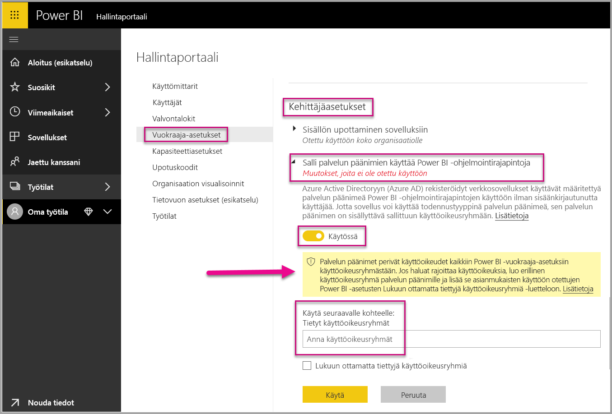
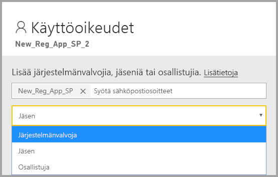

# <a name="embedding-power-bi-content-with-service-principal-and-application-secret"></a>Power BI sisällön upottaminen palvelun päänimeen ja sovelluksen salauskoodiin

[!INCLUDE[service principal overview](../../includes/service-principal-overview.md)]

Tässä artikkelissa kuvataan todentaminen palvelun päänimellä *sovellustunnuksen* ja *sovelluksen salauskoodin* avulla.

## <a name="method"></a>Menetelmä

Jos haluat käyttää palvelun päänimeä ja sovellustunnusta upotetussa analyysissa, toimi seuraavasti:

1. Luo [Azure AD -sovellus](https://docs.microsoft.com/azure/active-directory/manage-apps/what-is-application-management).

    1. Luo Azure AD -sovellus.
    
    2. Hanki sovelluksen *sovellustunnus* ja *sovelluksen salauskoodi*.

    >[!NOTE]
    >Nämä vaiheet on kuvattu **vaiheessa 1**. Lisätietoja Azure AD -sovelluksen luomisesta on artikkelissa [Azure AD-sovelluksen luominen](https://docs.microsoft.com/azure/active-directory/develop/howto-create-service-principal-portal).

2. Luo Azure AD:n käyttöoikeusryhmä.

3. Ota Power BI -palvelun järjestelmänvalvojan asetukset käyttöön.

4. Lisää palvelun päänimi työtilaasi.

5. Upota sisältö.

> [!IMPORTANT]
> Kun otat palvelun päänimen käyttöön käytettäväksi Power BI:n kanssa, sovelluksen AD-käyttöoikeudet eivät ole enää voimassa. Sovelluksen käyttöoikeuksia hallitaan tässä tapauksessa Power BI -hallintaportaalissa.

## <a name="step-1---create-an-azure-ad-app"></a>Vaihe 1 – Luo Azure AD -sovellus

Luo Azure AD -sovellus seuraavasti:
* Luo sovellus [Microsoft Azure -portaalissa](https://portal.azure.com/#allservices)
* Luo sovellus käyttämällä [PowerShelliä](https://docs.microsoft.com/powershell/azure/create-azure-service-principal-azureps?view=azps-3.6.1).

### <a name="creating-an-azure-ad-app-in-the-microsoft-azure-portal"></a>Sovelluksen luominen Microsoft Azure -portaalissa

1. Kirjaudu [Microsoft Azureen](https://portal.azure.com/#allservices).

2. Etsi **Sovelluksen rekisteröinnit** ja napsauta **Sovelluksen rekisteröinnit** -linkkiä.

    

3. Napsauta **Uusi rekisteröinti**.

    

4. Täytä tarvittavat tiedot:
    * **Nimi** – Anna nimi sovelluksellesi
    * **Tuetut tilityypit** – Valitse tarvittava Azure AD -tili
    * (Valinnainen) **Uudelleenohjauksen URI** – Anna URI tarvittaessa

5. Valitse **Rekisteröi**.

6. Rekisteröinnin jälkeen *Sovellustunnus* on käytettävissä **Yleiskatsaus**-välilehdessä. Kopioi ja tallenna *sovellustunnus* myöhempää käyttöä varten.

    

7. Napsauta **Varmenteet ja salasanat** -välilehteä.

     

8. Napsauta **Uusi asiakasohjelman salasana**

    

9. Kirjoita *Lisää asiakasohjelman salasana* -ikkunaan kuvaus, määritä asiakasohjelman salasanan vanhenemisajankohta ja napsauta **Lisää**.

10. Kopioi ja tallenna *Asiakasohjelman salasana* -arvo.

    

    >[!NOTE]
    >Kun poistut tästä ikkunasta, asiakasohjelman salasanan arvo piilotetaan etkä pysty lukemaan etkä kopioimaan sitä uudelleen.

### <a name="creating-an-azure-ad-app-using-powershell"></a>Azure AD -sovelluksen luominen PowerShellin avulla

Tässä osiossa on mallikomentosarja, jolla voit luoda uuden Azure AD -sovelluksen [PowerShellin](https://docs.microsoft.com/powershell/azure/create-azure-service-principal-azureps?view=azps-1.1.0) avulla.

```powershell
# The app ID - $app.appid
# The service principal object ID - $sp.objectId
# The app key - $key.value

# Sign in as a user that's allowed to create an app
Connect-AzureAD

# Create a new Azure AD web application
$app = New-AzureADApplication -DisplayName "testApp1" -Homepage "https://localhost:44322" -ReplyUrls "https://localhost:44322"

# Creates a service principal
$sp = New-AzureADServicePrincipal -AppId $app.AppId

# Get the service principal key
$key = New-AzureADServicePrincipalPasswordCredential -ObjectId $sp.ObjectId
```

## <a name="step-2---create-an-azure-ad-security-group"></a>Vaihe 2 – Luo Azure AD:n käyttöoikeusryhmä

Palvelun päänimellä ei ole käyttöoikeutta mihinkään Power BI -sisältöihisi eikä ohjelmointirajapintoihisi. Kun haluat antaa palvelun päänimelle käyttöoikeuden, luo käyttöoikeusryhmä Azure AD:ssä ja lisää luomasi palvelun päänimi kyseiseen käyttöoikeusryhmään.

Azure AD -käyttöoikeusryhmän luomiseen on kaksi tapaa:
* Manuaalinen (Azuressa)
* PowerShellin käyttäminen

### <a name="create-a-security-group-manually"></a>Käyttöoikeusryhmän luominen manuaalisesti

Jos haluat luoda Azure-käyttöoikeusryhmän manuaalisesti, noudata ohjeita artikkelissa [Perusryhmän luominen ja jäsenten lisääminen Azure Active Directoryssa](https://docs.microsoft.com/azure/active-directory/fundamentals/active-directory-groups-create-azure-portal). 

### <a name="create-a-security-group-using-powershell"></a>Käyttöoikeusryhmän luominen PowerShellin avulla

Alla on esimerkkikomentosarja, jolla luodaan uusi käyttöoikeusryhmä ja lisätään sovellus tähän käyttöoikeusryhmään.

>[!NOTE]
>Jos haluat ottaa käyttöön täydelliset käyttöoikeudet koko organisaation tasolla, ohita tämä vaihe.

```powershell
# Required to sign in as a tenant admin
Connect-AzureAD

# Create an Azure AD security group
$group = New-AzureADGroup -DisplayName <Group display name> -SecurityEnabled $true -MailEnabled $false -MailNickName notSet

# Add the service principal to the group
Add-AzureADGroupMember -ObjectId $($group.ObjectId) -RefObjectId $($sp.ObjectId)
```

## <a name="step-3---enable-the-power-bi-service-admin-settings"></a>Vaihe 3 – Ota Power BI -palvelun järjestelmänvalvojan asetukset käyttöön

Jotta Azure AD -sovellus voi käyttää Power BI -sisältöä ja ohjelmointirajapintoja, Power BI -järjestelmänvalvojan on otettava käyttöön palvelun päänimen käyttöoikeus Power BI -hallintaportaalissa.

Lisää Azure Active Directoryssa luomasi käyttöoikeusryhmä **kehittäjäasetusten** tietyn käyttöoikeusryhmän osiossa.

>[!IMPORTANT]
>Palvelun päänimillä on käyttöoikeus kaikkiin asetuksiin, jotka niille on otettu käyttöön. Järjestelmänvalvojan asetusten mukaan tämä sisältää tietyt käyttöoikeusryhmät tai koko organisaation.
>
>Jos haluat rajoittaa palvelun päänimen käyttöoikeuksia tiettyihin vuokraajan asetuksiin, salli käyttö vain tietyille käyttöoikeusryhmille. Vaihtoehtoisesti voit luoda erityisen käyttöoikeusryhmän palvelun päänimiä varten ja jättää sen pois halutuista vuokraajan asetuksista.



## <a name="step-4---add-the-service-principal-as-an-admin-to-your-workspace"></a>Vaihe 4 – Lisää palvelun päänimi järjestelmänvalvojaksi työtilaasi

Jos haluat Azure AD -sovelluksesi voivan käyttää Power BI -palvelussa artefakteja, kuten raportteja, koontinäyttöjä ja tietojoukkoja, lisää palvelun pääentiteetti jäseneksi tai järjestelmänvalvojaksi työtilaasi.

>[!NOTE]
>Tässä osiossa on käyttöliittymän ohjeet. Voit lisätä palvelun päänimen työtilaan myös valitsemalla [Ryhmät – Lisää ryhmän käyttäjän ohjelmointirajapinta](https://docs.microsoft.com/rest/api/power-bi/groups/addgroupuser).

1. Siirry sen työtilan kohdalle, jonka käyttöoikeuden haluat ottaa käyttöön, ja valitse **Lisää**-valikosta **Työtilan käyttöoikeus**.

    

2. Lisää palvelun päänimi **järjestelmänvalvojaksi** tai **jäseneksi** työtilaan.

    

## <a name="step-5---embed-your-content"></a>Vaihe 5 – Upota sisältö

Voit upottaa sisältöä mallisovellukseen tai omaan sovellukseesi.

* [Sisällön upottaminen mallisovelluksen avulla](embed-sample-for-customers.md#embed-content-using-the-sample-application)
* [Sisällön upottaminen oman sovelluksen avulla](embed-sample-for-customers.md#embed-content-within-your-application)

Kun sisältösi on upotettu, olet valmis [siirtymään tuotantoon](embed-sample-for-customers.md#move-to-production).

## <a name="considerations-and-limitations"></a>Huomioitavat asiat ja rajoitukset

* Palvelun päänimi toimii vain [uusien työtilojen](../../service-create-the-new-workspaces.md) kanssa.
* **Omaa työtilaa** ei tueta, kun käytät palvelun päänimeä.
* Tarvitset varattua kapasiteettia, kun siirryt hyötykäyttöön.
* Et voi kirjautua Power BI -portaaliin palvelun päänimellä.
* Power BI -järjestelmänvalvojan oikeuksia edellytetään, kun otat palvelun päänimen käyttöön Power BI -hallintaportaalin kehittäjäasetuksissa.
* Et voi asentaa tai hallita paikallista tietoyhdyskäytävää palvelun päänimellä.
* [Organisaatiosi upotetut sovellukset](embed-sample-for-your-organization.md) eivät voi käyttää palvelun päänimeä.
* [Tietovoiden](../../service-dataflows-overview.md) hallintaa ei tueta.
* Palvelun päänimi ei tällä hetkellä tue mitään järjestelmänvalvojien ohjelmointirajapintoja.
* Kun palvelun päänimeä käytetään [Azure Analysis Services](https://docs.microsoft.com/azure/analysis-services/analysis-services-overview) -tietolähteen avulla, palvelun päänimellä on itsellään oltava käyttöoikeudet Azure Analysis Services -esiintymään. Tähän ei riitä käyttöoikeusryhmä, joka sisältää palvelun päänimen.

## <a name="next-steps"></a>Seuraavat vaiheet

* [Power BI Embedded asiakkaillesi](embed-sample-for-customers.md)

* [Paikallista tietoyhdyskäytävää ja palvelun päänimeä käyttävä rivitason suojaus](embedded-row-level-security.md#on-premises-data-gateway-with-service-principal)