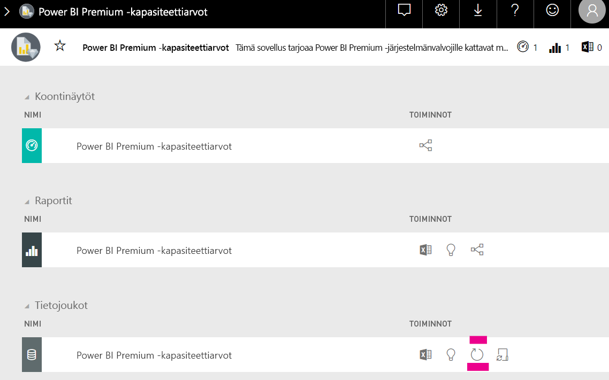

# Kapasiteetin suunnittelu Power BI Embedded -analytiikassa

Power BI Embedded -analytiikan vaatiman kapasiteettityypin laskeminen voi olla monimutkaista. Tämä johtuu siitä, että laskelma perustuu useisiin parametreihin, joista osan ennustaminen on vaikeaa.

Kun suunnittelet kapasiteettia, huomioi esimerkiksi seuraavat seikat:

* käyttämäsi tietomallit
* vaadittujen kyselyiden määrä ja monimutkaisuus
* sovelluksen käytön tuntikohtainen jakauma
* tietojen päivitysvälit
* muut käyttötavat, joiden ennakointi on vaikeaa.

Tämän artikkelin tarkoitus on helpottaa Power BI Embedded -analytiikan kapasiteetin suunnittelua. Olemme luoneet tätä tarkoitusta varten [Power BI Dedicated Capacity Load Assessment Tool](https://github.com/microsoft/PowerBI-Tools-For-Capacities/tree/master/LoadTestingPowerShellTool/) -työkalun, jolla voit automatisoida Power BI Embedded -analytiikkakapasiteettien kuormitustestausta (*A*-, *EM*- ja *P*-versiot).

## Suunnittelutyökalu

 [Power BI Dedicated Capacity Load Assessment Tool](https://github.com/microsoft/PowerBI-Tools-For-Capacities/tree/master/LoadTestingPowerShellTool/) voi auttaa sinua kartoittamaan, paljonko käyttäjäkuormitusta kapasiteettisi kestää. Se luo PowerShellillä automaattisia kuormitustestejä kapasiteeteillesi ja antaa sinun valita testattavat raportit sekä simuloitavien samanaikaisten käyttäjien määrän.

Työkalu luo kuormitusta kapasiteetille hahmontamalla jatkuvasti kutakin raporttia uusilla suodatinarvoilla (estääkseen epärealistisen hyvän suorituskyvyn raporttien välimuistitallennuksen johdosta), kunnes tunnus työkalun todentamiseksi palvelussa vanhentuu.

### Suunnittelutyökalun käyttäminen

Kun käytät työkalua, huomioi kapasiteettiesi nykyinen kuormitus. Älä suorita kuormitustestejä, kun käyttö on vilkasta.

Tässä on joitain esimerkkejä siitä, miten voit käyttää suunnittelutyökalua.

* Kapasiteetin järjestelmänvalvojat voivat saada paremman kuvan siitä, kuinka monta käyttäjää kapasiteetti kykenee palvelemaan tietyssä ajassa.
* Raportin tekijät voivat saada paremman kuvan käyttäjäkuormituksen vaikutuksista (mitataan Power BI Desktopin [suorituskyvyn analysoinnilla](https://docs.microsoft.com/power-bi/desktop-performance-analyzer)).
* Näet hahmonnukset reaaliaikaisesti selaimessasi.
* SQL Serverin profiloinnilla voit yhdistää mitattavien kapasiteettien [XMLA-päätepisteisiin](https://powerbi.microsoft.com/blog/power-bi-open-platform-connectivity-with-xmla-endpoints-public-preview/) nähdäksesi kyselyiden suorittamisen.
* Kuormitustestin vaikutukset näkyvät Premium-kapasiteetin mittarisovelluksen tietojoukkojen sivulla. Kapasiteetin järjestelmänvalvojat voivat luoda tällä työkalulla kuormitusta ja seurata sitä.

### Testitulosten tarkistaminen

Voit tarkistaa kuormitustestin tulokset testin suorittamisen jälkeen mittarisovelluksessa alla annettujen ohjeiden mukaisesti. Kuormituksen luomisen alkamisen jälkeen voi kulua jopa 15 minuuttia, ennen kuin kuormitus näkyy mittareissa.

1. Laajenna [mittarisovelluksen**aloitussivun**tietojoukkojen](../../service-admin-premium-monitor-capacity.md) välilehti.
2. Napsauta **Päivitä nyt**. Järjestelmänvalvojien tulisi toimia näin.

    

## Power BI -kapasiteettityökalujen GitHub-säilö

[Power BI -kapasiteettityökalujen GitHub-säilö](https://github.com/microsoft/PowerBI-Tools-For-Capacities) luotiin kapasiteetin suunnittelutyökalua ja muita tulevia työkaluja ja apuohjelmia varten.

Säilö on avointa lähdekoodia. Käyttäjiä kannustetaan osallistumaan, lisäämään muita Power BI Premiumiin ja Embeddediin liittyviä työkaluja sekä parantamaan nykyisiä.

## Seuraavat vaiheet

> [!div class="nextstepaction"]
>[Kapasiteetti ja SKU-versiot Power BI Embedded -analytiikassa](embedded-capacity.md)

> [!div class="nextstepaction"]
>[Power BI Embeddedin suorituskykyä parantavat parhaat käytännöt](embedded-performance-best-practices.md)