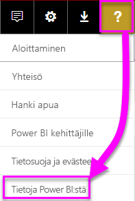
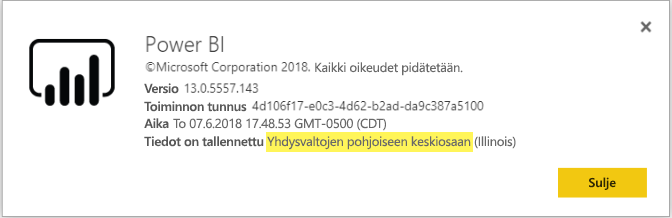

# <a name="frequently-asked-questions-about-power-bi-embedded"></a>Usein kysyttyjä kysymyksiä – Power BI Embedded

* Jos sinulla on muita kysymyksiä, [voit esittää niitä Power BI -yhteisössä](https://community.powerbi.com/).
* Eikö ongelma ratkennut? Vieraile [Power BI -tukisivulla](https://powerbi.microsoft.com/support/).

## <a name="general"></a>Yleiset

### <a name="what-is-power-bi-embedded"></a>Mikä Power BI Embedded on?

[Microsoft Power BI Embeddedin (PBIE)](azure-pbie-what-is-power-bi-embedded.md) avulla sovelluskehittäjät voivat upottaa näyttäviä, täysin interaktiivisia raportteja sovelluksiin ilman, että heidän tarvitsee luoda omia tietojen visualisointeja ja ohjausobjekteja alusta alkaen itse.

### <a name="who-is-the-target-audience-for-power-bi-embedded"></a>Mikä on Power BI Embeddedin kohderyhmä?

Kehittäjät ja ohjelmistoyritykset, joita kutsutaan riippumattomiksi ohjelmistotoimittajiksi (ISV).

### <a name="how-is-power-bi-embedded-different-from-power-bi-the-service"></a>Miten Power BI Embedded poikkeaa Power BI -palvelusta?

Power BI on ohjelmisto palveluna -tyyppinen analytiikkaratkaisu, joka mahdollistaa organisaatioille kriittisimpien liiketoimintatietojen tarkastelun yhdessä näkymässä.

Microsoft kehitti Power BI Embeddedin riippumattomille ohjelmistotoimittajille, jotka haluavat upottaa visualisointeja sovelluksiinsa auttaakseen asiakkaitaan tekemään analyyseihin perustuvia päätöksiä. Näin ohjelmistotoimittajien ei tarvitse luoda omia analyysiratkaisujaan. [Upotetut analyysitoiminnot](embedding.md) mahdollistavat yrityskäyttäjille pääsyn liiketoimintatietoihin sekä niihin perustuvat kyselyt, joiden avulla niistä voidaan luoda sovelluksessa merkityksellisiä tietoja.


### <a name="what-is-the-difference-between-power-bi-premium-and-power-bi-embedded"></a>Mikä on Power BI Premiumin ja Power BI Embeddedin välinen ero?

Power BI Premium on optimoitu yrityksille, jotka haluavat täydellisen BI-ratkaisun, joka mahdollistaa organisaation, kumppanien, asiakkaiden ja toimittajien tietojen tarkastelun yhdessä näkymässä. Power BI Premium auttaa organisaatiotasi tekemään päätöksiä. Power BI Premium on SaaS-tuote, jonka käyttäjät voivat käyttää sisältöä mobiilisovelluksen, sisäisesti kehitettyjen sovellusten ja Power BI -portaalin kautta.

Power BI Embedded on ISV-kumppaneille, jotka haluavat upottaa visualisointeja sovelluksinsa. Power BI Embedded auttaa asiakkaitasi tekemään päätöksiä, sillä se on suunnattu sovelluskehittäjille, joiden sovelluksia käyttävät asiakkaat voivat käyttää Power BI Embedded -kapasiteettiin tallennettua sisältöä organisaation sisällä tai ulkopuolella. Power BI Embedded -kapasiteetin sisältöä ei voida jakaa yhden napsautuksen julkaisulla verkkoon tai yhden napsautuksen julkaisulla SharePointiin.

### <a name="what-is-the-microsoft-recommendation-for-when-a-customer-should-buy-power-bi-premium-vs-power-bi-embedded"></a>Mikä on Microsoftin suositus sen suhteen, milloin asiakkaan kannattaa ostaa Power BI Premium ja milloin Power BI Embedded?

Microsoft suosittelee, että yritykset ostaisivat omatoimisen, yritystason Power BI Premium -BI-pilviratkaisun. Suosittelemme ISV-kumppaneita ostamaan Power BI Embeddedin, jotta he saavat käyttöönsä sen pilvipohjaiset upotetut analyysitoiminnot. Asiakkaat voivat kuitenkin ostaa haluamansa tuotteen ilman rajoituksia.

Joissain tapauksissa (tavallisesti suuri) ISV haluaa käyttää P-varastointiyksikköä saadakseen organisaatiolleen esimääritetyn Power BI -palvelun hyödyt sekä upotusmahdollisuuden sovelluksiin. Jotkin yritykset voivat päättää käyttää A-varastointiyksikköjä Azuressa, jos niitä kiinnostaa vain yrityssovellusten kehittäminen ja analyysitoimintojen upottaminen näihin sovelluksiin esimääritetyn Power BI -palvelun käytön sijaan.

### <a name="how-many-embed-tokens-can-i-create"></a>Kuinka monta upotettavaa tunnusta voit luoda?

PRO-käyttöoikeudella upotettavat tunnukset on tarkoitettu kehitystestaukseen, joten Power BI -päätili tai [palvelun päänimi](embed-service-principal.md) voi luoda vain rajallisen määrän upotettavia tunnuksia. Jos haluat upottaa hyötykäyttöympäristössä, [osta kapasiteettia](#technical). Kun ostat kapasiteettia, voit luoda upotustunnuksia rajattomasti. Siirry [Käytettävissä olevat ominaisuudet](https://docs.microsoft.com/rest/api/power-bi/availablefeatures) -kohtaan tarkistaaksesi käyttöarvon, joka ilmaisee nykyisen upotetun käytön prosenttilukuna.

## <a name="technical"></a>Tekniset

### <a name="where-can-i-learn-more-about-capacity-and-skus-in-power-bi-embedded-analytics"></a>Mistä saan tietää enemmän kapasiteetista ja SKU:sta Power BI:n upotetussa analytiikassa?

Katso artikkelia [Kapasiteetti ja SKU Power BI:n upotetussa analytiikassa](embedded-capacity.md).

### <a name="what-are-the-prerequisites-for-creating-a-pbie-capacity-in-azure"></a>Mitkä ovat ennakkoedellytykset PBIE-kapasiteetin luomiseksi Azuressa?

* Kirjaudu organisaation hakemistoon (Microsoft-tilejä ei tueta).
* Sinulla on oltava Power BI -vuokraaja, eli vähintään yhden käyttäjän hakemistossasi on täytynyt rekisteröityä Power BI:n käyttäjäksi. 
* Sinulla täytyy olla Azure-tilaus organisaatiosi hakemistossa.

### <a name="how-can-i-monitor-power-bi-embedded-capacity-consumption"></a>Miten voin valvoa Power BI Embedded -kapasiteetin käyttöä?

* Käyttämällä [Power BI -hallintaportaalia](../../service-admin-portal.md#power-bi-embedded).

* Lataamalla [mittausarvosovelluksen](https://docs.microsoft.com/power-bi/service-admin-premium-monitor-capacity) Power BI:ssä.

* Käyttämällä [Azuren diagnostiikan kirjausta](azure-pbie-diag-logs.md).

### <a name="can-my-capacity-scale-automatically-to-adjust-to-my-app-consumption"></a>Voiko kapasiteettini skaalautua automaattisesti sovellukseni kulutuksen mukaiseksi?

Automaattista skaalausta ei tällä hetkellä ole tarjolla, mutta kaikki ohjelmointirajapinnat ovat skaalattavissa milloin tahansa.

### <a name="why-creatingscalingresuming-a-capacity-results-in-putting-the-capacity-into-a-suspended-state"></a>Miksi kapasiteetin luominen/skaalaaminen/jatkaminen aiheuttaa sen, että kapasiteetti siirtyy keskeytettyyn tilaan?

Kapasiteetin valmistelu (skaalaaminen/jatkaminen/luominen) voi epäonnistua. Voit käyttää tietojen noutorajapintaa kapasiteetin valmistelun tilan tarkistamiseen: [Kapasiteetit – Nouda tiedot](https://docs.microsoft.com/rest/api/power-bi-embedded/capacities/getdetails).

### <a name="can-i-only-create-power-bi-embedded-capacities-in-a-specific-region"></a>Voinko luoda Power BI Embedded -kapasiteetteja vain tietyllä alueella?

[Multi-Geo (esikatselu)](embedded-multi-geo.md) -toiminnon avulla voit ostaa [Power BI Embedded -kapasiteetteja](azure-pbie-create-capacity.md) myös muualla kuin Power BI -kotivuokraajan sijainnissa

### <a name="why-cant-i-see-a-workspace-although-i-have-permissions"></a>Miksi en näe työtilaa, vaikka minulla on oikeudet?

Kun käyttäjä on myöntänyt oikeudet työtilaan, sovellukseen tai artefaktiin, se ei ehkä ole heti käytettävissä API-kutsujen kautta.
Tulos voi olla joko noudon ”artefakti puuttuu”- tai artefaktin käyttövirhe.
Käyttäjä voi ratkaista tämän ongelman [refreshUserPermissions-ohjelmointirajapinnan](https://docs.microsoft.com/rest/api/power-bi/users/refreshuserpermissions) kutsulla, joka päivittää käyttöoikeudet.


### <a name="how-can-i-find-my-pbi-tenant-region"></a>Miten voin selvittää oman PBI-vuokraajan alueeni?

Voit selvittää PBI-vuokraajan alueesi PBI-portaalin avulla.

[https://app.powerbi.com/](`https://app.powerbi.com/`) > ? > Tietoja Power BI:stä




### <a name="what-does-the-cloud-solution-provider-csp-channel-support"></a>Mitä Cloud Solution Provider (CSP) -kanavan kautta tuetaan?

* Voit luoda PBIE:n vuokraajalle CSP-tilaustyypillä
* Kumppanitili voi kirjautua sisään asiakkaan vuokraajaan ja hankkia PBIE:n asiakkaan vuokraajalle. Tällöin asiakkaan vuokraajan käyttäjälle on määritettävä Power BI -kapasiteetin järjestelmänvalvojan oikeudet.

### <a name="why-do-i-get-an-unsupported-account-message"></a>Miksi saan tukematonta tiliä koskevan viestin?

Power BI edellyttää kirjautumista sisään organisaation tilillä. Sovellus ei tue kirjautumista sisään Power BI:hin Microsoft-tilin avulla.

### <a name="can-i-use-apis-to-create-and-manage-azure-capacities"></a>Voinko luoda ja hallita Azure-kapasiteetteja ohjelmointirajapintojen avulla?

Kyllä. Voit luoda ja hallita PBIE-resursseja Powershellin cmdlet-komentojen ja Azure Resource Manager -ohjelmointirajapintojen avulla.

* [REST-ohjelmointirajapinnat](https://docs.microsoft.com/rest/api/power-bi-embedded/) 
* [Powershellin cmdlet-komennot](https://docs.microsoft.com/powershell/module/azurerm.powerbiembedded/)

### <a name="what-is-the-pbi-embedded-dedicated-capacity-role-in-a-pbi-embedded-solution"></a>Mikä on PBI Embeddedin varatun kapasiteetin rooli PBI Embedded -ratkaisussa?

Jos haluat [viedä ratkaisusi hyötykäyttöön](embed-sample-for-customers.md#move-to-production), sinun on määritettävä sovelluksesi käyttämä Power BI -sisältö (työtila) Power BI Embedded -kapasiteetille eli SKU:lle.

### <a name="in-what-azure-regions-is-pbi-embedded-available"></a>Millä Azure-alueilla PBI Embedded on käytettävissä?

[PAM](https://ecosystemmanager.azurewebsites.net/home) (EcoManager) – kysy asiaa tuotteen saatavuudesta vastaavalta esimieheltä

Saatavilla olevat alueet (16 – samat alueet kuin Power BI)

* Yhdysvallat (6) – Itä-Yhdysvallat, Itä-Yhdysvallat 2, Yhdysvaltojen pohjoinen keskiosa, Yhdysvaltojen eteläinen keskiosa, Länsi-Yhdysvallat, Länsi-Yhdysvallat 2
* Eurooppa (2) – Pohjois-Eurooppa, Länsi-Eurooppa
* Tyynenmeren Aasia (2) – Kaakkois-Aasia, Itä-Aasia
* Brasilia (1) – Brasilia, eteläinen
* Japani (1) – Japani, itä
* Australia (1) – Kaakkois-Australia
* Intia (1) – Länsi-Intia
* Kanada (1) – Kanada, keskinen
* Yhdistynyt kuningaskunta (1) – Yhdistynyt kuningaskunta, eteläinen

### <a name="what-is-power-bi-embeddeds-authentication-model"></a>Mikä on Power BI Embeddedin todennusmalli?

Power BI Embedded käyttää edelleen Azure AD:tä pääkäyttäjän (nimetty käyttäjä, jolla on Power BI Pro -käyttöoikeus) todennukseen tai [palvelun päänimeä](embed-service-principal.md) sovelluksen todentamiseen Power BI:ssä.  

 ISV-toimittaja voi ottaa sovelluksilleen käyttöön omia todennus- ja valtuutusmenetelmiä.

Voit käyttää olemassa olevaa hakemistoa, jos sinulla jo on Azure AD -vuokraaja. Voit myös luoda uuden Azure AD -vuokraajan upotetun sovelluksen sisällön suojaamista varten.

Voit hankkia AAD-tunnuksen jollain [Azure Active Directory -todennuskirjastolla](https://docs.microsoft.com/azure/active-directory/develop/active-directory-authentication-libraries). Asiakaskirjastot ovat saatavilla useille alustoille.

### <a name="my-application-already-uses-aad-for-user-authentication-how-can-we-use-this-identity-when-authenticating-to-power-bi-in-a-user-owns-data-scenario"></a>Oma sovellus käyttää jo AAD:tä käyttäjien todentamiseen. Miten voimme käyttää tätä identiteettiä, kun todennamme Power BI: hin ”Käyttäjä omistaa tiedot” -skenaariossa?

Kyse on OAuth-vakiotodennuksesta toisten puolesta suoritettavassa työnkulussa (<https://docs.microsoft.com/azure/active-directory/develop/web-api>). Sovellus on määritettävä siten, että se edellyttää käyttöoikeuksia Power BI -palveluun (vaadittujen soveltamisalueiden kanssa). Kun olet antanut käyttäjätunnuksen sovellukseen, voit kutsua ADAL API AcquireTokenAsyncin käyttämällä käyttäjätunnusta ja määrittämällä Power BI -resurssin URL-osoitteen resurssin tunnukseksi:

```csharp
var context = new AD.AuthenticationContext(authorityUrl);
var userAssertion = new AD.UserAssertion(userAccessToken);
var clientAssertion = new AD.ClientAssertionCertificate(MyAppId, MyAppCertificate)
var authenticationResult = await context.AcquireTokenAsync(resourceId, clientAssertion, userAssertion);
```

### <a name="what-object-id-is-the-service-principal-object-id"></a>Mikä on palvelun päänimen objektitunnus?

*Objektitunnus* on rekisteröidyn sovelluksen pääikkunassa näytettävä sovelluksen objektitunnus.

Käytä objektitunnusta, joka sijaitsee kohdassa *Hallittu sovellus paikallisessa hakemistossa > Ominaisuudet*. Tämä objektitunnus viittaa palvelun päänimeen toimintojen aikana ja tehtäessä muutoksia palvelun päänimen objektitunnukseen. Esimerkkitapaus on palvelun päänimen käyttäminen työtilan järjestelmänvalvojana.

### <a name="how-is-power-bi-embedded-different-from-other-azure-services"></a>Miten Power BI Embedded poikkeaa muista Azure-palveluista?

Sinulla on oltava Power BI -tili, jotta voit ostaa Power BI Embeddedin Azuressa. Oma Power BI Embedded -käyttöönottoalueesi määrittää Power BI -tilisi. Hallitse Power BI Embedded -resurssia Azuressa seuraavien toimintojen suorittamiseksi:

* Skaalaus ylös/alas
* Kapasiteetin järjestelmänvalvojien lisääminen
* Palvelun keskeytys/jatkaminen

PowerBI.comissa voit määrittää työtiloja Power BI Embedded -kapasiteettiin tai poistaa niiden määrityksen.

### <a name="what-content-pack-data-types-can-you-embed"></a>Mitä sisältöpaketin tyyppejä voidaan upottaa?

*Et voi* upottaa **raporttinäkymiä** ja **ruutuja**, jotka on muodostettu sisältöpakettien tietojoukoista. *Voit* kuitenkin upottaa **raportteja**, jotka on muodostettu sisältöpakettien tietojoukoista.

### <a name="what-is-the-difference-between-using-row-level-security-rls-vs-javascript-filters"></a>Mitä eroa on rivitason suojauksen (RLS) ja JavaScript-suodattimien käyttämisessä?

RLS- ja JavaScript-suodattimien väliltä valitseminen aiheuttaa usein sekaannusta, koska toisella menetelmällä hallitaan sisältöä, jonka tietty käyttäjä voi nähdä, ja toisella optimoidaan käyttäjän näkymää.

Rivitason suojauksella ISV-kehittäjä hallitsee tietojen suodatusta osana mallin ja upotustunnuksen luomista. Käyttäjä näkee vain sen, mitä ISV sallii käyttäjän näkevän. Tässä tapauksessa käyttäjä voi halutessaan nähdä vähemmän kuin mitä suodatetaan, mutta hän ei voi ohittaa rivitason suojauksen määritystä ja nähdä enempää kuin mitä sallitaan.

Asiakaspuolen suodatuksella (JavaScript) ISV voi päättää, mitä käyttäjä näkee alkunäkymässä, mutta ei voi hallita muutoksia, joita käyttäjä saattaa tehdä itse näkymään. Koska Javascript-asiakaskoodi voi käynnistää tietojen suodattamisen taustajärjestelmässä, sitä ei voida pitää turvallisena.

Lisätietoja on artikkelissa [Rivitason suojaus JavaScript-suodattimiin verrattuna](embedded-row-level-security.md#using-rls-vs-javascript-filters).

### <a name="how-do-i-manage-permissions-for-service-principals-with-power-bi"></a>Miten voin hallita palvelun päänimien käyttöoikeuksia Power BI:llä?

Kun otat [palvelun päänimen](embed-service-principal.md) käyttöön käytettäväksi Power BI:n kanssa, sovelluksen AD-käyttöoikeudet eivät ole enää voimassa. Sovelluksen käyttöoikeuksia hallitaan tässä tapauksessa Power BI -hallintaportaalissa.

Palvelun päänimet perivät käyttöoikeudet kaikkiin Power BI -vuokraaja-asetuksiin käyttöoikeusryhmästään. Jos haluat rajoittaa käyttöoikeuksia, luo erillinen käyttöoikeusryhmä palvelun päänimille ja lisää se asianmukaisten käyttöön otettujen Power BI -asetusten **Lukuun ottamatta tiettyjä käyttöoikeusryhmiä** -luetteloon.

Tällä on merkitystä, kun lisäät palvelun päänimen **järjestelmänvalvojaksi** uuteen työtilaan. Voit hallita tätä [ohjelmointirajapinnoilla](https://docs.microsoft.com/rest/api/power-bi/groups/addgroupuser) tai Power BI -palvelussa.

### <a name="when-to-use-an-application-id-vs-a-service-principal-object-id"></a>Milloin kannattaa käyttää sovellustunnusta ja milloin palvelun päänimen objektitunnusta?

**[Sovellustunnuksella](embed-sample-for-customers.md#application-id)** luodaan käyttöoikeustietue, kun sovellustunnus välitetään todennettavaksi.

Jos haluat viitata palvelun päänimeen toiminnoissa tai tehdä muutoksia, käytä **[palvelun päänimen objektitunnusta](embed-service-principal.md)** (ottaa esimerkiksi palvelun päänimen käyttöön työtilan järjestelmänvalvojana).

### <a name="can-you-manage-an-on-premises-data-gateway-with-service-principal"></a>Voinko hallita paikallista tietoyhdyskäytävää palvelun päänimellä?

Et voi hallita paikallista tietoyhdyskäytävä (tietoyhdyskäytävä) [palvelun päänimellä](embed-service-principal.md) samalla tavalla kuin päätilillä.

Päätilillä voit asentaa tietoyhdyskäytävän, lisätä käyttäjiä yhdyskäytävään, yhdistää tietolähteisiin ja suorittaa muita hallintatehtäviä.

Palvelun päänimellä voit määrittää [rivitason suojauksen (RLS)](embedded-row-level-security.md#on-premises-data-gateway-with-service-principal) SQL Server Analysis Servicesin (SSAS) paikallisella reaaliaikaisella tietolähdeyhteydellä. Tällä tavalla voit hallita käyttäjiä ja heidän käyttöoikeuksiaan tietoihin SSAS:ssä, kun integroit **Power BI Embeddedin** palvelun päänimellä.

### <a name="can-you-sign-into-the-power-bi-service-with-service-principal"></a>Voinko kirjautua Power BI -palveluun palvelun päänimellä?

Et voi kirjautua Power BI -palveluun palvelun päänimellä.

Et myöskään voi käyttää sisältöä käyttäjänä ulkoisissa sovelluksissa (SaaS-upotus) (vain kun luot upotustunnuksen).

### <a name="what-are-the-best-practices-to-improve-performance"></a>Mitkä ovat parhaita käytäntöjä suorituskyvyn parantamiseksi?

[Power BI Embeddedin suorituskyky](embedded-performance-best-practices.md)

## <a name="licensing"></a>Käyttöoikeudet

### <a name="how-do-i-purchase-power-bi-embedded"></a>Miten voin ostaa Power BI Embeddedin?

Power BI Embedded on saatavissa Azuren kautta.

### <a name="what-happens-if-i-already-purchased-power-bi-premium-and-now-i-want-some-power-bi-embedded-in-azure-benefits"></a>Mitä tapahtuu, jos olen jo ostanut Power BI Premiumin ja haluan nyt hyödyntää joitain Power BI Embeddedin etuja Azuressa?

Asiakkaat jatkavat aiempien Power BI Premium -ostosten maksamista kuluvan sopimusjakson loppuun saakka ja voivat sitten vaihtaa Power BI Premium -ostoksiaan tarpeen mukaan.

### <a name="do-i-still-have-to-buy-power-bi-premium-to-get-access-to-power-bi-embedded"></a>Pitääkö minun yhä ostaa Power BI Premium, jotta voin käyttää Power BI Embeddediä?

Ei. Power BI Embedded sisältää Azure-pohjaisen kapasiteetin. Sinun täytyy ottaa se käyttöön ja jakaa ratkaisusi asiakkaille.

### <a name="whats-the-purchase-commitment-for-power-bi-embedded"></a>Mihin asiakkaan on sitouduttava, kun hän ostaa Power BI Embeddedin?

Asiakkaat voivat muuttaa käyttötapaansa tuntipohjaisesti. Power BI Embedded -palvelu ei vaadi kuukausittaista tai vuosittaista sitoutumista.

### <a name="how-does-the-usage-of-power-bi-embedded-show-up-on-my-bill"></a>Miten Power BI Embeddedin käyttö näkyy laskussani?

Power BI Embeddedin laskutus perustuu ennustettavissa olevaan tuntihintaan, joka pohjautuu käyttöön otetun solmun (tai käyttöön otettujen solmujen) tyyppiin. Sinua laskutetaan niin kauan kuin resurssi on aktiivinen, vaikka et käyttäisi sitä. Laskutus keskeytetään, jos keskeytät resurssin.

### <a name="who-needs-a-power-bi-pro-license-for-power-bi-embedded-and-why"></a>Kuka tarvitsee Power BI Pro -käyttöoikeuden Power BI Embeddediä varten ja miksi?

Tarvitset Power BI Pro -käyttöoikeuden tai [palvelun päänimen](embed-service-principal.md) REST-ohjelmointirajapinnan käyttöön. Analyytikoilla, jotka lisäävät raportteja Power BI -työtilaan, on oltava Power BI Pro -käyttöoikeus tai palvelun päänimi. Järjestelmänvalvojilla, jotka hallitsevat Power BI -vuokraajaa ja -kapasiteettia, on oltava Power BI Pro -käyttöoikeus.

Power BI Embedded sallii Power BI -portaalin käytön upotetun sisällön hallintaan ja vahvistamiseen, joten Power BI Pro -käyttöoikeus vaaditaan sovelluksen todentamiseen PowerBI.comissa, jotta voit käyttää oikeissa säilöissä olevia raportteja.

Käyttäjä ei kuitenkaan tarvitse Pro-käyttöoikeutta [upotettujen raporttien luomiseen tai muokkaamiseen](https://github.com/Microsoft/PowerBI-JavaScript/wiki/Create-Report-in-Embed-View) sovelluksessasi, koska hänen ei tarvitse olla Power BI -käyttäjä.

### <a name="can-i-get-started-for-free"></a>Voinko aloittaa käytön maksutta?

Kyllä, voit käyttää [Azure-saldoasi](https://azure.microsoft.com/free/) Power BI Embeddediä varten.

### <a name="can-i-get-a-trial-experience-for-power-bi-embedded-in-azure"></a>Onko Power BI Embedded -kokeiluversiota mahdollista käyttää Azuressa?

Power BI Embedded on osa Azurea, joten palvelua on mahdollista käyttää [rekisteröitymisen yhteydessä saadulla 200 $:n saldolla](https://azure.microsoft.com/free/).

### <a name="is-power-bi-embedded-available-for-national-clouds-us-government-germany-china"></a>Onko Power BI Embedded saatavilla kansallisissa pilvipalveluissa (Yhdysvaltain julkishallinto, Saksa, Kiina)?

Power BI Embedded on käytettävissä myös [kansallisissa pilvipalveluissa](embed-sample-for-customers-national-clouds.md).

### <a name="is-power-bi-embedded-available-for-non-profits-and-educational"></a>Onko Power BI Embedded käytettävissä järjestö- ja opetustarkoituksiin?

Azuresta ei ole tarjolla erikoishintaa järjestöille tai oppilaitoksille.

## <a name="power-bi-workspace-collection"></a>Power BI ‑työtilakokoelma

### <a name="what-is-power-bi-workspace-collection"></a>Mikä on Power BI ‑työtilakokoelma?

**Power BI -työtilakokoelman** (**Power BI Embedded** -versio 1) on ratkaisu, joka perustuu **Power BI -työtilakokoelman** Azure-resurssiin. Tämän ratkaisun avulla voit luoda asiakkaillesi **Power BI Embedded** -sovelluksia **Power BI -työtilakokoelma** -ratkaisun Power BI -sisältöä käyttämällä, erillisiä ohjelmointirajapintoja ja työtilakokoelma-avaimia antaaksesi sovellukselle käyttöoikeuden Power BI:hin.

### <a name="can-i-migrate-from-power-bi-workspace-collection-to-power-bi-embedded"></a>Voinko siirtyä Power BI -työtilakokoelmasta Power BI Embeddediin?

1. Voit käyttää siirtotyökalua kloonataksesi **Power BI -työtilakokoelma** -sisällön Power BI:hin - https://docs.microsoft.com/power-bi/developer/migrate-from-powerbi-embedded#content-migration.

2. Aloita **Power BI Embedded** -sovelluksen soveltuvuusselitys, joka käyttää Power BI -sisältöä.

3. Kun olet valmis tuotantoon, osta **Power BI Embeddedille** varattua kapasiteettia ja määritä Power BI sisältö (työtila) kyseiselle kapasiteetille.

    > [!Note]
    > Voit jatkaa **Power BI t-työtilakokoelman** käyttöä sillä aikaa kun rinnakkaista työtilaa luodaan **Power BI Embedded** -ratkaisulla. Kun olet valmis, voit siirtää asiakkaasi uuteen **Power BI Embedded** -ratkaisuun ja poistaa **Power BI -työtilakokoelmaratkaisun** käytöstä.

Katso lisätietoja artikkelista [Miten Power BI -työtilakokoelman sisältö siirretään Power Embeddediin](https://docs.microsoft.com/power-bi/developer/migrate-from-powerbi-embedded)

### <a name="is-power-bi-workspace-collection-on-a-deprecation-path"></a>Ollaanko Power BI -työtilakokoelmaa lakkauttamassa?

Kyllä, mutta asiakkaat, jotka käyttävät **Power BI -työtilakokoelmaa**, voivat jatkaa sen käyttöä kunnes se poistetaan käytöstä. Asiakkaat voivat myös luoda uusia työtilakokoelmia ja mitä tahansa **Power BI Embedded** -sovelluksia, jotka yhä käyttävät **Power BI -työtilakokoelmaa**.

Tämä tarkoittaa kuitenkin sitä, että uusia ominaisuuksia ei enää lisätä **Power BI -työtilakokoelman** ratkaisuihin. Suosittelemme asiakkaita siirtymään uuden **Power BI Embedded** -ratkaisun käyttöön.

### <a name="when-is-power-bi-workspace-collection-support-discontinued"></a>Koska Power BI -työtilakokoelman tuki lakkautetaan?

Asiakkaat, jotka käyttävät **Power BI -työtilakokoelmaa** voivat jatkaa sen käyttöä 2018 kesäkuun loppuun asti tai tukisopimuksensa loppuun asti.

### <a name="in-what-regions-can-i-create-a-pbi-workspace-collection"></a>Millä alueilla PBI-työtilakokoelmia voi luoda?

Saatavilla alueilla: Kaakkois-Australia; Brasilia, eteläinen; Kanada, keskinen; Itä-Yhdysvallat 2; Japani, itäinen; Yhdysvaltojen pohjoinen keskiosa; Pohjois-Eurooppa; Yhdysvaltojen eteläinen keskiosa; Kaakkois-Aasia; Yhdistynyt kuningaskunta, eteläinen; Länsi-Eurooppa; Intia, läntinen ja Länsi-Yhdysvallat.

### <a name="why-should-i-migrate-from-pbi-workspace-collection-to-power-bi-embedded"></a>Miksi minun pitäisi siirtyä PBI -työtilakokoelmasta Power BI Embeddediin?

**Power BI Embedded** sisältää joitain uusia ratkaisuominaisuuksia ja -toimintoja, jotka eivät ole käytettävissä **Power BI -työtilakokoelmassa**.

Seuraavassa joitakin ominaisuuksista:
* Kaikkia PBI-tietolähteitä tuetaan. Vain kahta **Power BI -työtilakokoelman** tietolähdettä tuetaan. 
* Uusia ominaisuuksia, kuten usein kysyttyjä kysymyksiä, päivityksiä, kirjanmerkkejä, koontinäyttöjen ja ruutujen upottamista ja mukautettuja valikoimia tuetaan vain **Power BI Embedded** -ratkaisussa.
* Kapasiteettilaskutusmalli.

## <a name="embedding-setup-tool"></a>Upottamisen määritystyökalu

### <a name="what-is-the-embedding-setup-tool"></a>Mikä on upottamisen määritystyökalu?

[Upottamisen määritystyökalun](https://aka.ms/embedsetup) avulla voit nopeasti päästä alkuun ja ladata mallisovelluksen, joilla voit aloittaa upottamisen Power BI:ssä.

### <a name="which-solution-should-i-choose"></a>Kumpi ohjelma kannattaa valita?

* [Asiakkaille tarkoitettu upotus](embedding.md#embedding-for-your-customers) mahdollistaa raporttinäkymien ja raporttien upottamisen käyttäjille, joilla ei ole Power BI -tiliä. Suorita [asiakkaille tarkoitettu upotus](https://aka.ms/embedsetup/AppOwnsData).
* [Organisaatiolle tarkoitettu upotus](embedding.md#embedding-for-your-organization) mahdollistaa Power BI -palvelun laajentamisen. Suorita [organisaatiolle tarkoitettu upotus](https://aka.ms/embedsetup/UserOwnsData).

### <a name="ive-downloaded-the-sample-app-which-solution-do-i-choose"></a>Olen ladannut mallisovelluksen, kumpaa ohjelmaa minun tulee käyttää?

Jos käytät **asiakkaille tarkoitettua upotusta**, tallenna ja pura *PowerBI-Developer-Samples.zip* -tiedosto. Avaa sitten *PowerBI-Developer-Samples-master\App Owns Data*-kansio ja suorita *PowerBIEmbedded_AppOwnsData.sln*-tiedosto.

Jos käytät **organisaatiolle tarkoitettua upotusta**, tallenna ja pura *PowerBI-Developer-Samples.zip* -tiedosto. Avaa sitten *PowerBI-Developer-Samples-master\User Owns Data\integrate-report-web-app* -kansio ja suorita *pbi-saas-embed-report.sln* -tiedosto.

### <a name="how-can-i-edit-my-registered-application"></a>Miten voi muokata rekisteröityä sovellusta?

Jos haluat oppia muokkaamaan Azure AD -rekisteröityjä sovelluksia, katso [Pikaopas: Sovelluksen päivittäminen Azure Active Directoryssa](https://docs.microsoft.com/azure/active-directory/develop/quickstart-v1-update-azure-ad-app).

### <a name="how-can-i-edit-my-power-bi-user-profile-or-data"></a>Miten voit muokata Power BI käyttäjäprofiilia tai tietoja?

Voit oppia muokkaamaan Power BI -tietoja [täällä](https://docs.microsoft.com/power-bi/service-basic-concepts).

Jos haluat lisätietoja, katso [upotetun sovelluksen vianmääritys](embedded-troubleshoot.md).

Onko sinulla kysyttävää? [Kokeile Power BI -yhteisöä](https://community.powerbi.com/)
