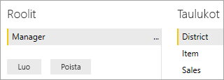
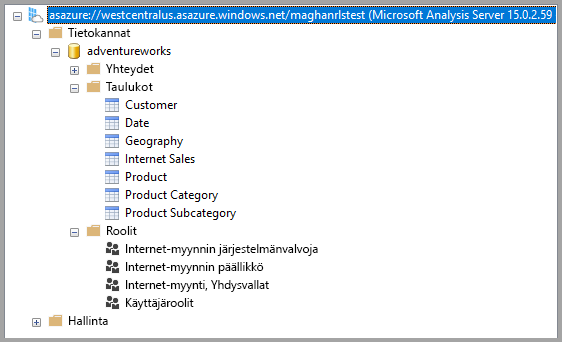
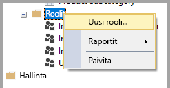
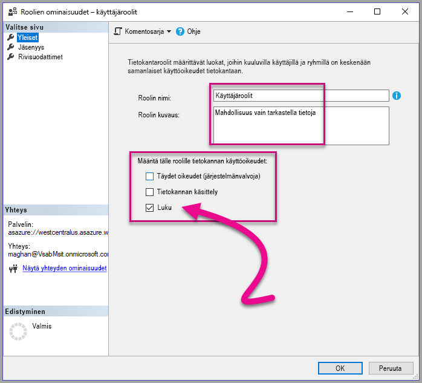
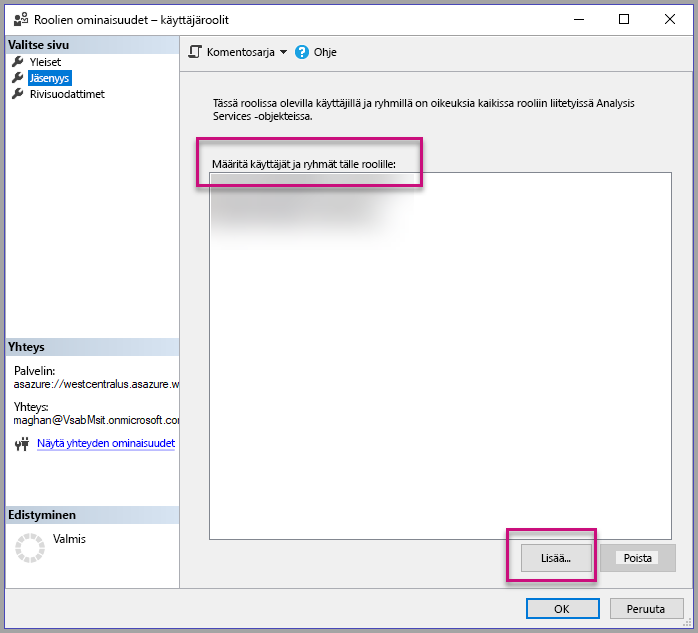
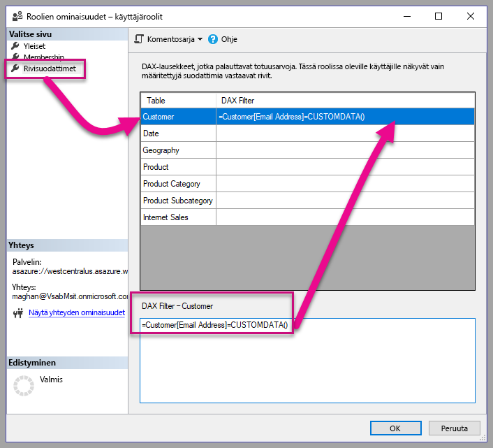
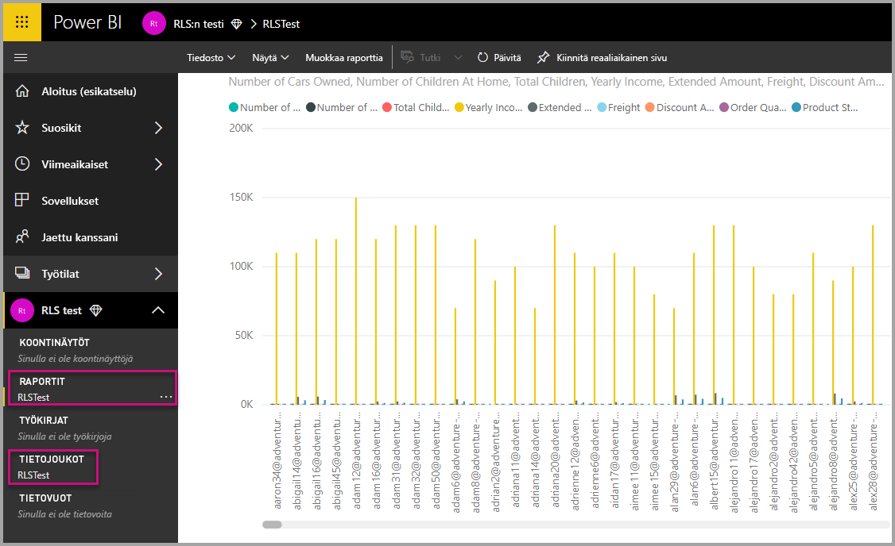
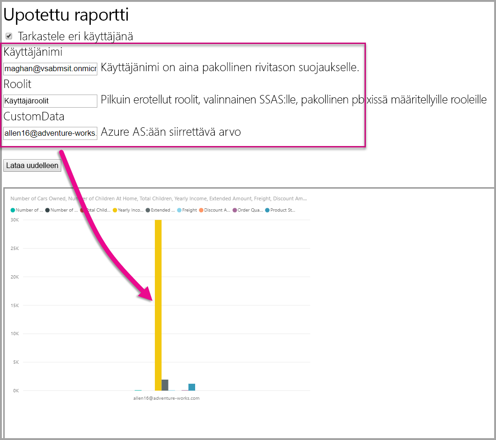
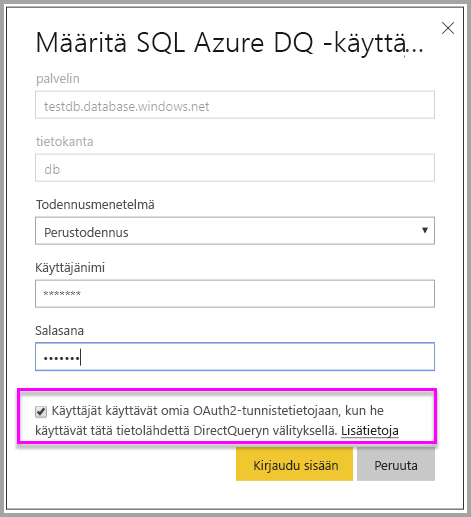
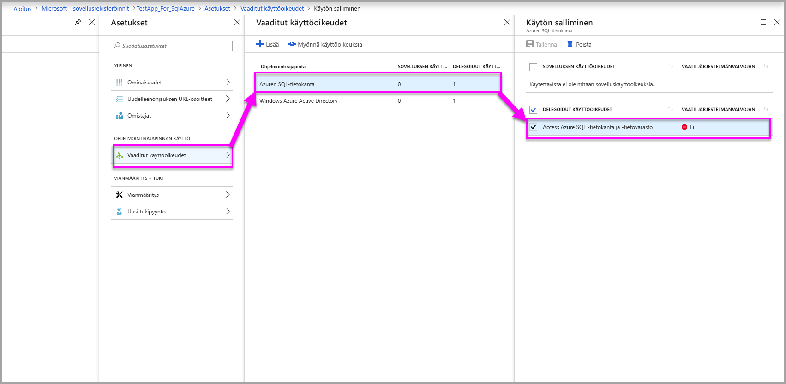

# <a name="row-level-security-with-power-bi-embedded"></a>Rivitason suojaus Power BI Embeddedissä

**Rivitason suojauksen (RLS)** avulla voidaan rajoittaa käyttäjien käyttöoikeuksia raporttinäkymien, ruutujen, raporttien ja tietojoukkojen tietoihin. Eri käyttäjät voivat työskennellä samojen kohteiden parissa ja nähdä eri tiedot. Upottaminen tukee rivitason suojausta.

Jos olet upottamassa sisältöä muille kuin Power BI:n käyttäjille (sovellus omistaa tiedot), tavallisesti ISV-skenaariossa, tämä artikkeli koskee sinua. Määritä tiliin upotustunnus käyttäjälle ja roolille.

Jos olet upottamassa sisältöä Power BI -käyttäjille (käyttäjä omistaa tiedot) organisaatiosi sisällä, rivitason suojaus toimii samalla tavalla kuin suoraan Power BI -palvelussa. Sinun ei tarvitse tehdä sovelluksessasi mitään muuta. Lisätietoja on artikkelissa [Rivitason suojaus (RLS) Power BI:ssä](../../service-admin-rls.md).


Jotta voit hyödyntää rivitason suojausta, sinun on tärkeää ymmärtää kolme pääkäsitettä: käyttäjät, roolit ja säännöt. Alla on kunkin käsitteen kuvailu:

**Käyttäjät** – Kohdetta (koontinäyttöä, ruutua, raporttia tai tietojoukkoa) tarkastelevat loppukäyttäjät. Power BI Embeddedissä käyttäjät tunnistetaan upotuksen tunnuksen käyttäjänimi-ominaisuudella.

**Roolit** – Käyttäjät kuuluvat rooleihin. Rooli on sääntöjen säilö. Roolin nimi voi olla esim. *myyntipäällikkö* tai *myyntiedustaja*. Voit luoda rooleja Power BI Desktopissa. Lisätietoja on artikkelissa [Rivitason suojaus (RLS) Power BI Desktopissa](../../desktop-rls.md).

**Säännöt** – Rooleilla on sääntöjä, jotka ovat tietoihin sovellettavia todellisia suodattimia. Sääntö voi olla yksinkertainen, esim. ”maa = Yhdysvallat”, tai paljon dynaamisempi.
Tässä artikkelissa on esimerkki rivitason suojauksen luomisesta ja sen käyttämisestä upotetussa sovelluksessa. Esimerkissämme käytetään [Jälleenmyynnin analyysiesimerkki](https://go.microsoft.com/fwlink/?LinkID=780547) -PBIX-tiedostoa.


## <a name="adding-roles-with-power-bi-desktop"></a>Roolien lisääminen Power BI Desktopilla

Microsoftin **jälleenmyynnin analyysiesimerkissä** näkyy kaikkien jälleenmyyntiketjuun kuuluvien myymälöiden myynti. Jos rivitason suojaus ei ole käytössä, kaikkien alueiden johtohenkilöt näkevät samat tiedot kirjautuessaan ja tarkastellessaan raporttia. Ylin johto on päättänyt, että kunkin alueen johtajan pitäisi nähdä hallitsemiensa myymälöiden myynti. Rivitason suojauksen avulla ylin johto voi rajata tiedot alueen johtajan mukaan.

RLS on luotu Power BI Desktopissa. Kun tietojoukko ja raportti on avattu, voimme siirtyä kaavionäkymään ja tarkastella rakennetta:


Huomioi seuraavat asiat tässä rakenteessa:

* Kaikki mittarit, kuten **Kokonaismyynti**, on tallennettu **Myynti**-faktataulukkoon.
* Saatavilla on neljä muuta liittyvää dimensiotaulukkoa: **Kohde**, **Aika**, **Säilö** ja **Alue**.
* Yhteysviivojen nuolet osoittavat, mihin suuntaan suodattimet voivat jatkua taulukosta toiseen. Jos suodatin on sijoitettu esimerkiksi **Aika[Päivämäärä]** -kohtaan, nykyisessä rakenteessa se suodattaa arvot vain **Myynti**-taulukosta eteenpäin. Tämä suodatin ei vaikuta muihin taulukoihin, sillä kaikki yhteysviivojen nuolet osoittavat myyntitaulukkoon eivätkä siitä poispäin.
* **Alue**-taulukko ilmaisee kunkin alueen johtajan:
  
    

Jos tämän rakenteen perusteella käytetään suodatinta **Alue**-taulukon **Alueen johtaja** -sarakkeessa ja jos kyseinen suodatin vastaa raporttia tarkastelevaa käyttäjää, suodatin suodattaa **Myymälä-** ja **Myynti**-taulukoiden tiedot, jolloin vain kyseisen alueen johtaja näkee tiedot.

Ohjeet:

1. Valitse **Mallinnus**-välilehdeltä **Roolien hallinta**.

    
2. Luo uusi rooli, jonka nimi on **Johtaja**.

    
3. Kirjoita **Alue**-taulukkoon seuraava DAX-lauseke: **[alueen johtaja] = USERNAME()** .

    
4. Varmista sääntöjen toimivuus valitsemalla **Mallinnus**-välilehdeltä **Näytä rooleina** ja valitsemalla sitten sekä juuri luomasi **Johtaja**-rooli että **Muut käyttäjät**. Valitse **Antero Ma** käyttäjäksi.

    

    Raportit näyttävät tiedot nyt ikään kuin olisit kirjautuneena **Antero Ma** -tilillä.

Kun suodatinta käytetään näin, kaikki **Alue-** , **Myymälä-** ja **Myynti**-taulukkojen tietueet suodatetaan. **Myynti-** ja **Aika**-taulukkojen, **Myynti-** ja **Kohde**-taulukkojen ja **Kohde-** ja **Aika**-taulukkojen yhteyksiin käytettyjen suodattimien suunnan vuoksi taulukoita ei suodateta alaspäin. Saat lisätietoja kaksisuuntaisesta ristiinsuodatuksesta lataamalla [Kaksisuuntainen ristiinsuodatus SQL Server Analysis Services 2016:ssa ja Power BI Desktopissa](https://download.microsoft.com/download/2/7/8/2782DF95-3E0D-40CD-BFC8-749A2882E109/Bidirectional%20cross-filtering%20in%20Analysis%20Services%202016%20and%20Power%20BI.docx) -raportin.

## <a name="applying-user-and-role-to-an-embed-token"></a>Käyttäjän ja roolin käyttäminen upotustunnukseen

Nyt kun Power BI Desktop -roolit on määritetty, sovelluksesi on määritettävä, jotta voit hyödyntää rooleja.

Sovelluksesi todentaa ja valtuuttaa käyttäjäsi, ja upotettavien tunnusten avulla heille voidaan myöntää käyttöoikeudet valittuun Power BI Embedded -raporttiin. Power BI Embedded ei sisällä tietoja siitä, kuka käyttäjä on. Jotta rivitason suojaus toimii, sinun on välitettävä käyttäjätietoja upotustunnuksen osana. Voit välittää käyttäjätietojen käyttämällä [Upotustunnus](https://docs.microsoft.com/rest/api/power-bi/embedtoken)-ohjelmointirajapintaa.

Ohjelmointirajapinta tukee käyttäjätietojen luetteloa, joka sisältää viittauksen oleellisiin tietojoukkoihin. Jotta rivitason suojaus toimii, sinun on välitettävä alla olevat tiedot osana käyttäjätietoja.

* **käyttäjänimi (pakollinen)** – Merkkijono, jonka avulla käyttäjä voidaan tunnistaa rivitason suojauksen sääntöjä käytettäessä. Luettelossa voi olla vain yksi käyttäjä. Käyttäjänimen voi luoda *ASCII*-merkeillä.
* **roolit (pakollinen)** – Merkkijono, joka sisältää rivitason suojausta käytettäessä valittavat säännöt. Jos välitettäviä rooleja on useampi kuin yksi, ne tulisi välittää merkkijonotaulukkona.
* **tietojoukko (pakollinen)** – Tietojoukko, joka koskee upotettavaa kohdetta.

Voit luoda upotuksen tunnuksen **GenerateTokenInGroup**-menetelmällä **PowerBIClient.Reports**-kohdassa.

Voit esimerkiksi muuttaa [PowerBIEmbedded_AppOwnsData](https://github.com/Microsoft/PowerBI-Developer-Samples/tree/master/App%20Owns%20Data) -mallia. *Services\EmbedService.cs line 76 and 77* voidaan päivittää arvosta:

```csharp
// Generate Embed Token.
var generateTokenRequestParameters = new GenerateTokenRequest(accessLevel: "view");

var tokenResponse = await client.Reports.GenerateTokenInGroupAsync(GroupId, report.Id, generateTokenRequestParameters);
```

to

```csharp
var generateTokenRequestParameters = new GenerateTokenRequest("View", null, identities: new List<EffectiveIdentity> { new EffectiveIdentity(username: "username", roles: new List<string> { "roleA", "roleB" }, datasets: new List<string> { "datasetId" }) });

var tokenResponse = await client.Reports.GenerateTokenInGroupAsync("groupId", "reportId", generateTokenRequestParameters);
```

Jos muodostat yhteyden REST-ohjelmointirajapintaan, päivitetty ohjelmointirajapinta hyväksyy nyt JSON-lisätaulukon nimeltä **käyttäjätiedot**, joka sisältää käyttäjänimen, luettelon merkkijonorooleista ja luettelon merkkijonotietojoukoista. 

Käytä seuraavaa koodia esimerkkinä:

```json
{
    "accessLevel": "View",
    "identities": [
        {
            "username": "EffectiveIdentity",
            "roles": [ "Role1", "Role2" ],
            "datasets": [ "fe0a1aeb-f6a4-4b27-a2d3-b5df3bb28bdc" ]
        }
    ]
}
```

Nyt kun kaikki osat on koottu yhteen ja henkilö kirjautuu sovellukseesi tarkastelemaan tätä kohdetta, hän näkee vain sellaiset tiedot, jotka rivitason suojaus sallii hänen näkevän.

## <a name="working-with-analysis-services-live-connections"></a>Reaaliaikaisten Analysis Services -yhteyksien käyttäminen

Rivitason suojausta voi käyttää paikallisilla palvelimilla reaaliaikaisten Analysis Services -yhteyksien avulla. Kun käytät tämäntyyppistä yhteyttä, sinun tulee tuntea muutama käsite.

Käyttäjänimi-ominaisuuden on vastattava Windows-käyttäjää, jolla on käyttöoikeudet Analysis Services -palvelimella.

>[!NOTE]
> Kun palvelun päänimeä käytetään [Azure Analysis Services](https://docs.microsoft.com/azure/analysis-services/analysis-services-overview) ‑tietolähteen avulla, palvelun päänimellä on itsellään oltava käyttöoikeudet Azure Analysis Services ‑esiintymään. Tähän ei riitä käyttöoikeusryhmä, joka sisältää palvelun päänimen.

### <a name="on-premises-data-gateway-configuration"></a>Paikallisen tietoyhdyskäytävän määritys

[Paikallista tietoyhdyskäytävää](../../service-gateway-onprem.md) käytetään, kun käsittelet reaaliaikaisia Analysis Services -yhteyksiä. Upotuksen tunnusta luotaessa, kun käyttäjätieto on luetteloitu, päätili on lueteltava yhdyskäytävän järjestelmänvalvojana. Jos päätili ei ole luettelossa, rivitason suojausta ei käytetä tietojen ominaisuuksiin. Yhdyskäytävän muu käyttäjä kuin järjestelmänvalvojien voi lisätä rooleja, mutta hänen on annettava käyttäjätiedoksi oma käyttäjänimensä.

### <a name="use-of-roles"></a>Roolien käyttäminen

Roolit voidaan toimittaa upotustunnuksen käyttäjätiedoissa. Jos roolia ei ole annettu, annettua käyttäjänimeä voidaan käyttää asianmukaisia rooleja ratkaistaessa.

### <a name="using-the-customdata-feature"></a>CustomData-toiminnon käyttäminen

CustomData-ominaisuus toimii vain malleilla, jotka sijaitsevat **Azure Analysis Services -palveluissa**, ja se toimii vain **Connect live** -tilassa. Toisin kuin käyttäjät ja roolit, CustomData-ominaisuutta ei voi asettaa .pbix-tiedoston sisälle. Sinulla on oltava käyttäjänimi CustomData-ominaisuuden sisältävää tunnusta luotaessa.

CustomData-ominaisuuden avulla voit lisätä rivisuodattimen tarkasteltaessa sovelluksesi Power BI -tietoja, kun käytät **Azure Analysis Servicesiä** tietolähteenä (Azure Analysis Servicesiin yhdistettyjen Power BI -tietojen tarkasteleminen sovelluksessa).

CustomData-ominaisuus mahdollistaa vapaan tekstin (merkkijonon) välittämisen CustomDatan yhteysmerkkijono-ominaisuuden avulla. Analysis Services käyttää tätä arvoa *CUSTOMDATA()* -funktion kautta.

Ainoa tapa saada dynaaminen rivitason suojaus (joka käyttää dynaamisia arvoja suodattimen arviointiin) **Azure Analysis Servicesissä** on käyttää *CUSTOMDATA()* -funktiota.

Voit käyttää sitä DAX-kyselyn roolissa. Voit käyttää sitä ilman roolia mittarin DAX-kyselyssä.
CustomData-ominaisuus on osa tunnuksen luontitoimintoja, joita voi käyttää koontinäyttöjen, raporttien ja ruutujen kanssa. Koontinäytöillä voi olla useita CustomData-käyttäjätietoja (yksi ruutu mallia kohden).

#### <a name="customdata-sdk-additions"></a>CustomDatan SDK-lisäykset

CustomDatan merkkijono-ominaisuus lisättiin käytössä olevaan käyttäjätietoon tunnuksen luontitapahtumassa.

```json
[JsonProperty(PropertyName = "customData")]
public string CustomData { get; set; }
```

Käyttäjätieto voidaan luoda mukautetuilla tiedoilla käyttämällä seuraavaa kutsua:

```csharp
public EffectiveIdentity(string username, IList<string> datasets, IList<string> roles = null, string customData = null);
```

#### <a name="customdata-sdk-usage"></a>CustomDatan SDK:n käyttäminen

Jos muodostat yhteyden REST-ohjelmointirajapintaan, voit lisätä mukautettuja tietoja kaikkiin käyttäjätietoihin, esimerkiksi:

```json
{
    "accessLevel": "View",
    "identities": [
        {
            "username": "EffectiveIdentity",
            "roles": [ "Role1", "Role2" ],
            "customData": "MyCustomData",
            "datasets": [ "fe0a1aeb-f6a4-4b27-a2d3-b5df3bb28bdc" ]
        }
    ]
}
```

Voit alkaa määrittää CustomData()-ominaisuutta Power BI Embedded -sovelluksella seuraavien ohjeiden mukaan.

1. Luo Azure Analysis Services -tietokanta. Kirjaudu sisään Azure Analysis Services -palvelimelle [SQL Server Management Studion](https://docs.microsoft.com/sql/ssms/download-sql-server-management-studio-ssms?view=sql-server-2017) kautta.

    

    

2. Luo rooli Analysis Services -palvelimella.

    

3. Määritä **yleiset** asetukset.  Täällä voit antaa **roolin nimen** ja määrittää tietokannalle vain **luku** -oikeudet.

    

4. Määritä **jäsenyyden** asetukset. Täällä voit lisätä käyttäjät, joita tämä rooli koskee.

    

5. Määritä **rivisuodattimien** DAX-kysely *CUSTOMDATA()* -funktion avulla.

    

6. Luo PBI-raportti ja julkaise se työtilan varatussa kapasiteetissa.

    

7. Power BI -ohjelmointirajapintojen avulla voit käyttää CustomData-ominaisuutta sovelluksessasi.  Sinulla on oltava käyttäjänimi CustomData-ominaisuuden sisältävää tunnusta luotaessa. Käyttäjänimen on oltava sama kuin pääkäyttäjän täydellinen käyttäjätunnus. Pääkäyttäjän on oltava luomasi roolin jäsen. Jos rooleja ei määritetä, kaikkia rooleja, joiden jäsen pääkäyttäjä on, käytetään rivitason suojauksen arviointiin.

    Kun käsittelet [palvelun päänimeä](embed-service-principal.md), sinun on suoritettava yllä olevat vaiheet päätilin käytön sijaan. Kun muodostetaan upotustunnusta, käytä [palvelun päänimen objektitunnusta](embed-service-principal.md#how-to-get-the-service-principal-object-id) käyttäjänimenä.

    > [!Note]
    > Kun olet valmis ottamaan sovelluksesi tuotantoon, pääkäyttäjän tili -kentän tai -vaihtoehdon ei pitäisi näkyä käyttäjälle.

    Lisää CustomData-ominaisuus näyttämällä [koodi](#customdata-sdk-additions).

8. Voit nyt tarkastella raporttia sovelluksessasi ennen CustomData-arvojen käyttämistä, jotta näet kaikki raporttisi sisältämät tiedot.

    

    Ota sitten CustomData-arvot käyttöön, jotta näet, miten raportti näyttää eri tietojoukon.
    

## <a name="using-rls-vs-javascript-filters"></a>Rivitason suojauksen käyttäminen JavaScript-suodattimiin verrattuna

Kun päätät suodattaa raportin tietoja, voit käyttää **rivitason suojausta** tai **JavaScript-suodattimia**.

[Rivitason suojaus](../../service-admin-rls.md) on ominaisuus, joka suodattaa tiedot tietomallin tasolla. Taustatietolähde ohjaa RLS-asetuksia. Upotustunnuksen luominen määrittää istunnon käyttäjänimen ja roolit tietomallisi perusteella. Sitä ei voi ohittaa, poistaa eikä hallita asiakaspuolen koodilla, minkä vuoksi sitä pidetään turvallisena. Rivitason suojausta suositellaan tietojen turvalliseen suodattamiseen. Voit suodattaa tietoja rivitason suojauksen avulla käyttämällä jotakin seuraavista vaihtoehdoista.

* [Power BI -raportin roolien määrittäminen](../../desktop-rls.md).
* Roolien määrittäminen tietolähteen tasolla (vain Analysis Servicesin reaaliaikainen yhteys).
* Ohjelmallisesti [upotustunnuksella](https://docs.microsoft.com/rest/api/power-bi/embedtoken/datasets_generatetokeningroup) käyttämällä `EffectiveIdentity`-komentoa. Kun käytetään upotustunnusta, todellinen suodatin läpäisee tietyn istunnon upotustunnuksen.

[JavaScript-suodattimien](https://github.com/Microsoft/PowerBI-JavaScript/wiki/Filters#page-level-and-visual-level-filters) avulla käyttäjä voi käyttää rajoitettua, kohdennettua tai suodatettua tietonäkymää. Käyttäjällä on kuitenkin yhä pääsy mallin rakenteen taulukoihin, sarakkeisiin ja mittareihin, ja hän voi mahdollisesti käyttää niiden tietoja. Tietojen käyttöoikeuksien rajoitus voidaan ottaa käyttöön vain rivitason suojauksella eikä asiakaspuolen suodatinohjelmointirajapintojen kautta.

## <a name="token-based-identity-with-azure-sql-database"></a>Tunnuspohjaiset käyttäjätiedot Azure SQL -tietokannassa

Voit **tunnuspohjaisten käyttäjätietojen** avulla määrittää upotetun tunnuksen voimassaolevat käyttäjätiedot **Azure Active Directory (AAD)** -käyttöoikeustietueen avulla **Azure SQL -tietokannalle**.

Asiakkaat, jotka säilyttävät tietojaan **Azure SQL -tietokannassa**, voivat nyt hyödyntää uutta ominaisuutta käyttäjien ja käyttäjien tiedonsaannin hallintaan Azure SQL:ssä **Power BI Embedded** -integroinnin ansiosta.

Upotetun tunnuksen luonnin aikana voidaan määrittää käyttäjän voimassaolevat käyttäjätiedot Azure SQL:ssä. Voit määrittää käyttäjän voimassaolevat käyttäjätiedot välittämällä AAD-käyttöoikeustietueen palvelimeen. Käyttöoikeustietuetta käytetään vain tätä käyttäjää koskevien olennaisten tietojen noutamiseen Azure SQL:stä tätä tiettyä istuntoa varten.

Sen avulla voidaan hallita kunkin käyttäjän näkymää Azure SQL:ssä tai kirjautua sisään Azure SQL:een erityisenä asiakkaana monen vuokraajan tietokannassa. Sen avulla voidaan käyttää rivitason suojausta Azure SQL -istunnossa, jos haluat hakea vain olennaiset tiedot tätä istuntoa varten, joten RLS:ää ei tarvitse enää hallita Power BI:ssä.

Tällaisia voimassaolevia käyttäjätietoja sovelletaan RLS-sääntöihin suoraan Azure SQL Serverissä. Power BI Embedded käyttää annettua käyttöoikeustietuetta tietojen kyselemiseen Azure SQL Serveristä. Käyttäjän täydellinen käyttäjätunnus (jota varten käyttöoikeustietue annettiin) saadaan USER_NAME() SQL -funktion avulla.

Tunnuspohjaiset käyttäjätiedot toimivat vain DirectQuery-malleissa varatulla kapasiteetilla, joka on yhdistetty Azure SQL -tietokantaan. Se on määritetty sallimaan AAD-todennus ([lisätietoja AAD-todennuksesta Azure SQL -tietokantaa varten](https://docs.microsoft.com/azure/sql-database/sql-database-manage-logins)). Tietojoukon tietolähde on määritettävä käyttämään loppukäyttäjän OAuth2-tunnistetietoja tunnuspohjaisten käyttäjätietojen käyttämiseksi.

   

### <a name="token-based-identity-sdk-additions"></a>Tunnuspohjaisten käyttäjätietojen SDK-lisäykset

Käyttäjätietojen blob-ominaisuus lisättiin voimassaoleviin käyttäjätietoihin tunnuksen luontitapahtumassa.

```JSON
[JsonProperty(PropertyName = "identityBlob")]
public IdentityBlob IdentityBlob { get; set; }
```

IdentityBlob-tyyppi on yksinkertainen JSON-rakenne, joka sisältää arvon merkkijono-ominaisuuden

```JSON
[JsonProperty(PropertyName = "value")]
public string value { get; set; }
```

EffectiveIdentity voidaan luoda käyttäjätietojen blob-objektilla seuraavan kutsun avulla:

```C#
public EffectiveIdentity(string username, IList<string> datasets, IList<string> roles = null, string customData = null, IdentityBlob identityBlob = null);
```

Käyttäjätietojen blob-objekti voidaan luoda käyttämällä seuraavaa kutsua.

```C#
public IdentityBlob(string value);
```

### <a name="token-based-identity-rest-api-usage"></a>Tunnuspohjaisten käyttäjätietojen REST-ohjelmointirajapinnan käyttö

Jos kutsut [REST-ohjelmointirajapinnan](/rest/api/power-bi/embedtoken/reports_generatetokeningroup#definitions), voit lisätä käyttäjätietojen blob-objektin kunkin käyttäjätiedon sisälle.

```JSON
{
    "accessLevel": "View",
    "identities": [
        {
            "datasets": ["fe0a1aeb-f6a4-4b27-a2d3-b5df3bb28bdc"],
        "identityBlob": {
            "value": "eyJ0eXAiOiJKV1QiLCJh…."
         }
        }
    ]
}
```

Käyttäjätietojen blob-objektissa annetun arvon on oltava kelvollinen käyttöoikeustietue Azure SQL Serveriin (resurssin URL-osoite on (<https://database.windows.net/>).

   > [!Note]
   > Jotta sovellus voi luoda käyttöoikeustietueen Azure SQL:lle, sovelluksella on oltava delegoitu **Azure SQL -tietokannan ja tietovaraston** käyttöoikeus **Azure SQL -tietokannan** ohjelmointirajapintaan AAD-sovelluksen rekisteröintimäärityksessä Azure-portaalissa.

   

## <a name="on-premises-data-gateway-with-service-principal"></a>Paikallinen tietoyhdyskäytävä ja palvelun päänimi

Asiakkaat, jotka määrittävät rivitason suojauksen (RLS) SQL Server Analysis Servicesin (SSAS) paikallisella reaaliaikaisen yhteyden tietolähteellä, voivat hyödyntää uutta [palvelun päänimen](embed-service-principal.md) toimintoa. Sen avulla he voivat hallita käyttäjiä ja heidän käyttöoikeuksiaan SSAS-tietoihin, kun he integroivat **Power BI Embeddedin**.

[Power BI REST -ohjelmointirajapintojen](https://docs.microsoft.com/rest/api/power-bi/) avulla voit määrittää SSAS:n paikallisten reaaliaikaisten yhteyksien käytössä olevat käyttäjätiedot upotustunnukselle [palvelun päänimen objektin](https://docs.microsoft.com/azure/active-directory/develop/app-objects-and-service-principals#service-principal-object) avulla.

Kun halusit määrittää SSAS:n paikallisen reaaliaikaisen yhteyden käytössä olevat käyttäjätiedot aiemmin, pääkäyttäjän, joka loi upotustunnuksen, piti olla yhdyskäytävän järjestelmänvalvoja. Nyt käyttäjän ei tarvitse olla yhdyskäytävän järjestelmänvalvoja, koska yhdyskäytävän järjestelmänvalvoja voi antaa käyttäjälle oikeuden kyseiseen tietolähteeseen. Tämän ansiosta käyttäjä voi kumota käytössä olevat käyttäjätiedot, kun upotustunnus luodaan. Tämä uusi toiminto mahdollistaa palvelun päänimellä upottamisen reaaliaikaisissa SSAS-yhteyksissä.

Jos haluat käyttää tätä toimintoa, yhdyskäytävän järjestelmänvalvojan täytyy antaa [tietolähteen käyttäjän lisäämisen REST-ohjelmointirajapinnalla](https://docs.microsoft.com/rest/api/power-bi/gateways/adddatasourceuser) palvelun päänimelle *ReadOverrideEffectiveIdentity*-oikeus BI Embeddedissä.

Tätä oikeutta ei voi määrittää hallintaportaalissa. Sen voi määrittää vain ohjelmointirajapinnalla. Näet hallintaportaalissa ilmoituksen niiden käyttäjien ja palvelun päänimien kohdalla, joilla on nämä oikeudet.

## <a name="considerations-and-limitations"></a>Huomioitavat asiat ja rajoitukset

* Käyttäjien määrittäminen rooleihin Power BI -palvelussa ei vaikuta rivitason suojaukseen upotustunnusta käytettäessä.
* Vaikka Power BI -palvelu ei sovella RLS-asetusta järjestelmänvalvojiin tai jäseniin, joilla on muokkausoikeudet, se soveltaa sitä tietoihin, kun annat upotetun tunnuksen sisältävät käyttäjätiedot.
* Reaaliaikaisia Analysis Services -yhteyksiä tuetaan paikallisissa palvelimissa.
* Reaaliaikaiset Azure Analysis Services -yhteydet tukevat suodattamista roolien mukaan. Dynaaminen suodatus voidaan tehdä CustomData-toiminnon avulla.
* Jos pohjana oleva tietojoukko ei vaadi rivitason suojausta, GenerateToken-pyyntö **ei** saa sisältää käytössä olevia käyttäjätietoja.
* Jos pohjana oleva tietojoukko on pilvimalli (välimuistissa oleva tai DirectQuery-malli), käytössä olevien käyttäjätietojen on sisällettävä vähintään yksi rooli. Muussa tapauksessa roolimääritystä ei tehdä.
* Käyttäjätietojen luettelo mahdollistaa useat käyttäjätietojen tunnukset koontinäyttöjen upotusta varten. Luettelo sisältää yksittäisen käyttäjän tiedot kaikille muille kohdetyypeille.

### <a name="token-based-identity-limitations"></a>Tunnuspohjaisten käyttäjätietojen rajoitukset

* Voit käyttää RLS-toimintoa vain, jos käytössäsi on varattu kapasiteetti.
* RLS ei toimi paikallisen SQL Serverin kanssa.

Onko sinulla kysyttävää? [Voit esittää kysymyksiä Power BI -yhteisössä](https://community.powerbi.com/)
