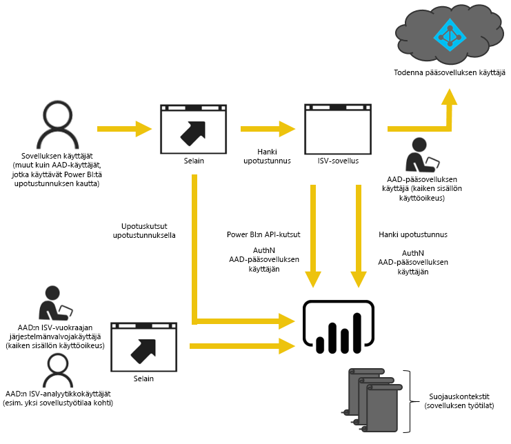
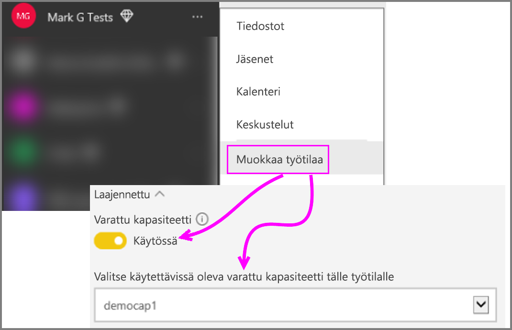

# Power BI -työtilakokoelman sisällön siirtäminen Power BI Embedded -palveluun

Opi siirtämään Power BI ‑työtilakokoelma Power BI Embedded ‑palveluun ja hyödynnä sisällön upottamisesta sovelluksiin syntyvät edut.

Hiljattain Microsoft [julkisti Power BI Embedded](https://powerbi.microsoft.com/blog/power-bi-embedded-capacity-based-skus-coming-to-azure/) ‑palvelun, uuden kapasiteettiin perustuvan lisensointimallin, joka tekee sisällön käytöstä ja jakamisesta joustavampaa käyttäjille. Lisäksi se tarjoaa lisää skaalautuvuutta ja suorituskykyä.

Power BI Embedded ‑palvelun ansiosta saat yhden ohjelmointirajapinnan, jossa on yhtenäiset ominaisuudet ja mahdollisuus käyttää sisältöjen upottamiseen uusimpia Power BI -toimintoja, kuten koontinäyttöjä, yhdyskäytäviä ja työtiloja. Tulevaisuudessa voit aloittaa käyttämällä Power BI Desktopia ja siirtyä ottamaan Power BI Embedded ‑palvelun käyttöön.

Nykyinen Power BI ‑työtilakokoelma on saatavilla vielä rajoitetun ajan. Enterprise Agreement -sopimuksen tehneet asiakkaat pystyvät jatkamaan käyttöä nykyisten sopimustensa umpeutumiseen saakka, kun taas Power BI ‑työtilakokoelman suoraan tai pilvipalveluratkaisun kautta hankkineet asiakkaat pystyvät jatkamaan käyttöä vuoden ajan Power BI Embedded ‑palvelun yleisesti saatavilla olevan version julkaisemisesta.  Tässä artikkelissa annetaan ohjeita Power BI ‑työtilakokoelman siirtämiseksi uuteen Power BI Embedded ‑kokemukseen ja kerrotaan, millaisia muutoksia siitä on odotettavissa sovellukseesi.

> [!IMPORTANT]
> Vaikka siirto muodostaa riippuvuuden Power BI Embedded ‑palveluun, Power BI:ssä ei muodostu riippuvuutta sovelluksesi käyttäjille, kun he käyttävät **upotettavaa tunnusta**. Heidän ei tarvitse rekisteröityä Power BI -käyttäjiksi, jotta he voisivat tarkastella upotettua sisältöä sovelluksessasi. Voit hyödyntää upottamista Embedded-palveluun käyttäjille, jotka eivät ole Power BI ‑käyttäjiä.

Ennen kuin aloitat uuteen Power BI Embeddediin siirtymiseen, voit käydä nopeasti läpi ohjeistuksen, joka auttaa määrittämään uuden Power BI Embedded -ympäristön [upottamisen määritystyökalua](https://aka.ms/embedsetup) käyttämällä.

Valitse ratkaisu, joka sopii sinulle:
* **Asiakkaille tarkoitettu upotus** - kun olet kiinnostunut [sovellus omistaa tiedot](https://aka.ms/embedsetup/AppOwnsData) -ratkaisusta. [Asiakkaille tarkoitettu upotus](embedding.md#embedding-for-your-customers) mahdollistaa raporttinäkymien ja raporttien upottamisen käyttäjille, joilla ei ole Power BI -tiliä. 

* **Organisaatiolle tarkoitettu upotus** - kun olet kiinnostunut [käyttäjä omistamaa tiedot](https://aka.ms/embedsetup/UserOwnsData) -ratkaisusta. [Organisaatiolle tarkoitettu upotus](embedding.md#embedding-for-your-organization) mahdollistaa Power BI -palvelun laajentamisen.

## Siirron valmisteleminen

Sinun on tehtävä joitakin valmistelutoimia, ennen kuin voit siirtää Power BI ‑työtilakokoelman Power Bi Embedded ‑palveluun. Sinulla on oltava käytettävissä vuokraaja sekä käyttäjä, jolla on Power BI Pro ‑käyttöoikeus.

1. Varmista, että sinulla on käytettävissäsi Azure Active Directoryn (Azure AD) vuokraaja.

    Sinun on päätettävä, mitä vuokraajan määritystä haluat käyttää.

   * Käytetäänkö aiemmin hankittua yrityksen Power BI ‑vuokraajaa?
   * Käytetäänkö sovellukselle erillistä vuokraajaa?
   * Käytetäänkö kullekin asiakkaalle erillistä vuokraajaa?

     Jos päätät luoda uuden vuokraajan joko sovelluksellesi tai kullekin asiakkaalle, katso [Azure Active Directory ‑vuokraajan luominen](create-an-azure-active-directory-tenant.md) tai [Miten saan Azure Active Directory ‑vuokraajan?](https://docs.microsoft.com/azure/active-directory/develop/active-directory-howto-tenant)
2. Luo uuteen vuokraajaan käyttäjä, joka toimii sovelluksen ”päätilinä”. Tili on rekisteröitävä Power BI:hin, ja siihen on liitettävä Power BI Pro ‑käyttöoikeus.

## Azure AD:ssä olevat tilit

Vuokraajassa on oltava seuraavat tilit.

> [!NOTE]
> Näillä tileillä on oltava Power BI Pro ‑käyttöoikeudet, jotta ne voivat käyttää työtiloja.

1. Vuokraajan järjestelmänvalvojakäyttäjä.

    On suositeltavaa, että tämä käyttäjä on kaikkien upotustarkoituksia varten luotujen työtilojen jäsen.

2. Tilit sisältöä luoville analyytikoille.

    Nämä käyttäjät määritetään työtiloihin tarpeen mukaan.

3. Sovelluksen *pääkäyttäjätili* tai Embedded-tili.

    Sovellusten taustapalvelu tallentaa tämän tilin tunnistetiedot ja käyttää tiliä Azure AD ‑tunnuksen hankkimiseen Power BI REST ‑ohjelmointirajapintoja varten. Tiliä käytetään sovelluksen upotettavan tunnuksen luontiin. Lisäksi tämän tilin on oltava upottamista varten luotujen työtilojen järjestelmänvalvoja.

> [!NOTE]
> Tämä on vain organisaatiosi tavallinen käyttäjätili, jota käytetään upottamistarkoituksiin.

## Sovelluksen rekisteröinti ja käyttöoikeudet

Sinun on rekisteröitävä sovellus Azure AD:ssa ja myönnettävä sille tietyt käyttöoikeudet.

### Sovelluksen rekisteröinti

Sinun on rekisteröitävä sovellus Azure AD:ssä REST-ohjelmointirajapinnan kutsujen tekemiseksi. Se tarkoittaa, että sinun on Power BI:n rekisteröintisivun lisäksi tehtävä lisämäärityksiä Azure-portaalissa. Saat lisätietoja artikkelista [Azure AD -sovelluksen rekisteröinti Power BI -sisällön upottamista varten](register-app.md).

Rekisteröi sovellus käyttämällä sovelluksen **päätiliä**.

## Työtilojen luominen (pakollinen)

Työtilojen avulla voit tarjota paremman eristyksen sovelluksessasi, jos se palvelee useita asiakkaita. Koontinäytöt ja raportit eristetään asiakkaiden välillä. Voit eristää entisestään sovelluskokemukset asiakkaiden välillä käyttämällä yhtä Power BI ‑tiliä kutakin työtilaa kohden.

> [!IMPORTANT]
> Henkilökohtaista työtilaa ei voi käyttää sisältöjen upottamiseen niin, että muutkin kuin Power BI ‑käyttäjät pääsevät hyödyntämään niitä.

Työtilan luomiseen Power BI:ssä tarvitaan käyttäjän, jolla on Pro-käyttöoikeus. Työtilan luomiseen käytetystä Power BI ‑käyttäjästä tulee oletusarvoisesti työtilan järjestelmänvalvoja.

> [!NOTE]
> Sovelluksen *päätilin* on oltava työtilan järjestelmänvalvoja.

## Sisällön siirto

Voit siirtää sisältösi työtilakokoelmista Power BI Embedded -palveluun rinnakkain nykyisen ratkaisusi kanssa ilman käyttökatkoa.

Voit käyttää **siirtotyökalua**, joka auttaa sisällön kopioimisessa Power BI ‑työtilakokoelmasta Power BI Embedded ‑palveluun. Se on erityisen hyödyllinen, jos sinulla on paljon sisältöä. Jos haluat lisätietoja, katso [Power BI Embedded -siirtotyökalu](migrate-tool.md).

Sisällön siirtoon tarvitaan pääasiassa kahta ohjelmointirajapintaa.

1. Download PBIX ‑ohjelmointirajapinnan avulla voit ladata palvelusta itsellesi PBIX-tiedostot, jotka on ladattu Power BI:hin lokakuun 2016 jälkeen.
2. Import PBIX ‑ohjelmointirajapintaa käytetään PBIX-tiedostojen lataamiseen Power BI:hin.

Jos haluat nähdä aiheeseen liittyviä koodikatkelmia, katso artikkeli [Koodikatkelmia sisällön siirtämiseen Power BI ‑työtilakokoelmasta](migrate-code-snippets.md).

### Raporttityypit

Raporttityyppejä on olemassa useita erilaisia, ja kukin niistä edellyttää siirtoa varten hieman omanlaistaan työnkulkua.

#### Välimuistissa oleva tietojoukko ja raportti

Välimuistissa olevat tietojoukot tarkoittavat PBIX-tiedostoja, joihin on tuotu tietoja sen sijaan, että niissä olisi reaaliaikainen tai DirectQuery-yhteys.

**Työnkulku**

1. Kutsu Download PBIX ‑ohjelmointirajapintaa PaaS-työtilasta.
2. Tallenna PBIX.
3. Kutsu Import PBIX ‑ohjelmointirajapinta SaaS-työtilaan.

#### DirectQuery-tietojoukko ja -raportti

**Työnkulku**

1. Kutsu GET https://api.powerbi.com/v1.0/collections/{collection_id}/workspaces/{wid}/datasets/{dataset_id}/Default.GetBoundGatewayDataSources ja tallenna vastaanotettu yhteysmerkkijono.
2. Kutsu Download PBIX ‑ohjelmointirajapintaa PaaS-työtilasta.
3. Tallenna PBIX.
4. Kutsu Import PBIX ‑ohjelmointirajapinta SaaS-työtilaan.
5. Päivitä yhteysmerkkijono kutsumalla - POST  https://api.powerbi.com/v1.0/myorg/datasets/{dataset_id}/Default.SetAllConnections
6. Hanki GW- ja tietolähdetunnukset kutsumalla – GET https://api.powerbi.com/v1.0/myorg/datasets/{dataset_id}/Default.GetBoundGatewayDataSources
7. Päivitä käyttäjän tunnistetiedot kutsumalla - PATCH https://api.powerbi.com/v1.0/myorg/gateways/{gateway_id}/datasources/{datasource_id}

#### Vanha tietojoukko ja raportit

Vanhoilla tietojoukoilla ja raporteilla tarkoitetaan ennen lokakuuta 2016 luotuja tietojoukkoja ja raportteja. Download PBIX ei tue PBIX-tiedostoja, jotka on ladattu järjestelmään ennen lokakuuta 2016.

**Työnkulku**

1. Nouda PBIX kehitysympäristöstäsi (omasta sisäisestä lähdekoodin hallinnastastasi).
2. Kutsu Import PBIX ‑ohjelmointirajapinta SaaS-työtilaan.

#### Push-tietojoukko ja -raportti

Download PBIX ei tue *Push-ohjelmointirajapintojen* tietojoukkoja. Push-ohjelmointirajapintojen tietojoukkojen tietoja ei voi siirtää PaaS-palvelusta SaaS-palveluun.

**Työnkulku**

1. Luo tietojoukko SaaS-työtilaan kutsumalla Create dataset ‑ohjelmointirajapintaa JSON-tietojoukolla.
2. Muodosta raportti luodusta tietojoukosta uudelleen.

Joidenkin vaihtoehtoisten menetelmien avulla on mahdollista siirtää push-ohjelmointirajapinnan raportti PaaS-palvelusta SaaS-palveluun seuraavien ohjeiden mukaisesti.

1. Lataa PaaS-työtilaan joitakin tyhjiä PBIX-tiedostoja.
2. Kloonaa push-ohjelmointirajapinnan raportti ja sido se vaiheen 1 tyhjään PBIX-tiedostoon.
3. Lataa järjestelmästä ulos push-ohjelmointirajapinnan raportti tyhjine PBIX-tiedostoineen.
4. Lataa tyhjä PBIX SaaS-työtilaan.
5. Luo SaaS-työtilassa push-tietojoukko.
6. Sido raportti uudelleen push-ohjelmointirajapinnan tietojoukkoon.

## Uusien raporttien luominen ja lataaminen järjestelmään

Power BI ‑työtilakokoelmien sisällön siirtämisen lisäksi voit luoda raportteja ja tietojoukkoja Power BI Desktopilla ja julkaista sitten raportit työtilassa. Raportit julkaiseva loppukäyttäjä tarvitsee työtilassa julkaisemiseen Power BI Pro ‑käyttöoikeudet.

## Sovelluksen luominen uudelleen

1. Sinun on muokattava sovellustasi, jotta voit käyttää Power BI:n REST-ohjelmointirajapintoja ja powerbi.comissa olevaa raporttisijaintia.
2. Luo uudelleen AuthN/AuthZ-todennus käyttämällä sovelluksesi *päätiliä*. Voit hyödyntää [upotettavaa tunnusta](https://docs.microsoft.com/rest/api/power-bi/embedtoken) siihen, että käyttäjä voi toimia muiden käyttäjien puolesta.
3. Upota raportit powerbi.comista sovellukseesi.

## Käyttäjien liittäminen Power BI ‑käyttäjään

Sinun on liitettävä sovelluksessasi hallitsemasi käyttäjät sovelluksessa Power BI:n *päätunnukseen*. Tämän Power BI ‑*päätilin* tunnistetiedot tallennetaan sovellukseesi, ja niitä käytetään upotettavien tunnusten luomiseen.

## Ennen tuotantoonvientiä tehtävät toimenpiteet

Kun olet valmis siirtymään tuotantoon, sinun on tehtävä seuraavat toimet.

* Jos käytössäsi on kehitystyöhön erillinen vuokraaja, varmista, että työtilat koontinäyttöineen ja raportteineen ovat käytettävissä tuotantoympäristössäsi. Lisäksi sinun on varmistettava, että olet luonut sovelluksen Azure AD:ssa tuotantovuokraajaan sekä määrittänyt vaiheen 1 mukaisesti oikeat sovelluksen käyttöoikeudet.
* Osta kapasiteettia tarpeidesi mukaan. Jos haluat oppia hahmottamaan paremmin, miten paljon ja minkätyyppistä kapasiteettia tarvitset, katso [Power BI Embedded ‑analyysitoimintojen kapasiteetin suunnittelun tekninen raportti](https://aka.ms/pbiewhitepaper). Voit [ostaa kapasiteettia](https://portal.azure.com/#create/Microsoft.PowerBIDedicated) Azurelta.
* Muokkaa työtilaa ja määritä se lisäasetuksista Premium-kapasiteettiin.

    

* Vie päivitetty sovelluksesi tuotantoon ja aloita raporttien upottaminen Power BI Embedded ‑palvelussa.

## Siirron jälkeen

Sinun on vielä tehtävä Azuressa joitakin puhdistustoimia.

* Poista kaikki käyttöön otetun ratkaisun työtilat Power BI ‑työtilakokoelman Azure Embedded ‑palvelusta.
* Poista kaikki Azuressa mahdollisesti olevat työtilakokoelmat.

## Seuraavat vaiheet

[Upottaminen Power BI:n avulla](embedding.md)  
[Power BI ‑työtilakokoelman siirtotyökalu](migrate-tool.md)  
[Koodikatkelmia sisällön siirtämiseen Power BI ‑työtilakokoelmasta](migrate-code-snippets.md)  
[Power BI:n koontinäyttöjen, raporttien ja ruutujen upottaminen](embed-sample-for-your-organization.md)  
[Mikä on Power BI Premium?](../../service-premium-what-is.md)  
[JavaScript API Git -säilö](https://github.com/Microsoft/PowerBI-JavaScript)  
[Power BI C# Git -säilö](https://github.com/Microsoft/PowerBI-CSharp)  
[JavaScript-upotuksen näyte](https://microsoft.github.io/PowerBI-JavaScript/demo/)  
[Työtilakokoelman analyysitoimintojen kapasiteetin suunnittelun tekninen raportti](https://aka.ms/pbiewhitepaper)  
[Power BI Premiumin tekninen raportti](https://aka.ms/pbipremiumwhitepaper)  

Onko sinulla kysyttävää? [Voit esittää kysymyksiä Power BI -yhteisössä](https://community.powerbi.com/)
