# <a name="power-bi-embedded-migration-tool"></a>Power BI Embedded -siirtotyökalu

Tämän siirtotyökalun avulla voit kopioida raportit Power BI Embedded Azure -palvelusta (PaaS) Power BI -palveluun (SaaS).

Voit siirtää sisältösi työtilakokoelmista Power BI -palveluun rinnakkain nykyisen ratkaisusi kanssa ilman käyttökatkoa.

## <a name="limitations"></a>Rajoitukset

* Lähetettyjä tietojoukkoja ei voi ladata palvelusta, ja ne on luotava uudelleen Power BI REST -ohjelmointirajapinnoille Power BI -palvelua varten.
* Ennen 26. marraskuuta 2016 tuotuja PBIX-tiedostoja ei voi ladata palvelusta.

## <a name="download"></a>Lataa

Voit ladata siirtotyökalunäytteen [GitHubista](https://github.com/Microsoft/powerbi-migration-sample). Voit ladata palvelusta joko säilön zipin tai kloonata sen paikallisesti. Kun se on ladattu palvelusta, voit avata *powerbi-migration-sample.sln*-näytteen Visual Studiossa siirtotyökalun luomiseksi ja suorittamiseksi.

## <a name="migration-plans"></a>Siirtosuunnitelmat

Siirtosuunnitelma on vain metatieto, joka kertoo Power BI Embedded -palvelun sisällön ja tavan, jolla haluat julkaista sen Power BI -palveluun.

### <a name="start-with-a-new-migration-plan"></a>Aloita uudella siirtosuunnitelmalla

Siirtosuunnitelma on metatieto Power BI Embedded -palvelussa saatavilla olevista kohteista, jotka haluat sitten siirtää Power BI -palveluun. Siirtosuunnitelma tallennetaan XML-tiedostona.

Haluat aloittaa luomalla uuden siirtosuunnitelman. Voit luoda uuden siirtosuunnitelman seuraavasti.

1. Valitse **Tiedosto** > **Uusi siirtosuunnitelma**.

    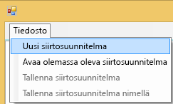

2. Haluat valita **Valitse Power BI Embedded -resurssiryhmä** -valintaikkunasta avattavan Ympäristö-luettelon ja valita tuotannon.

3. Sinua kehotetaan kirjautumaan sisään. Käytät Azure-tilauksesi kirjautumistunnusta.

   > [!IMPORTANT]
   > Kyse **ei** ole Office 365:n organisaation tilistä, jolla kirjaudut sisään Power BI -palveluun.

4. Valitse Azure-tilaus, joka tallentaa Power BI Embedded -työtilakokoelmat.

    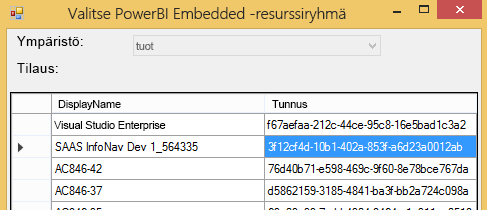
5. Valitse tilausluettelon alta **Resurssiryhmä**, joka sisältää työtilakokoelmat, ja valitse **Valitse**.

    

6. Valitse **Analysoi**. Saat näin Azure-tilauksessa olevien kohteiden inventaarion, jonka avulla voit aloittaa suunnitelman työstämisen.

    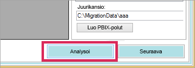

   > [!NOTE]
   > Analysointiprosessi voi viedä pari minuuttia työtilakokoelmien määrän ja niiden sisällön määrän mukaan.

7. Kun **Analysoi**-vaihe on suoritettu, sinua kehotetaan tallentamaan siirtosuunnitelma.

Olet tässä vaiheessa yhdistänyt siirtosuunnitelmasi Azure-tilaukseesi. Lue alta, miten työnkulku sujuu siirtosuunnitelmassa. Se sisältää kohteet Analysoi ja suunnittele siirtoa, Lataa palvelusta, Luo ryhmät ja Lataa palveluun.

### <a name="save-your-migration-plan"></a>Tallenna siirtosuunnitelma

Voit tallentaa siirtosuunnitelman myöhempää käyttöä varten. Se luo XML-tiedoston, joka sisältää siirtosuunnitelmasi kaikki tiedot.

Voit tallentaa siirtosuunnitelmasi seuraavasti.

1. Valitse **Tiedosto** > **Tallenna siirtosuunnitelma**.

    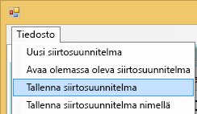

2. Anna tiedostollesi nimi tai käytä luotua tiedostonimeä ja valitse **Tallenna**.

### <a name="open-an-existing-migration-plan"></a>Avaa olemassa oleva siirtosuunnitelma

Voit avata tallennetun siirtosuunnitelman, jos haluat jatkaa siirron työstämistä.

Voit avata olemassa olevan siirtosuunnitelman seuraavasti.

1. Valitse **Tiedosto** > **Avaa olemassa oleva siirtosuunnitelma**.

    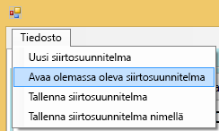

2. Valitse siirtotiedosto ja valitse **Avaa**.

## <a name="step-1-analyze--plan-migration"></a>Vaihe 1: Analysoi ja suunnittele siirtoa

**Analysoi ja suunnittele siirtoa** -välilehden avulla voit tarkastella Azure-tilauksesi resurssiryhmän tämänhetkistä sisältöä.

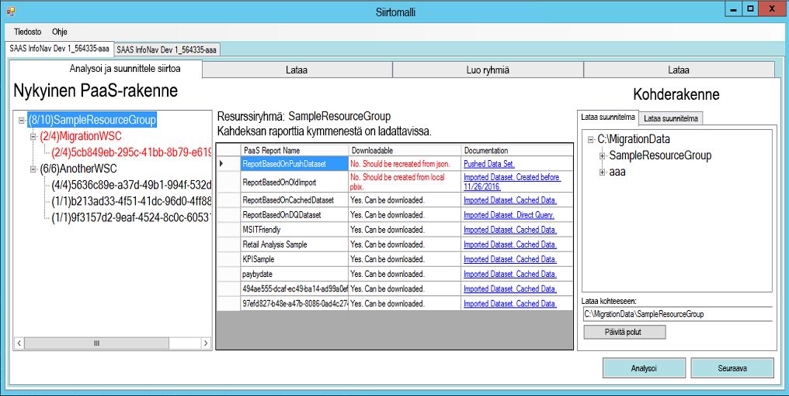

Tarkastelemme esimerkkinä *SampleResourceGroupia*.

### <a name="paas-topology"></a>PaaS-topologia

Tämä on luettelo kohteesta *Resurssiryhmä > Työtilakokoelmat > Työtilat*. Resurssiryhmä ja työtilakokoelmat näyttävät kutsumanimen. Työtilat näyttävät GUID-tunnuksen.

Luettelon kohteissa näytetään myös väri ja numero muodossa (#/#). Tämä osoittaa niiden raporttien määrän, jotka voidaan ladata palvelusta.
Musta väri tarkoittaa, että kaikki raportit voidaan ladata palvelusta.

Punainen väri tarkoittaa, että joitakin raportteja ei voida ladata. Vasemmalla oleva numero ilmaisee, kuinka monta raporttia voidaan yhteensä ladata palvelusta. Oikealla oleva numero ilmaisee, kuinka monta raporttia ryhmässä on yhteensä.

Voit valita PaaS-topologian kohteen näkymään raportissa Raportit-osiossa.

### <a name="reports"></a>Raportit

Raportit-osiossa on luettelo saatavilla olevista raporteista. Se ilmaisee, voidaanko ne ladata palvelusta vai ei.


### <a name="target-structure"></a>Kohderakenne

Ilmoitat **Kohderakenne**-kohdassa, mistä palvelusta kohteet ladataan ja miten ne ladataan palveluun.

#### <a name="download-plan"></a>Lataa suunnitelma

Polku luodaan automaattisesti puolestasi. Voit halutessasi muuttaa tätä polkua. Jos muutat polkua, sinun on valittava **Päivitä polut**.

> [!NOTE]
> Tämä ei varsinaisesti suorita latausta palvelusta vaan vain määrittää rakenteen, mistä raportit ladataan.

#### <a name="upload-plan"></a>Lataa suunnitelma

Voit täällä määrittää etuliitteen, jota käytetään Power BI -palvelussa luotavassa työtilassa. Sen jälkeen etuliitteenä toimii GUID-tunnus työtilalle, joka oli jo olemassa Azuressa.

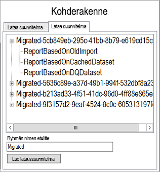

> [!NOTE]
> Tämä ei varsinaisesti luo ryhmiä Power BI -palvelussa vaan vain määrittää ryhmien nimeämisrakenteen.

Jos muutat etuliitettä, sinun on valittava **Luo palveluun ladattava suunnitelma**.

Voit napsauttaa hiiren oikealla painikkeella ryhmää ja nimetä ryhmän uudelleen halutessasi Lataa suunnitelma suoraan palveluun -kohdassa.

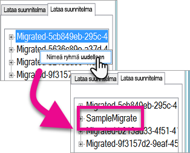

> [!NOTE]
> *Ryhmän* nimi ei saa sisältää välilyöntejä tai virheellisiä merkkejä.

## <a name="step-2-download"></a>Vaihe 2: Lataa

**Lataa**-välilehdessä näet luettelon raporteista ja liitännäisestä metatiedosta. Näet täällä viennin tilan sekä edellisen viennin tilan.

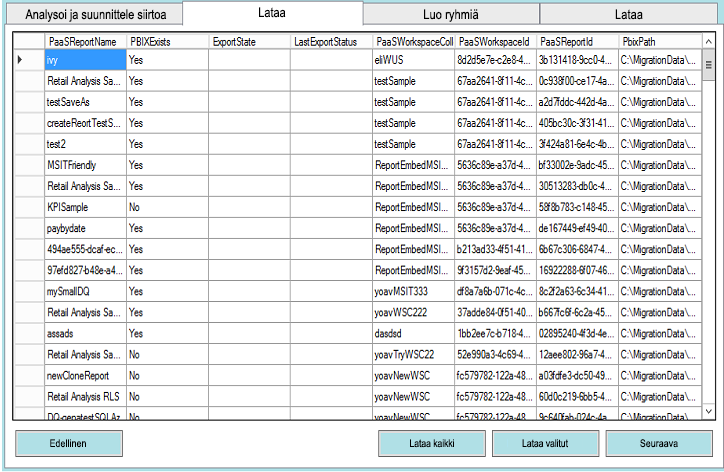

Sinulla on kaksi vaihtoehtoa.

* Valitse tietyt raportit ja valitse **Lataa valitut kohteet palvelusta**
* Valitse **Lataa kaikki kohteet palvelusta**.


Jos lataus palvelusta onnistui, näet tilan *Valmis*. Se tarkoittaa, että PBIX-tiedosto on luotu.

Kun lataus palvelusta on valmis, valitse **Luo ryhmät** -välilehti.

## <a name="step-3-create-groups"></a>Vaihe 3: Luo ryhmiä

Kun olet ladannut saatavilla olevat raportit palvelusta, voit siirtyä **Luo ryhmät** -välilehteen. Tämä välilehti luo työtilat Power BI -palvelussa luomasi siirtosuunnitelman mukaan. Se luo työtilan nimellä, jonka annoit **Lataa**-välilehden **Analysoi ja suunnittele siirtoa** -kohdassa.


Jos haluat luoda työtilat, voit valita joko **Luo valitut ryhmät** tai **Luo kaikki puuttuvat ryhmät**.

Kun valitset jommankumman näistä vaihtoehdoista, sinua kehotetaan kirjautumaan sisään. *Haluat käyttää tunnistetietojasi Power BI -palvelulle, jonka haluat luoda työtiloissa.*

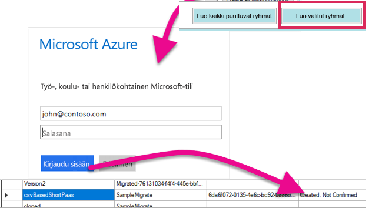

Tämä luo työtilan Power BI -palvelussa. Tämä ei lataa raportteja työtilaan.

Voit varmistaa, että työtila luotiin kirjautumalla sisään Power BI:hin, ja että työtila on olemassa. Huomaat, että työtilassa ei ole mitään.

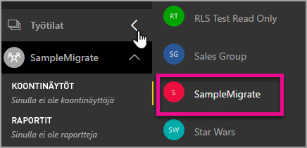

Työtilan luomisen jälkeen voit siirtyä **Lataa palveluun** -välilehteen.

## <a name="step-4-upload"></a>Vaihe 4: Lataa

Voit **Lataa palveluun** -välilehdessä ladata raportit Power BI -palveluun. Näet luettelon palvelusta ladatuista raporteista Lataa palvelusta -välilehdessä yhdessä kohderyhmän nimen kanssa siirtosuunnitelman mukaan.


Voit ladata valitut raportit tai kaikki raportit palveluun. Voit myös vaihtaa Lataa palveluun -tilaksi kohteiden uudelleenlataus.

Voit myös valita, mitä haluat tehdä, jos löytyy samanniminen raportti. Voit valita **Keskeytä**, **Ohita** ja **Korvaa**.

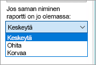

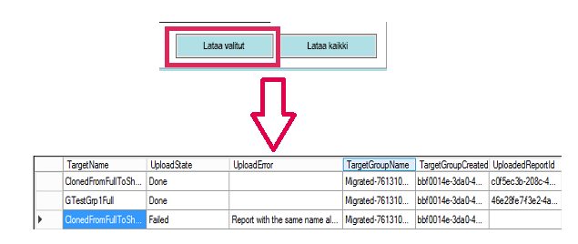

### <a name="duplicate-report-names"></a>Samat raportin nimet

Jos sinulla on samanniminen raportti, jonka tiedät kuitenkin olevan eri raportti, sinun on muutettava raportin **kohteen nimeä**. Voit muuttaa nimeä muokkaamalla manuaalisesti siirtosuunnitelman XML-tiedostoa.

Siirtotyökalu on suljettava muutoksen tekemiseksi. Työkalu ja siirtosuunnitelma on sitten avattava uudelleen.

Yllä olevassa esimerkissä yksi kloonatuista raporteista epäonnistui ja sait ilmoituksen, jonka mukaan samanniminen raportti on jo olemassa. Jos tarkastelemme siirtosuunnitelman XML-tiedostoa, näemme seuraavat asiat.

```xml
<ReportMigrationData>
    <PaaSWorkspaceCollectionName>SampleWorkspaceCollection</PaaSWorkspaceCollectionName>
    <PaaSWorkspaceId>4c04147b-d8fc-478b-8dcb-bcf687149823</PaaSWorkspaceId>
    <PaaSReportId>525a8328-b8cc-4f0d-b2cb-c3a9b4ba2efe</PaaSReportId>
    <PaaSReportLastImportTime>1/3/2017 2:10:19 PM</PaaSReportLastImportTime>
    <PaaSReportName>cloned</PaaSReportName>
    <IsPushDataset>false</IsPushDataset>
    <IsBoundToOldDataset>false</IsBoundToOldDataset>
    <PbixPath>C:\MigrationData\SampleResourceGroup\SampleWorkspaceCollection\4c04147b-d8fc-478b-8dcb-bcf687149823\cloned-525a8328-b8cc-4f0d-b2cb-c3a9b4ba2efe.pbix</PbixPath>
    <ExportState>Done</ExportState>
    <LastExportStatus>OK</LastExportStatus>
    <SaaSTargetGroupName>SampleMigrate</SaaSTargetGroupName>
    <SaaSTargetGroupId>6da6f072-0135-4e6c-bc92-0886d8aeb79d</SaaSTargetGroupId>
    <SaaSTargetReportName>cloned</SaaSTargetReportName>
    <SaaSImportState>Failed</SaaSImportState>
    <SaaSImportError>Report with the same name already exists</SaaSImportError>
</ReportMigrationData>
```

Voimme muuttaa epäonnistuneelle kohteelle SaaSTargetReportNamen nimeä.

```xml
<SaaSTargetReportName>cloned2</SaaSTargetReportName>
```

Voimme sitten avata suunnitelman uudelleen siirtotyökalussa ja ladata epäonnistuneen raportin palveluun.

Kun palaamme takaisin Power BI -palveluun, näemme, että raportit ja tietojoukot on ladattu työtilaan.

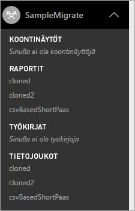

<a name="upload-local-file"></a>

### <a name="upload-a-local-pbix-file"></a>Lataa paikallinen PBIX-tiedosto palveluun

Voit ladata Power BI Desktop -tiedoston paikallisen version palveluun. Sulje työkalu, muokkaa XML-tiedostoa ja anna paikallisen PBIX-tiedoston täydellinen polku **PbixPath**-ominaisuudessa.

```xml
<PbixPath>[Full Path to PBIX file]</PbixPath>
```

Kun olet muokannut XML-tiedostoa, avaa suunnitelma uudelleen siirtotyökalussa ja lataa raportti palveluun.

<a name="directquery-reports"></a>

### <a name="directquery-reports"></a>DirectQuery-raportit

Sinun on päivitettävä DirectQuery-raporttien yhteysmerkkijonoa. Se voidaan tehdä *powerbi.comissa* tai voit ohjelmallisesti kysellä yhteysmerkkijonoa Power BI Embedded (Paas) -palvelusta. Katso esimerkkiä tästä artikkelista [DirectQuery-yhteysmerkkijonon poimiminen PaaS-raportista](migrate-code-snippets.md#extract-directquery-connection-string-from-paas-report).

Voit sitten päivittää tietojoukon yhteysmerkkijonon Power BI -palvelussa (SaaS) ja määrittää tietolähteen tunnistetiedot. Näet seuraavien esimerkkien avulla, miten se tapahtuu.

* [DirectQuery-yhteysmerkkijonon päivittäminen SaaS-työtilassa](migrate-code-snippets.md#update-directquery-connection-string-is-saas-workspace)
* [DirectQuery-tunnistetietojen määrittäminen SaaS-työtilassa](migrate-code-snippets.md#set-directquery-credentials-in-saas-workspace)

## <a name="embedding"></a>Upottaminen

Kun raportit on nyt siirretty Power BI Embedded Azure -palvelusta Power BI -palveluun, voit nyt päivittää sovelluksesi ja aloittaa raporttien upottamisen tässä työtilassa.

Katso lisätietoja artikkelista [Miten Power BI Embedded -työtilakokoelman sisältö siirretään Power BI -palveluun](migrate-from-powerbi-embedded.md).

## <a name="next-steps"></a>Seuraavat vaiheet

[Upottaminen Power BI:n avulla](embedding.md)  
[Miten Power BI Embedded -työtilakokoelman sisältö siirretään Power BI -palveluun](migrate-from-powerbi-embedded.md)  
[Mikä on Power BI Premium?](../../admin/service-premium-what-is.md)  
[JavaScript API Git -säilö](https://github.com/Microsoft/PowerBI-JavaScript)  
[Power BI C# Git -säilö](https://github.com/Microsoft/PowerBI-CSharp)  
[JavaScript-upotuksen näyte](https://microsoft.github.io/PowerBI-JavaScript/demo/)  
[Power BI Premiumin tekninen raportti](https://aka.ms/pbipremiumwhitepaper)  

Onko sinulla kysyttävää? [Voit esittää kysymyksiä Power BI -yhteisössä](https://community.powerbi.com/)