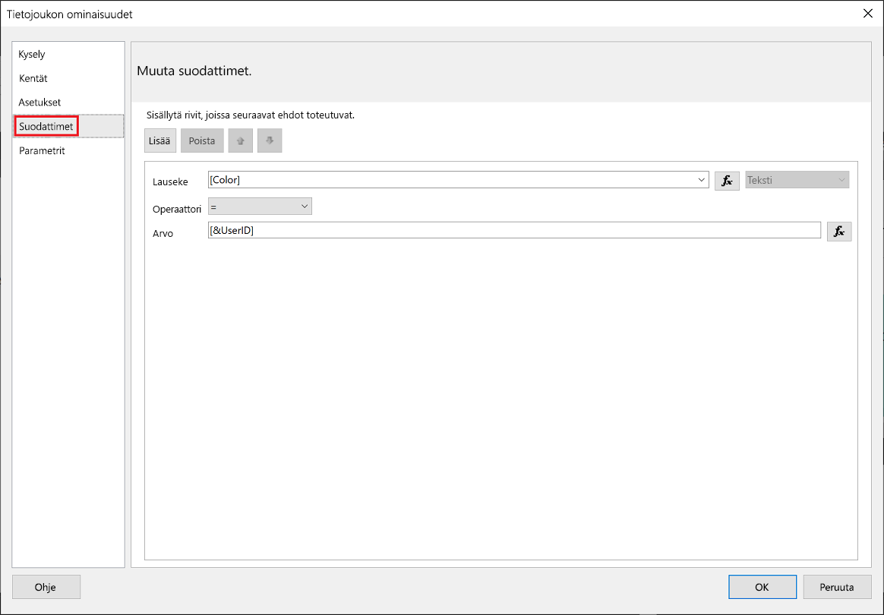
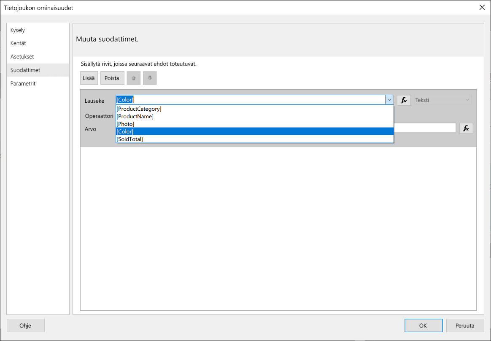
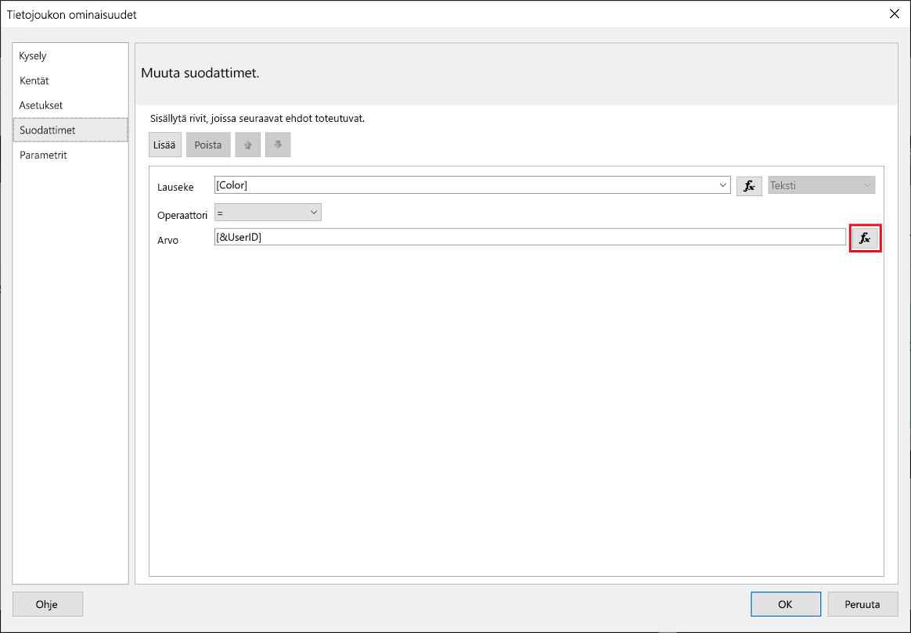
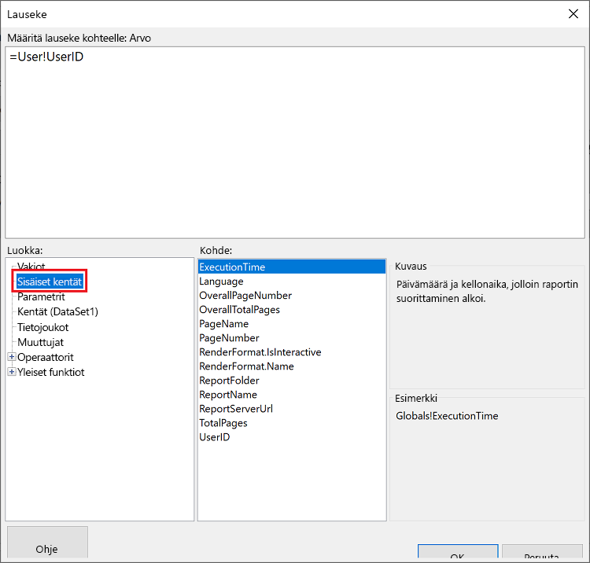
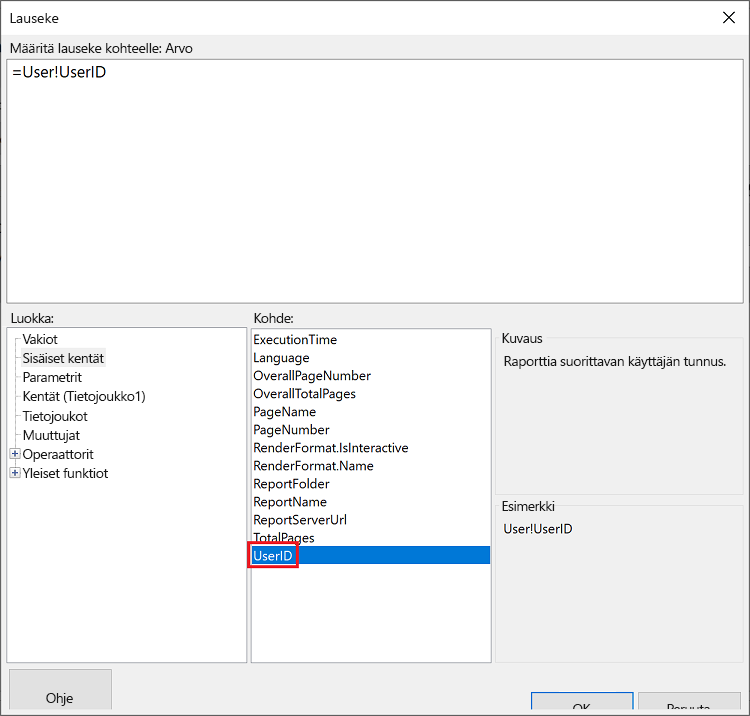
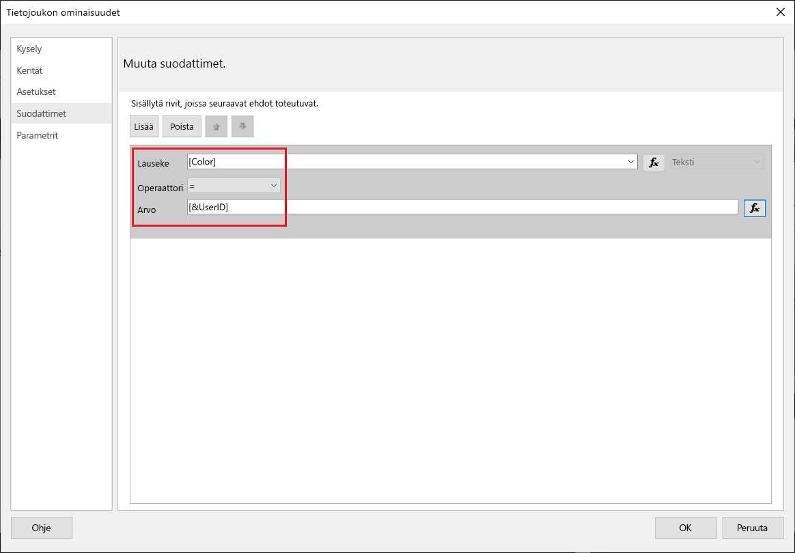
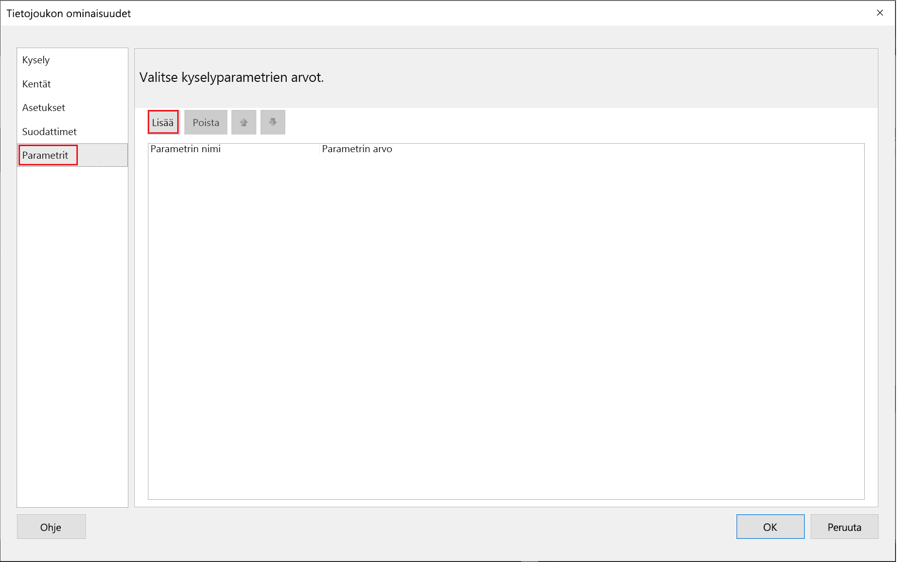
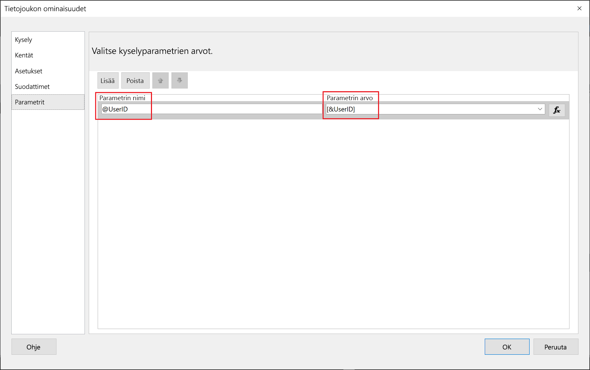
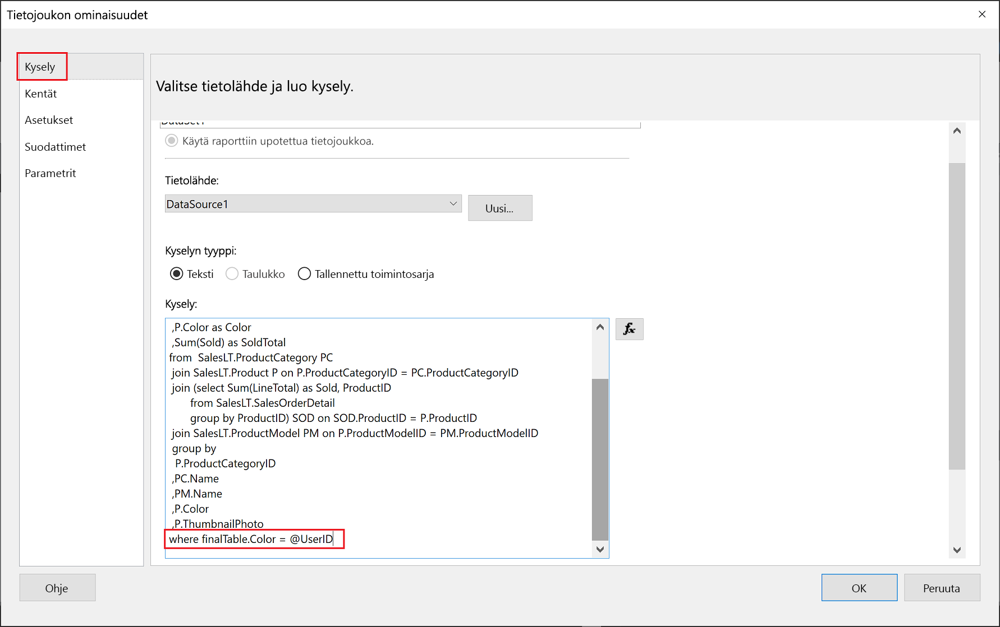

# <a name="implementing-row-level-security-in-embedded-paginated-reports-preview"></a>Rivitason suojauksen toteuttaminen upotetuissa sivutetuissa raporteissa (esikatselu)

Kun upotat sivutetun raportin, voit määrittää, mitä tietoja näytetään. Tämä mahdollistaa näytettyjen tietojen räätälöinnin käyttäjäkohtaisesti. Jos sinulla on esimerkiksi Power BI:n sivutettu raportti, joka sisältää yleisiä myyntituloksia, voit upottaa sen niin, että vain tietyn alueen myyntitulokset ovat käytettävissä.

Tämä ominaisuus tarjoaa turvallisen tavan näyttää tietojen alijoukko niin, että muut tiedot eivät vaarannu. Se muistuttaa [rivitason suojaus (RLS)](embedded-row-level-security.md) -ominaisuutta, joka tarjoaa turvallisen tavan näyttää tiedot Power BI -raporteissa (joita ei ole sivutettu), koontinäytöillä, ruuduissa ja tietojoukoissa.  

> [!NOTE]
> Tämä ominaisuus toimii asiakkaille upotettujen sivutettujen raporttien kanssa.

## <a name="configuring-a-parameter-to-filter-the-dataset"></a>Parametrin määrittäminen tietojoukon suodattamiseksi

Kun otat rivitason suojauksen käyttöön Power BI -sivutetulle raportille, sinun on määritettävä [parametri](../../paginated-reports/report-builder-parameters.md)**UserID**-määritteelle. Tämä parametri rajoittaa tietojoukosta vedettyjä tietoja ennen raportin upottamista.

Kun olet määrittänyt parametrin **UserID:lle**, käytä [Reports GenerateTokenForCreateInGroup](https://docs.microsoft.com/rest/api/power-bi/embedtoken/reports_generatetokenforcreateingroup)-ohjelmointirajapintaa upotetun suojaustunnuksen saamiseksi.

## <a name="use-userid-as-a-filter-at-report-or-query-level"></a>UserID-tunnuksen käyttäminen suodattimen raportti- tai kyselytasolla

Voit käyttää **UserId**-tunnusta *suodattimena* tai *kyselynä* tietolähteeseen [Power BI Report Builderissa](../../paginated-reports/report-builder-power-bi.md).

### <a name="using-the-filter"></a>Suodattimen käyttö

1. Valitse **Tietojoukon ominaisuudet** -ikkunan vasemmasta ruudusta **Suodatin**.

    

2. Valitse avattavasta **Lauseke**-valikosta parametri, jota haluat käyttää tietojen suodattamiseen.

     

3. Napsauta **Arvo**-toimintopainiketta. 

    

4. Valitse **Lauseke**-ikkunassa **Luokka**-luettelosta **Sisäiset kentät**.

    

5. Valitse **Kohde**-luettelosta **UserID** ja valitse **OK**.

    

6. Tarkista **Tietojoukon ominaisuudet**-ikkunassa, että lauseke on *valitsemasi parametri = UserID*ja valitse **OK**.

    

### <a name="using-a-query"></a>Kyselyn käyttäminen

1. Valitse **Tietojoukon ominaisuudet** -ikkunan vasemmasta ruudusta **Parametrit** ja napsauta **Lisää**.

    

2. Anna kohdassa **Parametrin nimi** **\@UserID**ja lisää kohtaan **Parametrin arvo** **[&UserID]** .

     

3. Valitse vasemmasta ruudusta **Kysely**ja lisää **UserID**-parametri kyselysi osaksi ja valitse **OK**.
    > [!NOTE]
    > Parametrin värinä alla olevassa esimerkkikuvassa käytetään (Wyalefintable. Color = @UserID). Tarvittaessa on mahdollista luoda monimutkaisempi kysely.

    

## <a name="passing-the-configured-parameter-using-the-embed-token"></a>Määritetyn parametrin syöttäminen upotustunnuksen avulla

Kun upotat sivutetun raportin asiakkaitasi varten, [Reports GenerateTokenForCreateInGroup](https://docs.microsoft.com/rest/api/power-bi/embedtoken/reports_generatetokenforcreateingroup) -ohjelmointirajapintaa käytetään upotustunnuksen muodostamiseen. Tämän tunnuksen avulla voidaan myös suodattaa joitakin tietoja, jotka on vedetty ulos sivutetun raportin kautta.

Jos haluat paljastaa vain osan tiedoista, määritä `username` kenttään tiedot, jotka haluat näyttää. Jos esimerkiksi sivutetussa raportissa, jossa on väriparametri, syötät *vihreä*`username`-kenttään, upotustunnus rajoittaa upotetut tiedot näyttämään vain tiedot, joissa on *vihreä*-arvo värisarakkeessa.

```JSON
{
    "accessLevel": "View",
    "reportId": "cfafbeb1-8037-4d0c-896e-a46fb27ff229",
    "identities": [
            {
                    // Replace the 'username' with a paginated report parameter
                    "username":     "...",
                    "reports: [
                        "cfafbeb1-8037-4d0c-896e-a46fb27ff229"
                    ]
            }
    ]
}
```
