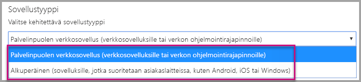
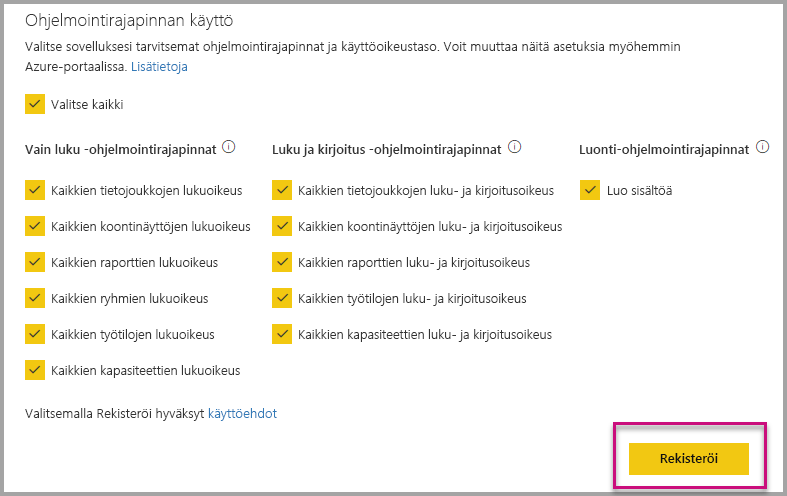
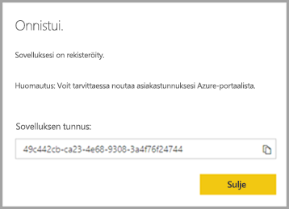
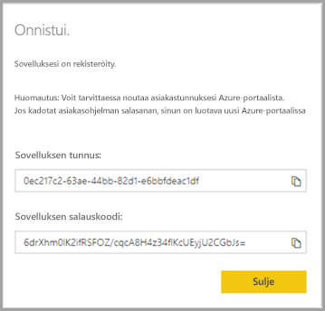
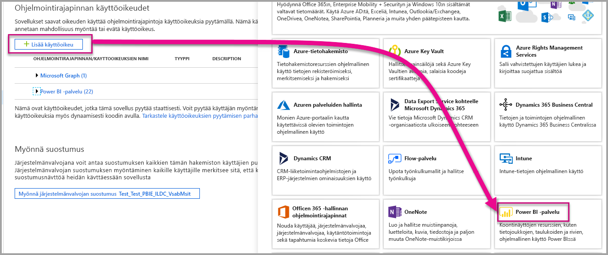

# <a name="register-an-azure-ad-application-to-use-with-power-bi"></a>Azure AD -sovelluksen rekisteröinti Power BI:ssä käytettäväksi

Lue, miten voit rekisteröidä sovelluksen Azure Active Directoryssä (Azure AD) Power BI -sisällön upottamiseksi.

Kun rekisteröit sovelluksen Azure AD:ssä, sovellus voi käyttää [Power BI REST -ohjelmointirajapintoja](https://docs.microsoft.com/rest/api/power-bi/). Kun rekisteröit sovelluksesi, voit määrittää sovelluksen käyttäjätiedot sekä käyttöoikeudet Power BI REST -resursseihin.

> [!IMPORTANT]
> Ennen Power BI -sovelluksen rekisteröintiä tarvitset [Azure Active Directory -vuokraajan ja organisaation käyttäjän](create-an-azure-active-directory-tenant.md). Jos et ole vielä rekisteröitynyt Power BI:hin siten, että vuokraajassa on käyttäjä, sovelluksen rekisteröinti epäonnistuu.

Voit rekisteröidä sovelluksen kahdella eri tavalla. Voit rekisteröidä sen [Power BI -sovelluksen rekisteröintityökalun](https://dev.powerbi.com/apps/) avulla tai rekisteröidä sen suoraan Azure-portaalissa. Power BI -sovelluksen rekisteröintityökalu on helpompi vaihtoehto, koska siinä on vain muutama täytettävä kenttä. Käytä Azure-portaalia, jos haluat tehdä muutoksia sovellukseen.

## <a name="register-with-the-power-bi-application-registration-tool"></a>Rekisteröinti Power BI -sovelluksen rekisteröintityökalun avulla

Rekisteröi sovellus **Azure Active Directoryssä**, jotta voit määrittää sovelluksen käyttäjätiedot ja Power BI REST -resurssien käyttöoikeudet. Kun rekisteröit jonkin sovelluksen (esimerkiksi konsolisovelluksen tai verkkosivuston), saat tunnisteen, jonka avulla sovellus voi tunnistaa itsensä käyttäjille, jolta ne pyytävät käyttöoikeuksia.

Voit rekisteröidä sovelluksen Power BI -sovelluksen rekisteröintityökalun avulla seuraavasti:

1. Siirry osoitteeseen [dev.powerbi.com/apps](https://dev.powerbi.com/apps).

2. Valitse **Kirjaudu sisään aiemmin luodulla tilillä** ja sitten **Seuraava**.

3. Anna **sovelluksen nimi**.

4. Anna **sovelluksen tyyppi**.

    Alla on lueteltu erot **alkuperäisten** sovellustyyppien ja **palvelinpuolen verkkosovellusten** sovellustyyppien välillä. Valitse sovellustyyppi näiden tietojen perusteella.

    Alkuperäinen:
    * Aiot luoda sovelluksen, joka on [suunniteltu asiakkaillesi](embed-sample-for-customers.md) ja joka todennetaan pääkäyttäjätilillä (Power BI Pro -käyttöoikeus, jolla kirjaudutaan Power BI:hin).

    Palvelinpuolen verkkosovellus:
    * Aiot luoda sovelluksen, joka on [suunniteltu organisaatiollesi](embed-sample-for-your-organization.md).
    * Aiot luoda sovelluksen, joka on [suunniteltu asiakkaillesi](embed-sample-for-customers.md) ja joka todennetaan palvelun päänimellä.
    * Aiot luoda verkkosovelluksia tai verkko-ohjelmointirajapintoja.

    

5. Jos valitset sovellustyypiksi **palvelinpuolen verkkosovelluksen**, anna **aloitussivun URL-osoite** ja **uudelleenohjauksen URL-osoite**. **Uudelleenohjauksen URL-osoite** voi olla mikä tahansa kelvollinen URL-osoite. Sen tulisi vastata luomaasi sovellusta. Jos valitset **alkuperäisen** sovellustyypin, jatka vaiheeseen 6.

6. Valitse sovelluksesi tarvitsemat Power BI -ohjelmointirajapinnat. Katso lisätietoja Power BI -käyttöoikeuksista artikkelista [Power BI -käyttöoikeudet](power-bi-permissions.md). Valitse sitten **Rekisteröi**.

    

    > [!Important]
    > Jos otat käyttöön palvelun päänimet käytettäväksi Power BI:n kanssa, Azure Active Directory -käyttöoikeudet eivät ole enää voimassa. Käyttöoikeuksia hallitaan Power BI -hallintaportaalissa.

7. Jos valitset **alkuperäisen** sovellustyypin, sinulle annetaan **sovellustunnus**. Jos valitset sovellustyypiksi **palvelinpuolen verkkosovelluksen**, saat **sovellustunnuksen** ja **sovellussalaisuuden**.

    > [!Note]
    > **Sovellustunnuksen** voi tarvittaessa hakea myöhemmin Azure-portaalista. Jos kadotat **sovellussalaisuuden**, sinun on luotava uusi Azure-portaalissa.

| Alkuperäinen | Palvelinpuolen verkkosovellus |
|--------|-----------------------------|
|  |  |

Voit nyt käyttää rekisteröityä sovellusta osana mukautettua sovellusta, kun käytät Power BI -palvelua ja Power BI Embedded -sovellusta.

## <a name="register-with-the-azure-portal"></a>Rekisteröinti Azure-portaalin avulla

Toinen vaihtoehto sovelluksen rekisteröintiin on tehdä se suoraan Azure-portaalissa. Voit rekisteröidä sovelluksen noudattamalla seuraavia vaiheita.

1. Hyväksy [Microsoft Power BI -ohjelmointirajapinnan ehdot](https://powerbi.microsoft.com/api-terms).

2. Kirjaudu sisään [Azure-portaaliin](https://portal.azure.com).

3. Valitse Azure AD -vuokraajasi valitsemalla tili sivun oikeassa yläkulmassa.

4. Valitse vasemmassa siirtymisruudussa **Kaikki palvelut**, valitse **Sovelluksen rekisteröinti** ja valitse sitten **Uusi rekisteröinti**.

5. Noudata kehotteita ja luo uusi sovellus.

   Katso lisätietoja siitä, miten voit rekisteröidä sovelluksia Azure Active Directoryssä, artikkelista [Sovelluksen rekisteröinti Azure Active Directoryssa](https://docs.microsoft.com/azure/active-directory/develop/quickstart-v2-register-an-app).

## <a name="how-to-get-the-application-id"></a>Sovellustunnuksen hakeminen

Kun rekisteröit sovelluksen, saat [sovellustunnuksen](embed-sample-for-customers.md#application-id).  **Sovellustunnuksen** avulla sovellus tunnistaa itsensä ja pyytää käyttäjille käyttöoikeuksia.

## <a name="how-to-get-the-service-principal-object-id"></a>Palvelun päänimen objektitunnuksen hakeminen

Kun käytät [Power BI -ohjelmointirajapintoja](https://docs.microsoft.com/rest/api/power-bi/), muista määrittää toiminnot [palvelun päänimen objektitunnuksella](embed-service-principal.md) siten, että toiminnot viittaavat palvelun päänimeen (ota esimerkiksi palvelun päänimi käyttöön työtilan järjestelmänvalvojana).

## <a name="apply-permissions-to-your-application-within-azure-ad"></a>Käyttöoikeuksien soveltaminen sovellukseen Azure AD:ssä

Ota käyttöön lisäkäyttöoikeuksia sovellukselle sovelluksen rekisteröintisivulla annettujen käyttöoikeuksien lisäksi. Voit tehdä tämän Azure AD-portaalissa tai ohjelmallisesti.

Sinun on kirjauduttava sisään joko *päätilillä*, jota käytetään upotukseen, tai yleisen järjestelmänvalvojan tilillä.

### <a name="using-the-azure-ad-portal"></a>Azure AD -portaalin käyttö

1. Selaa kohtaan [Sovelluksen rekisteröinnit](https://portal.azure.com/#blade/Microsoft_AAD_RegisteredApps/ApplicationsListBlade/quickStartType//sourceType/) Azure-portaalissa ja valitse sovellus, jota käytät upottamiseen.

2. Valitse **API-oikeudet** kohdassa **Hallinta**.

3. Valitse **API-oikeudet**-kohdassa **Lisää käyttöoikeus** ja valitse sitten **Power BI -palvelu**.

    

4. Valitse tarvitsemasi oikeudet kohdassa **Delegoidut oikeudet**. Valitse ne yksi kerrallaan valintojen tallentamiseksi. Kun olet valmis, valitse **Tallenna**.

5. Valitse **Myönnä suostumus**.

    **Myönnä suostumus** -toiminto edellyttää *päätiliä*, jotta Azure AD ei pyydä lupaa. Jos toiminnon suorittava tili on yleinen järjestelmänvalvoja, sovelluksen käyttöoikeudet myönnetään organisaation kaikille käyttäjille. Jos toiminnon suorittava tili on *päätili* eikä se ole yleinen järjestelmänvalvoja, käyttöoikeudet sovellukseen myönnetään vain *päätilille*.

### <a name="applying-permissions-programmatically"></a>Käyttöoikeuksien soveltaminen ohjelmallisesti

1. Sinun on hankittava olemassa olevat palvelun pääkohteet (käyttäjät) vuokraajassa. Lisätietoja tämän tekemisestä on artikkelissa [servicePrincipal](https://docs.microsoft.com/graph/api/resources/serviceprincipal?view=graph-rest-beta).

    Voit kutsua *Get servicePrincipal*-ohjelmointirajapintaa ilman {tunnusta}. Näin saat kaikki vuokraajassa olevat palvelun päänimet.

2. Voit tarkistaa palvelun päänimen sovelluksen asiakastunnuksella **appId**-ominaisuuden avulla.

3. Luo uusi palvelumalli, jos se puuttuu sovelluksesta.

    ```json
    Post https://graph.microsoft.com/beta/servicePrincipals
    Authorization: Bearer ey..qw
    Content-Type: application/json
    {
    "accountEnabled" : true,
    "appId" : "{App_Client_ID}",
    "displayName" : "{App_DisplayName}"
    }
    ```

4. Sovelluksen käyttöoikeuksien myöntäminen Power BI -ohjelmointirajapinnalle

   Jos käytät olemassa olevaa vuokraajaa etkä halua myöntää käyttöoikeuksia kaikkien vuokraajan käyttäjien puolesta, voit myöntää käyttöoikeudet tietylle käyttäjälle vaihtamalla **contentType**-arvoksi **Principal**.

   **ConsentType**-arvoksi voidaan antaa joko **AllPrincipals**- tai **Principal**-arvo.

   * **AllPrincipals**-arvoa voi käyttää vain vuokraajan järjestelmänvalvoja, myöntääkseen käyttöoikeuksia vuokraajan kaikkien käyttäjien puolesta.
   * **Principal**-arvoa käytetään käyttöoikeuksia myöntämiseen tietyn käyttäjän puolesta. Tässä tapauksessa lisäominaisuus tulee lisätä pyynnön runkoon - *principalId = {User_ObjectId}* .

     Sinun täytyy *myöntää käyttöoikeudet* päätilille, jotta Azure AD ei pyydä päätililtä lupaa, mikä ei ole mahdollista ei-vuorovaikutteista kirjautumista käytettäessä.

     ```json
     Post https://graph.microsoft.com/beta/OAuth2PermissionGrants
     Authorization: Bearer ey..qw
     Content-Type: application/json
     {
     "clientId":"{Service_Plan_ID}",
     "consentType":"AllPrincipals",
     "resourceId":"c78a3685-1ce7-52cd-95f7-dc5aea8ec98e",
     "scope":"Dataset.ReadWrite.All Dashboard.Read.All Report.Read.All Group.Read Group.Read.All Content.Create Metadata.View_Any Dataset.Read.All Data.Alter_Any",
     "expiryTime":"2018-03-29T14:35:32.4943409+03:00",
     "startTime":"2017-03-29T14:35:32.4933413+03:00"
     }
     ```

    **resourceId** *c78a3685-1ce7-52cd-95f7-dc5aea8ec98e* ei ole yleinen, mutta se on riippuvainen vuokraajasta. Tämä arvo on Power BI -palvelusovelluksen objectId-tunnus Azure Active Directory (AAD) -vuokraajassa.

    Käyttäjä voi hakea tämän arvon nopeasti Azure-portaalissa:
    1. https://portal.azure.com/#blade/Microsoft_AAD_IAM/StartboardApplicationsMenuBlade/AllApps

    2. Tee haku ”Power BI -palvelu” SearchBoxissa

5. Myönnä sovelluksen käyttöoikeudet Azure Active Directorylle (AAD)

   **ConsentType**-arvoksi voidaan antaa joko **AllPrincipals**- tai **Principal**-arvo.

   * **AllPrincipals**-arvoa voi käyttää vain vuokraajan järjestelmänvalvoja, myöntääkseen käyttöoikeuksia vuokraajan kaikille käyttäjille.
   * **Principal**-arvoa käytetään käyttöoikeuden myöntämiseksi tietylle käyttäjälle. Tässä tapauksessa lisäominaisuus tulee lisätä pyynnön runkoon - *principalId = {User_ObjectId}* .

   Sinun täytyy *myöntää käyttöoikeudet* päätilille, jotta Azure AD ei pyydä päätililtä lupaa, mikä ei ole mahdollista ei-vuorovaikutteista kirjautumista käytettäessä.

   ```json
   Post https://graph.microsoft.com/beta/OAuth2PermissionGrants
   Authorization: Bearer ey..qw
   Content-Type: application/json
   { 
   "clientId":"{Service_Plan_ID}",
   "consentType":"AllPrincipals",
   "resourceId":"61e57743-d5cf-41ba-bd1a-2b381390a3f1",
   "scope":"User.Read Directory.AccessAsUser.All",
   "expiryTime":"2018-03-29T14:35:32.4943409+03:00",
   "startTime":"2017-03-29T14:35:32.4933413+03:00"
   }
   ```

## <a name="next-steps"></a>Seuraavat vaiheet

Kun olet nyt rekisteröinyt sovelluksesi Azure AD:ssä, sinun on todennettava käyttäjät sovelluksessasi. Lue lisää artikkelista [Käyttäjien todentaminen ja Azure AD -käyttöoikeustietueen hankinta Power BI -sovellukselle](get-azuread-access-token.md).

Onko sinulla kysyttävää? [Voit esittää kysymyksiä Power BI -yhteisössä](https://community.powerbi.com/)