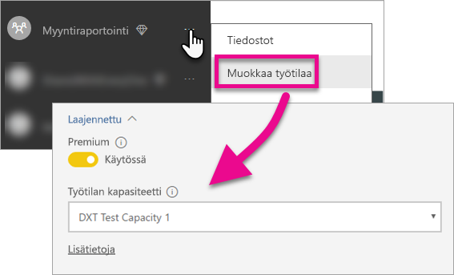

# Power BI:n koontinäyttöjen, raporttien ja ruutujen upottaminen

Lue ohjeet, miten voit upottaa Power BI -sisältöä sovellukseesi.

Microsoft [on julkistanut Power BI Premiumin](https://powerbi.microsoft.com/blog/microsoft-accelerates-modern-bi-adoption-with-power-bi-premium/), uuden kapasiteettiin perustuvan lisensointimallin, joka tekee sisällön käytöstä ja jakamisesta joustavampaa käyttäjille. Se tarjoaa myös lisää skaalautuvuutta ja suorituskykyä Power BI -palveluun. Lisäksi julkistettiin Power BI Embedded, jonka avulla voi luoda kapasiteettia Microsoft Azuressa. Power BI Embedded keskittyy sinun sovellukseesi ja asiakkaihisi. 

Tässä artikkelissa käsitellään Power BI ‑sisällön upottamista sekä organisaatiosi että asiakkaidesi kannalta. Molempien näkökulmien kannalta vaiheet ovat samankaltaisia. Jos jokin vaihe koskee vain asiakkaita varten tehtävää upottamista, siitä huomautetaan erikseen.

Upottaminen edellyttää, että teet ensin muutaman työvaiheen sovelluksessasi. Seuraavassa käydään läpi vaiheet, joiden avulla voit luoda upotettua sisältöä ja käyttää sitä sovelluksestasi.

> [!NOTE]
> Power BI -ohjelmointirajapinnat viittaavat sovelluksen työtiloihin edelleen ryhminä. Mitkä tahansa viittaukset ryhmiin tarkoittavat sitä, että työskentelet sovelluksen työtilojen parissa.

## Vaihe 1: upotettujen analyysitoimintojen kehitysympäristön määrittäminen

Ennen kuin ryhdyt upottamaan koontinäyttöjä ja raportteja sovellukseesi, varmista, että ympäristösi on määritetty niin, että upottaminen on siinä sallittu. Määritys edellyttää myös seuraavia toimia:

* [Varmista, että sinulla on Azure Active Directory ‑vuokraaja](embedding-content.md#azureadtenant)
* [Luo Power BI Pro ‑tili](embedding-content.md#proaccount)
* [Sovelluksen rekisteröinti ja käyttöoikeudet](embedding-content.md#appreg)
* [Sovellustyötilojen luominen](embedding-content.md#appws)
* [Raporttien luominen ja lataaminen järjestelmään](embedding-content.md#createreports)

Voit käyttää [Perehdyttämiskokemustyökalua](https://aka.ms/embedsetup) aloittaaksesi ja ladataksesi mallisovelluksen nopeasti.

Valitse ratkaisu, joka sopii sinulle:
* [Asiakkaille tarkoitettu upotus](embedding.md#embedding-for-your-customers) mahdollistaa raporttinäkymien ja raporttien upottamisen käyttäjille, joilla ei ole Power BI -tiliä. Suorita [asiakkaille tarkoitettu upotus](https://aka.ms/embedsetup/AppOwnsData).
* [Organisaatiolle tarkoitettu upotus](embedding.md#embedding-for-your-organization) mahdollistaa Power BI -palvelun laajentamisen. Suorita [organisaatiolle tarkoitettu upotus](https://aka.ms/embedsetup/UserOwnsData).

Jos haluat määrittää ympäristön manuaalisesti, jatka lukemista. 

> [!NOTE]
> Et tarvitse varattua kapasiteettia oman sovelluksesi kehittämistä varten. Sovelluksen kehittäjillä on oltava Power BI Pro ‑käyttöoikeudet.

### Azure Active Directory -vuokraaja

Voidaksesi upottaa kohteita Power BI:stä sovellukseesi, tarvitset Azure Active Directory (Azure AD) ‑vuokraajan. Vuokraajaan on sisällyttävä vähintään yksi Power BI Pro ‑käyttäjä. Sinun pitää myös määrittää vuokraajan kautta Azure AD ‑sovellus. Voit joko hyödyntää aiemmin luotua Azure AD ‑vuokraajaa tai luoda uuden nimenomaan upottamista varten.

Jos tarkoituksenasi on upottaa sisältöä asiakkaita varten, päätä, millaista vuokraajakokoonpanoa haluat käyttää.

* Käytetäänkö aiemmin hankittua yrityksen Power BI ‑vuokraajaa?
* Käytetäänkö sovellukselle erillistä vuokraajaa?
* Käytetäänkö kullekin asiakkaalle erillistä vuokraajaa?

Jos et halua käyttää aiemmin luotua vuokraajaa, voit luoda uuden vuokraajan joko sovelluksellesi tai yhden kullekin asiakkaalle – katso [Azure Active Directory ‑vuokraajan luominen](create-an-azure-active-directory-tenant.md) tai [Miten saan Azure Active Directory ‑vuokraajan?](https://docs.microsoft.com/azure/active-directory/develop/active-directory-howto-tenant)

### Power BI Pro ‑käyttäjätilin luominen

Sisällön upottamiseen tarvitaan vain yksi Power BI Pro ‑tili. Saatat kuitenkin haluta, että muutamilla eri käyttäjillä olisi kohteisiin tietyt käyttöoikeudet. Seuraavassa esitetään ehdotuksia mahdollisista käyttäjistä, joita voit harkita sisällyttäväsi vuokraajaan.

Seuraavien tilien on oltava vuokraajassa ja niihin on oltava liitettynä Power BI Pro ‑käyttöoikeus. Power BI Pro ‑käyttöoikeutta tarvitaan sovellustyötilojen kanssa työskentelyyn Power BI:ssä.

#### Organisaation tai vuokraajan järjestelmänvalvojakäyttäjä

On suositeltavaa, ettei organisaatiosi tai vuokraajan yleistä järjestelmänvalvojakäyttäjää käytettäisi tilinä, jonka avulla sovellus upottaa sisältöä asiakkaita varten. Syy on se, että sovellustilillä olisi mahdollisimman vähän käyttöoikeuksia vuokraajan sisällä. Järjestelmänvalvojakäyttäjän on oltava upotusta varten luotujen kaikkien sovellustyötilojen järjestelmänvalvoja.

#### Sisältöä luoville analyytikoille tarkoitetut tilit

Useat käyttäjät saattavat luoda Power BI ‑sisältöä. Tarvitset Power BI Pro ‑tilin kullekin analyytikolle, joka luo ja ottaa sisältöä käyttöön Power BI:ssä.

#### Sovelluksen *pääkäyttäjätili* sisällön upottamiseen asiakkaille

Päätili on tili, jota sovelluksesi käyttää, kun sisältöä upotetaan asiakkaita varten. Se koskee tyypillisesti riippumattomien ohjelmistokehittäjien sovelluksia. Päätili on ainoa pakollinen tili, joka organisaatiossasi on oltava. Sitä voi käyttää myös järjestelmänvalvojan ja analyytikon tilinä, mutta se ei ole suositeltavaa. Sovelluksesi taustapalvelu tallentaa tämän tilin tunnistetiedot ja käyttää tiliä Azure AD ‑todennustunnuksen hankkimiseen Power BI REST ‑ohjelmointirajapintoja varten. Tilin avulla luodaan sovelluksen upotustunnus, jota käytetään sisällön upottamiseen asiakkaita varten.

Päätili on tavallinen käyttäjä, jolla on sovelluksen kanssa käytettävä Power BI Pro ‑käyttöoikeus. Sen on oltava järjestelmänvalvoja upottamiseen käytettävälle sovellustyötilalle.

### Sovelluksen rekisteröinti ja käyttöoikeudet

Sinun on rekisteröitävä sovellus Azure AD:ssä REST-ohjelmointirajapinnan kutsujen tekemiseksi. Saat lisätietoja artikkelista [Azure AD -sovelluksen rekisteröinti Power BI -sisällön upottamista varten](register-app.md).

### Sovellustyötilojen luominen

Jos haluat upottaa koontinäyttöjä ja raportteja asiakkaita varten, kyseiset koontinäytöt ja raportit on sijoitettava sovellustyötilaan. Edellä mainitun *päätilin* tulee olla tämän sovellustyötilan järjestelmänvalvoja.

[!INCLUDE [powerbi-service-create-app-workspace](../includes/powerbi-service-create-app-workspace.md)]

> [!NOTE]
> Muut käyttäjät, jotka eivät ole järjestelmänvalvojia, voivat luoda vain enintään 250 sovellustyötilaa. Jos haluat luoda enemmän sovellustyötiloja, sinun on käytettävä vuokraajan järjestelmänvalvojan tiliä.
>

### Raporttien luominen ja lataaminen järjestelmään

Voit luoda Power BI Desktopia käyttämällä raportteja ja tietojoukkoja ja julkaista raportit sitten sovellustyötilassa. Raportit julkaiseva loppukäyttäjä tarvitsee Power BI Pro ‑käyttöoikeudet sovellustyötilassa julkaisemiseen.

## Vaihe 2: sisällön upottaminen

Power BI:n on pystyttävä todentamaan sinut sovelluksesi kautta. Jos olet upottamassa sisältöä asiakkaita varten, *päätilin* tunnistetiedot tallennetaan sovellukseen.

> [!NOTE]
> Katso lisätietoja käyttäjien todentamisesta upotuksen aikana asiakkaille artikkelista [Käyttäjien todentaminen ja Azure AD -käyttöoikeustietueen hankkiminen Power BI -sovellukselle](get-azuread-access-token.md).
>

Kun todennus on tehty, voit käyttää sovelluksestasi Power BI REST- ja JavaScript-ohjelmointirajapintoja koontinäyttöjen ja raporttien upottamiseen sovellukseen. 

**Organisaation käyttöön upottamisen** osalta katso seuraavia vaiheittaisia ohjeita:

* [Koontinäytön integrointi sovellukseen](integrate-dashboard.md)
* [Ruudun integrointi sovellukseen](integrate-tile.md)
* [Raportin integrointi sovellukseen](integrate-report.md)

Riippumattomille ohjelmistokehittäjille ominaisen **asiakkaiden käyttöön upottamisen** osalta katso seuraavia ohjeartikkeleita:

* [Koontinäytön, ruudun tai raportin integrointi sovellukseen](embed-sample-for-customers.md)

Sisällön upottamiseen asiakkaita varten tarvitaan upotustunnus. Katso lisätietoja artikkelista [Tunnuksen upottaminen](https://docs.microsoft.com/rest/api/power-bi/embedtoken).

## Vaihe 3: vie ratkaisusi tuotantoon

Tuotantoon vienti edellyttää muutamia työvaiheita.

### Upottaminen organisaation käyttöön

Jos olet upottamassa sisältöä organisaation käyttöön, sinun ei tarvitse kuin ilmoittaa kaikille, miten he saavat sovelluksesi käyttöönsä. 

Kaikki käyttäjät voivat heille määritetystä käyttöoikeudesta riippumatta käyttää sisältöä, joka on upotettu sovellustyötilasta (ryhmästä), jos tällä työtilalla on siihen varattua kapasiteettia. Sinun on siten nimenomaisesti lisättävä sovellustyötilaan kaikki käyttäjät, joilla ei ole Power BI Pro -käyttöoikeutta; muussa tapauksessa näyttöön tulee luvattoman käytön virhe 401. Seuraavassa taulukossa esitetään Power BI Premiumin SKU:t, jotka ovat käytettävissä Office 365:n kautta.

| Kapasiteetin solmu | Ytimiä yhteensä *(Tausta ja edusta)* | Taustan ytimet | Edustan ytimet | DirectQueryn/live-yhteyden rajoitukset | Sivun hahmonnuksia enintään huipputuntina |
| --- | --- | --- | --- | --- | --- |
| EM3 |4 näennäisydintä |2 ydintä, 10 Gt RAM |2 ydintä | |601–1 200 |
| P1 |8 näennäisydintä |4 ydintä, 25 Gt RAM |4 ydintä |30 sekunnissa |1 201–2 400 |
| P2 |16 näennäisydintä |8 ydintä, 50 Gt RAM |8 ydintä |60 sekunnissa |2 401–4 800 |
| P3 |32 näennäisydintä |16 ydintä, 100 Gt RAM |16 ydintä |120 sekunnissa |4 801–9 600 |

> [!NOTE]
> Power BI Premiumin hankkiminen edellyttää, että olet vuokraajasi yleinen tai laskutuksen järjestelmänvalvoja. Lisätietoja siitä, miten voit ostaa Power BI Premiumin on ohjeaiheessa [Power BI Premiumin ostaminen](../service-admin-premium-purchase.md).

>[!Note]
>[Määritä organisaatiollesi upotettujen analyysitoimintojen ympäristö.](#step-1-setup-your-embedded-analytics-development-environment)
>

### Upottaminen asiakkaiden käyttöön

Jos olet upottamassa sisältöä asiakkaidesi käytettäväksi, toimi seuraavasti.

* Jos käytössäsi on kehitystyöhön erillinen vuokraaja, varmista, että sovellustyötilat koontinäyttöineen ja raportteineen ovat käytettävissä tuotantoympäristössäsi. Varmista myös, että luot sovelluksen Azure AD:ssa tuotantovuokraajaan sekä määrität vaiheen 1 mukaisesti oikeat sovelluksen käyttöoikeudet.
* Osta kapasiteettia tarpeidesi mukaan. Alla oleva taulukko selventää, millaisen Power BI Embeddedin kapasiteetti-SKU:n saatat tarvita. Lisätietoja saat ohjeaiheesta [Upotetun analytiikan kapasiteetin suunnittelun tekninen raportti](https://aka.ms/pbiewhitepaper). Kun olet valmis ostamaan kapasiteettia, voit tehdä sen [Microsoft Azure ‑portaalista](https://portal.azure.com). Lisätietoa Power BI Embedded ‑kapasiteetin luomisesta saat ohjeaiheesta [Power BI Embedded -kapasiteetin luominen Azure-portaalissa](https://docs.microsoft.com/azure/power-bi-embedded/create-capacity).

> [!IMPORTANT]
> Koska upotustunnukset on tarkoitettu vain kehitystestaukseen, Power BI -päätilin luomien upotustunnusten määrää on rajoitettu. [Sinun on ostettava kapasiteettia](https://docs.microsoft.com/power-bi/developer/embedded-faq#technical), jos haluat toteuttaa upotusskenaarioita hyötykäytössä. Kun ostat varattua kapasiteettia, voit luoda upotustunnuksia rajattomasti. [Käytettävissä olevat ominaisuudet](https://docs.microsoft.com/rest/api/power-bi/availablefeatures) -kohdasta voit tarkistaa, kuinka monta maksutonta upotettua tunnusta on käytetty.

| Kapasiteetin solmu | Ytimiä yhteensä *(Tausta ja edusta)* | Taustan ytimet | Edustan ytimet | DirectQueryn/live-yhteyden rajoitukset | Sivun hahmonnuksia enintään huipputuntina |
| --- | --- | --- | --- | --- | --- |
| A1 |1 näennäisydin |0,5 ydintä, 3 Gt RAM |0,5 ydintä | 5 sekunnissa |1–300 |
| A2 |2 näennäisydintä |1 ydin, 5 Gt RAM |1 ydin | 10 sekunnissa |301–600 |
| A3 |4 näennäisydintä |2 ydintä, 10 Gt RAM |2 ydintä | 15 sekunnissa |601–1 200 |
| A4 |8 näennäisydintä |4 ydintä, 25 Gt RAM |4 ydintä |30 sekunnissa |1 201–2 400 |
| A5 |16 näennäisydintä |8 ydintä, 50 Gt RAM |8 ydintä |60 sekunnissa |2 401–4 800 |
| A6 |32 näennäisydintä |16 ydintä, 100 Gt RAM |16 ydintä |120 sekunnissa |4 801–9 600 |

* Muokkaa sovellustyötilaa ja määritä se lisäasetuksista oikeaan varattuun kapasiteettiin.

    

* Vie päivitetty sovelluksesi tuotantoon ja aloita Power BI ‑koontinäyttöjen ja ‑raporttien upottaminen.

>[!Note]
>[Määrittä asiakkaillesi upotettujen analyysitoimintojen ympäristö.](#step-1-setup-your-embedded-analytics-development-environment) 
>

## Järjestelmänvalvojan asetukset

Yleiset järjestelmänvalvojat eli Power BI -palvelun järjestelmänvalvojat voivat ottaa käyttöön REST-ohjelmointirajapintojen käytön vuokraajassa ja poistaa sen käytöstä. Power BI ‑järjestelmänvalvojat voivat määrittää asetuksen koskemaan koko organisaatiota tai yksittäisiä käyttöoikeusryhmiä. Oletusarvoisesti se on käytössä koko organisaatiolle. Asetus määritetään [Power BI -hallintaportaalista](../service-admin-portal.md).

## Seuraavat vaiheet

[Upottaminen Power BI:n avulla](embedding.md)  
[Miten Power BI Embedded -työtilakokoelman sisältö siirretään Power BI -palveluun](migrate-from-powerbi-embedded.md)  
[Mikä on Power BI Premium?](../service-premium.md)  
[Ohjeet Power BI Premiumin ostamiseen](../service-admin-premium-purchase.md)  
[JavaScript API Git -säilö](https://github.com/Microsoft/PowerBI-JavaScript)  
[Power BI C# Git -säilö](https://github.com/Microsoft/PowerBI-CSharp)  
[JavaScript-upotuksen näyte](https://microsoft.github.io/PowerBI-JavaScript/demo/)  
[Upotetun analytiikan kapasiteetin suunnittelun tekninen raportti](https://aka.ms/pbiewhitepaper)  
[Power BI Premiumin tekninen raportti](https://aka.ms/pbipremiumwhitepaper)  

Onko sinulla muuta kysyttävää? [Voit esittää kysymyksiä Power BI -yhteisössä](http://community.powerbi.com/)