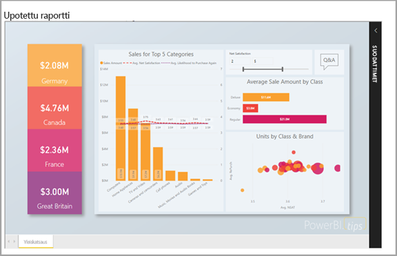

# Upotettu analysointi Power BI:n avulla

Power BI -palvelu (SaaS) ja Power BI Embedded -palvelu Azuressa (PaaS) sisältävät ohjelmointirajapintoja raporttinäkymien ja raporttien upottamista varten. Sisällön upottamisen ansiosta saat käyttöösi Power BI:n uusimmat toiminnot, esimerkiksi koontinäytöt, yhdyskäytävät ja työtilat.

Voit käyttää [upottamisen määritystyökalua](https://aka.ms/embedsetup) päästäksesi nopeasti alkuun ja ladataksesi mallisovelluksen.

Valitse ratkaisu, joka sopii sinulle:

* [Organisaatiolle tarkoitettu upotus](embedding.md#embedding-for-your-organization) mahdollistaa Power BI -palvelun laajentamisen. Jos haluat toimia näin suorita [organisaatiolle tarkoitettu upotus](https://aka.ms/embedsetup/UserOwnsData).
* [Asiakkaille tarkoitettu upotus](embedding.md#embedding-for-your-customers) mahdollistaa koontinäyttöjen ja raporttien upottamisen käyttäjille, joilla ei ole Power BI -tiliä. Jos haluat toimia näin, suorita [asiakkaille tarkoitettu](https://aka.ms/embedsetup/AppOwnsData) upotus.

## Ohjelmointirajapintojen käyttö

Power BI -sisällön upottamiseen on kaksi tapaa:
- Voit upottaa organisaatiosi käyttäjille, joilla on Power BI -käyttöoikeudet. 
 
- Voit upottaa käyttäjillesi ja asiakkaillesi, joilla ei ole Power BI -käyttöoikeuksia. 

[Power BI REST -ohjelmointirajapinta](https://docs.microsoft.com/rest/api/power-bi/) mahdollistaa molemmat tavat.

Niitä asiakkaita ja käyttäjiä varten, joilla ei ole Power BI-käyttöoikeuksia, voit upottaa koontinäyttöjä ja raportteja mukautettuun sovellukseen käyttäen samaa ohjelmointirajapintaa joko organisaatiosi tai asiakkaiden palvelemiseen. Asiakkaasi näkevät sovelluksen hallitsemat tiedot. Organisaatiosi Power BI -käyttäjät voivat lisäksi tarkastella *omia tietojaan* suoraan Power BI:ssä tai upotetun sovelluksen kontekstissa. Voit hyödyntää JavaScriptia ja REST-ohjelmointirajapintoja täysipainoisesti upotustarpeisiisi.

Jos haluat lisätietoja siitä, miten upottaminen toimii, tutustu [JavaScript-upotusesimerkkiin](https://microsoft.github.io/PowerBI-JavaScript/demo/).

## Upottaminen organisaation käyttöön

**Organisaatiolle tarkoitettu upotus** mahdollistaa Power BI -palvelun laajentamisen. Tällainen upottaminen edellyttää, että sovelluksesi käyttäjät kirjautuvat Power BI -palveluun tarkastelemaan sisältöä. Kun organisaatiosi käyttäjä kirjautuu sisään, hän voi käyttää vain koontinäyttöjä ja raportteja, jotka hän omistaa tai jotka joku on jakanut hänen kanssaan Power BI -palvelussa.

Organisaation upottamisesta ovat esimerkkejä vaikkapa sisäiset sovellukset, kuten [SharePoint Online](https://powerbi.microsoft.com/blog/integrate-power-bi-reports-in-sharepoint-online/), [Microsoft Teams -integrointi (sinulla on oltava järjestelmänvalvojan oikeudet)](https://powerbi.microsoft.com/blog/power-bi-teams-up-with-microsoft-teams/) ja [Microsoft Dynamics](https://docs.microsoft.com/dynamics365/customer-engagement/basics/add-edit-power-bi-visualizations-dashboard).

Jos haluat upottaa organisaatiollesi, katso [opetusohjelma: Power BI -sisällön upottaminen sovellukseen organisaatiolle](embed-sample-for-your-organization.md).

Itsepalvelutoiminnot, kuten muokkaus ja tallennus, ovat käytettävissä [JavaScript-ohjelmointirajapinnassa](https://github.com/Microsoft/PowerBI-JavaScript), kun käytetään upotusta Power BI -käyttäjille.

Voit käyttää [upottamisen määritystyökalua](https://aka.ms/embedsetup/UserOwnsData), jonka avulla pääset alkuun ja jolla voit ladata mallisovelluksen. Se opastaa, miten raportti integroidaan organisaatiollesi.

## Upottaminen asiakkaiden käyttöön

**Asiakkaille tarkoitettu upotus** mahdollistaa koontinäyttöjen ja raporttien upottamisen käyttäjille, joilla ei ole Power BI -tiliä. Tällaista upottamista kutsutaan myös nimellä *Power BI Embedded*.

[Power BI Embedded](azure-pbie-what-is-power-bi-embedded.md) on **Microsoft Azure** -palvelu, jonka avulla riippumattomat ohjelmistotoimittajat ja -kehittäjät voivat upottaa nopeasti upeita visualisointeja, raportteja ja koontinäyttöjä sovelluksiin. Tämä upottaminen tehdään kapasiteettipohjaisella ja tuntikäyttöön perustuvalla mallilla.

Power BI Embeddedistä on hyötyä riippumattomille ohjelmistotoimittajille, niiden kehittäjille ja asiakkaille. Esimerkiksi riippumaton ohjelmistotoimittaja voi aloittaa visualisointien luomisen ilmaiseksi Power BI Desktopilla. Riippumattomat ohjelmistotoimittajat voivat päästä nopeammin markkinoille vähentämällä visuaalista analyyttistä kehitystyötä ja erottumalla kilpailijoista eriytetyillä tietoratkaisuilla. Riippumattomat ohjelmistotoimittajat voivat halutessaan myös veloittaa palkkion upotettujen analyysitoimintojen avulla luodusta lisäarvosta.

Power BI Embeddedin ansiosta asiakkaiden ei tarvitse tietää mitään Power BI:stä. Voit luoda upotetun sovelluksen kahdella eri tavalla:
- Power BI Pro -tili 
- Palvelun päänimi 

Power BI Pro -tili toimii sovelluksesi päätilinä (tätä voi pitää eräänlaisena välitystilinä). Tämän tilin avulla voit luoda upotustunnuksia, jotka mahdollistavat sovelluksesi Power BI -koontinäyttöjen ja -raporttien käytön.

[Palvelun päänimi](embed-service-principal.md) voi upottaa Power BI -sisältöä sovellukseen **sovelluksen** tunnuksen avulla. Sen avulla voit luoda upotustunnuksia, jotka mahdollistavat sovelluksesi Power BI -koontinäyttöjen ja -raporttien käytön.

Power BI Embeddedia käyttävät kehittäjät voivat keskittyä kehittämään sovelluksen keskeisiä toimintoja visualisointien ja analytiikan kehittämisen sijaan. He voivat nopeasti vastata asiakkaan raporttiin ja koontinäyttöön liittyviin vaatimuksiin ja upottaa helposti täysin dokumentoituja ohjelmointirajapintoja ja SDK:ita. Riippumattomat ohjelmistotoimittajat mahdollistavat asiakkaiden nopeiden ja tietoon perustuvien päätösten tekemisen kontekstissa mistä tahansa laitteesta, sillä tietojen välillä siirtyminen on sovelluksissa helppoa.

> [!IMPORTANT]
> Vaikka upottaminen edellyttää Power BI -palvelua, asiakkaillasi ei tarvitse olla Power BI -tiliä, jotta he voivat käyttää sovelluksesi upotettua sisältöä. 

Kun olet valmis siirtymään tuotantoon, työtilallesi täytyy määrittää erillinen kapasiteetti. Microsoft Azureen sisältyvä Power BI Embedded tarjoaa sinulle [varattua kapasiteettia](azure-pbie-create-capacity.md) käyttöön sovellustesi kanssa.

Jos haluat lisätietoja upottamisesta, lue ohjeartikkeli [Power BI -sisällön upottaminen](embed-sample-for-customers.md).

## Seuraavat vaiheet

Voit nyt kokeilla Power BI -sisällön upottamista sovellukseen tai asiakkaillesi.

> [!div class="nextstepaction"]
> [Upottaminen organisaatiollesi](embed-sample-for-your-organization.md)

> [!div class="nextstepaction"]
> [Mikä Power BI Embedded on?](azure-pbie-what-is-power-bi-embedded.md)

> [!div class="nextstepaction"]
>[Upottaminen asiakkaillesi](embed-sample-for-customers.md)

Onko sinulla kysyttävää? [Voit esittää kysymyksiä Power BI -yhteisössä](http://community.powerbi.com/)
