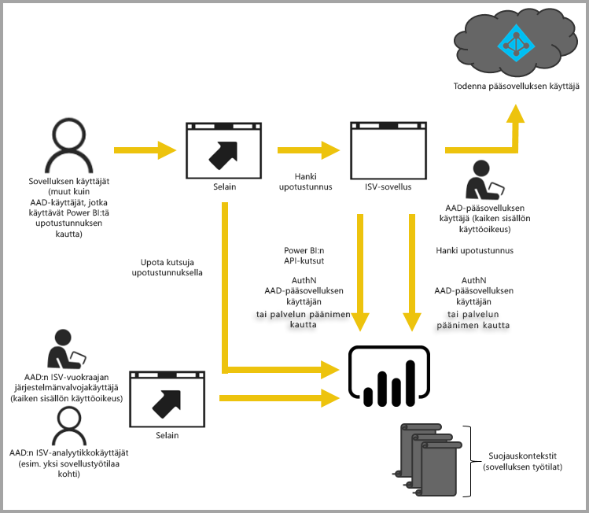

# Upottaminen Power BI:llä
Power BI tarjoaa ohjelmointirajapintoja, jotka mahdollistavat koontinäyttöjen ja raporttien upottamisen sovelluksiin. Power BI:n ohjelmointirajapinnat tarjoavat yhtenäisen ominaisuusjoukon ja mahdollistavat uusimpien Power BI -toimintojen, kuten koontinäyttöjen, yhdyskäytävien ja sovellustyötilojen, käytön sisällön upottamisessa.

## Yksittäinen ohjelmointirajapinta
Power BI-sisällön upottamisessa on kaksi pääskenaariota:  upottaminen organisaation käyttäjien (joilla on Power BI -käyttöoikeudet) käyttöön sekä upottaminen käyttäjille ja asiakkaille, joilta ei edellytetä Power BI-käyttöoikeutta. Power BI REST -ohjelmointirajapinta sallii molemmat skenaariot. 

Niitä asiakkaita ja käyttäjiä varten, joilla ei ole Power BI-käyttöoikeuksia, voit upottaa koontinäyttöjä ja raportteja mukautettuun sovellukseen käyttäen samaa ohjelmointirajapintaa joko organisaatiosi tai asiakkaiden palvelemiseen. Asiakkaasi näkevät tiedot, joita sovellus hallitsee. Power BI-käyttäjät organisaatiossasi voivat lisäksi tarkastella *omia tietojaan* suoraan Power BI:ssä tai upotetun sovelluksen kontekstissa. Voit hyödyntää JavaScriptia ja REST-ohjelmointirajapintoja täysipainoisesti upotustarpeisiisi.

Näyte siitä, kuinka upottaminen toimii, annetaan artikkelissa [JavaScript-upotuksen näyte](https://microsoft.github.io/PowerBI-JavaScript/demo/).

## Upottaminen organisaation käyttöön
Upottaminen organisaation käyttöön mahdollistaa Power BI -palvelun laajentamisen. Tämä edellyttää, että sovelluksesi käyttäjät kirjautuvat Power BI -palveluun, kun he haluavat tarkastella sisältöään. Kun käyttäjä organisaatiossasi kirjautuu sisään, hän voi käyttää vain koontinäyttöjä ja raportteja, jotka hän omistaa tai jotka on jaettu hänen kanssaan Power BI -palvelussa. 

*Sisäinen verkkosovellus, SharePoint Onlinen WWW-osa ja [Microsoft Teams -integrointi ovat esimerkkejä upottamisesta organisaation käyttöön (sinulla on oltava järjestelmänvalvojan oikeudet)](https://powerbi.microsoft.com/en-us/blog/power-bi-teams-up-with-microsoft-teams/).*

Organisaation käyttöön upottamisen osalta katso seuraavia ohjeaiheita:

* [Raportin integrointi sovellukseen](integrate-report.md)
* [Koontinäytön integrointi sovellukseen](integrate-dashboard.md)
* [Ruudun integrointi sovellukseen](integrate-tile.md)

Itsepalvelutoiminnot, kuten muun muassa muokkaus ja tallennus, ovat käytettävissä [JavaScript-ohjelmointirajapinnassa](https://github.com/Microsoft/PowerBI-JavaScript), kun käytetään upotusta Power BI -käyttäjien käyttöön.

Voit käyttää [yrityksesi käytössä olevaa upottamiseen tarkoitettua perehdyttämistyökalua](https://aka.ms/embedsetup/UserOwnsData), jonka avulla pääset nopeasti alkuun ja voit ladata mallisovelluksen, joka opastaa, miten raportti integroidaan yrityksessäsi.

## Upottaminen asiakkaiden käyttöön
Upottaminen asiakkaiden käyttöön mahdollistaa koontinäyttöjen ja raporttien upottamisen käyttäjille, joilla ei ole Power BI -tiliä. Asiakkaiden ei tarvitse tietää mitään Power BI:stä. Upotetun sovelluksen luomiseen vaaditaan vähintään yksi Power BI Pro -tili. Power BI Pro -tili toimii sovelluksesi päätilinä. Voit ajatella sitä eräänlaisena välityspalvelimen tilinä. Power BI Pro -tilin avulla voit luoda myös upotustunnuksia, jotka mahdollistavat pääsyn sovelluksesi omistamiin/hallitsemiin koontinäyttöihin ja raportteihin Power BI -palvelussa. 

*Muille yrityksille myytävä ISV-sovellus on esimerkki upottamisesta asiakkaiden käyttöön.*

Käytät koontinäyttöjen, raporttien ja ruutujen upottamiseen samoja ohjelmointirajapintoja, joita käyttäisit upottamisessa organisaation käyttöön.

> [!IMPORTANT]
> Vaikka upottaminen on riippuvaista Power BI-palvelusta, asiakkaasi eivät ole riippuvaisia Power BI:stä. Heidän ei tarvitse rekisteröityä Power BI -käyttäjiksi, jotta he voisivat tarkastella upotettua sisältöä sovelluksessasi.
> 

Kun olet valmis siirtymään tuotantoon, sovellustyötilallesi täytyy määrittää tietty kapasiteetti. Microsoft Azureen sisältyvä Power BI Embedded tarjoaa kapasiteettia käyttöön sovellustesi kanssa.

Saat upottamista koskevia yksityiskohtaisia tietoja artikkelista [Power BI:n koontinäyttöjen, raporttien ja ruutujen upottaminen](embedding-content.md).

Voit käyttää [asiakkaidesi käytössä olevaa upottamiseen tarkoitettua perehdyttämistyökalua](https://aka.ms/embedsetup/AppOwnsData), jonka avulla pääset nopeasti alkuun ja voit ladata mallisovelluksen, joka opastaa, miten raportti integroidaan sovellukseen.

Jos käytit Power BI Workspace Collections -palvelua Azuressa, katso artikkelista [Sisällön siirtäminen Azuren Power BI Workspace Collections -palvelusta](migrate-from-powerbi-embedded.md) lisätietoja siitä, miten voit siirtää sisältösi.

## Seuraavat vaiheet
[Power BI:n koontinäyttöjen, raporttien ja ruutujen upottaminen](embedding-content.md)  
[Power BI Embedded -työtilan kokoelman sisällön siirtäminen Power BI:hin](migrate-from-powerbi-embedded.md)  
[Mikä on Power BI Premium?](../service-premium.md)  
[JavaScript API Git -säilö](https://github.com/Microsoft/PowerBI-JavaScript)  
[Power BI C# Git -säilö](https://github.com/Microsoft/PowerBI-CSharp)  
[JavaScript-upotuksen näyte](https://microsoft.github.io/PowerBI-JavaScript/demo/)  
[Upotetun analytiikan kapasiteetin suunnittelun tekninen raportti](https://aka.ms/pbiewhitepaper)  
[Power BI Premiumin tekninen raportti](https://aka.ms/pbipremiumwhitepaper)  

Onko sinulla muuta kysyttävää? [Voit esittää kysymyksiä Power BI -yhteisössä](http://community.powerbi.com/)

