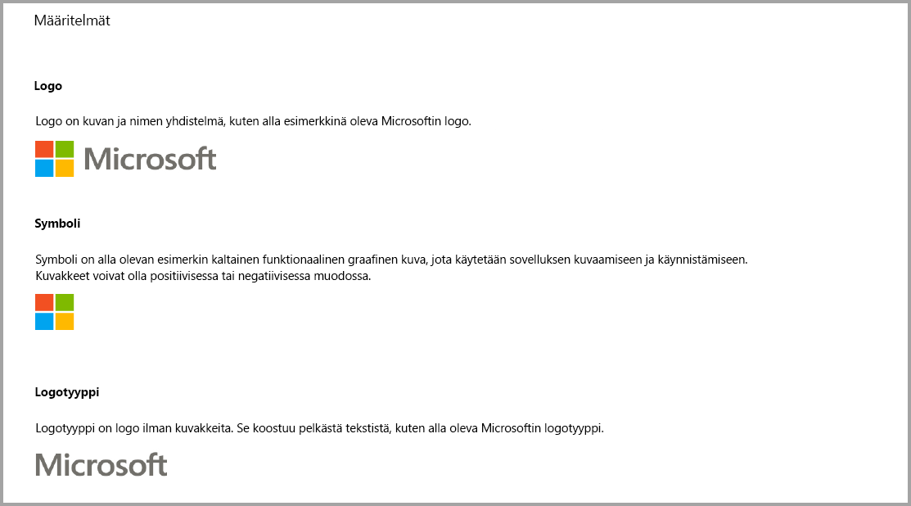
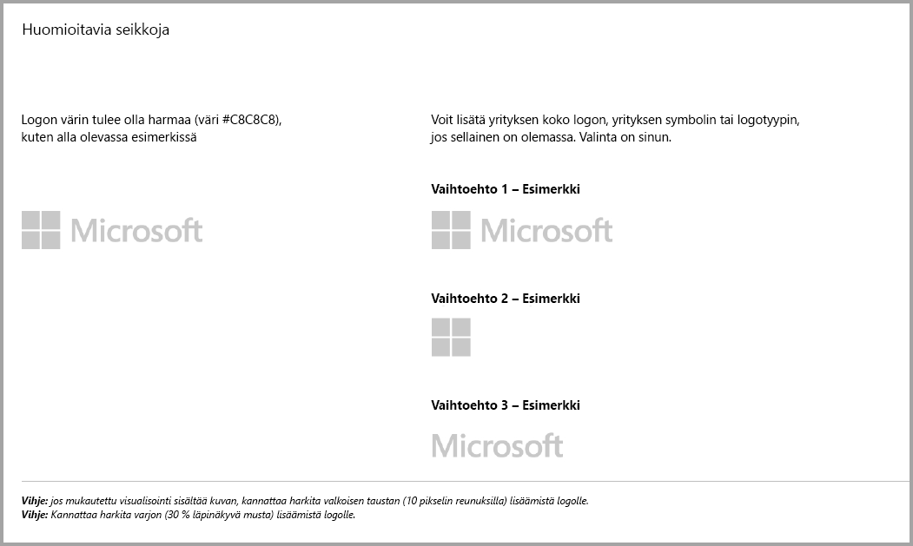
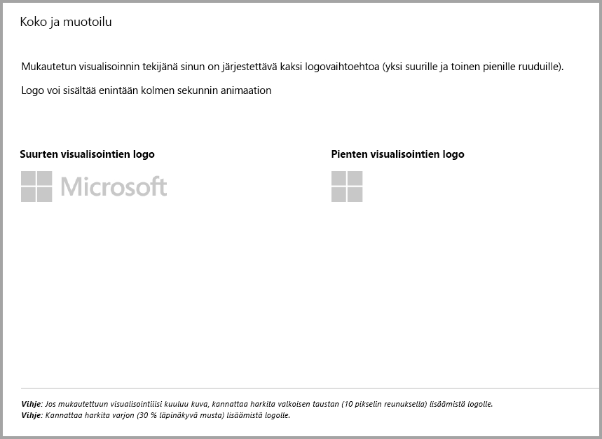
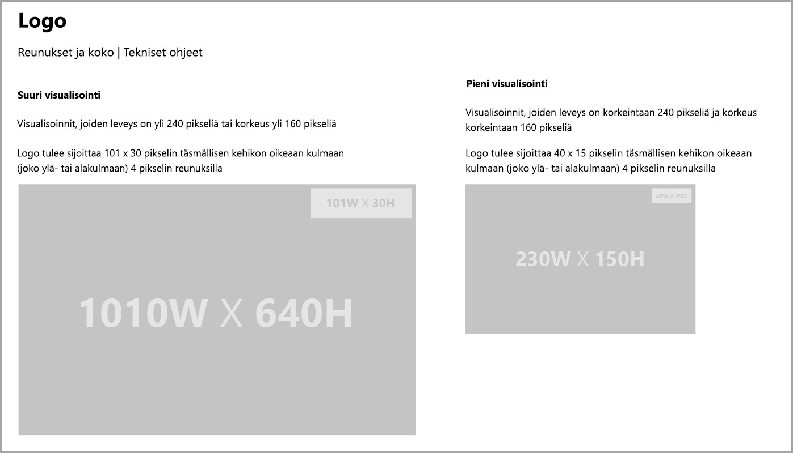
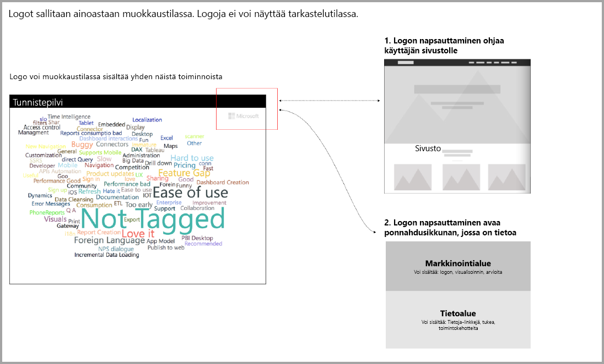

# Power BI -visualisointien ohjeet
Varmista ennen kuin [julkaiset](https://docs.microsoft.com/power-bi/developer/office-store) visualisoinnin AppSourcessa muiden käytettäväksi, että noudatat ohjeita, jotta käyttäjäsi saavat erinomaisen käyttökokemuksen. 

## Pikavalikko
Pikavalikko on hiiren kakkospainikkeella avautuva valikko, joka tulee näkyviin, kun hiiren osoitin on visualisoinnin päällä.
Kaikissa Power BI:n visualisoinneissa tulee ottaa pikavalikko käyttöön, jotta käyttökokemus on yhtenäinen. Lue [tästä artikkelista](https://github.com/Microsoft/PowerBI-visuals/blob/gh-pages/tutorials/building-bar-chart/adding-context-menu-to-the-bar.md) pikavalikon lisäämisohjeet.

## Logo-ohjeet
> [!NOTE]
> Tämän artikkelin sanalogo viittaa mihin tahansa kaupallisen yrityksen logoon alla olevissa kuvissa esitetyllä tavalla. 

Tässä osiossa annetaan ohjeet Power BI -visualisointien logojen lisäämiseen. Logot eivät ole pakollisia. Jos ne lisätään, niiden on noudatettava seuraavia ohjeita. 

> [!IMPORTANT]
> Logot sallitaan *ainoastaan muokkaustilassa*. Logoja *ei voi* näyttää tarkastelutilassa.

Mahdollisten tietokuvakkeiden tulisi lukutilassa vastata väriltään, kooltaan ja sijainniltaan yllä olevia logoja.

## Ohjeet Power BI -visualisointeihin, jotka sisältävät lisäostoja

Viime aikoihin asti Marketplace (AppSource) hyväksyi ainoastaan maksuttomia Power BI -visualisointeja. Tämä käytäntö on muuttunut (joulukuussa 2018), joten voit nyt lähettää AppSourceen myös visualisointeja, joissa on ”lisäosto saattaa olla tarpeen” -hintalappu. 

”Lisäosto saattaa olla tarpeen” -visualisoinnit ovat samankaltaisia kuin Office-kaupan apuohjelmien sovelluskohtaiset ostokset. Kehittäjät voivat lähettää visualisointeja myös sertifioitaviksi sen jälkeen, kun AppSource-tiimi on hyväksynyt ne, ja varmistettuaan, että visualisoinnit täyttävät sertifiointivaatimukset. Lisätietoja on artikkelissa [Sertifioidut Power BI -visualisoinnit](../power-bi-custom-visuals-certified.md).

> [!NOTE]
> Visualisoinnin sertifiointi edellyttää, ettei siinä käytetä ulkoisia palveluita tai resursseja.

>[!IMPORTANT]  
> Jos päivität visualisoinnin ilmaisesta ”Lisäosto saattaa olla tarpeen” -tasolle, käyttäjien on saatava sama ilmainen toimintotaso kuin ennen päivitystä. Voit lisätä valinnaisia maksullisia lisäominaisuuksia aiempien maksuttomien ominaisuuksien lisäksi. Suosittelemme lähettämään sovelluskohtaisten tuotteiden visualisoinnit lisäominaisuuksien kanssa uusina visualisointeina sen sijaan, että päivittäisit aiemmat, maksuttomat visualisoinnit.

## Miten lähetysprosessi on muuttunut?

Kehittäjät lataavat ostoja sisältävät visualisointinsa AppSourceen myyjien koontinäytön kautta aivan samoin kuin maksuttomien visualisointien kohdalla. Kehittäjien tulee ilmoittaa visualisointinsa sisältämistä sovelluskohtaisia ostoja edellyttävistä ominaisuuksista kirjoittamalla myyjän koontinäytön muistiinpanokohtaan ”Visual with in-app purchase” (Sovelluskohtaisia ostoja sisältävä visualisointi). Lisäksi kehittäjien tulee antaa käyttöoikeusavain tai -tunnus, jotta vahvistustiimi voi vahvistaa sovelluskohtaisia ostoja edellyttävät ominaisuudet. Kun visualisointi on vahvistettu ja hyväksytty, AppSourcessa ilmoitetaan sovelluskohtaisia ostoja sisältävän visualisoinnin hinnoitteluvaihtoehtojen kohdalla, että käyttö saattaa edellyttää lisäostoja.

## Mikä on sovelluskohtaisia ostoja sisältävä Power BI -visualisointi?

Sovelluskohtaisia ostoja sisältävä visualisointi on *ilmainen* visualisointi, jossa on *maksuttomia ominaisuuksia*. Siihen liittyy myös lisäominaisuuksia, joiden käyttäminen saattaa vaatia lisämaksuja. Kehittäjien on ilmoitettava käyttäjille visualisoinnin kuvauksessa siitä, minkä ominaisuuksien käyttö edellyttää lisäostoja. Microsoft ei tällä hetkellä tarjoa omia ohjelmointirajapintoja, jotka tukisivat ostoja sovelluksissa ja apuohjelmissa.

Kehittäjät voivat käyttää ostoihin haluamaansa kolmannen osapuolen maksujärjestelmää. Lisätietoja on [Microsoftin myymälä-käytännössä](https://docs.microsoft.com/office/dev/store/validation-policies#2-apps-or-add-ins-can-display-certain-ads).

> [!NOTE]
> Vesileimoja ei sallita ilmaisissa ominaisuuksissa eikä ilmaisissa visualisoinneissa. Vesileimoja voi käyttää ainoastaan maksullisissa ominaisuuksissa, joita käytetään ilman kelvollista käyttöoikeutta. Suosittelemme näyttämään kaikki käyttöoikeustiedot ponnahdusikkunassa, jos maksullisia lisäominaisuuksia käytetään ilman kelvollista käyttöoikeutta.  

## Parhaat käytännöt

### Visualisoinnin aloitussivu

Aloitussivulla kerrot käyttäjille, miten visualisointia voi käyttää ja mistä sen käyttöoikeuden voi ostaa. Älä lisää automaattisesti toistettavia videoita. Lisää ainoastaan sellaista sisältöä, joka parantaa käyttökokemusta, esimerkiksi käyttöoikeuden ostamiseen liittyviä ohjeita tai linkkejä ja sovelluskohtaisia ostoja edellyttävien ominaisuuksien käyttöohjeita.

### Käyttöoikeusavain ja -tunnus

Lisää käyttömukavuuden parantamiseksi käyttöoikeusavainta tai -tunnusta koskevat kentät muokkausruudun yläreunaan.

## Usein kysytyt kysymykset

Saat lisätietoja visualisoinneista [lisäostoja sisältävien visualisointien usein kysytyistä kysymyksistä](https://docs.microsoft.com/power-bi/power-bi-custom-visuals-faq#visuals-with-additional-purchases).

## Seuraavat vaiheet

Lue ohjeet siihen, miten voit julkaista omia visualisointejasi [AppSourcessa](office-store.md) muiden löydettäväksi ja käytettäväksi.
