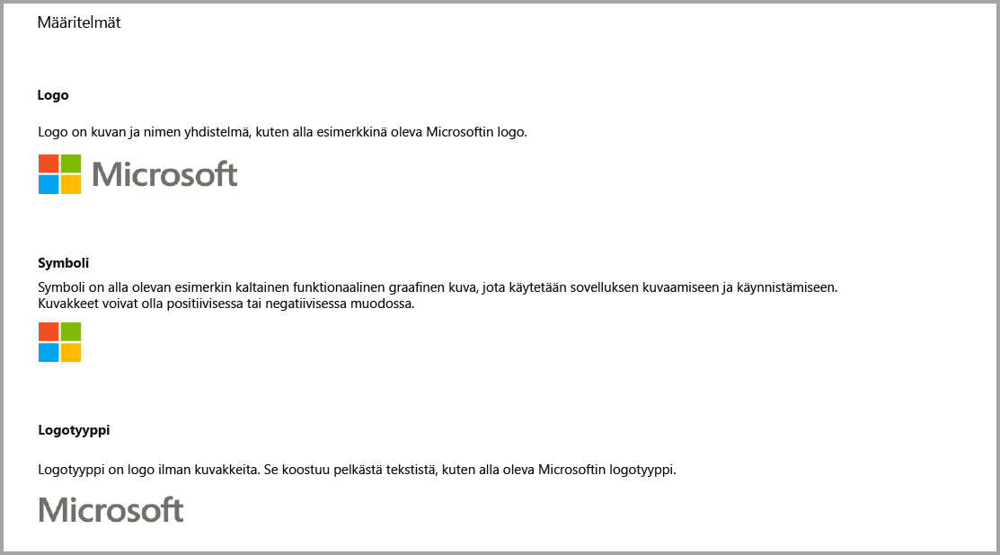
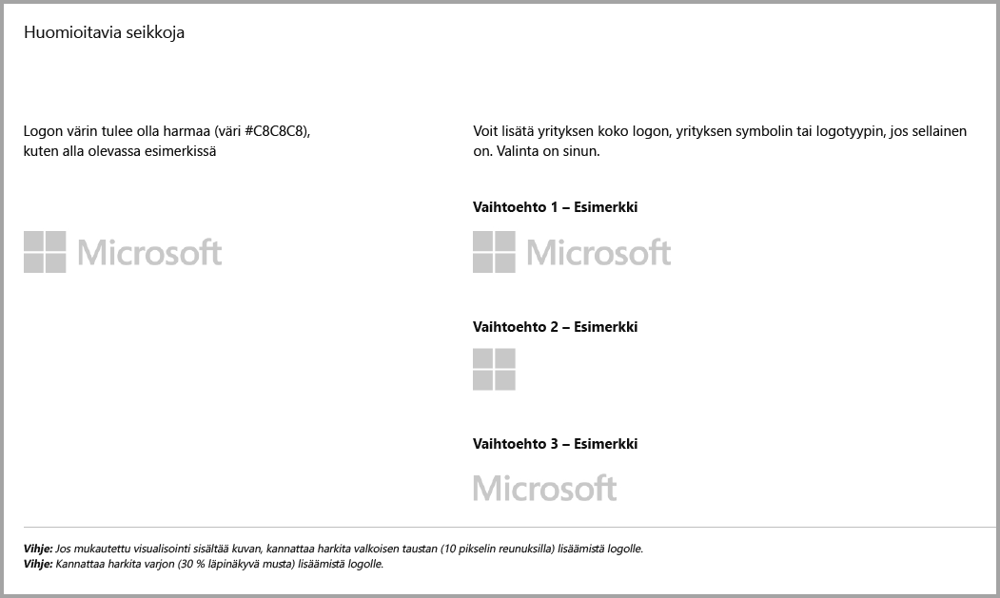
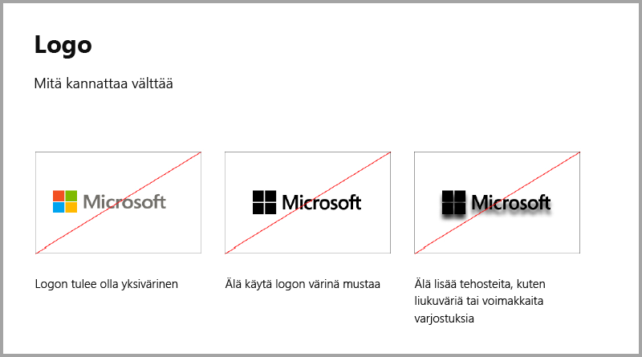
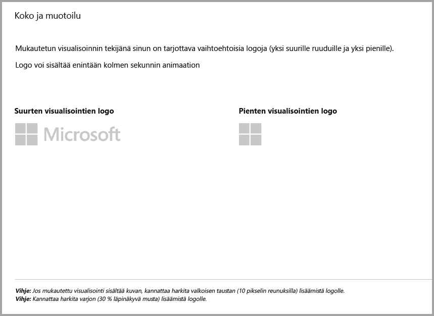
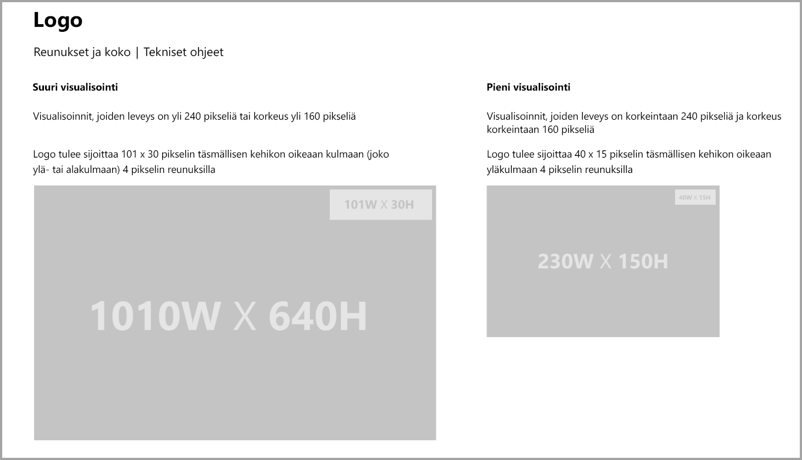
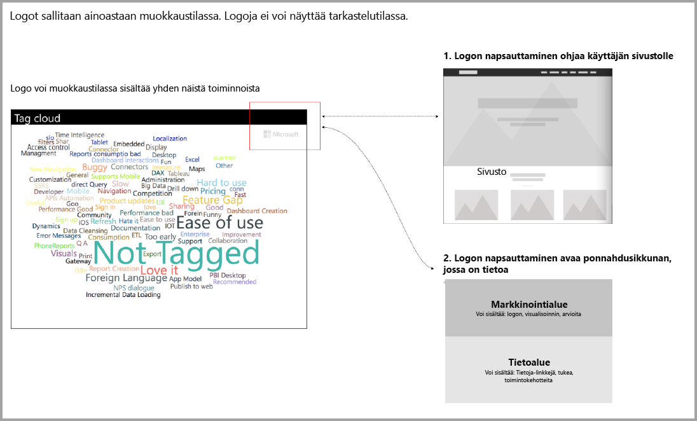

# Ohjeet Power BI -visualisointeihin, jotka sisältävät lisäostoja

Viime aikoihin asti **Marketplace (AppSource)** hyväksyi ainoastaan maksuttomia Power BI -visualisointeja. Käytäntö on muuttumassa siten, että myös Saattaa edellyttää lisäostoja -merkittyjä visualisointeja voi lähettää **AppSourceen**. Visualisoinnit, jotka saattavat edellyttää lisäostoja, ovat samankaltaisia kuin Office-kaupan apuohjelmien sovelluskohtaiset ostokset. Kehittäjät voivat lähettää visualisointeja myös sertifioitaviksi sen jälkeen, kun **AppSource**-tiimi on hyväksynyt ne, ja varmistettuaan, että visualisoinnit täyttävät [Sertifioidut mukautetut visualisoinnit](../power-bi-custom-visuals-certified.md) -artikkelissa kuvatut sertifiointivaatimukset.

> [!Note]
> Visualisoinnin sertifiointi edellyttää, ettei siinä käytetä ulkoisia palveluita tai resursseja.

## Miten lähetysprosessi muuttuu?

Kehittäjät lataavat ostoja sisältävät visualisointinsa AppSourceen myyjien koontinäytön kautta aivan samoin kuin maksuttomien visualisointien kohdalla. Kehittäjien tulee ilmoittaa visualisointinsa sisältämistä sovelluskohtaisia ostoja edellyttävistä ominaisuuksista kirjoittamalla myyjän koontinäytön muistiinpanokohtaan ”Visual with in-app purchase” (Sovelluskohtaisia ostoja sisältävä visualisointi). Lisäksi kehittäjien tulee antaa käyttöoikeusavain tai -tunnus, jotta vahvistustiimi voi vahvistaa sovelluskohtaisia ostoja edellyttävät ominaisuudet. Kun visualisointi on vahvistettu ja hyväksytty, AppSourcessa ilmoitetaan sovelluskohtaisia ostoja sisältävän visualisoinnin hinnoitteluvaihtoehtojen kohdalla, että käyttö saattaa edellyttää lisäostoja.

## Mikä on sovelluskohtaisia ostoja sisältävä Power BI -visualisointi?

Sovelluskohtaisia ostoja sisältävä visualisointi on maksuttomia ominaisuuksia tarjoava maksuton visualisointi, joka kuitenkin sisältää myös lisäominaisuuksia, joiden käyttö saattaa edellyttää lisämaksuja. Kehittäjien on ilmoitettava käyttäjille visualisoinnin kuvauksessa siitä, minkä ominaisuuksien käyttö edellyttää lisäostoja. Microsoft ei tällä hetkellä tarjoa omia ohjelmointirajapintoja tukemaan ostoja sovelluksissa ja apuohjelmissa. Kehittäjät voivat käyttää ostoihin haluamaansa kolmannen osapuolen maksujärjestelmää. Tutustu kaupan [käytäntöön](https://docs.microsoft.com/office/dev/store/validation-policies#2-apps-or-add-ins-can-display-certain-ads).

## Logo-ohjeet

Tässä osiossa annetaan ohjeet visualisoinnin logojen ja logotyyppien lisäämiseen.

> [!NOTE]
> Logot sallitaan ainoastaan muokkaustilassa. Logoja ei voi näyttää tarkastelutilassa.

## Parhaat käytännöt

### Visualisoinnin aloitussivu

Aloitussivulla kerrot käyttäjille, miten visualisointia voi käyttää ja mistä sen käyttöoikeuden voi ostaa. Älä lisää automaattisesti toistettavia videoita. Lisää ainoastaan sellaista sisältöä, joka parantaa käyttökokemusta, esimerkiksi käyttöoikeuden ostamiseen liittyviä ohjeita tai linkkejä ja sovelluskohtaisia ostoja edellyttävien ominaisuuksien käyttöohjeita.

### Käyttöoikeusavain ja -tunnus

Lisää käyttöoikeusavainta tai -tunnusta koskevat kentät muokkausruudun yläreunaan, jotta käyttäjät löytävät ne helpommin.

## Seuraavat vaiheet

Lue ohjeet siihen, miten voit julkaista omia visualisointejasi [AppSourcessa](office-store.md) muiden löydettäväksi ja käytettäväksi.
