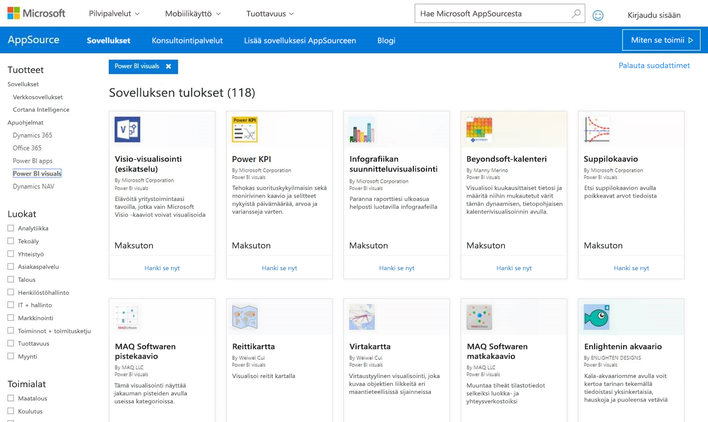
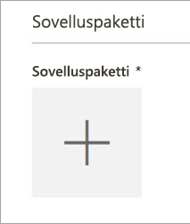
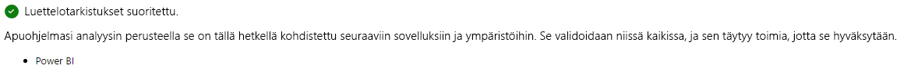
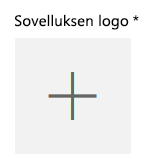
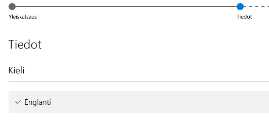

# Power BI -visualisointien julkaiseminen AppSourceen

Lue ohjeet siihen, miten voit julkaista omia visualisointejasi AppSourcessa muiden käyttöön.

Kun olet luonut oman visualisoinnin, voit julkaista sen AppSourcessa, josta muutkin löytävät sen käyttöönsä. Sinun täytyy kuitenkin tehdä ennen julkaisua tietyt valmistelutoimet. Saat lisätietoja mukautettujen visualisointien luomisesta ohjeartikkelista [Power BI:n mukautetun visualisoinnin kehittäminen](custom-visual-develop-tutorial.md).

   

## Mikä AppSource on?

**AppSource** on paikka, josta löydät SaaS-sovelluksia ja apuohjelmia Microsoftin tuotteille ja palveluille. [AppSource](https://appsource.microsoft.com/marketplace/apps?product=power-bi-visuals) yhdistää miljoonat Office 365:n, Dynamics 365:n, Cortana Intelligencen ja muiden käyttäjät ratkaisuihin, joilla he voivat työskennellä entistä tehokkaammin, älykkäämmin ja tyylikkäämmin.

## Oman visualisoinnin julkaisun valmisteleminen

Kun olet lukenut [Power BI:n visualisointien ohjeet](guidelines-powerbi-visuals.md), koodannut ja [testannut oman visualisointisi](https://github.com/Microsoft/PowerBI-visuals/blob/master/Tutorial/SubmissionTesting.md) ja paketoinut sen pbiviz-tiedostoon, kerää valmiiksi myös alla mainitut asiat julkaisua varten.

| Kohde | Pakollinen | Kuvaus |
| --- | --- | --- |
| Pbiviz-paketti, joka sisältää kaikki vaaditut metatiedot |Kyllä |Visualisoinnin nimi Näyttönimi GUID-tunnus Versio Kuvaus Tekijän nimi ja sähköpostiosoite |
| .pbix-raporttitiedostoesimerkki |Kyllä |Auta käyttäjiä tutustumaan visualisointiisi esittelemällä sitä. Korosta arvoa, jota visualisointi tuo käyttäjille, ja anna esimerkkejä käytöstä, muotoiluasetuksista ja niin edelleen. Voit myös lisätä loppuun *vinkkisivun*, jolla annat vinkkejä, kerrot, mitä kannattaa välttää ja niin edelleen. .pbix-raporttitiedostoesimerkin täytyy toimia offline-tilassa ilman mitään ulkoista yhteyttä. |
| Kuvake |Kyllä |Sisällytä mukaan oman visualisointisi logo, joka näytetään kaupassa. Se voi olla .png-, .jpg-, .jpeg- tai .gif-muodossa. Sen on oltava tarkalleen 300 × 300 kuvapistettä (leveys × korkeus). **Tärkeää!** Lue tämä [lyhyt opas](https://docs.microsoft.com/office/dev/store/craft-effective-appsource-store-images) ennen logon lähettämistä. |
| Näyttökuvat |Kyllä |Sinun täytyy antaa ainakin yksi näyttökuva. Se voi olla .png-, .jpg-, .jpeg- tai .gif-muodossa. Sen on oltava tarkalleen 1 366 × 768 kuvapistettä (leveys × korkeus). Suurin sallittu tiedostokoko on 1 024 kt. *Käyttäjämäärien kasvattamiseksi suosittelemme, että lisäät näyttökuviin tekstikuplia, jotka tuovat esiin tärkeimpien toimintojen etuja.* |
| Tuen latauslinkki |Kyllä |Tarjoa URL-osoite, josta asiakkaat voivat hankkia tukea, jos heillä on ongelmia visualisointisi käytössä. Tämä linkki on lisätty osana SellerDashboard-luetteloasi, ja käyttäjät näkevät sen käyttäessään visualisointiluetteloasi AppSourcessa. URL-osoitteen täytyy olla https:// - tai http:// -muodossa. |
| Tietosuoja-asiakirjan linkki |Kyllä |Tarjoa visualisointiasi käyttäville asiakkaille linkki tietosuojakäytäntöösi. Tämä linkki on lisätty osana SellerDashboard-luetteloasi, ja käyttäjät näkevät sen käyttäessään visualisointiluetteloasi AppSourcessa. Linkin täytyy olla https:// - tai http:// -muodossa. |
| Käyttöoikeussopimus (EULA) |Kyllä |Sinun täytyy ladata palveluun käyttöoikeussopimus. Se voi olla oma käyttöoikeussopimuksesi tai Office-kaupan oletuskäyttöoikeussopimus Power BI -visualisoinneille. Jos haluat käyttää oletuskäyttöoikeussopimusta, liitä seuraava URL-osoite myyjän koontinäytön ”Käyttöoikeussopimus”-tiedoston latauksen valintaikkunaan: [https://visuals.azureedge.net/app-store/Power BI - Default Custom Visual EULA.pdf](https://visuals.azureedge.net/app-store/Power%20BI%20-%20Default%20Custom%20Visual%20EULA.pdf). |
| Videolinkki |Ei |Voit kasvattaa kiinnostusta visualisointiasi kohtaan antamalla linkin sen esittelyvideoon. URL-osoitteen täytyy olla https:// - tai http:// -muodossa. |
| GitHub-säilö |Ei |Suosittelemme, että annat kelvollisen ja julkisen linkin [GitHub](https://www.github.com)-säilöön, joka sisältää visualisointisi lähteet ja esimerkkitiedot, jotta muut kehittäjät voivat antaa palautetta ja ehdottaa parannuksia koodiisi. |

## Power BI:hin lähettäminen

Lähettäminen aloitetaan lähettämällä sähköpostiviesti Power BI -visualisointien julkaisutiimille. Voit lähettää sähköpostin osoitteeseen [pbivizsubmit@microsoft.com](mailto:pbivizsubmit@microsoft.com).

> [!IMPORTANT]
> Sinun täytyy täyttää seuraavat pbiviz.json-tiedoston kentät ennen .pbiviz-paketin luomista: description, supportUrl, author, name ja email.

Liitä **.pbiviz-tiedosto** ja **malliraportin .pbix-tiedosto** sähköpostiisi. Power BI -tiimi vastaa sinulle ja antaa ohjeet sekä sovelluspaketin XML-tiedoston ladattavaksi. Tämä XML-sovelluspaketti vaaditaan, jotta voit lähettää julkaisusi Office Developer Centerin kautta.

> [!NOTE]
> Laadun parantamiseksi ja olemassa olevien raporttien toimintakyvyn takaamiseksi olemassa olevien visualisointien päivitykset ovat käytettävissä hyötykäyttöympäristössä vasta kahden viikon kuluttua kaupassa hyväksymisestä.

## AppSourceen lähettäminen

Kun saat XML-sovelluspaketin Power BI -tiimiltä, siirry [Developer Centeriin](https://sellerdashboard.microsoft.com/Application/Summary) lähettämään visualisointisi AppSourceen.

> [!NOTE]
> [Office Developer Centeriin](https://dev.office.com/) kirjautumiseen vaaditaan kelvollinen Office-kehittäjätili. Office-kehittäjätilin täytyy olla Microsoft-tili (Live ID, esimerkiksi hotmail.com tai outlook.com).

> [!IMPORTANT]
> Sinun täytyy lähettää .pbiviz- ja .pbix-tiedoston sisältävä sähköposti Power BI -tiimille ennen AppSourceen lähettämistä. Tällä tavoin Power BI -tiimi voi ladata tiedostot julkiseen jakopalvelimeen. Muussa tapauksessa kauppa ei voi hakea tiedostoja. Sinun täytyy lähettää tiedot aina, kun julkaiset uuden visualisoinnin, päivität aiemmin julkaistua visualisointia tai teet korjauksia hylätyn lähetyksen johdosta.

### Visualisoinnin lähettäminen

Voit lähettää visualisoinnin alla olevien ohjeiden mukaisesti.

1. Valitse **Lisää uusi sovellus**.

    

2. Valitse **Power BI:n mukautettu visualisointi** > **Seuraava**.

3. Valitse **Sovelluspaketti** -kohdan alta **+** ja valitse sitten Avaa tiedosto -valintaikkunassa XML-sovelluspakettitiedosto, jonka sait Power BI -tiimiltä.

    

4. Sinun pitäisi saada hyväksyntä siitä, että kyseessä on kelvollinen Power BI -sovelluspaketti.

    

5. Täytä **yleiset tiedot**.

   * *Lähetyksen otsikko:* Lähetyksesi nimi Developer Centerissä.
   * *Versio:* Versionumero määritetään automaattisesti apuohjelmasi sovelluspaketin perusteella.
   * *Julkaisupäivämäärä (UTC):* Valitse päivämäärä, jolloin sovelluksesi julkaistaan kaupassa. Jos valitset tulevaisuudessa olevan päivämäärän, sovelluksesi on saatavilla kaupasta vasta valittuna päivänä.
   * *Luokka:* Ensimmäiseksi luokaksi määritetään ”Tietojen visualisointi ja liiketoimintatiedot”. Tämä merkintä lisätään kaikille Power BI -visualisoinneille. Voit määrittää kaksi muutakin luokkaa, joiden avulla käyttäjät voivat helposti etsiä visualisointiasi.
   * *Testaushuomautukset:* voit halutessasi antaa tässä ohjeita Microsoftin testaajille.
   * *Sovelluksesi kutsuu, tukee, sisältää tai käyttää salausta*: jätä tämä kohta valitsematta.
   * *Tarjoa tämä apuohjelma käytettäväksi iPadin Office-apuohjelmaluettelossa*: jätä tämä kohta valitsematta.
6. Lataa visualisointisi logo valitsemalla **sovelluksen logon** kohdasta **+** . Valitse sitten kuvatiedosto Avaa tiedosto -valintaikkunassa. Kuvaketiedoston täytyy olla .png-, .jpg-, .jpeg- tai .gif-tiedosto. Sen on oltava tarkalleen 300 × 300 kuvapistettä (leveys × korkeus). Suurin sallittu tiedostokoko on 512 kt.

    

7. Täytä **tukiasiakirjojen** tiedot.

   * Tukiasiakirjan linkki
   * Tietosuoja-asiakirjan linkki
   * Videolinkki
   * Käyttöoikeussopimus (EULA)

       Sinun täytyy ladata palveluun käyttöoikeussopimus. Se voi olla oma käyttöoikeussopimuksesi tai Office-kaupan oletuskäyttöoikeussopimus Power BI -visualisoinneille. Jos haluat käyttää oletuskäyttöoikeussopimusta, liitä seuraava URL-osoite myyjän koontinäytön ”Käyttöoikeussopimus”-tiedoston latauksen valintaikkunaan: [https://visuals.azureedge.net/app-store/Power BI - Default Custom Visual EULA.pdf](https://visuals.azureedge.net/app-store/Power%20BI%20-%20Default%20Custom%20Visual%20EULA.pdf).

8. Jatka **Tiedot**-sivulle valitsemalla **Seuraava**.

9. Valitse **Kieli** ja valitse sitten kieli luettelosta.

    

10. Täytä Kuvaus-kohdan tiedot.

    * *Sovelluksen nimi (tällä kielellä):* Kirjoita sovelluksen nimi, joka näytetään kaupassa.
    * *Lyhyt kuvaus:* Kirjoita sovelluksen lyhyt kuvaus, joka näytetään kaupassa (enintään 100 merkkiä). Tämä kuvaus näytetään ylimmän tason sivuilla logon kanssa. Voit käyttää pbiviz-paketin kuvausta.
    * *Pitkä kuvaus:* Kirjoita sovelluksen tarkempi kuvaus, jonka asiakkaat näkevät sovelluksen tietosivulla. Jos haluat antaa yhteisön parantaa visualisointiasi tekemällä siitä avoimen lähdekoodin visualisoinnin, anna tässä linkki julkiseen säilöön (esimerkiksi GitHubiin).

11. Lataa ainakin yksi näyttökuva. Se voi olla .png-, .jpg-, .jpeg- tai .gif-muodossa. Sen on oltava tarkalleen 1 366 × 768 kuvapistettä (leveys × korkeus). Suurin sallittu tiedostokoko on 1 024 kt. *Käyttäjämäärien kasvattamiseksi suosittelemme, että lisäät näyttökuviin tekstikuplia, jotka tuovat esiin tärkeimpien toimintojen etuja.*

12. Jos haluat lisätä muita kieliä, valitse **Lisää kieli** ja toista vaiheet 10 sekä 11. Kun lisäät muitakin kieliä, käyttäjät voivat tarkastella visualisoinnin tietoja omalla kielellään. Kielet, joita ei luetella, vaihdetaan oletusarvoisesti ensimmäiseksi valituksi kieleksi.

13. Kun olet lisännyt haluamasi kielet, jatka **käytön estämisen** sivulla valitsemalla **Seuraava**.

14. Jos haluat estää tiettyjen maiden tai alueiden käyttäjiä käyttämästä tai estämästä sovellustasi, valitse ruutu ja valitse haluamasi maat tai alueet luettelosta.

15. Jatka **hinnoittelusivulle** valitsemalla **Seuraava**.

16. Tällä hetkellä tuemme vain *maksuttomia* visualisointeja. Myöskään lisäostoja visualisoinneissa (sovelluskohtaiset ostot) ei sallita. Valitse **Tämä sovellus on maksuton**.

    > [!NOTE]
    > Jos valitset minkä tahansa muun vaihtoehdon kuin maksuttomuuden tai jos lähetetyssä visualisoinnissa on sovelluskohtaisia ostoja, lähetyksesi hylätään.

17. Voit nyt valita **Tallenna luonnoksena** ja lähettää myöhemmin tai lähettää oman visualisointisi Office-kauppaan valitsemalla **Lähetä hyväksyttäväksi**.

## Lähetyksen tilan ja käytön seuraaminen

Voit tarkistaa [vahvistuskäytännöt](https://dev.office.com/officestore/docs/validation-policies#13-power-bi-custom-visuals).

Kun olet lähettänyt visualisoinnin, voit seurata sen tilaa [sovelluskoontinäytössä](https://sellerdashboard.microsoft.com/Application/Summary/).

## Visualisoinnin sertifioiminen

Kun visualisointisi on luotu, voit hankkia sille sertifioinnin. Tämä tarkoittaa sitä, että se voidaan suorittaa Power BI -palvelussa ja sitä voidaan käyttää palvelun muiden toimintojen kanssa (esimerkiksi PowerPointiin vieminen). Saat lisätietoja ohjeartikkelista [Mukautetun visualisoinnin *sertifioinnin hankkiminen*](../power-bi-custom-visuals-certified.md).

## Seuraavat vaiheet

[Power BI:n mukautetun visualisoinnin kehittäminen](custom-visual-develop-tutorial.md)  
[Visualisoinnit Power BI:ssä](../visuals/power-bi-report-visualizations.md)  
[Mukautetut visualisoinnit Power BI:ssä](../power-bi-custom-visuals.md)  
[Mukautetun visualisoinnin *sertifioinnin hankkiminen*](../power-bi-custom-visuals-certified.md)

Onko sinulla muuta kysyttävää? [Voit esittää kysymyksiä Power BI -yhteisössä](http://community.powerbi.com/)
