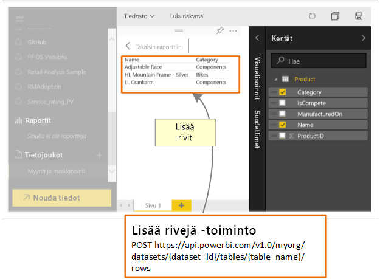

# Mitä kehittäjät voivat tehdä Power BI -ohjelmointirajapinnalla?

Power BI esittää koontinäyttöjä, jotka ovat vuorovaikutteisia ja joita voi luoda ja päivittää useista eri tietolähteistä reaaliaikaisesti. Voit luoda Power BI ‑koontinäyttöihin integroituja reaaliaikaisia sovelluksia käyttämällä mitä tahansa ohjelmointikieltä, joka tukee REST-kutsuja. Voit myös integroida Power BI-ruutuja ja raportteja sovelluksiin.

Lisäksi kehittäjät voivat luoda tiedoista omia visualisointejaan, joita voidaan käyttää vuorovaikutteisissa raporteissa ja koontinäkymissä.

Seuraavassa on joitakin asioita, joita voit tehdä Power BI -ohjelmointirajapinnan avulla.

| **Jos haluat tehdä tämän...** | **...siirry tänne** |
| --- | --- |
| Upottaa koontinäyttöjä, raportteja ja ruutuja sekä Power BI:tä käyttävien että Power BI:tä käyttämättömien (sovellus omistaa tiedot) käyttäjien saataville |[Power BI:n koontinäyttöjen, raporttien ja ruutujen upottaminen](embedding-content.md) |
| Laajentaa aiemmin luotua liiketoiminnan työnkulkua työntääksesi avaintietoja Power BI ‑koontinäyttöön |[Tietojen lähettäminen koontinäyttöön](walkthrough-push-data.md) |
| Todentaa käyttäjiä Power BI -palvelussa |[Power BI -palveluun todentaminen](get-azuread-access-token.md) |
| Luoda mukautetun visualisoinnin |[Power BI:n mukautetun visualisoinnin kehittäminen](custom-visual-develop-tutorial.md) |

> [!NOTE]
> Power BI -ohjelmointirajapinnat viittaavat sovelluksen työtiloihin edelleen ryhminä. Mitkä tahansa viittaukset ryhmiin tarkoittavat sitä, että työskentelet sovelluksen työtilojen parissa.

## Power BI:n kehittäjämallit

Power BI:n kehittäjämallit sisältävät kohteita, joita voi käyttää koontinäyttöjen, raporttien ja ruutujen upottamisessa.

[Power BI:n kehittäjämallit](https://github.com/Microsoft/PowerBI-Developer-Samples)

* **App Owns Data** ‑hakemiston mallit on tarkoitettu sisällön upottamiseen muita kuin Power BI ‑käyttäjiä varten.
* **User Owns Data** ‑hakemiston mallit on tarkoitettu sisällön upottamiseen Power BI ‑käyttäjiä varten.

## GitHub-säilöt

* [.NET SDK](https://github.com/Microsoft/PowerBI-CSharp)
* [JavaScript-ohjelmointirajapinta](https://github.com/Microsoft/PowerBI-JavaScript)
* [Mukautetut visualisoinnit](https://github.com/Microsoft/PowerBI-visuals)

## Kehitystyökalut

Seuraavassa on työkaluja, joiden avulla voit kehittää omia Power BI ‑kohteitasi.

Voit käyttää [upottamisen määritystyökalua](https://aka.ms/embedsetup) päästäksesi nopeasti alkuun ja ladataksesi mallisovelluksen, jolla opit upottamaan Power BI -sisältöä.

Valitse ratkaisu, joka sopii sinulle:

* [Asiakkaille tarkoitettu upotus](embedding.md#embedding-for-your-customers) mahdollistaa raporttinäkymien ja raporttien upottamisen käyttäjille, joilla ei ole Power BI -tiliä. Suorita [asiakkaille tarkoitettu upotus](https://aka.ms/embedsetup/AppOwnsData).

* [Organisaatiolle tarkoitettu upotus](embedding.md#embedding-for-your-organization) mahdollistaa Power BI -palvelun laajentamisen. Suorita [organisaatiolle tarkoitettu upotus](https://aka.ms/embedsetup/UserOwnsData).

Voit käyttää [Playground-työkalua](https://microsoft.github.io/PowerBI-JavaScript/demo), saadaksesi käyttöösi kokonaisen mallin, joka käyttää JavaScript-ohjelmointirajapintaa. Tämä työkalu on nopea tapa kokeilla erilaisia Power BI Embedded -malleja. Saat lisätietoja JavaScript-ohjelmointirajapinnasta vierailemassa [Power BI-JavaScript wiki](https://github.com/Microsoft/powerbi-javascript/wiki) -sivulla.

## Tietojen työntäminen Power BI:hin

Power BI ‑ohjelmointirajapinnan avulla voit lähettää tietoja tietojoukkoon. Tämän ominaisuuden avulla voit lisätä tietojoukkoon sisältyvään taulukkoon uuden rivin. Uudet tiedot voidaan sitten esittää koontinäytön ruuduissa sekä raporttiin sisältyvissä visualisoinneissa.

## Seuraavat vaiheet

[Tietojen työntäminen tietojoukkoon](walkthrough-push-data.md)  
[Power BI:n mukautetun visualisoinnin kehittäminen](custom-visual-develop-tutorial.md)  
[Power BI:n REST-ohjelmointirajapinnan viite](https://docs.microsoft.com/rest/api/power-bi/)  

Onko sinulla kysyttävää? [Voit esittää kysymyksiä Power BI -yhteisössä](http://community.powerbi.com/)
