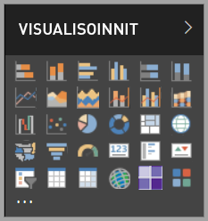

# Visualisoinnit Power BI:ssä

Power BI sisältää useita valmiita Power BI -visualisointeja. Nämä visualisoinnit ovat käytettävissä sekä [Power BI Desktopin](https://powerbi.microsoft.com/desktop/) että [Power BI-palvelun](https://app.powerbi.com)visualisointiruudussa, ja niitä voidaan käyttää Power BI -sisällön luomiseen ja muokkaamiseen.

Monia muita Power BI -visualisointeja on saatavilla Microsoft [AppSourcesta](https://nam06.safelinks.protection.outlook.com/?url=https%3A%2F%2Fappsource.microsoft.com%2Fen-us%2Fmarketplace%2Fapps%3Fpage%3D1%26product%3Dpower-bi-visuals&data=02%7C01%7CKesem.Sharabi%40microsoft.com%7C6d9286afacb3468d4cde08d740b76694%7C72f988bf86f141af91ab2d7cd011db47%7C1%7C0%7C637049028749147718&sdata=igWm0e1vXdgGcbyvngQBrHQVAkahPnxPC1ZhUPntGI8%3D&reserved=0) tai Power BI:n kautta. Microsoft ja Microsoftin kumppanit luovat nämä visualisoinnit, ja ne testataan ja vahvistetaan AppSourcen vahvistustiimissä.

Voit myös kehittää oman Power BI -visualisoinnin, jota sinä, organisaatiosi tai koko Power BI -yhteisö voitte käyttää.

## Power BI:n oletusvisualisoinnit

Nämä ovat valmiita Power BI -visualisointeja, jotka ovat käytettävissä *Power BI Desktopin* ja *Power BI Servicen* visualisointi-ruudussa.

Jos haluat poistaa Power BI -visualisoinnin kiinnityksen visualisointiruudusta, napsauta sitä hiiren kakkospainikkeella ja valitse **Poista kiinnitys**.

Jos haluat palauttaa visualisointiruudun oletusarvoiset Power BI -visualisoinnit, valitse **Tuo mukautettu visualisointi** ja valitse **Palauta oletusvisualisoinnit**. 

## AppSource Power BI -visualisoinnit

Microsoft ja yhteisön jäsenet antavat Power BI -visualisointinsa yleiseen käyttöön ja julkaisevat ne [AppSourcessa](https://appsource.microsoft.com/marketplace/apps?product=power-bi-visuals). Voit ladata näitä visualisointeja ja lisätä niitä Power BI -raportteihisi. Microsoft on testannut ja hyväksynyt kaikkien näiden Power BI -visualisointien toiminnan ja laadun.

### Mikä AppSource on?

[AppSource](office-store.md) on paikka Microsoft-ohjelmistosi sovelluksille, apuohjelmille ja laajennuksille. AppSource yhdistää miljoonat Office 365:n, Azuren, Dynamics 365:n, Cortanan ja Power BI:n kaltaisten tuotteiden käyttäjät ratkaisuihin, joiden avulla he voivat työskennellä entistä tehokkaammin ja älykkäämmin.

### Sertifioidut Power BI -visualisoinnit

Sertifioidut Power BI -visualisoinnit ovat [AppSource](https://nam06.safelinks.protection.outlook.com/?url=https%3A%2F%2Fappsource.microsoft.com%2Fen-us%2Fmarketplace%2Fapps%3Fpage%3D1%26product%3Dpower-bi-visuals&data=02%7C01%7CKesem.Sharabi%40microsoft.com%7C6d9286afacb3468d4cde08d740b76694%7C72f988bf86f141af91ab2d7cd011db47%7C1%7C0%7C637049028749147718&sdata=igWm0e1vXdgGcbyvngQBrHQVAkahPnxPC1ZhUPntGI8%3D&reserved=0)-visualisointeja, jotka täyttävät tietyt Power BI -tiimin testaamat ja hyväksymät koodivaatimukset. Testit on suunniteltu varmistamaan, ettei visualisointi käytä ulkoisia palveluita tai resursseja.

Jos haluat tarkastella luetteloa sertifioiduista Power BI -visualisoinneista tai lähettää oman, lue artikkeli [Sertifioidut Power BI -visualisoinnit](power-bi-custom-visuals-certified.md).

### Power BI visualisointien mallit

Jokaisessa Appsourcen Power BI -visualisoinnissa on tietomalli, joka havainnollistaa visualisoinnin toimintaa. Jos haluat ladata mallin, valitse [AppSourcessa](https://nam06.safelinks.protection.outlook.com/?url=https%3A%2F%2Fappsource.microsoft.com%2Fen-us%2Fmarketplace%2Fapps%3Fpage%3D1%26product%3Dpower-bi-visuals&data=02%7C01%7CKesem.Sharabi%40microsoft.com%7C6d9286afacb3468d4cde08d740b76694%7C72f988bf86f141af91ab2d7cd011db47%7C1%7C0%7C637049028749147718&sdata=igWm0e1vXdgGcbyvngQBrHQVAkahPnxPC1ZhUPntGI8%3D&reserved=0) Power BI -visualisointi ja napsauta *Kokeile mallia*-osassa **Malliraportti**-linkkiä.

## Organisaatiosäilö

Power BI -järjestelmänvalvojat hyväksyvät ja ottavat käyttöön Power BI -visualisoinnit organisaatiossaan. Näin raportin tekijät voivat helposti löytää, päivittää ja käyttää näitä Power BI -visualisointeja. Järjestelmänvalvojat voivat hallita näitä visualisointeja helposti toimintojen, kuten versioiden päivittämisen, käytöstä poistamisen ja Power BI -visualisointien avulla.

Jos haluat käyttää organisaatiosäilöä, valitse *Visualisointi*-ruudussa **Tuo mukautettu visualisointi**, valitse **Tuo Marketplacesta** ja valitse *Power BI -visualisoinnit*-ikkunan yläosasta **Oma organisaatio** -välilehti.

[Lue lisätietoja organisaation visualisoinneista](power-bi-custom-visuals-organization.md).

## Visualisointitiedostot

Power BI -visualisoinnit ovat paketteja, jotka sisältävät koodin niille tarjottujen tietojen näyttämiseksi (hahmontamiseksi). Kuka tahansa voi luoda mukautetun visualisoinnin ja pakata sen yksittäiseksi `.pbiviz`-tiedostoksi, jonka voi sitten tuoda Power BI -raporttiin.

Jos haluat tuoda Power BI -visualisoinnin, valitse *Visualisointi*-ruudusta **Tuo mukautettu visualisointi** ja valitse **Tuo tiedostosta**.

Jos olet verkkokehittäjä ja olet kiinnostunut luomaan oman visualisoinnin ja lisäämään sen Appsourceen, voit opetella [kehittämään Power BI -visualisoinnin](visuals/custom-visual-develop-tutorial.md) ja [julkaisemaan Power BI -visualisoinnin AppSourcessa](office-store.md).

> [!WARNING]
> Power BI -visualisointi voi sisältää koodeja, joka aiheuttavat suojaus- tai tietosuojariskejä. Varmista, että luotat Power BI -visualisoinnin tekijään ja lähteeseen, ennen kuin tuot sen raporttiisi.

## Seuraavat vaiheet

* Jos olet kehittäjä, aloita[ Power BI -visualisoinnin](./visuals/custom-visual-develop-tutorial.md) opetusohjelmasta.

* Lue, miten [Power BI -visualisointiprojekti rakentuu](./visuals/visual-project-structure.md).

* Tutustu [Power BI -visualisointien ohjeisiin](guidelines-powerbi-visuals.md).

Onko sinulla kysyttävää? Käy [Power BI -visualisoinnit, Usein kysyttyjä kysymyksiä](power-bi-custom-visuals-faq.md) -sivulla tai kokeile [Power BI -yhteisöä](https://community.powerbi.com/).