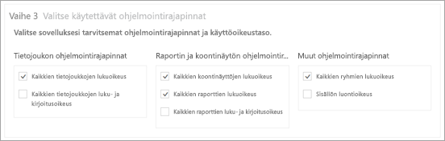
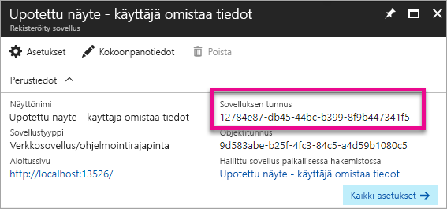

# <a name="register-an-azure-ad-app-to-embed-power-bi-content"></a>Azure AD -sovelluksen rekisteröinti Power BI -sisällön upottamiseksi

Lue, miten voit rekisteröidä sovelluksen Azure Active Directoryssä (Azure AD) Power BI -sisällön upottamiseksi.

Kun rekisteröit sovelluksen Azure AD:ssä, sovellus pääsee BI REST -ohjelmointirajapintoihin. Kun rekisteröit sovelluksesi, voit määrittää sovelluksen käyttäjätiedot sekä käyttöoikeudet Power BI REST -resursseihin.

> [!IMPORTANT]
> Ennen Power BI -sovelluksen rekisteröintiä tarvitset [Azure Active Directory -vuokraajan ja organisaation käyttäjän](create-an-azure-active-directory-tenant.md). Jos et ole vielä rekisteröitynyt Power BI:hin siten, että vuokraajassa on käyttäjä, sovelluksen rekisteröinti epäonnistuu.

Voit rekisteröidä sovelluksen kahdella eri tavalla. Voit rekisteröidä sen [Power BI -sovelluksen rekisteröintityökalun](https://dev.powerbi.com/apps/) avulla tai rekisteröidä sen suoraan Azure-portaalissa. Power BI -sovelluksen rekisteröintityökalu on helpoin vaihtoehto, koska siinä on vain muutama täytettävä kenttä. Käytä Azure-portaalia, jos haluat tehdä muutoksia sovellukseen.

## <a name="register-with-the-power-bi-app-registration-tool"></a>Rekisteröinti Power BI -sovelluksen rekisteröintityökalun avulla

Rekisteröi sovellus **Azure Active Directoryssä**, jotta voit määrittää sovelluksen käyttäjätiedot ja Power BI REST -resurssien käyttöoikeudet. Kun rekisteröit jonkin sovelluksen (esimerkiksi konsolisovelluksen tai verkkosivuston), saat tunnisteen, jonka avulla sovellus voi tunnistaa itsensä käyttäjille, jolta ne pyytävät käyttöoikeuksia.

Voit rekisteröidä sovelluksen Power BI -sovelluksen rekisteröintityökalun avulla seuraavasti:

1. Siirry osoitteeseen [dev.powerbi.com/apps](https://dev.powerbi.com/apps).
2. Valitse **Kirjaudu sisään aiemmin luodulla tilillä**.
3. Anna **sovelluksen nimi**.
4. Sovellustyypin valinta riippuu käyttämästäsi sovellustyypistä.

   * Käytä **Native-sovellusta** asiakaslaitteissa suoritettaville sovelluksille. Valitse **Native-sovellus**, jos upotat sisältöä asiakasohjelmista – varsinaisesta sovelluksesta riippumatta, verkkosovellukset mukaan lukien.
   * Käytä **Server-side Web -sovellusta** verkkosovelluksille tai verkon ohjelmointirajapinnoille.

5. Syötä arvo **uudelleenohjaus-URL-osoitteelle** ja **aloitussivun URL-osoitteelle**. **Uudelleenohjauksen URL-osoitteena** toimii mikä tahansa kelvollinen URL-osoite.

    **Kotisivun URL-osoite** on käytettävissä vain, jos valitset sovellustyypille **Server-side Web -sovelluksen**.

    *Asiakkaiden käyttöön tarkoitettu upottaminen*- ja *integrate-dashboard-web-app*-mallien **uudelleenohjaus-URL-osoite** on `http://localhost:13526/Redirect`. Raportti- ja ruutumallien **uudelleenohjaus-URL-osoite** on `http://localhost:13526/`.
6. Valitse sovellukselle ohjelmointirajapinnat, joilla on pääsy. Katso lisätietoja Power BI -käyttöoikeuksista artikkelista [Power BI -käyttöoikeudet](power-bi-permissions.md).

    
7. Valitse **Rekisteröi sovellus**.

    Saat **asiakastunnuksen** ja jos olet valinnut **Server-side Web -sovelluksen**, saat myös **asiakkaan salasanan**. **Asiakastunnus** voidaan noutaa Azure-portaalista myöhemmin tarvittaessa. Jos kadotat **asiakkaan salasanan**, sinun on luotava uusi asiakkaan salasana Azure-portaalissa.

8. Siirry Azureen ja valitse **Myönnä käyttöoikeuksia**.

   > [!Note]
   > Vuokraajan käyttäjien täytyy voida käyttää **_Myönnä käyttöoikeuksia_** -toimintoa, jotta tämä vaihe voidaan suorittaa.

* Siirry Azureen.
* Etsi ja valitse **Sovelluksen rekisteröinnit**.
* Valitse sovelluksesi.
* Valitse **Asetukset**.
* Valitse **Käyttöoikeudet vaaditaan**.
* Valitse **Power BI -palvelu**, jotta voit vahvistaa sovelluksen rekisteröintisivustossa valitsemasi käyttöoikeudet.
* Valitse **Myönnä käyttöoikeuksia**.

Voit nyt käyttää rekisteröityä sovellusta osana mukautettua sovellusta Power BI -palvelun käyttämiseksi.

> [!IMPORTANT]
> Jos upotat sisältöä asiakkaille, sinun on konfiguroitava lisäkäyttöoikeuksia Azure-portaalissa. Katso lisätietoja artikkelista [Sovella sovelluksen käyttöoikeuksia](#apply-permissions-to-your-application).

## <a name="register-with-the-azure-portal"></a>Rekisteröinti Azure-portaalin avulla

Toinen vaihtoehto sovelluksen rekisteröintiin on tehdä se suoraan Azure-portaalissa. Voit rekisteröidä sovelluksen noudattamalla seuraavia vaiheita.

1. Hyväksy [Microsoft Power BI -ohjelmointirajapinnan ehdot](https://powerbi.microsoft.com/api-terms).
2. Kirjaudu sisään [Azure-portaaliin](https://portal.azure.com).
3. Valitse Azure AD -vuokraajasi valitsemalla tili sivun oikeassa yläkulmassa.
4. Valitse vasemmassa siirtymisruudussa **Lisää palveluita**, valitse **Sovelluksen rekisteröinnit** kohdasta **Suojaus + käyttäjätiedot** ja valitse **Uuden sovelluksen rekisteröinti**.

    
5. Noudata kehotteita ja luo uusi sovellus.

   * Anna verkkosovelluksille kirjautumisen URL-osoite. Se toimii sovelluksen perus-URL-osoitteena, jossa käyttäjät voivat kirjautua sisään ( esim.`http://localhost:13526`).
   * Anna Native-sovelluksille **uudelleenohjaus-URL-osoite**, jonka avulla Azure AD palauttaa tunnusvastaukset. Anna sovellukseen liittyvä arvo (esimerkiksi `http://myapplication/Redirect`).

Katso lisätietoja siitä, miten voit rekisteröidä sovelluksia Azure Active Directoryssä, artikkelista [Sovellusten integrointi Azure Active Directoryyn](https://docs.microsoft.com/azure/active-directory/develop/active-directory-integrating-applications).

## <a name="how-to-get-the-client-id"></a>Asiakastunnuksen hankinta

Kun rekisteröit sovelluksen, saat **asiakastunnuksen**.  **Asiakastunnuksen** avulla sovellus tunnistaa itsensä ja pyytää käyttäjille käyttöoikeuksia.

Saat asiakastunnuksen seuraavasti:

1. Kirjaudu sisään [Azure-portaaliin](https://portal.azure.com).
2. Valitse Azure AD -vuokraajasi valitsemalla tili sivun oikeassa yläkulmassa.
3. Valitse vasemmassa siirtymisruudussa **Lisää palveluita** ja valitse **Sovelluksen rekisteröinnit**.
4. Valitse sovellus, jolle haluat noutaa käytettävän asiakastunnuksen.
5. **sovellustunnus** on listattu GUID-tunnuksena. Tämä on sovelluksen asiakastunnus.

    

## <a name="apply-permissions-to-your-application-within-azure-ad"></a>Käyttöoikeuksien soveltaminen sovellukseen Azure AD:ssä

> [!IMPORTANT]
> Tämä osio koskee vain sovelluksia, jotka **upottavat sisältöä organisaatiolle**.

Ota käyttöön lisäkäyttöoikeuksia sovellukselle sovelluksen rekisteröintisivulla annettujen käyttöoikeuksien lisäksi. Voit tehdä tämän Azure AD-portaalin kautta tai ohjelmallisesti.

Sinun on kirjauduttava sisään joko *päätilillä*, jota käytetään upotukseen, tai yleisen järjestelmänvalvojan tilillä.

### <a name="using-the-azure-ad-portal"></a>Azure AD -portaalin käyttö

1. Selaa kohtaan [Sovelluksen rekisteröinnit](https://portal.azure.com/#blade/Microsoft_AAD_IAM/ApplicationsListBlade) Azure-portaalissa ja valitse sovellus, jota käytät upottamiseen.

    
2. Valitse **Tarvittavat käyttöoikeudet** kohdasta **Ohjelmointirajapinnan käyttö**.

    

3. Valitse kohdassa **Tarvittavat käyttöoikeudet** **Power BI -palvelu (Power BI)**.

    

   > [!NOTE]
   > Jos olet luonut sovelluksen suoraan Azure AD -portaalissa **Power BI -palvelua (Power BI)** ei ehkä ole. Jos se puuttuu, valitse **+ Lisää** ja valitse sitten **1 Valitse ja ohjelmointirajapinta**. Valitse **Power BI -palvelu** ohjelmointirajapintaluettelosta ja valitse **Valitse**.  Jos **Power BI -palvelua (Power BI)** ei ole saatavilla kohdassa **+ Lisää**, rekisteröidy Power BI:hin vähintään yhdellä käyttäjällä.

4. Valitse kaikki käyttöoikeudet kohdasta **Delegoidut käyttöoikeudet**. Valitse ne yksi kerrallaan valintojen tallentamiseksi. Kun olet valmis, valitse **Tallenna**.

    
5. Valitse kohdasta **Tarvittavat käyttöoikeudet** **Myönnä käyttöoikeuksia**.

    **Myönnä käyttöoikeuksia** -toiminto edellyttää *päätiliä*, jotta Azure AD ei pyydä lupaa. Jos toiminnon suorittava tili on yleinen järjestelmänvalvoja, sovelluksen käyttöoikeudet myönnetään organisaation kaikille käyttäjille. Jos toiminnon suorittava tili on *päätili* eikä se ole yleinen järjestelmänvalvoja, sovellukseen käyttöoikeudet myönnetään vain *päätilille*.

    

### <a name="applying-permissions-programmatically"></a>Käyttöoikeuksien soveltaminen ohjelmallisesti

1. Sinun on hankittava olemassa olevat palvelun pääkohteet (käyttäjät) vuokraajassa. Lisätietoja tämän tekemisestä on artikkelissa [Get servicePrincipal](https://developer.microsoft.com/graph/docs/api-reference/beta/api/serviceprincipal_get).

    Voit kutsua *Get servicePrincipal*-ohjelmointirajapinnan ilman {tunnusta}, ja saat vuokraajassa olevat kaikki palvelun pääkohteet.
2. Voit tarkistaa palvelun päänimen sovelluksen asiakastunnuksella **appId**-ominaisuutena.

3. Luo uusi palvelumalli, jos se puuttuu sovelluksesta.

    ```json
    Post https://graph.microsoft.com/beta/servicePrincipals
    Authorization: Bearer ey..qw
    Content-Type: application/json
    {
    "accountEnabled" : true,
    "appId" : "{App_Client_ID}",
    "displayName" : "{App_DisplayName}"
    }
    ```

4. Sovelluksen käyttöoikeuksien myöntäminen Power BI -ohjelmointirajapinnalle

   Jos käytät olemassa olevaa vuokraajaa, etkä ole kiinnostunut myöntämään käyttöoikeuksia kaikkien vuokraajan käyttäjien puolesta, voit myöntää käyttöoikeudet tietylle käyttäjälle vaihtamalla **contentType**-arvon **Principal**-arvoksi.

   **ConsentType**-arvoksi voidaan antaa joko **AllPrincipals**- tai **Principal**-arvo.

   * **AllPrincipals**-arvoa voi käyttää vain vuokraajan järjestelmänvalvoja, myöntääkseen käyttöoikeuksia vuokraajan kaikkien käyttäjien puolesta.
   * **Principal**-arvoa käytetään käyttöoikeuksia myöntämiseen tietyn käyttäjän puolesta. Tässä tapauksessa lisäominaisuus tulee lisätä pyynnön runkoon - *principalId = {User_ObjectId}*.

     Sinun täytyy *myöntää käyttöoikeudet*, jotta Azure AD ei pyydä päätililtä lupaa, mikä ei ole mahdollista ei-vuorovaikutteista kirjautumista käytettäessä.

     ```json
     Post https://graph.microsoft.com/beta/OAuth2PermissionGrants
     Authorization: Bearer ey..qw
     Content-Type: application/json
     {
     "clientId":"{Service_Plan_ID}",
     "consentType":"AllPrincipals",
     "resourceId":"c78a3685-1ce7-52cd-95f7-dc5aea8ec98e",
     "scope":"Dataset.ReadWrite.All Dashboard.Read.All Report.Read.All Group.Read Group.Read.All Content.Create Metadata.View_Any Dataset.Read.All Data.Alter_Any",
     "expiryTime":"2018-03-29T14:35:32.4943409+03:00",
     "startTime":"2017-03-29T14:35:32.4933413+03:00"
     }
     ```

    **resourceId** *c78a3685-1ce7-52cd-95f7-dc5aea8ec98e* ei ole yleinen, mutta se on riippuvainen vuokraajasta. Tämä arvo on ”Power BI” -palvelusovelluksen objectId-tunnus AAD-vuokraajassa.

    Käyttäjä voi hakea tämän arvon nopeasti Azure-portaalissa:
    1. https://portal.azure.com/#blade/Microsoft_AAD_IAM/StartboardApplicationsMenuBlade/AllApps
    2. Tee haku ”Power BI -palvelu” SearchBoxissa

5. Myönnä sovelluksen käyttöoikeudet Azure Active Directorylle (AAD)

   **ConsentType**-arvoksi voidaan antaa joko **AllPrincipals**- tai **Principal**-arvo.

   * **AllPrincipals**-arvoa voi käyttää vain vuokraajan järjestelmänvalvoja, myöntääkseen käyttöoikeuksia vuokraajan kaikkien käyttäjien puolesta.
   * **Principal**-arvoa käytetään käyttöoikeuksia myöntämiseen tietyn käyttäjän puolesta. Tässä tapauksessa lisäominaisuus tulee lisätä pyynnön runkoon - *principalId = {User_ObjectId}*.

   Sinun täytyy *myöntää käyttöoikeudet*, jotta Azure AD ei pyydä päätililtä lupaa, mikä ei ole mahdollista ei-vuorovaikutteista kirjautumista käytettäessä.

   ```json
   Post https://graph.microsoft.com/beta/OAuth2PermissionGrants
   Authorization: Bearer ey..qw
   Content-Type: application/json
   { 
   "clientId":"{Service_Plan_ID}",
   "consentType":"AllPrincipals",
   "resourceId":"61e57743-d5cf-41ba-bd1a-2b381390a3f1",
   "scope":"User.Read Directory.AccessAsUser.All",
   "expiryTime":"2018-03-29T14:35:32.4943409+03:00",
   "startTime":"2017-03-29T14:35:32.4933413+03:00"
   }
   ```

## <a name="next-steps"></a>Seuraavat vaiheet

Kun olet nyt rekisteröinyt sovelluksesi Azure AD:ssä, sinun on todennettava sovelluksessa olevat käyttäjät. Lue lisää artikkelista [Käyttäjien todentaminen ja Azure AD -käyttöoikeustietueen hankinta Power BI -sovellukselle](get-azuread-access-token.md).

Onko sinulla muuta kysyttävää? [Voit esittää kysymyksiä Power BI -yhteisössä](http://community.powerbi.com/)
