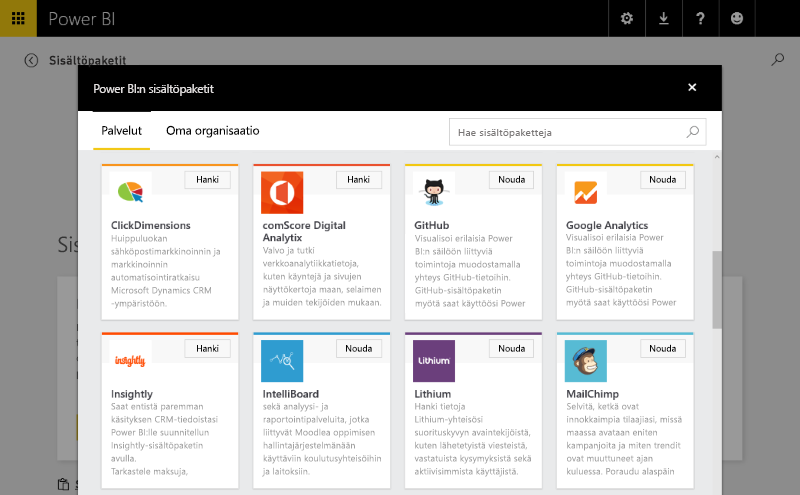
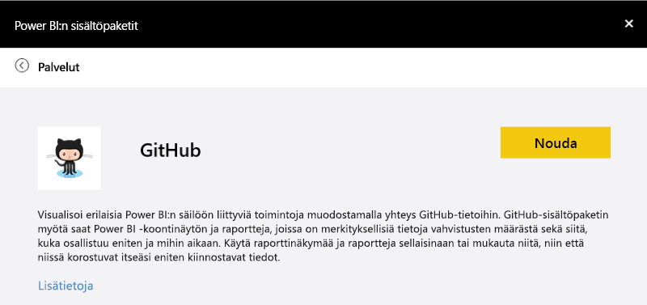
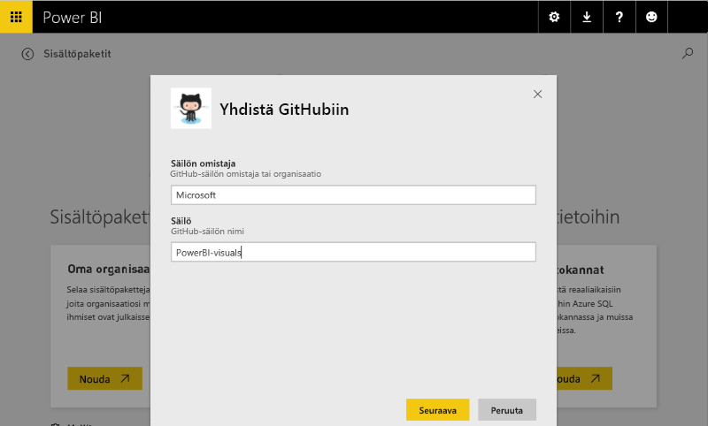
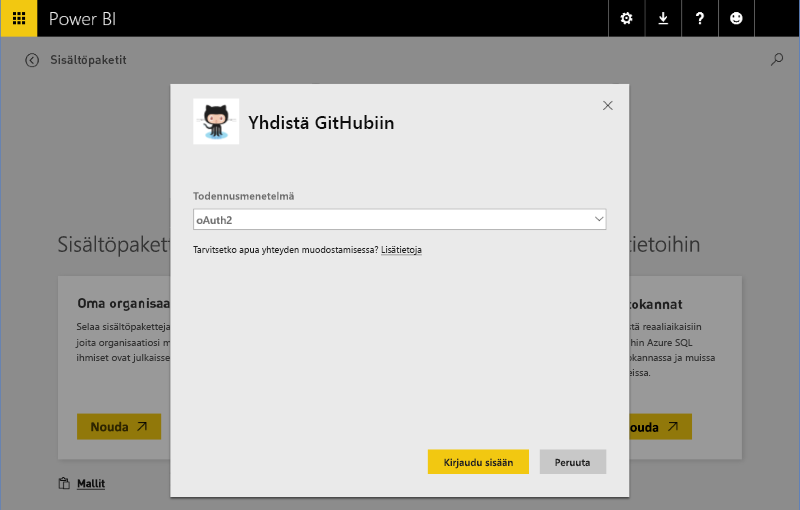
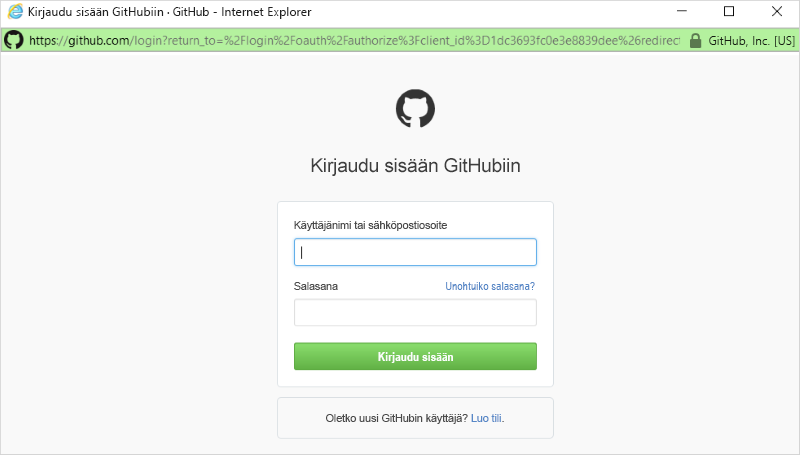
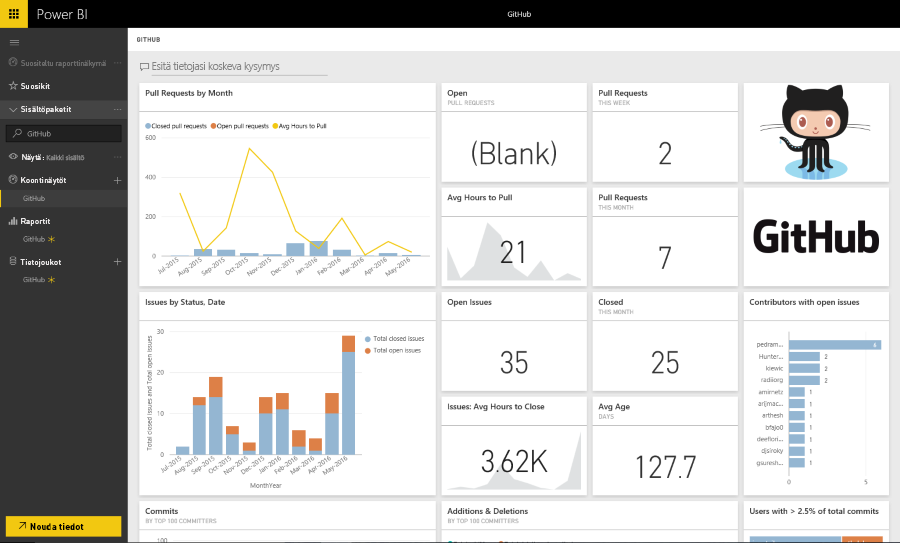

# Mallisisältöpaketin kokemukset Power BI:ssä
Tässä osassa esitellään tyypillinen käyttökokemus, kun käyttäjä muodostaa yhteyden ISV:n [sisältöpakettiin](../service-connect-to-services.md). 

Kokeile yhdistämistä itse muodostamalla yhteys julkaistuun sisältöpakettiin osoitteessa https://app.powerbi.com/getdata/services (käytä esimerkiksi alla kuvailtua [GitHub-sisältöpakettia](https://app.powerbi.com/getdata/services/github)).

## Yhdistä
Aluksi käyttäjä selaa sisältöpakettivalikoimaa ja valitsee sisältöpaketin, johon yhteys muodostetaan. Sisältöpakettimerkintä sisältää nimen, kuvakkeen ja kuvaavan tekstin, joka antaa lisätietoa käyttäjälle.

## Parametrit
Kun paketti on valittu, käyttäjältä pyydetään parametreja (tarvittaessa). Tekijä antaa parametrien valintaikkunan ilmoituksella sisältöpaketin luonnin aikana.

Tällä hetkellä parametrien käyttöliittymä on erittäin yksinkertainen – avattavia luetteloita ei voi luetella millään tavalla ja tietosyötön oikeellisuustarkistus on rajoitettu säännönmukaiseksi lausekkeeksi.

## Tunnistetiedot
Parametrien jälkeen käyttäjää pyydetään kirjautumaan sisään.  Jos lähde tukee useita todentamistyyppejä, käyttäjä valitsee sopivan vaihtoehdon. Jos lähde edellyttää OAuth-todentamista, palvelun kirjautumiskäyttöliittymä avautuu, kun käyttäjä valitsee Kirjaudu sisään.  Muussa tapauksessa käyttäjä voi antaa tunnistetietonsa valintaikkunassa.

## Esiintymä
Kun kirjautuminen onnistuu, sisältöpakettiin sisältyvät osat – malli, raportit ja koontinäyttö – näkyvät siirtymispalkissa.  Nämä osat lisätään kunkin käyttäjän tiliin.  Tiedot ladataan asynkronisesti tietojoukon (mallin) täyttämiseksi.  Käyttäjä voi sitten käyttää koontinäyttöä, raportteja ja mallia.

Oletusarvoisesti käyttäjälle on määritetty päivittäinen päiväaikataulu, jossa arvioidaan uudelleen mallin kyselyt.  Käyttäjälle annettujen tunnistetietojen on sallittava tietojen päivittäminen ilman, että tunnistetiedot ovat näkyvissä.

## Tarkasteleminen ja valvonta
Kun sisältöpaketti on lisätty käyttäjän tiliin, hän voi tutkia ja valvoa tietoja ja merkityksellisiä tietoja.

Tämä sisältää yleensä seuraavat:

* koontinäytön tarkasteleminen ja mukauttaminen
* raportin tarkasteleminen ja mukauttaminen
* tietoja koskevien kysymysten esittäminen luonnollisella kielellä
* tietomallin tietojen tutkiminen tarkastelemisen piirtoalustan avulla

Paketin luomisessa kannattaa harkita luonnollisen kielen mallin (synonyymit) ja ymmärrettävän mallirakenteen tarjoamista, jotta tarkastelukokemus olisi parempi.

