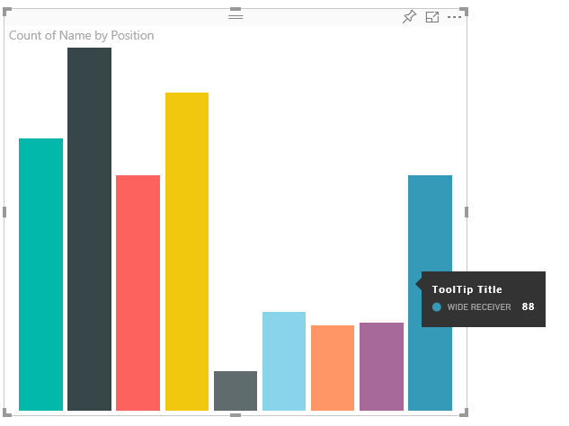
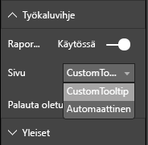

# <a name="tooltips-in-power-bi-visuals"></a>Power BI:n visualisointien työkaluvihjeet

Visualisoinnit voivat nyt hyödyntää Power BI:n työkaluvihjetukea. Power BI:n työkaluvihjeet käsittelevät seuraavia toimia:

* Näytä työkaluvihje.
* Piilota työkaluvihje.
* Siirrä työkaluvihje.

Työkaluvihjeet voivat näyttää tekstimuotoisen elementin, jolla on otsikko, tietyn värinen arvo ja peittävyys määritettyjen koordinaattien rajoissa. Nämä tiedot toimitetaan ohjelmointirajapinnalle, ja Power BI -isäntä tekee sen samalla tavalla kuin työkaluvihjeiden hahmontamisen alkuperäisille visualisoinneille.

Seuraavassa kuvassa näkyy työkaluvihje mallipalkkikaaviossa:



Edellä oleva työkaluvihjeen kuva havainnollistaa yksittäistä palkkiluokkaa ja arvoa. Voit laajentaa yksittäisen työkaluvihjeen näyttämään useita arvoja.

## <a name="manage-tooltips"></a>Työkaluvihjeiden hallinta

Käyttöliittymä, jonka kautta voit hallita työkaluvihjeitä, on ITooltipService. Sen avulla ilmoitetaan isännälle, että työkaluvihje täytyy näyttää, poistaa tai siirtää.

```typescript
    interface ITooltipService {
        enabled(): boolean;
        show(options: TooltipShowOptions): void;
        move(options: TooltipMoveOptions): void;
        hide(options: TooltipHideOptions): void;
    }
```

Visualisoinnin on kuunneltava hiiren tapahtumia visualisoinnissa ja tarvittaessa kutsuttava `Tooltip****Options`-objekteissa täytetyt asianmukaisen sisällön sisältävät `show()`-, `move()`- ja `hide()`-edustajat.
`TooltipShowOptions` ja `TooltipHideOptions` puolestaan määrittävät, mitä näytetään ja miten näissä tapahtumissa käyttäydytään.

Koska näiden menetelmien kutsuminen edellyttää käyttäjätapahtumia, kuten hiiren liikkeitä tai kosketustapahtumia, kannattaa tapahtumille luoda kuuntelutoimintoja, jotka puolestaan kutsuvat `TooltipService`-jäseniä.
Mallimme koostuu luokkaan nimeltä `TooltipServiceWrapper`.

### <a name="the-tooltipservicewrapper-class"></a>TooltipServiceWrapper-luokka

Tämän luokan perusajatuksena on säilyttää kohteen `TooltipService` esiintymä, kuunnella D3-hiiritapahtumia merkityksellisissä elementeissä ja kutsua sitten elementtejä `show()` ja `hide()` tarvittaessa.

Luokka sisältää ja hallitsee näiden tapahtumien mitä tahansa asiaankuuluvaa tilaa ja logiikkaa, jotka useimmiten on tarkoitettu toimimaan yhdessä pohjana olevan D3-koodin kanssa. D3-liitäntöjä ja -muuntoa ei voida käsitellä tässä artikkelissa.

Koko mallikoodi on [SampleBarChart-visualisointisäilössä](https://github.com/Microsoft/PowerBI-visuals-sampleBarChart/commit/981b021612d7b333adffe9f723ab27783c76fb14).

### <a name="create-tooltipservicewrapper"></a>TooltipServiceWrapper-kohteen luominen

Palkkikaaviokonstruktorilla on nyt `TooltipServiceWrapper`-jäsen, joka on muodostettu konstruktorilla, jolla on `tooltipService`-isäntäesiintymä.

```typescript
        private tooltipServiceWrapper: ITooltipServiceWrapper;

        this.tooltipServiceWrapper = createTooltipServiceWrapper(this.host.tooltipService, options.element);
```

`TooltipServiceWrapper`-luokka sisältää `tooltipService`-esiintymän, joka on myös visualisointi-ja kosketusparametrien D3-pääelementti.

```typescript
    class TooltipServiceWrapper implements ITooltipServiceWrapper {
        private handleTouchTimeoutId: number;
        private visualHostTooltipService: ITooltipService;
        private rootElement: Element;
        private handleTouchDelay: number;

        constructor(tooltipService: ITooltipService, rootElement: Element, handleTouchDelay: number) {
            this.visualHostTooltipService = tooltipService;
            this.handleTouchDelay = handleTouchDelay;
            this.rootElement = rootElement;
        }
        .
        .
        .
    }
```

Tämän luokan ainoa aloituskohta tapahtuman kuuntelijoiden rekisteröimiseen on `addTooltip`-menetelmä.

### <a name="the-addtooltip-method"></a>AddTooltip-menetelmä

```typescript
        public addTooltip<T>(
            selection: d3.Selection<Element>,
            getTooltipInfoDelegate: (args: TooltipEventArgs<T>) => VisualTooltipDataItem[],
            getDataPointIdentity: (args: TooltipEventArgs<T>) => ISelectionId,
            reloadTooltipDataOnMouseMove?: boolean): void {

            if (!selection || !this.visualHostTooltipService.enabled()) {
                return;
            }
        ...
        ...
        }
```

* **selection: d3.Selection<Element>** : D3-elementit, joissa työkaluvihjeet käsitellään.

* **getTooltipInfoDelegate: (args: TooltipEventArgs<T>) => VisualTooltipDataItem[]** : Edustaja työkaluvihjeen sisällön täyttämiseen (mitä näytetään) kontekstin mukaan.

* **getDataPointIdentity: (args: TooltipEventArgs<T>) => ISelectionId**: Edustaja, joka hakee arvopistetunnuksen (ei käytetä tässä mallissa). 

* **reloadTooltipDataOnMouseMove? boolean**: Totuusarvo, joka ilmaisee, päivitetäänkö työkaluvihjeen tiedot MouseMove-tapahtuman aikana (ei käytössä tässä mallissa).

Kuten näet, `addTooltip` poistuu ilman toimia, jos `tooltipService` on poistettu käytöstä tai jos todellista valintaa ei ole.

### <a name="call-the-show-method-to-display-a-tooltip"></a>Show-menetelmän kutsuminen työkaluvihjeen näyttämiseksi

`addTooltip`-menetelmä kuuntelee D3-`mouseover`-tapahtumaa seuraavassa koodissa esitetyllä tavalla:

```typescript
        ...
        ...
        selection.on("mouseover.tooltip", () => {
            // Ignore mouseover while handling touch events
            if (!this.canDisplayTooltip(d3.event))
                return;

            let tooltipEventArgs = this.makeTooltipEventArgs<T>(rootNode, true, false);
            if (!tooltipEventArgs)
                return;

            let tooltipInfo = getTooltipInfoDelegate(tooltipEventArgs);
            if (tooltipInfo == null)
                return;

            let selectionId = getDataPointIdentity(tooltipEventArgs);

            this.visualHostTooltipService.show({
                coordinates: tooltipEventArgs.coordinates,
                isTouchEvent: false,
                dataItems: tooltipInfo,
                identities: selectionId ? [selectionId] : [],
            });
        });
```

* **makeTooltipEventArgs**: Purkaa kontekstin D3:n valituista elementeistä kohteeseen tooltipEventArgs. Laskee myös koordinaatit.

* **getTooltipInfoDelegate**: Luo työkaluvihjeen sisällön kohteesta tooltipEventArgs. Vastakutsu BarChart-luokkaan, koska se on visualisoinnin logiikka. Todellinen työkaluvihjeessä näytettävä tekstisisältö.

* **getDataPointIdentity**: Ei käytetä tässä mallissa.

* **this.visualHostTooltipService.show**: Työkaluvihjeen näyttämiseen käytettävä kutsu.  

Lisäkäsittelyä on `mouseout`- ja `mousemove`-tapahtumien mallissa.

Jos haluat lisätietoja, tutustu [SampleBarChart-visualisointisäilöön](https://github.com/Microsoft/PowerBI-visuals-sampleBarChart/commit/981b021612d7b333adffe9f723ab27783c76fb14).

### <a name="populate-the-tooltip-content-by-the-gettooltipdata-method"></a>Työkaluvihjeen sisällön täyttäminen getTooltipData-menetelmällä

BarChart-kohteeseen lisättiin jäsen `getTooltipData`, joka yksinkertaisesti purkaa arvopisteen `category`-, `value`- ja `color`-ominaisuudet VisualTooltipDataItem[]-elementtiin.

```typescript
        private static getTooltipData(value: any): VisualTooltipDataItem[] {
            return [{
                displayName: value.category,
                value: value.value.toString(),
                color: value.color,
                header: 'ToolTip Title'
            }];
        }
```

Edellisessä toteutuksessa jäsen `header` on vakio, mutta voit käyttää sitä monimutkaisempiin toteutuksiin, jotka edellyttävät dynaamisia arvoja. Voit täyttää kohteen `VisualTooltipDataItem[]` käyttäen useampaa kuin yhtä elementtiä, jolloin työkaluvihjeeseen lisätään useita rivejä. Se voi olla hyödyllistä visualisoinneissa, kuten pinotussa palkkikaaviossa, jossa työkaluvihje voi näyttää tietoja useammasta kuin yhdestä arvopisteestä.

### <a name="call-the-addtooltip-method"></a>AddTooltip-menetelmän kutsuminen

Viimeinen vaihe on kutsua `addTooltip`-menetelmää, kun todelliset tiedot saattavat muuttua. Tämä kutsu tapahtuu `BarChart.update()`-menetelmässä. Kutsu tehdään kaikkien bar-elementtien valinnan valvomiseksi. Vain `BarChart.getTooltipData()` ohitetaan, kuten edellä mainittiin.

```typescript
        this.tooltipServiceWrapper.addTooltip(this.barContainer.selectAll('.bar'),
            (tooltipEvent: TooltipEventArgs<number>) => BarChart.getTooltipData(tooltipEvent.data),
            (tooltipEvent: TooltipEventArgs<number>) => null);
```

## <a name="add-report-page-tooltips"></a>Raporttisivun työkaluvihjeiden lisääminen

Jos haluat lisätä raporttisivun työkaluvihjeiden tuen, löydät suurimman osan muutoksista tiedostosta *capabilities.json*.

Mallin rakenne on

```json
{
    "tooltips": {
        "supportedTypes": {
            "default": true,
            "canvas": true
        },
        "roles": [
            "tooltips"
        ]
    }
}
```

Voit määrittää raporttisivun työkaluvihjeet **Muotoilu**-ruudussa.



* `supportedTypes`: Visualisoinnin tukema työkaluvihjeiden määritys, joka näkyy kenttäsäilössä. 
   * `default`: Määrittää, tuetaanko tietokentän kautta tapahtuvaa ”automaattisten” työkaluvihjeiden sidontaa. 
   * `canvas`: Määrittää, tuetaanko raporttisivun työkaluvihjeitä.

* `roles`: (Valinnainen) Määritettynä ohjaa, mitkä tietoroolit sidotaan valittuun työkaluvihjeasetukseen kenttäsäilössä.

Lisätietoja on artikkelissa [Raporttisivun työkaluvihjeiden käyttöohjeet](https://powerbi.microsoft.com/blog/power-bi-desktop-march-2018-feature-summary/#tooltips).

Power BI näyttää raporttisivun työkaluvihjeen `ITooltipService.Show(options: TooltipShowOptions)`- tai `ITooltipService.Move(options: TooltipMoveOptions)`-kutsun jälkeen käyttämällä selectionId-ominaisuutta (edeltävän `options`-argumentin `identities`-ominaisuus). SelectionId-tunnuksen tulisi edustaa työkaluvihjeen noutamia valittuja tietoja (luokka, sarja ja niin edelleen) siinä kohteessa, jonka päälle veit hiiren osoittimen.

Seuraavassa koodissa on esimerkki selectionId-kohteen lähettämisestä työkaluvihjeen näyttökutsuihin:

```typescript
    this.tooltipServiceWrapper.addTooltip(this.barContainer.selectAll('.bar'),
        (tooltipEvent: TooltipEventArgs<number>) => BarChart.getTooltipData(tooltipEvent.data),
        (tooltipEvent: TooltipEventArgs<number>) => tooltipEvent.data.selectionID);
```
