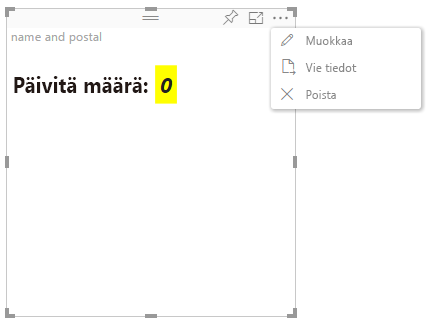

# Muokkaustilan lisäasetukset

Edistyneitä käyttöliittymän ohjaustoimintoja edellyttävät visualisoinnit voivat määrittää muokkaustilan lisäasetusten tuen.
Jos se on tuettu, raportin muokkaustilassa visualisoinnin valikkoon ilmestyy `Edit`-painike.
Kun `Edit`-painiketta napsautetaan, EditModen asetukseksi tulee `Advanced`.
Visualisointi voi käyttää EditMode-lippua määrittääkseen, tuleeko nämä käyttöliittymän ohjausobjektit näyttää.

Visualisointi ei oletusarvoisesti tue muokkaustilan lisäasetuksia.
Jos vaaditaan erilaista käyttäytymistä, se on määritettävä eksplisiittisesti visualisoinnin tiedostossa `capabilities.json` asettamalla ominaisuus `advancedEditModeSupport`.

Mahdolliset arvot ovat:

- 0 - NotSupported

- 1 - SupportedNoAction

- 2 - SupportedInFocus

## Siirtyminen muokkaustilan lisäasetuksiin

`Edit`-painike on näkyvissä, jos:

 1– `advancedEditModeSupport`-ominaisuus tiedostossa capabilities.json on joko `SupportedNoAction` tai `SupportedInFocus`.

 2– visualisointia tarkastellaan raportin muokkaustilassa.

Jos `advancedEditModeSupport`-ominaisuus puuttuu tiedostosta capabilities.json tai jos sen asetuksena on `NotSupported`, Muokkaa-painike poistuu näkyvistä.

Kun käyttäjä napsauttaa kohtaa `Edit`, visualisointi saa update()-kutsun, jossa EditModen asetuksena on `Advanced`.
Seuraavat toiminnot toteutuvat ominaisuuksiin määritetyn arvon mukaan:

* `SupportedNoAction` – Ei isännän lisätoimia.
* `SupportedInFocus` – Isäntä avaa visualisoinnin kohdistustilaan.

## Poistuminen kehittyneestä muokkaustilasta

`Back to report`-painike on näkyvissä, jos:

1 – `advancedEditModeSupport`-ominaisuus kohteessa capabilities.json on `SupportedInFocus`.
