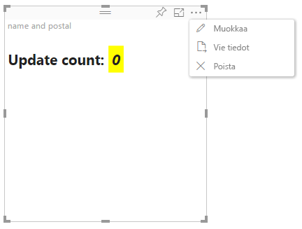

# Power BI:n visualisointien kehittynyt muokkaustila

Jos tarvitset kehittyneitä käyttöliittymän ohjausobjekteja Power BI:n visualisoinnissa, voit hyödyntää kehittynyttä muokkaustilaa. Kun olet raportin muokkaustilassa, valitse **Muokkaa**-painike ja määritä muokkaus tilaksi **Kehittynyt**. Visualisointi voi käyttää `EditMode`-merkintää määrittääkseen, tuleeko sen näyttää tämä käyttöliittymän ohjausobjekti.

Visualisointi ei oletusarvoisesti tue muokkaustilan lisäasetuksia. Jos vaaditaan erilaista käyttäytymistä, se on määritettävä eksplisiittisesti visualisoinnin tiedostossa *capabilities.json* asettamalla ominaisuus `advancedEditModeSupport`.

Mahdolliset arvot ovat:

- `0` – NotSupported

- `1` – SupportedNoAction

- `2` – SupportedInFocus

## Siirtyminen kehittyneeseen muokkaustilaan

Näkyvissä on **Muokkaa**-painike, jos:

* `advancedEditModeSupport`-ominaisuuden asetukseksi tiedostossa *capabilities.json* on määritetty `SupportedNoAction` tai `SupportedInFocus`.

* Visualisointia tarkastellaan raportin muokkaustilassa.

Jos `advancedEditModeSupport`-ominaisuus puuttuu tiedostosta *capabilities.json* tai jos sen asetuksena on `NotSupported`, **Muokkaa**-painike ei ole näkyvissä.

Kun valitset **Muokkaa**, visualisointi saa update()-kutsun, jossa EditMode-asetuksena on `Advanced`. Sen mukaan, mikä arvo on määritetty *capabilities.json*-tiedostossa, seuraavat toiminnot toteutetaan:

* `SupportedNoAction`: Isäntä ei vaadi lisätoimia.
* `SupportedInFocus`: Isäntä avaa visualisoinnin tarkastelutilaan.

## Poistuminen kehittyneestä muokkaustilasta

**Takaisin raporttiin** -painike on näkyvissä, jos:

* `advancedEditModeSupport`-ominaisuuden asetukseksi tiedostossa *capabilities.json* on määritetty `SupportedInFocus`.
