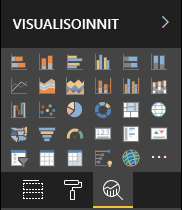

# <a name="the-analytics-pane-in-power-bi-visuals"></a>Analytiikka-ruutu Power BI:n visualisoinneissa

**Analytiikka**-ruutu otettiin käyttöön [alkuperäisissä visualisoinneissa](https://docs.microsoft.com/power-bi/desktop-analytics-pane) marraskuussa 2018.
Tässä artikkelissa käsitellään sitä, miten Power BI:n visualisoinnit voivat ohjelmointirajapinnan versiossa 2.5.0 esittää ja hallita ominaisuuksiaan **Analytiikka**-ruudussa.



## <a name="manage-the-analytics-pane"></a>Analytiikka-ruudun hallinta

Samaan tapaan kuin ominaisuuksia hallitaan [**Muotoilu**-ruudussa](https://docs.microsoft.com/power-bi/developer/visuals/custom-visual-develop-tutorial-format-options), voit hallita **Analytiikka**-ruutua määrittämällä objektin visualisoinnin *capabilities.json*-tiedostossa.

Erot **Analytiikka**-ruudussa ovat seuraavat:

* Objektin määrittelyssä lisätään **objectCategory**-kenttä, jonka arvo on 2.

    > [!NOTE]
    > Valinnainen `objectCategory`-kenttä otettiin käyttöön ohjelmointirajapinnan versiossa 2.5.0. Se määrittää visualisoinnin aspektin, jota objekti valvoo (1 = muotoilu, 2 = analytiikka). `Formatting`-kenttää käytetään esimerkiksi ulkoasua, värejä, akseleita ja otsikoita varten. `Analytics`-kenttää käytetään esimerkiksi ennusteisiin, trendiviivoihin, viiteviivoihin ja muotoihin.
    >
    > Jos arvoa ei määritetä, `objectCategory`-kentän oletusarvona on muotoilu.

* Objektilla on oltava seuraavat kaksi ominaisuutta:
    * `show`-tyyppinä `bool` ja oletusarvona `false`.
    * `displayName`-tyyppinä `text`. Valitsemastasi oletusarvosta tulee esiintymän ensimmäinen näyttönimi.

```json
{
  "objects": {
    "YourAnalyticsPropertiesCard": {
      "displayName": "Your analytics properties card's name",
      "objectCategory": 2,
      "properties": {
        "show": {
          "type": {
            "bool": true
          }
        },
        "displayName": {
          "type": {
            "text": true
          }
        },
      ... //any other properties for your Analytics card
      }
    }
  ...
  }
}
```

Voit määrittää muita ominaisuuksia samalla tavalla kuin **Muotoilu**-objekteja. Voit myös luetella objekteja samalla tavalla kuin **Muotoilu**-ruudussa.

## <a name="known-limitations-and-issues-of-the-analytics-pane"></a>Analytiikka-ruudun tunnetut rajoitukset ja ongelmat

* **Analytiikka**-ruudussa ei ole vielä moniesiintymätukea. Objekteilla ei voi olla muuta [valitsinta](https://microsoft.github.io/PowerBI-visuals/docs/concepts/objects-and-properties/#selector) kuin staattinen (eli ”valitsin”: tyhjäarvo), eikä Power BI:n visualisoinneilla voi olla käyttäjän määrittämiä useita esiintymiä kortista.
* `integer`-tyyppisiä ominaisuuksia ei näytetä oikein. Voit kiertää ongelman käyttämällä sen sijaan `numeric`-tyyppiä.

> [!NOTE]
> * Käytä **Analytiikka**-ruutua vain objekteille, jotka lisäävät uusia tietoja tai kertovat lisää esitetyistä tiedoista (esimerkiksi viiveviivat, jotka kuvaavat tärkeitä trendejä).
> * Kaikki asetukset, jotka ohjaavat visualisoinnin ulkoasua (eli muotoilua), on rajoitettava **Muotoilu**-ruutuun.
